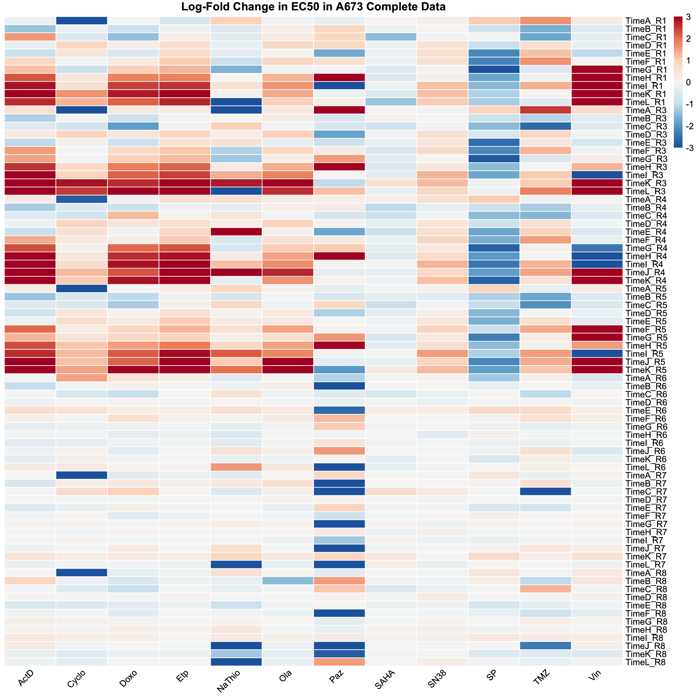
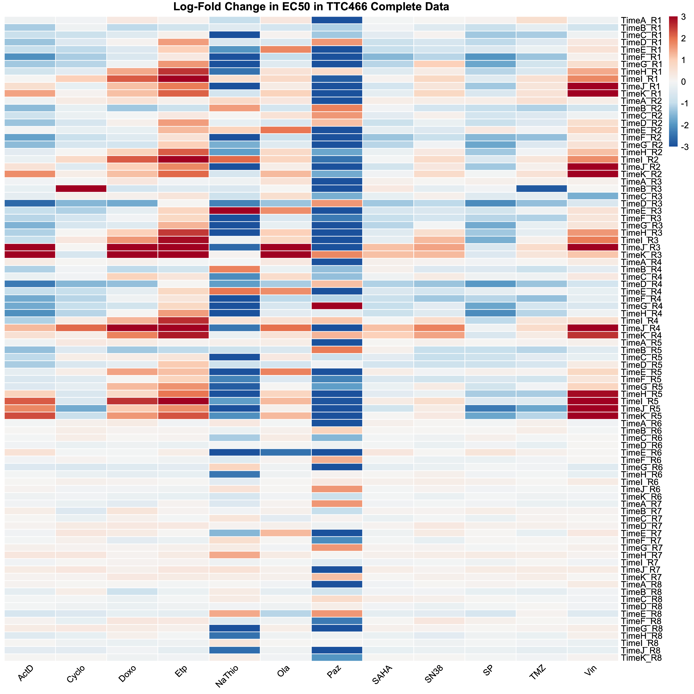
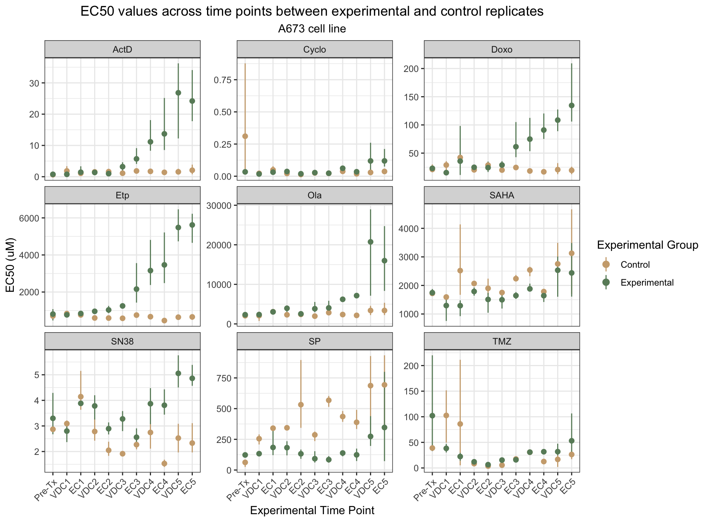
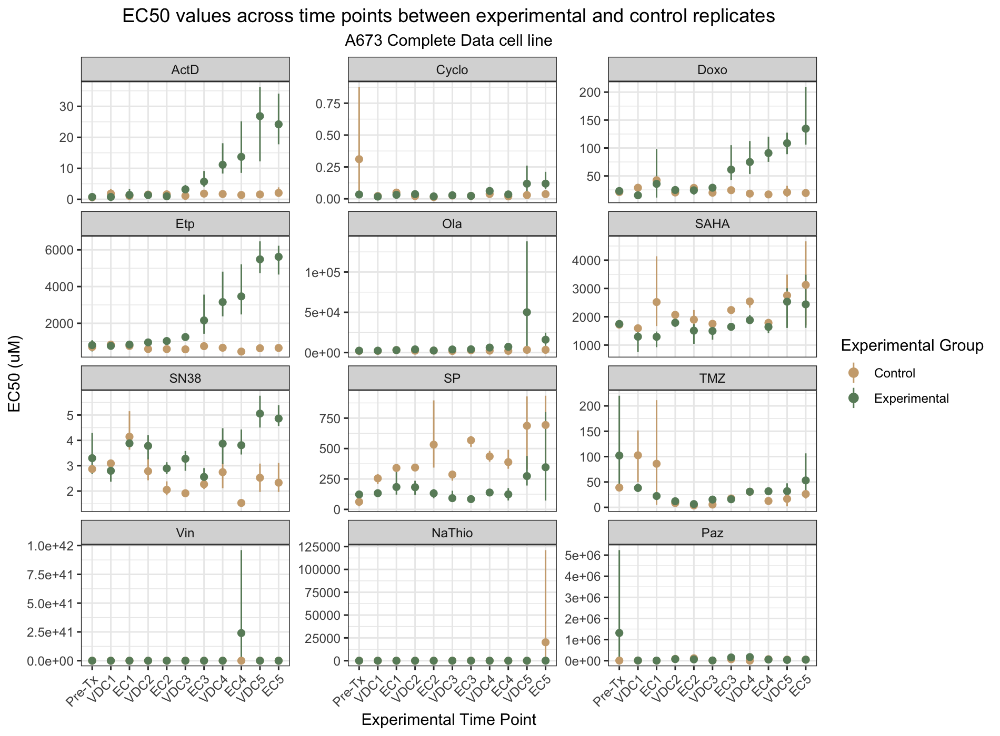
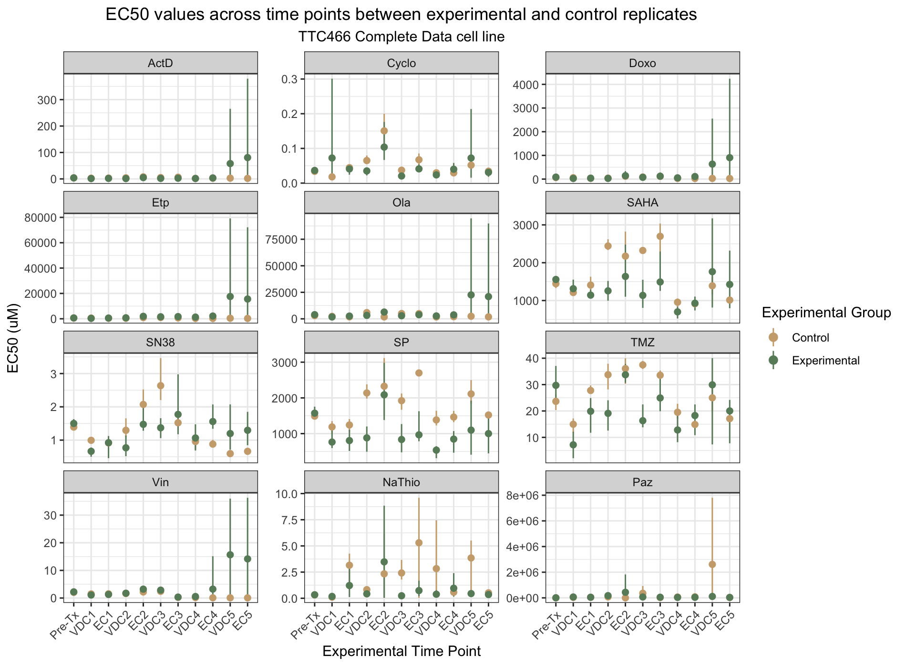

```{r setup, include=FALSE}
knitr::opts_chunk$set(echo = TRUE)
```

# R Preliminaries and Data Load/Merge

## Initial Setup and Package Load

```{r initial_setup, cache=FALSE, message = FALSE, warning = FALSE}
library(knitr); library(rmdformats); library(here); library(magrittr)
library(pheatmap); library(RColorBrewer); library(reshape2)
library(EBSeq); library(stats); library(ggplot2); library(tidyverse) 
library(xtable)
options(xtable.floating = FALSE)
options(xtable.timestamp = "")

## Global options

options(max.print="75")
opts_chunk$set(comment=NA,
               message=FALSE,
               warning=FALSE)
opts_knit$set(width=75)
```

## Load Data

We'll load the expression data from our lab's evolution experiment, drug response data for both cell lines, and the drug response data specific to samples that were included in the lab's sequencing experiments. 

The drug response data has been preprocessed as follows:  
- For each date, evolutionary replicates 6-8 are controls. The mean EC50 value between these three replicates is extracted for each drug, termed the `control_value`
- For each date, a each replicate is divided by the `control_value` for each drug, leaving us with the fold change for each replicate:drug combination at each date. 
- The log2 is taken for each value, in order to put the increased fold changes on the same scale as the decreased fold changes. 

```{r load_data}
dr_A673_all <- readRDS(here("Data", "dr_A673.rds"))
dr_TTC466_all <- readRDS(here("Data", "dr_TTC466.rds"))
EC50_data_A673 <- readRDS(here("Data", "original_EC50_A673.rds"))
EC50_data_TTC466 <- readRDS(here("Data", "original_EC50_TTC466.rds"))
EC50_data_A673_main <- EC50_data_A673[ , !colnames(EC50_data_A673) %in% c("Paz", "Vin", "NaThio")]
EC50_data_TTC466_main <- EC50_data_TTC466[ , !colnames(EC50_data_TTC466) %in% c("Paz", "Vin", "NaThio")]
EC50_change_data_A673 <- readRDS(here("Data", "logchange_EC50_A673.rds"))
EC50_change_data_TTC466 <- readRDS(here("Data", "logchange_EC50_TTC466.rds"))
EC50_change_data_seq <- readRDS(here("Data", "logchange_EC50_seq.rds"))
expr_data_lab <- readRDS(here("Data", "expr_data_lab.rds"))
```


# Heatmaps of EC50 changes

```{r plot_heatmaps}
make_EC50_heatmap <- function(EC50_data, cell_line){
  EC50_data[EC50_data > 3] <- 3
  EC50_data[EC50_data < -3] <- -3
  print(pheatmap(EC50_data, treeheight_row = 0, treeheight_col = 0,
           show_rownames = TRUE, show_colnames = TRUE, 
           cluster_rows = FALSE, cluster_cols = FALSE,
           color = colorRampPalette(rev(brewer.pal(n = 7, name = "RdBu")))(100),
           border_color = "white", angle_col = "45",
           main = paste("Log-Fold Change in EC50 in", cell_line)))
}

colnames(EC50_change_data_A673)
reps_A673 <- substr(row.names(EC50_change_data_A673), 7, 8)
heatmap_EC50_A673 <- EC50_change_data_A673[reps_A673 %in% c("R1", "R3", "R4", "R5"), 
                                    !(colnames(EC50_change_data_A673) %in% c("NaThio", "Paz", "Vin"))]
heatmap_EC50_A673["TimeJ_R5", "Ola"] <- NA 


reps_TTC466 <- substr(row.names(EC50_change_data_TTC466), 7, 8)
heatmap_EC50_TTC466 <- EC50_change_data_TTC466[reps_TTC466 %in% c("R1", "R2", "R3", "R4", "R5"), 
                                        !(colnames(EC50_change_data_TTC466) %in% c("NaThio", "Paz", "Vin"))]
heatmap_EC50_TTC466[rownames(heatmap_EC50_TTC466) %in% c("TimeJ_R3", "TimeK_R3"), 
                    colnames(heatmap_EC50_TTC466) %in% c("Ola", "Etp", "Doxo", "ActD")] <- NA


heatmap_EC50_seq <- EC50_change_data_seq[ , !(colnames(EC50_change_data_TTC466) %in% c("NaThio", "Paz", "Vin"))]

# You need to go through and make the plot saving part of the function
# can change the resolution in the function call or something

dev.off()
png("../Plots/Heatmaps/A673_heatmap_complete.png", width = 2500, height = 2500,
    units = "px", pointsize = 130, res = 225)
make_EC50_heatmap(EC50_change_data_A673, "A673 Complete Data")
dev.off()

png("../Plots/Heatmaps/TTC466_heatmap_complete.png", width = 2500, height = 2500,
    units = "px", pointsize = 130, res = 225)
make_EC50_heatmap(EC50_change_data_TTC466, "TTC466 Complete Data")
dev.off()

png("../Plots/Heatmaps/A673_heatmap.png", width = 2000, height = 1400,
    units = "px", pointsize = 100, res = 300)
make_EC50_heatmap(heatmap_EC50_A673, "A673")
dev.off()

png("../Plots/Heatmaps/TTC466_heatmap.png", width = 2000, height = 1400,
    units = "px", pointsize = 100, res = 300)
make_EC50_heatmap(heatmap_EC50_TTC466, "TTC466")
dev.off()

png("../Plots/Heatmaps/seq_heatmap.png", width = 2000, height = 1400,
    units = "px", res = 300)
make_EC50_heatmap(heatmap_EC50_seq, "Sequenced A673")
dev.off()

```

Figure 2


Supplementary Figure 1


Figure 4


Supplementary Figure 3



# Waterfall plots of Drug Response changes

Let's take a look at some waterfall plots of the drug response for all samples sent from RNA-sequencing. In addition to being shown below, the plots will be saved in the following filepath `Plots/Waterfall/RNA_Seq`.

```{r waterfall_seq_samples, results='asis'}

waterfall.plot <- function(df, column.name, cell_line, metric, times){
  # This function will create a waterfall style bar plot using the data from a
  # column, column.name in df.
  # The x axis will display the row names of the data frame.
  # The y axis will display the value for each row in the specified column.
  # The x axis will be ordered based on descending y axis value, creating a
  # the waterfall style.
  # Each plot will be saved as a PNG
  # df$labels <- row.names(df)
  df$labels <- times
  # df$times <- times
  df$Treatment_Time <- c("gray75", "gray60", "gray50", "gray15",
                         "gray75", "gray60", "gray50", "gray15",
                         "gray75", "gray60", "gray50", "gray15", "gray70", "gray40",
                         "gray75", "gray60", "gray50", "gray15")
  df <- df %>% arrange(desc(UQ(sym(column.name))))
  # df$labels <- factor(times, levels = times) #Order sample labels in ranked order so plot will have descending waterfall pattern
  df$labels <- factor(df$labels, levels=df$labels)
  max.val <- ceiling(max(df[ , column.name]))
  min.val <- ceiling(min(df[ , column.name]))
  # Create separate directories for each drug's subgroup
  plotDir <- "../Plots"
  dir.create(file.path(plotDir), showWarnings = FALSE)
  plotWater <- "Waterfall"
  dir.create(file.path(plotDir, plotWater), showWarnings = FALSE)
  subsetDir <- "RNA_Seq"
  dir.create(file.path(plotDir, plotWater, subsetDir), showWarnings = FALSE)
  # File name of new plot
  filename <- paste0(column.name, "_", metric, ".png")
  if(metric == "EC50)"){
    metric <- "EC50 (mM)"
  }
  if(metric == "EC50)"){
    metric <- "EC50 (mM)"
  } # Adds unit for only EC50/EC50, because AUC should not have units
  waterfall <- ggplot(df, aes(x=labels, y = UQ(sym(column.name)), fill = UQ(sym(column.name)))) +
          geom_bar(stat="identity") + 
          ggtitle(paste(" Sequenced samples against ", column.name, sep = "")) +
          ylab("log2(\u0394EC50)") +
          xlab("Sample Label") +
    theme_bw() +
          theme(axis.text.x = element_text(angle = 70, vjust = 0.5, hjust=0.5, 
                                           size = 22, color = df$Treatment_Time),
                axis.title.x = element_text(size = 30), 
                axis.title.y = element_text(size = 30),
                plot.title = element_text(size = 40, hjust = 0.5),
                legend.title = element_text(size = 22),
                legend.text = element_text(size = 22),
                legend.title.align=0.5,
                legend.background = element_rect(fill="transparent")) +
          scale_y_discrete(breaks=c(min.val, ceiling(min.val/2), ceiling(min.val/4), 0, 
                                    ceiling(max.val/4), ceiling(max.val/2), max.val)) +
          scale_fill_gradient2(name = "log2(\u0394EC50)",
                               low = "#2066AC", mid = "white", high = "red3")
  png(file.path(plotDir, plotWater, subsetDir, filename), 
      width = 1400, height = 1400, units = "px", pointsize = 50, 
      res = 125)
  print(waterfall)
  dev.off()
}

timepoints <- c("R1-PreTx", "R1-IE1", "R1-VDC3", "R1-IE4",
                "R3-PreTx", "R3-IE1", "R3-VDC3", "R3-IE4",
                "R4-PreTx","R4-VDC1", "R4-IE1", "R4-IE2", "R4-VDC3", "R4-IE4",
                "R5-PreTx", "R5-IE1", "R5-VDC3", "R5-IE4")

for (drug in colnames(EC50_change_data_seq)) { 
                                        # Removes Time column from waterfall plotting
  EC50_change_data_seq["I1", "Vin"] <- NA
  waterfall.plot(df = EC50_change_data_seq, column.name = drug, 
                 cell_line = "A673", metric = "EC50", times = timepoints)
  # Make waterfall plot for change in EC50 for samples sent to sequencing against each drug
  filename <- paste0("../Plots/Waterfall/RNA_Seq/", drug, "_EC50.png")
  cat("")
}

# print(rownames(EC50_change_data_seq))

```

# Point-Range Plots of EC50 over time

```{r point_range_plot, message=FALSE}

plot_point_range <- function(EC50_df, cell_line=c("A673", "A673_Complete", "TTC466", "TTC466_Complete")){
  # EC50_df: data frame where rows contain individual replicates at individual time points
  #          and columns contain drugs
  # Unfortunately for now this function is very specific to the data format that I have
  # I've got a migraine, and that's just how it's gotta be for now
  # Format data
  if(cell_line %in% c("A673", "A673_Complete")){
    if(cell_line=="A673_Complete"){
      cell_line <- "A673 Complete Data"
    }
    EC50_df <- melt(EC50_df)
    EC50_df$rep_group <- rep(c("Experimental", "Experimental", "Experimental", "Experimental", 
                                 "Control", "Control", "Control"), 12)
    EC50_df$time <- factor(c(rep("Pre-Tx", 7),
                        rep("VDC1", 7), 
                        rep("EC1", 7), 
                        rep("VDC2", 7),
                        rep("EC2", 7),
                        rep("VDC3", 7),
                        rep("EC3", 7),
                        rep("VDC4", 7),
                        rep("EC4", 7),
                        rep("VDC5", 9), # This is funky because of some of the cells growing to 
                        rep("EC5", 2), # confluence faster than others
                        rep("VDC5", 3),
                        rep("EC5", 7)), ordered = TRUE, 
                        levels = c("Pre-Tx", "VDC1", "EC1", "VDC2", "EC2", 
                                   "VDC3", "EC3", "VDC4", "EC4", "VDC5", "EC5"))
    if(cell_line=="A673"){
      add_rows <- EC50_df[c(75:77, 159:161, 243:245, 327:329, 411:413,
                            495:497, 579:581, 663:665, 747:749), ]
      add_rows$time <- rep("EC5", nrow(add_rows))
      EC50_df <- rbind(EC50_df, add_rows)
    }
    if(cell_line=="A673 Complete Data"){
      add_rows <- EC50_df[c(75:77, 159:161, 243:245, 327:329, 411:413,
                            495:497, 579:581, 663:665, 747:749, 831:833,
                            915:917, 999:1001), ]
      add_rows$time <- rep("EC5", nrow(add_rows))
      EC50_df <- rbind(EC50_df, add_rows)
    }
  }
  if(cell_line %in% c("TTC466", "TTC466_Complete")){
    if(cell_line=="TTC466_Complete"){
      cell_line <- "TTC466 Complete Data"
    }
    EC50_df["TimeE_R3", "NaThio"] <- NA
    EC50_df["TimeE_R8", "Paz"] <- NA
    EC50_df["TimeA_R7", "Paz"] <- NA
    EC50_df <- melt(EC50_df)
    EC50_df$rep_group <- rep(c("Experimental", "Experimental", "Experimental", 
                                 "Experimental", "Experimental", 
                                 "Control", "Control", "Control"), 11)
    EC50_df$time <- factor(c(rep("Pre-Tx", 8),
                      rep("VDC1", 8), 
                      rep("EC1", 8), 
                      rep("VDC2", 8),
                      rep("EC2", 8),
                      rep("VDC3", 8),
                      rep("EC3", 8),
                      rep("VDC4", 8),
                      rep("EC4", 8),
                      rep("VDC5", 8),
                      rep("EC5", 8)),
                      ordered = TRUE, 
                        levels = c("Pre-Tx", "VDC1", "EC1", "VDC2", "EC2", 
                                   "VDC3", "EC3", "VDC4", "EC4", "VDC5", "EC5"))
  }
  # Order drug variable so that poorly modeled drugs show up as last 3
  EC50_df$variable <- factor(EC50_df$variable, ordered = TRUE, 
                            levels = c("ActD", "Cyclo", "Doxo", "Etp", "Ola", 
                                        "SAHA", "SN38", "SP", "TMZ", "Vin", 
                                        "NaThio", "Paz"))
  EC50_df %>% 
    group_by(variable, rep_group, time) %>%
    summarise(mean_EC50 = mean(value, na.rm = TRUE), 
              max_EC50 = max(value, na.rm = TRUE), 
              min_EC50 = min(value, na.rm = TRUE)) -> EC50_summary
  # Plot figure
  png(filename = paste0("../Plots/Point_Range/pointrange_", cell_line, ".png"),
      width = 1900, height = 1400, res = 200)
  print(ggplot(EC50_summary, aes(x=time, y=mean_EC50, ymin=min_EC50, ymax=max_EC50,
                                 color = factor(rep_group))) +
          geom_pointrange(fatten=2.5) + 
          scale_colour_manual(name = "Experimental Group",
                              values = c("Experimental" = "darkseagreen4", 
                                         "Control" = "burlywood3")) +
          facet_wrap(vars(variable), ncol = 3, scales = "free_y") +
          ggtitle("EC50 values across time points between experimental and control replicates",
                  subtitle = paste(cell_line, "cell line")) +
          labs(x = "Experimental Time Point", y = "EC50 (uM)") +
          theme_bw() +
          theme(
            axis.text.x = element_text(angle = 45, vjust=1, hjust=1),
            plot.title = element_text(hjust = 0.5), 
            plot.subtitle = element_text(hjust = 0.5))) 
  dev.off()
}

EC50_data_A673_edit <- EC50_data_A673_main
EC50_data_A673_edit["TimeJ_R5", "Ola"] <- NA
plot_point_range(EC50_data_A673_edit, cell_line = "A673")
plot_point_range(EC50_data_A673, cell_line = "A673_Complete")

EC50_data_TTC466_edit <- EC50_data_TTC466_main
EC50_data_TTC466_edit[row.names(EC50_data_TTC466_edit) %in% c("TimeJ_R3", "TimeK_R3"),
                      colnames(EC50_data_TTC466_edit) %in% c("ActD", "Ola", "Etp", "Doxo")] <- NA
plot_point_range(EC50_data_TTC466_edit, cell_line = "TTC466")
plot_point_range(EC50_data_TTC466, cell_line = "TTC466_Complete")

```
Figure 2


Supplementary Figure 2


Supplementary Figure 4



# Differential Gene Expression Analysis


Here, we'll build our helper functions for running the differential gene expression analysis. 


```{r de_helper_fns}

updown_genes <- function(expr.lst, de.genes){
  ### This function will return two lists of up/down regulated 
  ### genes when a cell line is sensitive to each drug. 
  ### One list will contain genes that 
  ### are up regulated in the lower responding cell lines, 
  ### and one in the lower responding lines.
  
  ### The function will take a matrix (expr.lst$x) containing 
  ### the expression values for the cell lines pertaining 
  ### to the DE expression analysis being run. The cell lines (columns)
  ### correspond to the class labels found in expr.lst$y.
  ### Cell lines labeled '1' have a high AUC to the drug in 
  ### question and cell lines labeled '2' have a low AUC 
  ### to the drug in question.
  
  ### First, the matrix will be separated into high/low AUC
  ### cell lines. Then, a loop will be run with the genes that are 
  ### given as differentially expressed. The genes with a higher
  ### average in the high AUC cell lines will be labeled as genes
  ### whose expression is increased. Genes with a lower average in the
  ### high AUC cell lines will be labeled as genes whose expression is 
  ### decreased. 
  
  data.mat <- expr.lst$x # Expression values
  data.class <- expr.lst$y # Class values
  res.cells_lines <- data.mat[ , which(data.class == 1)] # Resistant, high AUC
  sens.cell_lines <- data.mat[ , which(data.class == 2)] # Sensitive, low AUC
  up.genes <- c() # Up in resistant
  down.genes <- c() # Down in resistant
  extra.genes <- c()
  for(gene in de.genes){
    mean.res <- rowMeans(res.cells_lines[gene, ]) # Mean expr in resistant
    mean.sens <- rowMeans(sens.cell_lines[gene, ]) # Mean expr in sensitive
    if (mean.sens > mean.res) { # Sensitive expr > Resistant expr?
      up.genes <- c(up.genes, gene) # High expr in sens = up-regulated
    } else if (mean.sens < mean.res) { # Sensitive expr < Resistant expr?
      down.genes <- c(down.genes, gene) # Low expr in sens = down-regulated
    } else {
      extra.genes <- c(extra.genes, gene) # 
    }
  }
  return(list(up = up.genes, down = down.genes, extra = extra.genes))
}


high_low_subset <- function(drug_data, drug, percent){
  low_quant <- quantile(drug_data[ , drug], probs = percent, na.rm = TRUE)
  high_quant <- quantile(drug_data[ , drug], probs = 1-percent, na.rm = TRUE)
  median_EC50 <- median(drug_data[ , drug])
  high_lines <- row.names(drug_data[drug_data[ , drug] > high_quant , ])
  low_lines <- row.names(drug_data[drug_data[ , drug] < low_quant , ])
  return(list(high_lines = high_lines, 
              low_lines = low_lines))
}


input_DE <- function(drug_data, expr_data, meta_df, subset_cat = NULL,
                     group_value = NULL, drug, dr_type, cutoff){
  # This is a crucial function for creating the input to the user-defined DE fns
  # below. 
  # First it subsets the data if a subset category and group value are provided.
  # Next, it finds the names of high/low cell lines based on the drug data,
  # speficied drug, and percent of top/bottom responders that we are comparing.
  # Then, it extracts the drug data for the given cell line names and labels them
  # as 1 for high drug response metric or 2 for low drug response metric.
  #
  # A list is return containing the following: 
  #   x: drug response data for the combined high and low cell lines
  #   y: label, 1 or 2, categorizing x's cell lines as high or low responders
  #   num.high: length of high cell lines
  #   num.low: length of low cell lines # probably not necessary, will likely remove later
  # if(is.null(group.value) == FALSE){
  #   drug.data <- subset.df(meta.df = meta.df,
  #                          data.df = drug.data,
  #                          meta.ID.index = 2,
  #                          data.ID.index = "row",
  #                          column = subset.cat,
  #                          group.value = group.value)}
  high_low_lines <- high_low_subset(drug_data, drug, percent = cutoff)
  high_lines <- high_low_lines$high_lines
  low_lines <- high_low_lines$low_lines
  highresp_expr <- expr_data[ , colnames(expr_data) %in% high_lines]
  lowresp_expr <- expr_data[ , colnames(expr_data) %in% low_lines]
  x <- cbind(highresp_expr, lowresp_expr)
  y <- c(rep(2, ncol(highresp_expr)), rep(1, ncol(lowresp_expr)))
  return(list(x = x, y = y, 
              num_high = ncol(highresp_expr), 
              num_low = ncol(lowresp_expr)))
}


updown_genes <- function(expr.lst, de.genes){
  ### This function will return two lists of up/down regulated 
  ### genes when a cell line is sensitive to each drug. 
  ### One list will contain genes that 
  ### are up regulated in the lower responding cell lines, 
  ### and one in the lower responding lines.
  
  ### The function will take a matrix (expr.lst$x) containing 
  ### the expression values for the cell lines pertaining 
  ### to the DE expression analysis being run. The cell lines (columns)
  ### correspond to the class labels found in expr.lst$y.
  ### Cell lines labeled '1' have a high AUC to the drug in 
  ### question and cell lines labeled '2' have a low AUC 
  ### to the drug in question.
  
  ### First, the matrix will be separated into high/low AUC
  ### cell lines. Then, a loop will be run with the genes that are 
  ### given as differentially expressed. The genes with a higher
  ### average in the high AUC cell lines will be labeled as genes
  ### whose expression is increased. Genes with a lower average in the
  ### high AUC cell lines will be labeled as genes whose expression is 
  ### decreased. 
  
  data.mat <- expr.lst$x # Expression values
  data.class <- expr.lst$y # Class values
  res.cells_lines <- data.mat[ , which(data.class == 2)] # Resistant, high AUC
  sens.cell_lines <- data.mat[ , which(data.class == 1)] # Sensitive, low AUC
  up.genes <- c() # Up in resistant
  down.genes <- c() # Down in resistant
  extra.genes <- c()
  for(gene in de.genes){
    mean.res <- rowMeans(res.cells_lines[gene, ]) # Mean expr in resistant
    mean.sens <- rowMeans(sens.cell_lines[gene, ]) # Mean expr in sensitive
    if (mean.res > mean.sens) { # Resistant expr > sensitive expr?
      up.genes <- c(up.genes, gene) # High expr in resistant = up-regulated
    } else if (mean.res < mean.sens) { # Resistant expr < sensitive expr?
      down.genes <- c(down.genes, gene) # Low expr in resistant = down-regulated
    } else {
      extra.genes <- c(extra.genes, gene) # 
    }
  }
  return(list(up = up.genes, down = down.genes, extra = extra.genes))
}


EBSeq_DE <- function(expr_lst){
  data_mat <- as.matrix(expr_lst$x) # Expression values
  data_class <- factor(expr_lst$y) # Class values
  EBOut <- EBTest(Data=data_mat, 
                  Conditions=data_class,
                  sizeFactors=MedianNorm(data_mat), 
                  maxround = 15)
  return(EBOut)
}

run_de_analysis <- function(drug_data, expr_data, drug, group_perc, FDR){
  input_df <- input_DE(drug_data = drug_data,
                       expr_data = expr_data,
                       drug = drug,
                       cutoff = group_perc)
  de_all <- EBSeq_DE(input_df)
  de_signif <- GetDEResults(de_all, FDR = FDR)
  updown_de <- updown_genes(input_df, de_signif$DEfound)
  write.table(updown_de$up, 
              file = paste0("../DE_Results/DE_up_resistant_", drug, ".csv"),
              sep = ",", 
              quote = FALSE, row.names = FALSE, col.names = FALSE)
  write.table(updown_de$down, 
              file = paste0("../DE_Results/DE_up_sensitive_", drug, ".csv"), 
              sep = ",",
              quote = FALSE, row.names = FALSE, col.names = FALSE)
}
```


And finally, we'll run our differential expression analysis using `EBSeq` between the top/bottom 1/3 of responders to each drug. 

```{r run_de, message=FALSE, results='asis'}


for (drug_name in colnames(EC50_change_data_seq)){
  EC50_change_data_seq["I1", "Vin"] <- NA
  print(drug_name)
  write(drug_name, file = "../DE_Results/all_DE_results_latex.txt", append = TRUE)
  run_de_analysis(drug_data = EC50_change_data_seq,
                  expr_data = expr_data_lab,
                  drug = drug_name,
                  group_perc = 0.3333,
                  FDR = 0.05)
  resistant_genes <- tryCatch(read.table(file =
                                  paste0("../DE_Results/DE_up_resistant_", drug_name, ".csv")), 
                              error = function(e) {table("No Differentially Expressed Genes Found")})
  sensitive_genes <- tryCatch(read.table(file =
                                  paste0("../DE_Results/DE_up_sensitive_", drug_name, ".csv")),
                              error = function(e) {table("No Differentially Expressed Genes Found")})
  write(paste("Genes Up-Regulated in", drug_name, "Resistant State:"), 
        file = "../DE_Results/all_DE_results_latex.txt", append = TRUE)
  print(xtable(resistant_genes),
        file = "../DE_Results/all_DE_results_latex.txt", append = TRUE)
  write(paste("Genes Up-Regulated in", drug_name, "Sensitive State:"), 
        file = "../DE_Results/all_DE_results_latex.txt", append = TRUE)
  print(xtable(sensitive_genes),
        file = "../DE_Results/all_DE_results_latex.txt", append = TRUE)
  print("Up in resistance: ")
  print(xtable(resistant_genes, caption = paste("Genes with increased expression in ", 
                                                drug_name, "resistance")), type = "html")
  print("Up in sensitivity: ")
  print(xtable(sensitive_genes, caption = paste("Genes with increased expression in ", 
                                                drug_name, "sensitivity")), type = "html")
}

```

