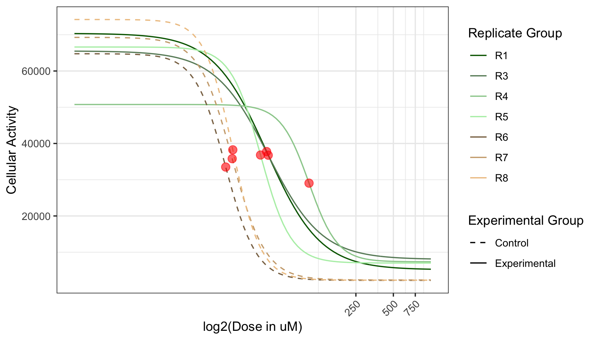
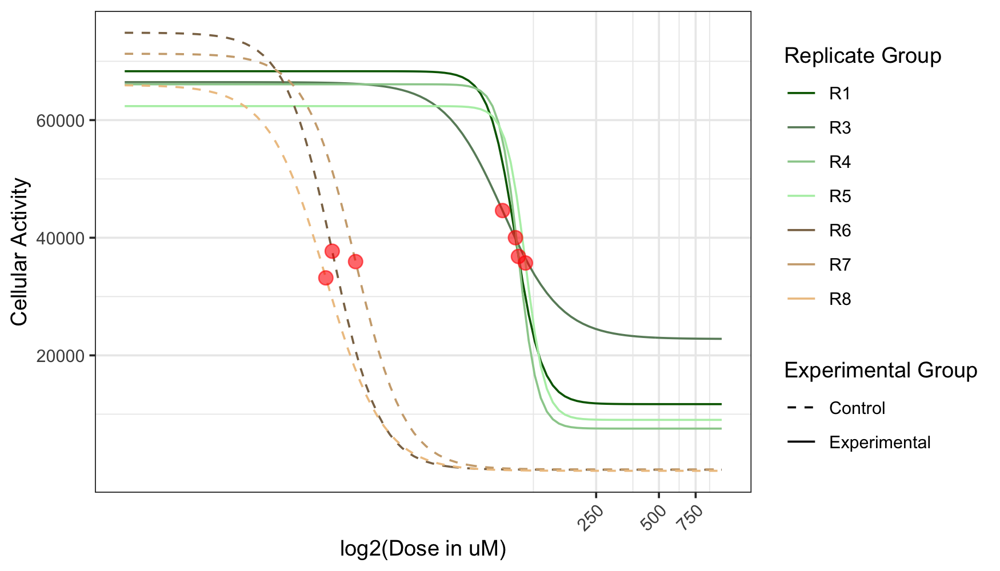
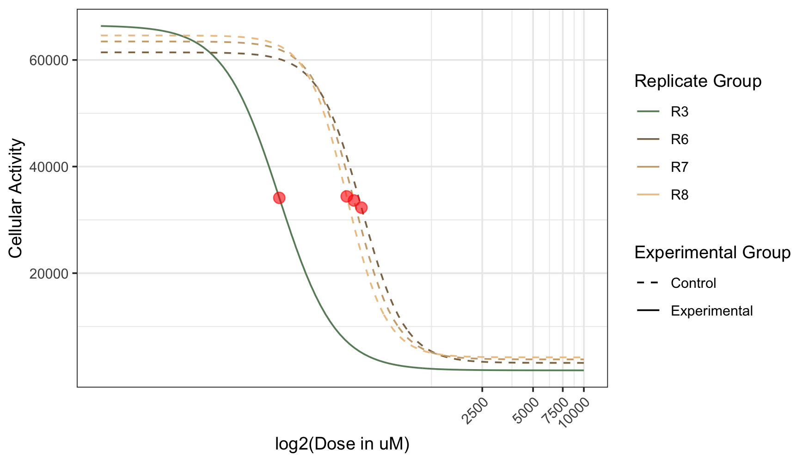
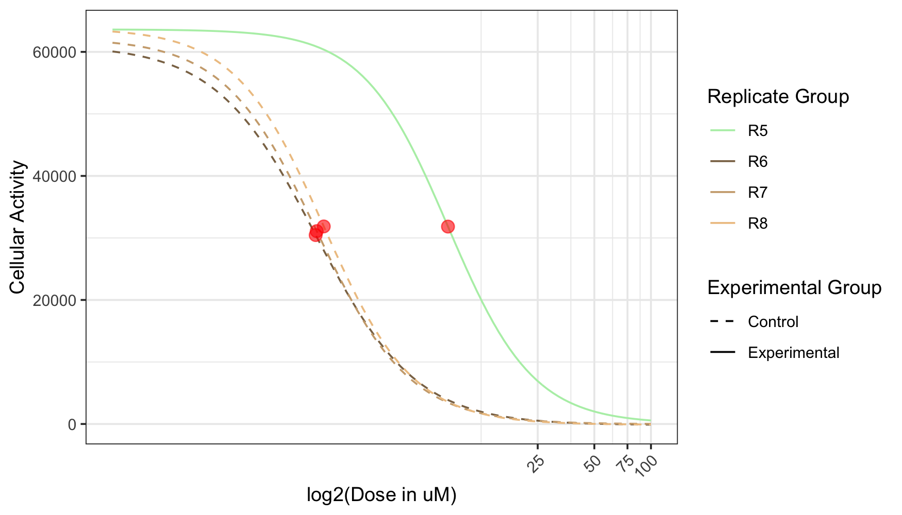

# R Preliminaries and Data Load/Merge

```{r setup, include=FALSE}
knitr::opts_chunk$set(echo = TRUE)
```


## Initial Setup and Package Load

```{r initial_setup, cache=FALSE, message = FALSE, warning = FALSE}
library(xlsx); library(ggplot2); library(drc)
library(reshape2); library(here); library(tidyverse)
library(stringr); library(RColorBrewer); library(pheatmap)
library(knitr)


## Global options

options(max.print="75")
opts_chunk$set(comment=NA,
               message=FALSE,
               warning=FALSE)
opts_knit$set(width=75)
```

## Load Data

## Helper functions for calculating concentrations

The starting concentrations for all drugs are as follows:

- actD: 100 uM
- SP2509: 10000 uM
- paz: 50000 uM
- ola: 20000 uM
- SAHA: 50000 uM
- SN38: 100 uM
- tem: 100 uM
- eto: 20000 uM
- vin: 10 uM
- dox: 1000 uM
- cyclo: 2% by volume
- NaThio: 2% by volume

Here we start by creating a matrix of concentration values for each drug, based on a fold-change of 3. This fold-change value could be changed to match a different experimental protocol. 

```{r conc_helpers}

starting.conc <- c(ActD=100, SP=10*1000, Paz=50*1000, Ola=20*1000, SAHA=50*1000, SN38=100, 
                   TMZ=100, Etp=20*1000, Vin=10, Doxo=1*1000, Cyclo = 2, NaThio = 2)

calc.conc <- function(starting.conc, n_fold){
  # Function takes 1 numeric value and returns a vector with 7 elements 
  # beginning with the given value, followed by serial divisions of 2.
  
  # For example:
  #
  # If starting.conc = 1000
  # Function returns: 
  # [1] 1000, 500, 250, 125, 62.5, 31.25, 15.625
  conc1 <- starting.conc
  conc2 <- starting.conc/n_fold
  conc3 <- conc2/n_fold
  conc4 <- conc3/n_fold
  conc5 <- conc4/n_fold
  conc6 <- conc5/n_fold
  conc7 <- conc6/n_fold
  return(c(conc1, conc2, conc3, conc4, conc5, conc6, conc7))
}

all.conc <- sapply(starting.conc, calc.conc, n_fold = 3) # Creates matrix with 
                                                         # [drug] in EWS expr
log2.all.conc <- data.frame(log2(all.conc)) # Log2 transforms for improved plotting

```


## Helper functions for reading files

Now we'll read in all the files individually using some helper functions. 

```{r helper_read}

read.file <- function(path){
  # Reads single drug response file, extracts important rows/columns and 
  # subtracts mean control value from each element.
  file <- read.xlsx(path, sheetIndex = 1, rowIndex = 1:10, colIndex = 1:13, 
                    header = TRUE, stringsAsFactors = FALSE)
  row.names(file) <- c(file[1:8 , 1], "remove")
  file <- file[ , 2:length(colnames(file))]
  colnames(file) <- file["remove", ]
  control <- mean(as.numeric(file["H", 1:3]))
  file <- file[1:(length(row.names(file))-2), ]
  file <- sapply(file, as.numeric)
  file <- file - control # Subtract mean control reading from each elem
  return(file)}

read.idealfile <- function(path, control = NULL){
  file <- read.xlsx(path, sheetIndex = 1, rowIndex = 1:9, colIndex = 2:13, 
                    header = TRUE, stringsAsFactors = FALSE)
  if(is.null(control)){
    control <- mean(as.numeric(file[nrow(file), 1:3]))
    file <- file[1:nrow(file)-1, ]
  }
  file <- sapply(file, as.numeric)
  file <- file - control
  return(file)
}

drug.summary.allreps <- function(data, cols, dose.values){
  # Extracts single drug from one file's drug response data
  data.drug <- data.frame(data[,cols])
  data.drug$mean <- apply(data.drug, 1, mean)
  data.drug$sd <- apply(data.drug[, 1:3], 1, sd)
  data.drug$doses <- dose.values[ , colnames(data.drug)[1]]
  data.drug$reps <- data$reps
  return(data.drug)
}

drug.summary <- function(data, cols, dose.values){
  # Extracts single drug from one file's drug response data
  data.drug <- data.frame(data[,cols])
  data.drug$mean <- apply(data.drug, 1, mean)
  data.drug$sd <- apply(data.drug[, 1:3], 1, sd)
  data.drug$doses <- dose.values[ , colnames(data.drug)[1]]
  return(data.drug)
}

```


## Read drug response data

Drug response values gathered here use the log2 transformed concentrations. This makes for improved drug response plotting.

``` {r read_dr, warning=FALSE}

find.dr.A673 <- function(conc.values = log2.all.conc){
  # Function manually reads in each drug response file and returns the EC50 for 
  # each repitition's drug response against each drug.
  # Returned is a list containing matrices for each date/cell-line combo
  
  ##############################################################################
  ### 06-06-18 ###
  ##############################################################################
  
  # Read date's files
  
  path.A673.060618.ASPO.R1 <- "../Drug-Dose-Response/A673/06-06-18/ActD-Sp-Paz-Ola/R1.xls"
  # path.A673.060618.ASPO.R2 <- "../Drug-Dose-Response/A673/06-06-18/ActD-Sp-Paz-Ola/R2.xls"
  path.A673.060618.ASPO.R3 <- "../Drug-Dose-Response/A673/06-06-18/ActD-Sp-Paz-Ola/R3.xls"
  path.A673.060618.ASPO.R4 <- "../Drug-Dose-Response/A673/06-06-18/ActD-Sp-Paz-Ola/R4.xls"
  path.A673.060618.ASPO.R5 <- "../Drug-Dose-Response/A673/06-06-18/ActD-Sp-Paz-Ola/R5.xls"
  path.A673.060618.ASPO.R6 <- "../Drug-Dose-Response/A673/06-06-18/ActD-Sp-Paz-Ola/R6.xls"
  path.A673.060618.ASPO.R7 <- "../Drug-Dose-Response/A673/06-06-18/ActD-Sp-Paz-Ola/R7.xls"
  path.A673.060618.ASPO.R8 <- "../Drug-Dose-Response/A673/06-06-18/ActD-Sp-Paz-Ola/R8.xls"
  
  resp.A673.060618.ASPO.R1 <- read.file(path.A673.060618.ASPO.R1)
  # resp.A673.060618.ASPO.R2 <- read.file(path.A673.060618.ASPO.R2)
  resp.A673.060618.ASPO.R3 <- read.file(path.A673.060618.ASPO.R3)
  resp.A673.060618.ASPO.R4 <- read.file(path.A673.060618.ASPO.R4)
  resp.A673.060618.ASPO.R5 <- read.file(path.A673.060618.ASPO.R5)
  resp.A673.060618.ASPO.R6 <- read.file(path.A673.060618.ASPO.R6)
  resp.A673.060618.ASPO.R7 <- read.file(path.A673.060618.ASPO.R7)
  resp.A673.060618.ASPO.R8 <- read.file(path.A673.060618.ASPO.R8)
  
  path.A673.060618.SSTE.R1 <- "../Drug-Dose-Response/A673/06-06-18/SAHA-SN38-TMZ-Etp/R1.xls"
  # path.A673.060618.SSTE.R2 <- "../Drug-Dose-Response/A673/06-06-18/SAHA-SN38-TMZ-Etp/R2.xls"
  path.A673.060618.SSTE.R3 <- "../Drug-Dose-Response/A673/06-06-18/SAHA-SN38-TMZ-Etp/R3.xls"
  path.A673.060618.SSTE.R4 <- "../Drug-Dose-Response/A673/06-06-18/SAHA-SN38-TMZ-Etp/R4.xls"
  path.A673.060618.SSTE.R5 <- "../Drug-Dose-Response/A673/06-06-18/SAHA-SN38-TMZ-Etp/R5.xls"
  path.A673.060618.SSTE.R6 <- "../Drug-Dose-Response/A673/06-06-18/SAHA-SN38-TMZ-Etp/R6.xls"
  path.A673.060618.SSTE.R7 <- "../Drug-Dose-Response/A673/06-06-18/SAHA-SN38-TMZ-Etp/R7.xls"
  path.A673.060618.SSTE.R8 <- "../Drug-Dose-Response/A673/06-06-18/SAHA-SN38-TMZ-Etp/R8.xls"
  
  resp.A673.060618.SSTE.R1 <- read.file(path.A673.060618.SSTE.R1)
  # resp.A673.060618.SSTE.R2 <- read.file(path.A673.060618.SSTE.R2)
  resp.A673.060618.SSTE.R3 <- read.file(path.A673.060618.SSTE.R3)
  resp.A673.060618.SSTE.R4 <- read.file(path.A673.060618.SSTE.R4)
  resp.A673.060618.SSTE.R5 <- read.file(path.A673.060618.SSTE.R5)
  resp.A673.060618.SSTE.R6 <- read.file(path.A673.060618.SSTE.R6)
  resp.A673.060618.SSTE.R7 <- read.file(path.A673.060618.SSTE.R7)
  resp.A673.060618.SSTE.R8 <- read.file(path.A673.060618.SSTE.R8)
  
  path.A673.060618.VDCN.R1 <- "../Drug-Dose-Response/A673/06-06-18/Vin-Doxo-Cyclo-Na/R1.xls"
  # path.A673.060618.VDCN.R2 <- "../Drug-Dose-Response/A673/06-06-18/Vin-Doxo-Cyclo-Na/R2.xls"
  path.A673.060618.VDCN.R3 <- "../Drug-Dose-Response/A673/06-06-18/Vin-Doxo-Cyclo-Na/R3.xls"
  path.A673.060618.VDCN.R4 <- "../Drug-Dose-Response/A673/06-06-18/Vin-Doxo-Cyclo-Na/R4.xls"
  path.A673.060618.VDCN.R5 <- "../Drug-Dose-Response/A673/06-06-18/Vin-Doxo-Cyclo-Na/R5.xls"
  path.A673.060618.VDCN.R6 <- "../Drug-Dose-Response/A673/06-06-18/Vin-Doxo-Cyclo-Na/R6.xls"
  path.A673.060618.VDCN.R7 <- "../Drug-Dose-Response/A673/06-06-18/Vin-Doxo-Cyclo-Na/R7.xls"
  path.A673.060618.VDCN.R8 <- "../Drug-Dose-Response/A673/06-06-18/Vin-Doxo-Cyclo-Na/R8.xls"
  
  resp.A673.060618.VDCN.R1 <- read.file(path.A673.060618.VDCN.R1)
  # resp.A673.060618.VDCN.R2 <- read.file(path.A673.060618.VDCN.R2)
  resp.A673.060618.VDCN.R3 <- read.file(path.A673.060618.VDCN.R3)
  resp.A673.060618.VDCN.R4 <- read.file(path.A673.060618.VDCN.R4)
  resp.A673.060618.VDCN.R5 <- read.file(path.A673.060618.VDCN.R5)
  resp.A673.060618.VDCN.R6 <- read.file(path.A673.060618.VDCN.R6)
  resp.A673.060618.VDCN.R7 <- read.file(path.A673.060618.VDCN.R7)
  resp.A673.060618.VDCN.R8 <- read.file(path.A673.060618.VDCN.R8)
  
  resp.A673.060618.R1 <- cbind(resp.A673.060618.ASPO.R1, resp.A673.060618.SSTE.R1, resp.A673.060618.VDCN.R1)
  # resp.A673.060618.R2 <- cbind(resp.A673.060618.ASPO.R2, resp.A673.060618.SSTE.R2, resp.A673.060618.VDCN.R2)
  resp.A673.060618.R3 <- cbind(resp.A673.060618.ASPO.R3, resp.A673.060618.SSTE.R3, resp.A673.060618.VDCN.R3)
  resp.A673.060618.R4 <- cbind(resp.A673.060618.ASPO.R4, resp.A673.060618.SSTE.R4, resp.A673.060618.VDCN.R4)
  resp.A673.060618.R5 <- cbind(resp.A673.060618.ASPO.R5, resp.A673.060618.SSTE.R5, resp.A673.060618.VDCN.R5)
  resp.A673.060618.R6 <- cbind(resp.A673.060618.ASPO.R6, resp.A673.060618.SSTE.R6, resp.A673.060618.VDCN.R6)
  resp.A673.060618.R7 <- cbind(resp.A673.060618.ASPO.R7, resp.A673.060618.SSTE.R7, resp.A673.060618.VDCN.R7)
  resp.A673.060618.R8 <- cbind(resp.A673.060618.ASPO.R8, resp.A673.060618.SSTE.R8, resp.A673.060618.VDCN.R8)

  cols.060618 <- c("ActD", "ActD", "ActD",
                   "SP", "SP", "SP",
                   "Paz", "Paz", "Paz",
                   "Ola", "Ola", "Ola", 
                   "SAHA", "SAHA", "SAHA", 
                   "SN38", "SN38", "SN38",
                   "TMZ", "TMZ", "TMZ", 
                   "Etp", "Etp", "Etp",
                   "Vin", "Vin", "Vin", 
                   "Doxo", "Doxo", "Doxo",
                   "Cyclo", "Cyclo", "Cyclo",
                   "NaThio", "NaThio", "NaThio")
  
  colnames(resp.A673.060618.R1) <- cols.060618
  # colnames(resp.A673.060618.R2) <- cols.060618
  colnames(resp.A673.060618.R3) <- cols.060618
  colnames(resp.A673.060618.R4) <- cols.060618
  colnames(resp.A673.060618.R5) <- cols.060618
  colnames(resp.A673.060618.R6) <- cols.060618
  colnames(resp.A673.060618.R7) <- cols.060618
  colnames(resp.A673.060618.R8) <- cols.060618
  
  dr.060618 <- list(R1 = resp.A673.060618.R1, R3 = resp.A673.060618.R3, 
                         R4 = resp.A673.060618.R4, R5 = resp.A673.060618.R5,
                         R6 = resp.A673.060618.R6, R7 = resp.A673.060618.R7,
                         R8 = resp.A673.060618.R8)
  
  ##############################################################################
  ### 06-17-18 ###
  ##############################################################################
  
  path.A673.061718.ASPO.R1 <- "../Drug-Dose-Response/A673/06-17-18/ActD-Sp-Paz-Ola/R1.xls"
  # path.A673.061718.ASPO.R2 <- "../Drug-Dose-Response/A673/06-17-18/ActD-Sp-Paz-Ola/R2.xls"
  path.A673.061718.ASPO.R3 <- "../Drug-Dose-Response/A673/06-17-18/ActD-Sp-Paz-Ola/R3.xls"
  path.A673.061718.ASPO.R4 <- "../Drug-Dose-Response/A673/06-17-18/ActD-Sp-Paz-Ola/R4.xls"
  path.A673.061718.ASPO.R5 <- "../Drug-Dose-Response/A673/06-17-18/ActD-Sp-Paz-Ola/R5.xls"
  path.A673.061718.ASPO.R6 <- "../Drug-Dose-Response/A673/06-17-18/ActD-Sp-Paz-Ola/R6.xls"
  path.A673.061718.ASPO.R7 <- "../Drug-Dose-Response/A673/06-17-18/ActD-Sp-Paz-Ola/R7.xls"
  path.A673.061718.ASPO.R8 <- "../Drug-Dose-Response/A673/06-17-18/ActD-Sp-Paz-Ola/R8.xls"
  
  resp.A673.061718.ASPO.R1 <- read.idealfile(path.A673.061718.ASPO.R1)
  # resp.A673.061718.ASPO.R2 <- read.idealfile(path.A673.061718.ASPO.R2)
  resp.A673.061718.ASPO.R3 <- read.idealfile(path.A673.061718.ASPO.R3)
  resp.A673.061718.ASPO.R4 <- read.idealfile(path.A673.061718.ASPO.R4)
  resp.A673.061718.ASPO.R5 <- read.idealfile(path.A673.061718.ASPO.R5)
  resp.A673.061718.ASPO.R6 <- read.idealfile(path.A673.061718.ASPO.R6)
  resp.A673.061718.ASPO.R7 <- read.idealfile(path.A673.061718.ASPO.R7)
  resp.A673.061718.ASPO.R8 <- read.idealfile(path.A673.061718.ASPO.R8)
  
  path.A673.061718.SSTE.R1 <- "../Drug-Dose-Response/A673/06-17-18/SAHA-SN38-TMZ-Etp/R1.xls"
  # path.A673.061718.SSTE.R2 <- "../Drug-Dose-Response/A673/06-17-18/SAHA-SN38-TMZ-Etp/R2.xls"
  path.A673.061718.SSTE.R3 <- "../Drug-Dose-Response/A673/06-17-18/SAHA-SN38-TMZ-Etp/R3.xls"
  path.A673.061718.SSTE.R4 <- "../Drug-Dose-Response/A673/06-17-18/SAHA-SN38-TMZ-Etp/R4.xls"
  path.A673.061718.SSTE.R5 <- "../Drug-Dose-Response/A673/06-17-18/SAHA-SN38-TMZ-Etp/R5.xls"
  path.A673.061718.SSTE.R6 <- "../Drug-Dose-Response/A673/06-17-18/SAHA-SN38-TMZ-Etp/R6.xls"
  path.A673.061718.SSTE.R7 <- "../Drug-Dose-Response/A673/06-17-18/SAHA-SN38-TMZ-Etp/R7.xls"
  path.A673.061718.SSTE.R8 <- "../Drug-Dose-Response/A673/06-17-18/SAHA-SN38-TMZ-Etp/R8.xls"
  
  resp.A673.061718.SSTE.R1 <- read.idealfile(path.A673.061718.SSTE.R1)
  # resp.A673.061718.SSTE.R2 <- read.idealfile(path.A673.061718.SSTE.R2)
  resp.A673.061718.SSTE.R3 <- read.idealfile(path.A673.061718.SSTE.R3)
  resp.A673.061718.SSTE.R4 <- read.idealfile(path.A673.061718.SSTE.R4)
  resp.A673.061718.SSTE.R5 <- read.idealfile(path.A673.061718.SSTE.R5)
  resp.A673.061718.SSTE.R6 <- read.idealfile(path.A673.061718.SSTE.R6)
  resp.A673.061718.SSTE.R7 <- read.idealfile(path.A673.061718.SSTE.R7)
  resp.A673.061718.SSTE.R8 <- read.idealfile(path.A673.061718.SSTE.R8)
  
  path.A673.061718.VDCN.R1 <- "../Drug-Dose-Response/A673/06-17-18/Vin-Doxo-Cyclo-Na/R1.xls"
  # path.A673.061718.VDCN.R2 <- "../Drug-Dose-Response/A673/06-17-18/Vin-Doxo-Cyclo-Na/R2.xls"
  path.A673.061718.VDCN.R3 <- "../Drug-Dose-Response/A673/06-17-18/Vin-Doxo-Cyclo-Na/R3.xls"
  path.A673.061718.VDCN.R4 <- "../Drug-Dose-Response/A673/06-17-18/Vin-Doxo-Cyclo-Na/R4.xls"
  path.A673.061718.VDCN.R5 <- "../Drug-Dose-Response/A673/06-17-18/Vin-Doxo-Cyclo-Na/R5.xls"
  path.A673.061718.VDCN.R6 <- "../Drug-Dose-Response/A673/06-17-18/Vin-Doxo-Cyclo-Na/R6.xls"
  path.A673.061718.VDCN.R7 <- "../Drug-Dose-Response/A673/06-17-18/Vin-Doxo-Cyclo-Na/R7.xls"
  path.A673.061718.VDCN.R8 <- "../Drug-Dose-Response/A673/06-17-18/Vin-Doxo-Cyclo-Na/R8.xls"
  
  resp.A673.061718.VDCN.R1 <- read.idealfile(path.A673.061718.VDCN.R1)
  # resp.A673.061718.VDCN.R2 <- read.idealfile(path.A673.061718.VDCN.R2)
  resp.A673.061718.VDCN.R3 <- read.idealfile(path.A673.061718.VDCN.R3)
  resp.A673.061718.VDCN.R4 <- read.idealfile(path.A673.061718.VDCN.R4)
  resp.A673.061718.VDCN.R5 <- read.idealfile(path.A673.061718.VDCN.R5)
  resp.A673.061718.VDCN.R6 <- read.idealfile(path.A673.061718.VDCN.R6)
  resp.A673.061718.VDCN.R7 <- read.idealfile(path.A673.061718.VDCN.R7)
  resp.A673.061718.VDCN.R8 <- read.idealfile(path.A673.061718.VDCN.R8)
  
  resp.A673.061718.R1 <- cbind(resp.A673.061718.ASPO.R1, resp.A673.061718.SSTE.R1, resp.A673.061718.VDCN.R1)
  # resp.A673.061718.R2 <- cbind(resp.A673.061718.ASPO.R2, resp.A673.061718.SSTE.R2, resp.A673.061718.VDCN.R2)
  resp.A673.061718.R3 <- cbind(resp.A673.061718.ASPO.R3, resp.A673.061718.SSTE.R3, resp.A673.061718.VDCN.R3)
  resp.A673.061718.R4 <- cbind(resp.A673.061718.ASPO.R4, resp.A673.061718.SSTE.R4, resp.A673.061718.VDCN.R4)
  resp.A673.061718.R5 <- cbind(resp.A673.061718.ASPO.R5, resp.A673.061718.SSTE.R5, resp.A673.061718.VDCN.R5)
  resp.A673.061718.R6 <- cbind(resp.A673.061718.ASPO.R6, resp.A673.061718.SSTE.R6, resp.A673.061718.VDCN.R6)
  resp.A673.061718.R7 <- cbind(resp.A673.061718.ASPO.R7, resp.A673.061718.SSTE.R7, resp.A673.061718.VDCN.R7)
  resp.A673.061718.R8 <- cbind(resp.A673.061718.ASPO.R8, resp.A673.061718.SSTE.R8, resp.A673.061718.VDCN.R8)
  
  # Adjust colnames to match conc.values
  
  cols.061718 <- c("ActD", "ActD", "ActD",
                   "SP", "SP", "SP",
                   "Paz", "Paz", "Paz",
                   "Ola", "Ola", "Ola", 
                   "SAHA", "SAHA", "SAHA", 
                   "SN38", "SN38", "SN38",
                   "TMZ", "TMZ", "TMZ", 
                   "Etp", "Etp", "Etp",
                   "Vin", "Vin", "Vin", 
                   "Doxo", "Doxo", "Doxo",
                   "Cyclo", "Cyclo", "Cyclo",
                   "NaThio", "NaThio", "NaThio")
  
  colnames(resp.A673.061718.R1) <- cols.061718
  # colnames(resp.A673.061718.R2) <- cols.061718
  colnames(resp.A673.061718.R3) <- cols.061718
  colnames(resp.A673.061718.R4) <- cols.061718
  colnames(resp.A673.061718.R5) <- cols.061718
  colnames(resp.A673.061718.R6) <- cols.061718
  colnames(resp.A673.061718.R7) <- cols.061718
  colnames(resp.A673.061718.R8) <- cols.061718

  dr.061718 <- list(R1 = resp.A673.061718.R1, R3 = resp.A673.061718.R3, 
                         R4 = resp.A673.061718.R4, R5 = resp.A673.061718.R5,
                         R6 = resp.A673.061718.R6, R7 = resp.A673.061718.R7,
                         R8 = resp.A673.061718.R8)
  
  ##############################################################################
  ### 06-30-18 ###
  ##############################################################################
  
  path.A673.063018.ASPO.R1 <- "../Drug-Dose-Response/A673/06-30-18/ActD-Sp-Paz-Ola/R1.xls"
  # path.A673.063018.ASPO.R2 <- "../Drug-Dose-Response/A673/06-30-18/ActD-Sp-Paz-Ola/R2.xls"
  path.A673.063018.ASPO.R3 <- "../Drug-Dose-Response/A673/06-30-18/ActD-Sp-Paz-Ola/R3.xls"
  path.A673.063018.ASPO.R4 <- "../Drug-Dose-Response/A673/06-30-18/ActD-Sp-Paz-Ola/R4.xls"
  path.A673.063018.ASPO.R5 <- "../Drug-Dose-Response/A673/06-30-18/ActD-Sp-Paz-Ola/R5.xls"
  path.A673.063018.ASPO.R6 <- "../Drug-Dose-Response/A673/06-30-18/ActD-Sp-Paz-Ola/R6.xls"
  path.A673.063018.ASPO.R7 <- "../Drug-Dose-Response/A673/06-30-18/ActD-Sp-Paz-Ola/R7.xls"
  path.A673.063018.ASPO.R8 <- "../Drug-Dose-Response/A673/06-30-18/ActD-Sp-Paz-Ola/R8.xls"
  
  resp.A673.063018.ASPO.R1 <- read.idealfile(path.A673.063018.ASPO.R1)
  # resp.A673.063018.ASPO.R2 <- read.idealfile(path.A673.063018.ASPO.R2)
  resp.A673.063018.ASPO.R3 <- read.idealfile(path.A673.063018.ASPO.R3)
  resp.A673.063018.ASPO.R4 <- read.idealfile(path.A673.063018.ASPO.R4)
  resp.A673.063018.ASPO.R5 <- read.idealfile(path.A673.063018.ASPO.R5)
  resp.A673.063018.ASPO.R6 <- read.idealfile(path.A673.063018.ASPO.R6)
  resp.A673.063018.ASPO.R7 <- read.idealfile(path.A673.063018.ASPO.R7)
  resp.A673.063018.ASPO.R8 <- read.idealfile(path.A673.063018.ASPO.R8)
  
  path.A673.063018.SSEV.R1 <- "../Drug-Dose-Response/A673/06-30-18/SAHA-SN38-Eto-Vin/R1.xls"
  # path.A673.063018.SSEV.R2 <- "../Drug-Dose-Response/A673/06-30-18/SAHA-SN38-Eto-Vin/R2.xls"
  path.A673.063018.SSEV.R3 <- "../Drug-Dose-Response/A673/06-30-18/SAHA-SN38-Eto-Vin/R3.xls"
  path.A673.063018.SSEV.R4 <- "../Drug-Dose-Response/A673/06-30-18/SAHA-SN38-Eto-Vin/R4.xls"
  path.A673.063018.SSEV.R5 <- "../Drug-Dose-Response/A673/06-30-18/SAHA-SN38-Eto-Vin/R5.xls"
  path.A673.063018.SSEV.R6 <- "../Drug-Dose-Response/A673/06-30-18/SAHA-SN38-Eto-Vin/R6.xls"
  path.A673.063018.SSEV.R7 <- "../Drug-Dose-Response/A673/06-30-18/SAHA-SN38-Eto-Vin/R7.xls"
  path.A673.063018.SSEV.R8 <- "../Drug-Dose-Response/A673/06-30-18/SAHA-SN38-Eto-Vin/R8.xls"
  
  resp.A673.063018.SSEV.R1 <- read.idealfile(path.A673.063018.SSEV.R1)
  # resp.A673.063018.SSEV.R2 <- read.idealfile(path.A673.063018.SSEV.R2)
  resp.A673.063018.SSEV.R3 <- read.idealfile(path.A673.063018.SSEV.R3)
  resp.A673.063018.SSEV.R4 <- read.idealfile(path.A673.063018.SSEV.R4)
  resp.A673.063018.SSEV.R5 <- read.idealfile(path.A673.063018.SSEV.R5)
  resp.A673.063018.SSEV.R6 <- read.idealfile(path.A673.063018.SSEV.R6)
  resp.A673.063018.SSEV.R7 <- read.idealfile(path.A673.063018.SSEV.R7)
  resp.A673.063018.SSEV.R8 <- read.idealfile(path.A673.063018.SSEV.R8)
  
  path.A673.063018.DTCN.R1 <- "../Drug-Dose-Response/A673/06-30-18/Dox-Tmz-Cyclo-Na/R1.xls"
  # path.A673.063018.DTCN.R2 <- "../Drug-Dose-Response/A673/06-30-18/Dox-Tmz-Cyclo-Na/R2.xls"
  path.A673.063018.DTCN.R3 <- "../Drug-Dose-Response/A673/06-30-18/Dox-Tmz-Cyclo-Na/R3.xls"
  path.A673.063018.DTCN.R4 <- "../Drug-Dose-Response/A673/06-30-18/Dox-Tmz-Cyclo-Na/R4.xls"
  path.A673.063018.DTCN.R5 <- "../Drug-Dose-Response/A673/06-30-18/Dox-Tmz-Cyclo-Na/R5.xls"
  path.A673.063018.DTCN.R6 <- "../Drug-Dose-Response/A673/06-30-18/Dox-Tmz-Cyclo-Na/R6.xls"
  path.A673.063018.DTCN.R7 <- "../Drug-Dose-Response/A673/06-30-18/Dox-Tmz-Cyclo-Na/R7.xls"
  path.A673.063018.DTCN.R8 <- "../Drug-Dose-Response/A673/06-30-18/Dox-Tmz-Cyclo-Na/R8.xls"
  
  resp.A673.063018.DTCN.R1 <- read.idealfile(path.A673.063018.DTCN.R1)
  # resp.A673.063018.DTCN.R2 <- read.idealfile(path.A673.063018.DTCN.R2)
  resp.A673.063018.DTCN.R3 <- read.idealfile(path.A673.063018.DTCN.R3)
  resp.A673.063018.DTCN.R4 <- read.idealfile(path.A673.063018.DTCN.R4)
  resp.A673.063018.DTCN.R5 <- read.idealfile(path.A673.063018.DTCN.R5)
  resp.A673.063018.DTCN.R6 <- read.idealfile(path.A673.063018.DTCN.R6)
  resp.A673.063018.DTCN.R7 <- read.idealfile(path.A673.063018.DTCN.R7)
  resp.A673.063018.DTCN.R8 <- read.idealfile(path.A673.063018.DTCN.R8)
  
  
  resp.A673.063018.R1 <- cbind(resp.A673.063018.ASPO.R1, resp.A673.063018.SSEV.R1, resp.A673.063018.DTCN.R1)
  # resp.A673.063018.R2 <- cbind(resp.A673.063018.ASPO.R2, resp.A673.063018.SSEV.R2, resp.A673.063018.DTCN.R2)
  resp.A673.063018.R3 <- cbind(resp.A673.063018.ASPO.R3, resp.A673.063018.SSEV.R3, resp.A673.063018.DTCN.R3)
  resp.A673.063018.R4 <- cbind(resp.A673.063018.ASPO.R4, resp.A673.063018.SSEV.R4, resp.A673.063018.DTCN.R4)
  resp.A673.063018.R5 <- cbind(resp.A673.063018.ASPO.R5, resp.A673.063018.SSEV.R5, resp.A673.063018.DTCN.R5)
  resp.A673.063018.R6 <- cbind(resp.A673.063018.ASPO.R6, resp.A673.063018.SSEV.R6, resp.A673.063018.DTCN.R6)
  resp.A673.063018.R7 <- cbind(resp.A673.063018.ASPO.R7, resp.A673.063018.SSEV.R7, resp.A673.063018.DTCN.R7)
  resp.A673.063018.R8 <- cbind(resp.A673.063018.ASPO.R8, resp.A673.063018.SSEV.R8, resp.A673.063018.DTCN.R8)
  
  
  # Adjust colnames to match conc.values
  
  cols.063018 <- c("ActD", "ActD", "ActD",
                   "SP", "SP", "SP",
                   "Paz", "Paz", "Paz",
                   "Ola", "Ola", "Ola", 
                   "SAHA", "SAHA", "SAHA", 
                   "SN38", "SN38", "SN38",
                   "Etp", "Etp", "Etp",
                   "Vin", "Vin", "Vin", 
                   "Doxo", "Doxo", "Doxo",
                   "TMZ", "TMZ", "TMZ", 
                   "Cyclo", "Cyclo", "Cyclo",
                   "NaThio", "NaThio", "NaThio")
  
  colnames(resp.A673.063018.R1) <- cols.063018
  # colnames(resp.A673.063018.R2) <- cols.063018
  colnames(resp.A673.063018.R3) <- cols.063018
  colnames(resp.A673.063018.R4) <- cols.063018
  colnames(resp.A673.063018.R5) <- cols.063018
  colnames(resp.A673.063018.R6) <- cols.063018
  colnames(resp.A673.063018.R7) <- cols.063018
  colnames(resp.A673.063018.R8) <- cols.063018
  
  reps <- c("R1", "R3", "R4", "R5", "R6", "R7", "R8")
  
  dr.063018 <- list(R1 = resp.A673.063018.R1, R3 = resp.A673.063018.R3, 
                         R4 = resp.A673.063018.R4, R5 = resp.A673.063018.R5,
                         R6 = resp.A673.063018.R6, R7 = resp.A673.063018.R7,
                         R8 = resp.A673.063018.R8)
  
  ##############################################################################
  ### 07-15-18 ###
  ##############################################################################
  
  path.A673.071518.ASOS.R1 <- "../Drug-Dose-Response/A673/07-15-18/ActD-Sp-Ola-SAHA/R1.xls"
  # path.A673.071518.ASOS.R2 <- "../Drug-Dose-Response/A673/07-15-18/ActD-Sp-Ola-SAHA/R2.xls"
  path.A673.071518.ASOS.R3 <- "../Drug-Dose-Response/A673/07-15-18/ActD-Sp-Ola-SAHA/R3.xls"
  path.A673.071518.ASOS.R4 <- "../Drug-Dose-Response/A673/07-15-18/ActD-Sp-Ola-SAHA/R4.xls"
  path.A673.071518.ASOS.R5 <- "../Drug-Dose-Response/A673/07-15-18/ActD-Sp-Ola-SAHA/R5.xls"
  path.A673.071518.ASOS.R6 <- "../Drug-Dose-Response/A673/07-15-18/ActD-Sp-Ola-SAHA/R6.xls"
  path.A673.071518.ASOS.R7 <- "../Drug-Dose-Response/A673/07-15-18/ActD-Sp-Ola-SAHA/R7.xls"
  path.A673.071518.ASOS.R8 <- "../Drug-Dose-Response/A673/07-15-18/ActD-Sp-Ola-SAHA/R8.xls"
  
  resp.A673.071518.ASOS.R1 <- read.idealfile(path.A673.071518.ASOS.R1)
  # resp.A673.071518.ASOS.R2 <- read.idealfile(path.A673.071518.ASOS.R2)
  resp.A673.071518.ASOS.R3 <- read.idealfile(path.A673.071518.ASOS.R3)
  resp.A673.071518.ASOS.R4 <- read.idealfile(path.A673.071518.ASOS.R4)
  resp.A673.071518.ASOS.R5 <- read.idealfile(path.A673.071518.ASOS.R5)
  resp.A673.071518.ASOS.R6 <- read.idealfile(path.A673.071518.ASOS.R6)
  resp.A673.071518.ASOS.R7 <- read.idealfile(path.A673.071518.ASOS.R7)
  resp.A673.071518.ASOS.R8 <- read.idealfile(path.A673.071518.ASOS.R8)
  
  path.A673.071518.PTCN.R1 <- "../Drug-Dose-Response/A673/07-15-18/Paz-Tmz-Cycl-Na/R1.xls"
  # path.A673.071518.PTCN.R2 <- "../Drug-Dose-Response/A673/07-15-18/Paz-Tmz-Cycl-Na/R2.xls"
  path.A673.071518.PTCN.R3 <- "../Drug-Dose-Response/A673/07-15-18/Paz-Tmz-Cycl-Na/R3.xls"
  path.A673.071518.PTCN.R4 <- "../Drug-Dose-Response/A673/07-15-18/Paz-Tmz-Cycl-Na/R4.xls"
  path.A673.071518.PTCN.R5 <- "../Drug-Dose-Response/A673/07-15-18/Paz-Tmz-Cycl-Na/R5.xls"
  path.A673.071518.PTCN.R6 <- "../Drug-Dose-Response/A673/07-15-18/Paz-Tmz-Cycl-Na/R6.xls"
  path.A673.071518.PTCN.R7 <- "../Drug-Dose-Response/A673/07-15-18/Paz-Tmz-Cycl-Na/R7.xls"
  path.A673.071518.PTCN.R8 <- "../Drug-Dose-Response/A673/07-15-18/Paz-Tmz-Cycl-Na/R8.xls"
  
  resp.A673.071518.PTCN.R1 <- read.idealfile(path.A673.071518.PTCN.R1)
  # resp.A673.071518.PTCN.R2 <- read.idealfile(path.A673.071518.PTCN.R2)
  resp.A673.071518.PTCN.R3 <- read.idealfile(path.A673.071518.PTCN.R3)
  resp.A673.071518.PTCN.R4 <- read.idealfile(path.A673.071518.PTCN.R4)
  resp.A673.071518.PTCN.R5 <- read.idealfile(path.A673.071518.PTCN.R5)
  resp.A673.071518.PTCN.R6 <- read.idealfile(path.A673.071518.PTCN.R6)
  resp.A673.071518.PTCN.R7 <- read.idealfile(path.A673.071518.PTCN.R7)
  resp.A673.071518.PTCN.R8 <- read.idealfile(path.A673.071518.PTCN.R8)
  
  path.A673.071518.SEVD.R1 <- "../Drug-Dose-Response/A673/07-15-18/SN38-Eto-Vin-Dox/R1.xls"
  # path.A673.071518.SEVD.R2 <- "../Drug-Dose-Response/A673/07-15-18/SN38-Eto-Vin-Dox/R2.xls"
  path.A673.071518.SEVD.R3 <- "../Drug-Dose-Response/A673/07-15-18/SN38-Eto-Vin-Dox/R3.xls"
  path.A673.071518.SEVD.R4 <- "../Drug-Dose-Response/A673/07-15-18/SN38-Eto-Vin-Dox/R4.xls"
  path.A673.071518.SEVD.R5 <- "../Drug-Dose-Response/A673/07-15-18/SN38-Eto-Vin-Dox/R5.xls"
  path.A673.071518.SEVD.R6 <- "../Drug-Dose-Response/A673/07-15-18/SN38-Eto-Vin-Dox/R6.xls"
  path.A673.071518.SEVD.R7 <- "../Drug-Dose-Response/A673/07-15-18/SN38-Eto-Vin-Dox/R7.xls"
  path.A673.071518.SEVD.R8 <- "../Drug-Dose-Response/A673/07-15-18/SN38-Eto-Vin-Dox/R8.xls"
  
  resp.A673.071518.SEVD.R1 <- read.idealfile(path.A673.071518.SEVD.R1)
  # resp.A673.071518.SEVD.R2 <- read.idealfile(path.A673.071518.SEVD.R2)
  resp.A673.071518.SEVD.R3 <- read.idealfile(path.A673.071518.SEVD.R3)
  resp.A673.071518.SEVD.R4 <- read.idealfile(path.A673.071518.SEVD.R4)
  resp.A673.071518.SEVD.R5 <- read.idealfile(path.A673.071518.SEVD.R5)
  resp.A673.071518.SEVD.R6 <- read.idealfile(path.A673.071518.SEVD.R6)
  resp.A673.071518.SEVD.R7 <- read.idealfile(path.A673.071518.SEVD.R7)
  resp.A673.071518.SEVD.R8 <- read.idealfile(path.A673.071518.SEVD.R8)
  
  
  resp.A673.071518.R1 <- cbind(resp.A673.071518.ASOS.R1, resp.A673.071518.PTCN.R1, resp.A673.071518.SEVD.R1)
  # resp.A673.071518.R2 <- cbind(resp.A673.071518.ASOS.R2, resp.A673.071518.PTCN.R2, resp.A673.071518.SEVD.R2)
  resp.A673.071518.R3 <- cbind(resp.A673.071518.ASOS.R3, resp.A673.071518.PTCN.R3, resp.A673.071518.SEVD.R3)
  resp.A673.071518.R4 <- cbind(resp.A673.071518.ASOS.R4, resp.A673.071518.PTCN.R4, resp.A673.071518.SEVD.R4)
  resp.A673.071518.R5 <- cbind(resp.A673.071518.ASOS.R5, resp.A673.071518.PTCN.R5, resp.A673.071518.SEVD.R5)
  resp.A673.071518.R6 <- cbind(resp.A673.071518.ASOS.R6, resp.A673.071518.PTCN.R6, resp.A673.071518.SEVD.R6)
  resp.A673.071518.R7 <- cbind(resp.A673.071518.ASOS.R7, resp.A673.071518.PTCN.R7, resp.A673.071518.SEVD.R7)
  resp.A673.071518.R8 <- cbind(resp.A673.071518.ASOS.R8, resp.A673.071518.PTCN.R8, resp.A673.071518.SEVD.R8)
  
  # Adjust colnames to match conc.values
  
  cols.071518 <- c("ActD", "ActD", "ActD",
                   "SP", "SP", "SP",
                   "Ola", "Ola", "Ola", 
                   "SAHA", "SAHA", "SAHA",
                   "Paz", "Paz", "Paz",
                   "TMZ", "TMZ", "TMZ",
                   "Cyclo", "Cyclo", "Cyclo",
                   "NaThio", "NaThio", "NaThio",
                   "SN38", "SN38", "SN38",
                   "Etp", "Etp", "Etp",
                   "Vin", "Vin", "Vin", 
                   "Doxo", "Doxo", "Doxo")
  
  colnames(resp.A673.071518.R1) <- cols.071518
  # colnames(resp.A673.071518.R2) <- cols.071518
  colnames(resp.A673.071518.R3) <- cols.071518
  colnames(resp.A673.071518.R4) <- cols.071518
  colnames(resp.A673.071518.R5) <- cols.071518
  colnames(resp.A673.071518.R6) <- cols.071518
  colnames(resp.A673.071518.R7) <- cols.071518
  colnames(resp.A673.071518.R8) <- cols.071518
  
  dr.071518 <- list(R1 = resp.A673.071518.R1, R3 = resp.A673.071518.R3, 
                         R4 = resp.A673.071518.R4, R5 = resp.A673.071518.R5,
                         R6 = resp.A673.071518.R6, R7 = resp.A673.071518.R7,
                         R8 = resp.A673.071518.R8)
  
  ##############################################################################
  ### 07-22-18 ###
  ##############################################################################
  
  path.A673.072218.ASOS.R1 <- "../Drug-Dose-Response/A673/07-22-18/ActD-Sp-Ola-SAHA/R1.xls"
  # path.A673.072218.ASOS.R2 <- "../Drug-Dose-Response/A673/07-22-18/ActD-Sp-Ola-SAHA/R2.xls"
  path.A673.072218.ASOS.R3 <- "../Drug-Dose-Response/A673/07-22-18/ActD-Sp-Ola-SAHA/R3.xls"
  path.A673.072218.ASOS.R4 <- "../Drug-Dose-Response/A673/07-22-18/ActD-Sp-Ola-SAHA/R4.xls"
  path.A673.072218.ASOS.R5 <- "../Drug-Dose-Response/A673/07-22-18/ActD-Sp-Ola-SAHA/R5.xls"
  path.A673.072218.ASOS.R6 <- "../Drug-Dose-Response/A673/07-22-18/ActD-Sp-Ola-SAHA/R6.xls"
  path.A673.072218.ASOS.R7 <- "../Drug-Dose-Response/A673/07-22-18/ActD-Sp-Ola-SAHA/R7.xls"
  path.A673.072218.ASOS.R8 <- "../Drug-Dose-Response/A673/07-22-18/ActD-Sp-Ola-SAHA/R8.xls"
  
  resp.A673.072218.ASOS.R1 <- read.idealfile(path.A673.072218.ASOS.R1)
  # resp.A673.072218.ASOS.R2 <- read.idealfile(path.A673.072218.ASOS.R2)
  resp.A673.072218.ASOS.R3 <- read.idealfile(path.A673.072218.ASOS.R3)
  resp.A673.072218.ASOS.R4 <- read.idealfile(path.A673.072218.ASOS.R4)
  resp.A673.072218.ASOS.R5 <- read.idealfile(path.A673.072218.ASOS.R5)
  resp.A673.072218.ASOS.R6 <- read.idealfile(path.A673.072218.ASOS.R6)
  resp.A673.072218.ASOS.R7 <- read.idealfile(path.A673.072218.ASOS.R7)
  resp.A673.072218.ASOS.R8 <- read.idealfile(path.A673.072218.ASOS.R8)
  
  path.A673.072218.PTCN.R1 <- "../Drug-Dose-Response/A673/07-22-18/Paz-Tmz-Cyclo-Na/R1.xls"
  # path.A673.072218.PTCN.R2 <- "../Drug-Dose-Response/A673/07-22-18/Paz-Tmz-Cyclo-Na/R2.xls"
  path.A673.072218.PTCN.R3 <- "../Drug-Dose-Response/A673/07-22-18/Paz-Tmz-Cyclo-Na/R3.xls"
  path.A673.072218.PTCN.R4 <- "../Drug-Dose-Response/A673/07-22-18/Paz-Tmz-Cyclo-Na/R4.xls"
  path.A673.072218.PTCN.R5 <- "../Drug-Dose-Response/A673/07-22-18/Paz-Tmz-Cyclo-Na/R5.xls"
  path.A673.072218.PTCN.R6 <- "../Drug-Dose-Response/A673/07-22-18/Paz-Tmz-Cyclo-Na/R6.xls"
  path.A673.072218.PTCN.R7 <- "../Drug-Dose-Response/A673/07-22-18/Paz-Tmz-Cyclo-Na/R7.xls"
  path.A673.072218.PTCN.R8 <- "../Drug-Dose-Response/A673/07-22-18/Paz-Tmz-Cyclo-Na/R8.xls"
  
  resp.A673.072218.PTCN.R1 <- read.idealfile(path.A673.072218.PTCN.R1)
  # resp.A673.072218.PTCN.R2 <- read.idealfile(path.A673.072218.PTCN.R2)
  resp.A673.072218.PTCN.R3 <- read.idealfile(path.A673.072218.PTCN.R3)
  resp.A673.072218.PTCN.R4 <- read.idealfile(path.A673.072218.PTCN.R4)
  resp.A673.072218.PTCN.R5 <- read.idealfile(path.A673.072218.PTCN.R5)
  resp.A673.072218.PTCN.R6 <- read.idealfile(path.A673.072218.PTCN.R6)
  resp.A673.072218.PTCN.R7 <- read.idealfile(path.A673.072218.PTCN.R7)
  resp.A673.072218.PTCN.R8 <- read.idealfile(path.A673.072218.PTCN.R8)
  
  path.A673.072218.SEVD.R1 <- "../Drug-Dose-Response/A673/07-22-18/SN38-Etop-Vin-Dox/R1.xls"
  # path.A673.072218.SEVD.R2 <- "../Drug-Dose-Response/A673/07-22-18/SN38-Etop-Vin-Dox/R2.xls"
  path.A673.072218.SEVD.R3 <- "../Drug-Dose-Response/A673/07-22-18/SN38-Etop-Vin-Dox/R3.xls"
  path.A673.072218.SEVD.R4 <- "../Drug-Dose-Response/A673/07-22-18/SN38-Etop-Vin-Dox/R4.xls"
  path.A673.072218.SEVD.R5 <- "../Drug-Dose-Response/A673/07-22-18/SN38-Etop-Vin-Dox/R5.xls"
  path.A673.072218.SEVD.R6 <- "../Drug-Dose-Response/A673/07-22-18/SN38-Etop-Vin-Dox/R6.xls"
  path.A673.072218.SEVD.R7 <- "../Drug-Dose-Response/A673/07-22-18/SN38-Etop-Vin-Dox/R7.xls"
  path.A673.072218.SEVD.R8 <- "../Drug-Dose-Response/A673/07-22-18/SN38-Etop-Vin-Dox/R8.xls"
  
  resp.A673.072218.SEVD.R1 <- read.idealfile(path.A673.072218.SEVD.R1)
  # resp.A673.072218.SEVD.R2 <- read.idealfile(path.A673.072218.SEVD.R2)
  resp.A673.072218.SEVD.R3 <- read.idealfile(path.A673.072218.SEVD.R3)
  resp.A673.072218.SEVD.R4 <- read.idealfile(path.A673.072218.SEVD.R4)
  resp.A673.072218.SEVD.R5 <- read.idealfile(path.A673.072218.SEVD.R5)
  resp.A673.072218.SEVD.R6 <- read.idealfile(path.A673.072218.SEVD.R6)
  resp.A673.072218.SEVD.R7 <- read.idealfile(path.A673.072218.SEVD.R7)
  resp.A673.072218.SEVD.R8 <- read.idealfile(path.A673.072218.SEVD.R8)
  
  resp.A673.072218.R1 <- cbind(resp.A673.072218.ASOS.R1, resp.A673.072218.PTCN.R1, resp.A673.072218.SEVD.R1)
  # resp.A673.072218.R2 <- cbind(resp.A673.072218.ASOS.R2, resp.A673.072218.PTCN.R2, resp.A673.072218.SEVD.R2)
  resp.A673.072218.R3 <- cbind(resp.A673.072218.ASOS.R3, resp.A673.072218.PTCN.R3, resp.A673.072218.SEVD.R3)
  resp.A673.072218.R4 <- cbind(resp.A673.072218.ASOS.R4, resp.A673.072218.PTCN.R4, resp.A673.072218.SEVD.R4)
  resp.A673.072218.R5 <- cbind(resp.A673.072218.ASOS.R5, resp.A673.072218.PTCN.R5, resp.A673.072218.SEVD.R5)
  resp.A673.072218.R6 <- cbind(resp.A673.072218.ASOS.R6, resp.A673.072218.PTCN.R6, resp.A673.072218.SEVD.R6)
  resp.A673.072218.R7 <- cbind(resp.A673.072218.ASOS.R7, resp.A673.072218.PTCN.R7, resp.A673.072218.SEVD.R7)
  resp.A673.072218.R8 <- cbind(resp.A673.072218.ASOS.R8, resp.A673.072218.PTCN.R8, resp.A673.072218.SEVD.R8)
  
  # Adjust colnames to match conc.values
  
  cols.072218 <- c("ActD", "ActD", "ActD",
                   "SP", "SP", "SP",
                   "Ola", "Ola", "Ola", 
                   "SAHA", "SAHA", "SAHA",
                   "Paz", "Paz", "Paz",
                   "TMZ", "TMZ", "TMZ",
                   "Cyclo", "Cyclo", "Cyclo",
                   "NaThio", "NaThio", "NaThio",
                   "SN38", "SN38", "SN38",
                   "Etp", "Etp", "Etp",
                   "Vin", "Vin", "Vin", 
                   "Doxo", "Doxo", "Doxo")
  
  colnames(resp.A673.072218.R1) <- cols.072218
  # colnames(resp.A673.072218.R2) <- cols.072218
  colnames(resp.A673.072218.R3) <- cols.072218
  colnames(resp.A673.072218.R4) <- cols.072218
  colnames(resp.A673.072218.R5) <- cols.072218
  colnames(resp.A673.072218.R6) <- cols.072218
  colnames(resp.A673.072218.R7) <- cols.072218
  colnames(resp.A673.072218.R8) <- cols.072218
  
  dr.072218 <- list(R1 = resp.A673.072218.R1, R3 = resp.A673.072218.R3, 
                         R4 = resp.A673.072218.R4, R5 = resp.A673.072218.R5,
                         R6 = resp.A673.072218.R6, R7 = resp.A673.072218.R7,
                         R8 = resp.A673.072218.R8)
  
  ##############################################################################
  ### 08-02-18 ###
  ##############################################################################
  
  path.A673.080218.ASOS.R1 <- "../Drug-Dose-Response/A673/08-02-18/ActD-Sp-Ola-SAHA/R1.xls"
  # path.A673.080218.ASOS.R2 <- "../Drug-Dose-Response/A673/08-02-18/ActD-Sp-Ola-SAHA/R2.xls"
  path.A673.080218.ASOS.R3 <- "../Drug-Dose-Response/A673/08-02-18/ActD-Sp-Ola-SAHA/R3.xls"
  path.A673.080218.ASOS.R4 <- "../Drug-Dose-Response/A673/08-02-18/ActD-Sp-Ola-SAHA/R4.xls"
  path.A673.080218.ASOS.R5 <- "../Drug-Dose-Response/A673/08-02-18/ActD-Sp-Ola-SAHA/R5.xls"
  path.A673.080218.ASOS.R6 <- "../Drug-Dose-Response/A673/08-02-18/ActD-Sp-Ola-SAHA/R6.xls"
  path.A673.080218.ASOS.R7 <- "../Drug-Dose-Response/A673/08-02-18/ActD-Sp-Ola-SAHA/R7.xls"
  path.A673.080218.ASOS.R8 <- "../Drug-Dose-Response/A673/08-02-18/ActD-Sp-Ola-SAHA/R8.xls"
  
  resp.A673.080218.ASOS.R1 <- read.idealfile(path.A673.080218.ASOS.R1)
  # resp.A673.080218.ASOS.R2 <- read.idealfile(path.A673.080218.ASOS.R2)
  resp.A673.080218.ASOS.R3 <- read.idealfile(path.A673.080218.ASOS.R3)
  resp.A673.080218.ASOS.R4 <- read.idealfile(path.A673.080218.ASOS.R4)
  resp.A673.080218.ASOS.R5 <- read.idealfile(path.A673.080218.ASOS.R5)
  resp.A673.080218.ASOS.R6 <- read.idealfile(path.A673.080218.ASOS.R6)
  resp.A673.080218.ASOS.R7 <- read.idealfile(path.A673.080218.ASOS.R7)
  resp.A673.080218.ASOS.R8 <- read.idealfile(path.A673.080218.ASOS.R8)
  
  path.A673.080218.PTCN.R1 <- "../Drug-Dose-Response/A673/08-02-18/Paz-TMZ-Cyclo-NaThio/R1.xls"
  # path.A673.080218.PTCN.R2 <- "../Drug-Dose-Response/A673/08-02-18/Paz-TMZ-Cyclo-NaThio/R2.xls"
  path.A673.080218.PTCN.R3 <- "../Drug-Dose-Response/A673/08-02-18/Paz-TMZ-Cyclo-NaThio/R3.xls"
  path.A673.080218.PTCN.R4 <- "../Drug-Dose-Response/A673/08-02-18/Paz-TMZ-Cyclo-NaThio/R4.xls"
  path.A673.080218.PTCN.R5 <- "../Drug-Dose-Response/A673/08-02-18/Paz-TMZ-Cyclo-NaThio/R5.xls"
  path.A673.080218.PTCN.R6 <- "../Drug-Dose-Response/A673/08-02-18/Paz-TMZ-Cyclo-NaThio/R6.xls"
  path.A673.080218.PTCN.R7 <- "../Drug-Dose-Response/A673/08-02-18/Paz-TMZ-Cyclo-NaThio/R7.xls"
  path.A673.080218.PTCN.R8 <- "../Drug-Dose-Response/A673/08-02-18/Paz-TMZ-Cyclo-NaThio/R8.xls"
  
  resp.A673.080218.PTCN.R1 <- read.idealfile(path.A673.080218.PTCN.R1)
  # resp.A673.080218.PTCN.R2 <- read.idealfile(path.A673.080218.PTCN.R2)
  resp.A673.080218.PTCN.R3 <- read.idealfile(path.A673.080218.PTCN.R3)
  resp.A673.080218.PTCN.R4 <- read.idealfile(path.A673.080218.PTCN.R4)
  resp.A673.080218.PTCN.R5 <- read.idealfile(path.A673.080218.PTCN.R5)
  resp.A673.080218.PTCN.R6 <- read.idealfile(path.A673.080218.PTCN.R6)
  resp.A673.080218.PTCN.R7 <- read.idealfile(path.A673.080218.PTCN.R7)
  resp.A673.080218.PTCN.R8 <- read.idealfile(path.A673.080218.PTCN.R8)
  
  path.A673.080218.SEVD.R1 <- "../Drug-Dose-Response/A673/08-02-18/SN38-Etop-Vin-Dox/R1.xls"
  # path.A673.080218.SEVD.R2 <- "../Drug-Dose-Response/A673/08-02-18/SN38-Etop-Vin-Dox/R2.xls"
  path.A673.080218.SEVD.R3 <- "../Drug-Dose-Response/A673/08-02-18/SN38-Etop-Vin-Dox/R3.xls"
  path.A673.080218.SEVD.R4 <- "../Drug-Dose-Response/A673/08-02-18/SN38-Etop-Vin-Dox/R4.xls"
  path.A673.080218.SEVD.R5 <- "../Drug-Dose-Response/A673/08-02-18/SN38-Etop-Vin-Dox/R5.xls"
  path.A673.080218.SEVD.R6 <- "../Drug-Dose-Response/A673/08-02-18/SN38-Etop-Vin-Dox/R6.xls"
  path.A673.080218.SEVD.R7 <- "../Drug-Dose-Response/A673/08-02-18/SN38-Etop-Vin-Dox/R7.xls"
  path.A673.080218.SEVD.R8 <- "../Drug-Dose-Response/A673/08-02-18/SN38-Etop-Vin-Dox/R8.xls"
  
  resp.A673.080218.SEVD.R1 <- read.idealfile(path.A673.080218.SEVD.R1)
  # resp.A673.080218.SEVD.R2 <- read.idealfile(path.A673.080218.SEVD.R2)
  resp.A673.080218.SEVD.R3 <- read.idealfile(path.A673.080218.SEVD.R3)
  resp.A673.080218.SEVD.R4 <- read.idealfile(path.A673.080218.SEVD.R4)
  resp.A673.080218.SEVD.R5 <- read.idealfile(path.A673.080218.SEVD.R5)
  resp.A673.080218.SEVD.R6 <- read.idealfile(path.A673.080218.SEVD.R6)
  resp.A673.080218.SEVD.R7 <- read.idealfile(path.A673.080218.SEVD.R7)
  resp.A673.080218.SEVD.R8 <- read.idealfile(path.A673.080218.SEVD.R8)
  
  resp.A673.080218.R1 <- cbind(resp.A673.080218.ASOS.R1, resp.A673.080218.PTCN.R1, resp.A673.080218.SEVD.R1)
  # resp.A673.080218.R2 <- cbind(resp.A673.080218.ASOS.R2, resp.A673.080218.PTCN.R2, resp.A673.080218.SEVD.R2)
  resp.A673.080218.R3 <- cbind(resp.A673.080218.ASOS.R3, resp.A673.080218.PTCN.R3, resp.A673.080218.SEVD.R3)
  resp.A673.080218.R4 <- cbind(resp.A673.080218.ASOS.R4, resp.A673.080218.PTCN.R4, resp.A673.080218.SEVD.R4)
  resp.A673.080218.R5 <- cbind(resp.A673.080218.ASOS.R5, resp.A673.080218.PTCN.R5, resp.A673.080218.SEVD.R5)
  resp.A673.080218.R6 <- cbind(resp.A673.080218.ASOS.R6, resp.A673.080218.PTCN.R6, resp.A673.080218.SEVD.R6)
  resp.A673.080218.R7 <- cbind(resp.A673.080218.ASOS.R7, resp.A673.080218.PTCN.R7, resp.A673.080218.SEVD.R7)
  resp.A673.080218.R8 <- cbind(resp.A673.080218.ASOS.R8, resp.A673.080218.PTCN.R8, resp.A673.080218.SEVD.R8)
  
  # Adjust colnames to match conc.values
  
  cols.080218 <- c("ActD", "ActD", "ActD",
                   "SP", "SP", "SP",
                   "Ola", "Ola", "Ola", 
                   "SAHA", "SAHA", "SAHA",
                   "Paz", "Paz", "Paz",
                   "TMZ", "TMZ", "TMZ",
                   "Cyclo", "Cyclo", "Cyclo",
                   "NaThio", "NaThio", "NaThio",
                   "SN38", "SN38", "SN38",
                   "Etp", "Etp", "Etp",
                   "Vin", "Vin", "Vin", 
                   "Doxo", "Doxo", "Doxo")
  
  colnames(resp.A673.080218.R1) <- cols.080218
  # colnames(resp.A673.080218.R2) <- cols.080218
  colnames(resp.A673.080218.R3) <- cols.080218
  colnames(resp.A673.080218.R4) <- cols.080218
  colnames(resp.A673.080218.R5) <- cols.080218
  colnames(resp.A673.080218.R6) <- cols.080218
  colnames(resp.A673.080218.R7) <- cols.080218
  colnames(resp.A673.080218.R8) <- cols.080218
  
  dr.080218 <- list(R1 = resp.A673.080218.R1, R3 = resp.A673.080218.R3, 
                         R4 = resp.A673.080218.R4, R5 = resp.A673.080218.R5,
                         R6 = resp.A673.080218.R6, R7 = resp.A673.080218.R7,
                         R8 = resp.A673.080218.R8)
  
  ##############################################################################
  ### 08-09-18 ###
  ##############################################################################
  
  path.A673.080918.ASOS.R1 <- "../Drug-Dose-Response/A673/08-09-18/ActD-SP-Ola-SAHA/R1.xls"
  # path.A673.080918.ASOS.R2 <- "../Drug-Dose-Response/A673/08-09-18/ActD-SP-Ola-SAHA/R2.xls"
  path.A673.080918.ASOS.R3 <- "../Drug-Dose-Response/A673/08-09-18/ActD-SP-Ola-SAHA/R3.xls"
  path.A673.080918.ASOS.R4 <- "../Drug-Dose-Response/A673/08-09-18/ActD-SP-Ola-SAHA/R4.xls"
  path.A673.080918.ASOS.R5 <- "../Drug-Dose-Response/A673/08-09-18/ActD-SP-Ola-SAHA/R5.xls"
  path.A673.080918.ASOS.R6 <- "../Drug-Dose-Response/A673/08-09-18/ActD-SP-Ola-SAHA/R6.xls"
  path.A673.080918.ASOS.R7 <- "../Drug-Dose-Response/A673/08-09-18/ActD-SP-Ola-SAHA/R7.xls"
  path.A673.080918.ASOS.R8 <- "../Drug-Dose-Response/A673/08-09-18/ActD-SP-Ola-SAHA/R8.xls"
  
  resp.A673.080918.ASOS.R1 <- read.idealfile(path.A673.080918.ASOS.R1)
  # resp.A673.080918.ASOS.R2 <- read.idealfile(path.A673.080918.ASOS.R2)
  resp.A673.080918.ASOS.R3 <- read.idealfile(path.A673.080918.ASOS.R3)
  resp.A673.080918.ASOS.R4 <- read.idealfile(path.A673.080918.ASOS.R4)
  resp.A673.080918.ASOS.R5 <- read.idealfile(path.A673.080918.ASOS.R5)
  resp.A673.080918.ASOS.R6 <- read.idealfile(path.A673.080918.ASOS.R6)
  resp.A673.080918.ASOS.R7 <- read.idealfile(path.A673.080918.ASOS.R7)
  resp.A673.080918.ASOS.R8 <- read.idealfile(path.A673.080918.ASOS.R8)
  
  path.A673.080918.PTCN.R1 <- "../Drug-Dose-Response/A673/08-09-18/Pazo-TMZ-Cyclo-NaThio/R1.xls"
  # path.A673.080918.PTCN.R2 <- "../Drug-Dose-Response/A673/08-09-18/Pazo-TMZ-Cyclo-NaThio/R2.xls"
  path.A673.080918.PTCN.R3 <- "../Drug-Dose-Response/A673/08-09-18/Pazo-TMZ-Cyclo-NaThio/R3.xls"
  path.A673.080918.PTCN.R4 <- "../Drug-Dose-Response/A673/08-09-18/Pazo-TMZ-Cyclo-NaThio/R4.xls"
  path.A673.080918.PTCN.R5 <- "../Drug-Dose-Response/A673/08-09-18/Pazo-TMZ-Cyclo-NaThio/R5.xls"
  path.A673.080918.PTCN.R6 <- "../Drug-Dose-Response/A673/08-09-18/Pazo-TMZ-Cyclo-NaThio/R6.xls"
  path.A673.080918.PTCN.R7 <- "../Drug-Dose-Response/A673/08-09-18/Pazo-TMZ-Cyclo-NaThio/R7.xls"
  path.A673.080918.PTCN.R8 <- "../Drug-Dose-Response/A673/08-09-18/Pazo-TMZ-Cyclo-NaThio/R8.xls"
  
  resp.A673.080918.PTCN.R1 <- read.idealfile(path.A673.080918.PTCN.R1)
  # resp.A673.080918.PTCN.R2 <- read.idealfile(path.A673.080918.PTCN.R2)
  resp.A673.080918.PTCN.R3 <- read.idealfile(path.A673.080918.PTCN.R3)
  resp.A673.080918.PTCN.R4 <- read.idealfile(path.A673.080918.PTCN.R4)
  resp.A673.080918.PTCN.R5 <- read.idealfile(path.A673.080918.PTCN.R5)
  resp.A673.080918.PTCN.R6 <- read.idealfile(path.A673.080918.PTCN.R6)
  resp.A673.080918.PTCN.R7 <- read.idealfile(path.A673.080918.PTCN.R7)
  resp.A673.080918.PTCN.R8 <- read.idealfile(path.A673.080918.PTCN.R8)
  
  path.A673.080918.SEVD.R1 <- "../Drug-Dose-Response/A673/08-09-18/SN38-Etop-Vin-Dox/R1.xls"
  # path.A673.080918.SEVD.R2 <- "../Drug-Dose-Response/A673/08-09-18/SN38-Etop-Vin-Dox/R2.xls"
  path.A673.080918.SEVD.R3 <- "../Drug-Dose-Response/A673/08-09-18/SN38-Etop-Vin-Dox/R3.xls"
  path.A673.080918.SEVD.R4 <- "../Drug-Dose-Response/A673/08-09-18/SN38-Etop-Vin-Dox/R4.xls"
  path.A673.080918.SEVD.R5 <- "../Drug-Dose-Response/A673/08-09-18/SN38-Etop-Vin-Dox/R5.xls"
  path.A673.080918.SEVD.R6 <- "../Drug-Dose-Response/A673/08-09-18/SN38-Etop-Vin-Dox/R6.xls"
  path.A673.080918.SEVD.R7 <- "../Drug-Dose-Response/A673/08-09-18/SN38-Etop-Vin-Dox/R7.xls"
  path.A673.080918.SEVD.R8 <- "../Drug-Dose-Response/A673/08-09-18/SN38-Etop-Vin-Dox/R8.xls"
  
  resp.A673.080918.SEVD.R1 <- read.idealfile(path.A673.080918.SEVD.R1)
  # resp.A673.080918.SEVD.R2 <- read.idealfile(path.A673.080918.SEVD.R2)
  resp.A673.080918.SEVD.R3 <- read.idealfile(path.A673.080918.SEVD.R3)
  resp.A673.080918.SEVD.R4 <- read.idealfile(path.A673.080918.SEVD.R4)
  resp.A673.080918.SEVD.R5 <- read.idealfile(path.A673.080918.SEVD.R5)
  resp.A673.080918.SEVD.R6 <- read.idealfile(path.A673.080918.SEVD.R6)
  resp.A673.080918.SEVD.R7 <- read.idealfile(path.A673.080918.SEVD.R7)
  resp.A673.080918.SEVD.R8 <- read.idealfile(path.A673.080918.SEVD.R8)
  
  resp.A673.080918.R1 <- cbind(resp.A673.080918.ASOS.R1, resp.A673.080918.PTCN.R1, resp.A673.080918.SEVD.R1)
  # resp.A673.080918.R2 <- cbind(resp.A673.080918.ASOS.R2, resp.A673.080918.PTCN.R2, resp.A673.080918.SEVD.R2)
  resp.A673.080918.R3 <- cbind(resp.A673.080918.ASOS.R3, resp.A673.080918.PTCN.R3, resp.A673.080918.SEVD.R3)
  resp.A673.080918.R4 <- cbind(resp.A673.080918.ASOS.R4, resp.A673.080918.PTCN.R4, resp.A673.080918.SEVD.R4)
  resp.A673.080918.R5 <- cbind(resp.A673.080918.ASOS.R5, resp.A673.080918.PTCN.R5, resp.A673.080918.SEVD.R5)
  resp.A673.080918.R6 <- cbind(resp.A673.080918.ASOS.R6, resp.A673.080918.PTCN.R6, resp.A673.080918.SEVD.R6)
  resp.A673.080918.R7 <- cbind(resp.A673.080918.ASOS.R7, resp.A673.080918.PTCN.R7, resp.A673.080918.SEVD.R7)
  resp.A673.080918.R8 <- cbind(resp.A673.080918.ASOS.R8, resp.A673.080918.PTCN.R8, resp.A673.080918.SEVD.R8)
  
  
  # Adjust colnames to match conc.values
  
  cols.080918 <- c("ActD", "ActD", "ActD",
                   "SP", "SP", "SP",
                   "Ola", "Ola", "Ola", 
                   "SAHA", "SAHA", "SAHA",
                   "Paz", "Paz", "Paz",
                   "TMZ", "TMZ", "TMZ",
                   "Cyclo", "Cyclo", "Cyclo",
                   "NaThio", "NaThio", "NaThio",
                   "SN38", "SN38", "SN38",
                   "Etp", "Etp", "Etp",
                   "Vin", "Vin", "Vin", 
                   "Doxo", "Doxo", "Doxo")
  
  colnames(resp.A673.080918.R1) <- cols.080918
  # colnames(resp.A673.080918.R2) <- cols.080918
  colnames(resp.A673.080918.R3) <- cols.080918
  colnames(resp.A673.080918.R4) <- cols.080918
  colnames(resp.A673.080918.R5) <- cols.080918
  colnames(resp.A673.080918.R6) <- cols.080918
  colnames(resp.A673.080918.R7) <- cols.080918
  colnames(resp.A673.080918.R8) <- cols.080918
  
  dr.080918 <- list(R1 = resp.A673.080918.R1, R3 = resp.A673.080918.R3, 
                         R4 = resp.A673.080918.R4, R5 = resp.A673.080918.R5,
                         R6 = resp.A673.080918.R6, R7 = resp.A673.080918.R7,
                         R8 = resp.A673.080918.R8)
  
  ##############################################################################
  ### 08-19-18 ###
  ##############################################################################
  
  path.A673.081918.ASOS.R1 <- "../Drug-Dose-Response/A673/08-19-18/ActD-SP-Ola-SAHA/R1.xls"
  # path.A673.081918.ASOS.R2 <- "../Drug-Dose-Response/A673/08-19-18/ActD-SP-Ola-SAHA/R2.xls"
  path.A673.081918.ASOS.R3 <- "../Drug-Dose-Response/A673/08-19-18/ActD-SP-Ola-SAHA/R3.xls"
  path.A673.081918.ASOS.R4 <- "../Drug-Dose-Response/A673/08-19-18/ActD-SP-Ola-SAHA/R4.xls"
  path.A673.081918.ASOS.R5 <- "../Drug-Dose-Response/A673/08-19-18/ActD-SP-Ola-SAHA/R5.xls"
  path.A673.081918.ASOS.R6 <- "../Drug-Dose-Response/A673/08-19-18/ActD-SP-Ola-SAHA/R6.xls"
  path.A673.081918.ASOS.R7 <- "../Drug-Dose-Response/A673/08-19-18/ActD-SP-Ola-SAHA/R7.xls"
  path.A673.081918.ASOS.R8 <- "../Drug-Dose-Response/A673/08-19-18/ActD-SP-Ola-SAHA/R8.xls"
  
  resp.A673.081918.ASOS.R1 <- read.idealfile(path.A673.081918.ASOS.R1)
  # resp.A673.081918.ASOS.R2 <- read.idealfile(path.A673.081918.ASOS.R2)
  resp.A673.081918.ASOS.R3 <- read.idealfile(path.A673.081918.ASOS.R3)
  resp.A673.081918.ASOS.R4 <- read.idealfile(path.A673.081918.ASOS.R4)
  resp.A673.081918.ASOS.R5 <- read.idealfile(path.A673.081918.ASOS.R5)
  resp.A673.081918.ASOS.R6 <- read.idealfile(path.A673.081918.ASOS.R6)
  resp.A673.081918.ASOS.R7 <- read.idealfile(path.A673.081918.ASOS.R7)
  resp.A673.081918.ASOS.R8 <- read.idealfile(path.A673.081918.ASOS.R8)
  
  path.A673.081918.PTCN.R1 <- "../Drug-Dose-Response/A673/08-19-18/Paz-TMZ-Cyclo-NaThio/R1.xls"
  # path.A673.081918.PTCN.R2 <- "../Drug-Dose-Response/A673/08-19-18/Paz-TMZ-Cyclo-NaThio/R2.xls"
  path.A673.081918.PTCN.R3 <- "../Drug-Dose-Response/A673/08-19-18/Paz-TMZ-Cyclo-NaThio/R3.xls"
  path.A673.081918.PTCN.R4 <- "../Drug-Dose-Response/A673/08-19-18/Paz-TMZ-Cyclo-NaThio/R4.xls"
  path.A673.081918.PTCN.R5 <- "../Drug-Dose-Response/A673/08-19-18/Paz-TMZ-Cyclo-NaThio/R5.xls"
  path.A673.081918.PTCN.R6 <- "../Drug-Dose-Response/A673/08-19-18/Paz-TMZ-Cyclo-NaThio/R6.xls"
  path.A673.081918.PTCN.R7 <- "../Drug-Dose-Response/A673/08-19-18/Paz-TMZ-Cyclo-NaThio/R7.xls"
  path.A673.081918.PTCN.R8 <- "../Drug-Dose-Response/A673/08-19-18/Paz-TMZ-Cyclo-NaThio/R8.xls"
  
  resp.A673.081918.PTCN.R1 <- read.idealfile(path.A673.081918.PTCN.R1)
  # resp.A673.081918.PTCN.R2 <- read.idealfile(path.A673.081918.PTCN.R2)
  resp.A673.081918.PTCN.R3 <- read.idealfile(path.A673.081918.PTCN.R3)
  resp.A673.081918.PTCN.R4 <- read.idealfile(path.A673.081918.PTCN.R4)
  resp.A673.081918.PTCN.R5 <- read.idealfile(path.A673.081918.PTCN.R5)
  resp.A673.081918.PTCN.R6 <- read.idealfile(path.A673.081918.PTCN.R6)
  resp.A673.081918.PTCN.R7 <- read.idealfile(path.A673.081918.PTCN.R7)
  resp.A673.081918.PTCN.R8 <- read.idealfile(path.A673.081918.PTCN.R8)
  
  path.A673.081918.SEVD.R1 <- "../Drug-Dose-Response/A673/08-19-18/SN38-Etop-Vin-Dox/R1.xls"
  # path.A673.081918.SEVD.R2 <- "../Drug-Dose-Response/A673/08-19-18/SN38-Etop-Vin-Dox/R2.xls"
  path.A673.081918.SEVD.R3 <- "../Drug-Dose-Response/A673/08-19-18/SN38-Etop-Vin-Dox/R3.xls"
  path.A673.081918.SEVD.R4 <- "../Drug-Dose-Response/A673/08-19-18/SN38-Etop-Vin-Dox/R4.xls"
  path.A673.081918.SEVD.R5 <- "../Drug-Dose-Response/A673/08-19-18/SN38-Etop-Vin-Dox/R5.xls"
  path.A673.081918.SEVD.R6 <- "../Drug-Dose-Response/A673/08-19-18/SN38-Etop-Vin-Dox/R6.xls"
  path.A673.081918.SEVD.R7 <- "../Drug-Dose-Response/A673/08-19-18/SN38-Etop-Vin-Dox/R7.xls"
  path.A673.081918.SEVD.R8 <- "../Drug-Dose-Response/A673/08-19-18/SN38-Etop-Vin-Dox/R8.xls"
  
  resp.A673.081918.SEVD.R1 <- read.idealfile(path.A673.081918.SEVD.R1)
  # resp.A673.081918.SEVD.R2 <- read.idealfile(path.A673.081918.SEVD.R2)
  resp.A673.081918.SEVD.R3 <- read.idealfile(path.A673.081918.SEVD.R3)
  resp.A673.081918.SEVD.R4 <- read.idealfile(path.A673.081918.SEVD.R4)
  resp.A673.081918.SEVD.R5 <- read.idealfile(path.A673.081918.SEVD.R5)
  resp.A673.081918.SEVD.R6 <- read.idealfile(path.A673.081918.SEVD.R6)
  resp.A673.081918.SEVD.R7 <- read.idealfile(path.A673.081918.SEVD.R7)
  resp.A673.081918.SEVD.R8 <- read.idealfile(path.A673.081918.SEVD.R8)
  
  
  resp.A673.081918.R1 <- cbind(resp.A673.081918.ASOS.R1, resp.A673.081918.PTCN.R1, resp.A673.081918.SEVD.R1)
  # resp.A673.081918.R2 <- cbind(resp.A673.081918.ASOS.R2, resp.A673.081918.PTCN.R2, resp.A673.081918.SEVD.R2)
  resp.A673.081918.R3 <- cbind(resp.A673.081918.ASOS.R3, resp.A673.081918.PTCN.R3, resp.A673.081918.SEVD.R3)
  resp.A673.081918.R4 <- cbind(resp.A673.081918.ASOS.R4, resp.A673.081918.PTCN.R4, resp.A673.081918.SEVD.R4)
  resp.A673.081918.R5 <- cbind(resp.A673.081918.ASOS.R5, resp.A673.081918.PTCN.R5, resp.A673.081918.SEVD.R5)
  resp.A673.081918.R6 <- cbind(resp.A673.081918.ASOS.R6, resp.A673.081918.PTCN.R6, resp.A673.081918.SEVD.R6)
  resp.A673.081918.R7 <- cbind(resp.A673.081918.ASOS.R7, resp.A673.081918.PTCN.R7, resp.A673.081918.SEVD.R7)
  resp.A673.081918.R8 <- cbind(resp.A673.081918.ASOS.R8, resp.A673.081918.PTCN.R8, resp.A673.081918.SEVD.R8)
  
  # Adjust colnames to match conc.values
  
  cols.081918 <- c("ActD", "ActD", "ActD",
                   "SP", "SP", "SP",
                   "Ola", "Ola", "Ola", 
                   "SAHA", "SAHA", "SAHA",
                   "Paz", "Paz", "Paz",
                   "TMZ", "TMZ", "TMZ",
                   "Cyclo", "Cyclo", "Cyclo",
                   "NaThio", "NaThio", "NaThio",
                   "SN38", "SN38", "SN38",
                   "Etp", "Etp", "Etp",
                   "Vin", "Vin", "Vin", 
                   "Doxo", "Doxo", "Doxo")
  
  colnames(resp.A673.081918.R1) <- cols.081918
  # colnames(resp.A673.081918.R2) <- cols.081918
  colnames(resp.A673.081918.R3) <- cols.081918
  colnames(resp.A673.081918.R4) <- cols.081918
  colnames(resp.A673.081918.R5) <- cols.081918
  colnames(resp.A673.081918.R6) <- cols.081918
  colnames(resp.A673.081918.R7) <- cols.081918
  colnames(resp.A673.081918.R8) <- cols.081918
  
  dr.081918 <- list(R1 = resp.A673.081918.R1, R3 = resp.A673.081918.R3, 
                         R4 = resp.A673.081918.R4, R5 = resp.A673.081918.R5,
                         R6 = resp.A673.081918.R6, R7 = resp.A673.081918.R7,
                         R8 = resp.A673.081918.R8)

  ##############################################################################
  ### 09-06-18 ###
  ##############################################################################
  
  path.A673.090618.ASOS.R1 <- "../Drug-Dose-Response/A673/09-06-18/ActD-SP-Ola-SAHA/R1.xls"
  # path.A673.090618.ASOS.R2 <- "../Drug-Dose-Response/A673/09-06-18/ActD-SP-Ola-SAHA/R2.xls"
  path.A673.090618.ASOS.R3 <- "../Drug-Dose-Response/A673/09-06-18/ActD-SP-Ola-SAHA/R3.xls"
  path.A673.090618.ASOS.R4 <- "../Drug-Dose-Response/A673/09-06-18/ActD-SP-Ola-SAHA/R4.xls"
  path.A673.090618.ASOS.R5 <- "../Drug-Dose-Response/A673/09-06-18/ActD-SP-Ola-SAHA/R5.xls"
  path.A673.090618.ASOS.R6 <- "../Drug-Dose-Response/A673/09-06-18/ActD-SP-Ola-SAHA/R6.xls"
  path.A673.090618.ASOS.R7 <- "../Drug-Dose-Response/A673/09-06-18/ActD-SP-Ola-SAHA/R7.xls"
  path.A673.090618.ASOS.R8 <- "../Drug-Dose-Response/A673/09-06-18/ActD-SP-Ola-SAHA/R8.xls"
  
  resp.A673.090618.ASOS.R1 <- read.idealfile(path.A673.090618.ASOS.R1)
  # resp.A673.090618.ASOS.R2 <- read.idealfile(path.A673.090618.ASOS.R2)
  resp.A673.090618.ASOS.R3 <- read.idealfile(path.A673.090618.ASOS.R3)
  resp.A673.090618.ASOS.R4 <- read.idealfile(path.A673.090618.ASOS.R4)
  resp.A673.090618.ASOS.R5 <- read.idealfile(path.A673.090618.ASOS.R5)
  resp.A673.090618.ASOS.R6 <- read.idealfile(path.A673.090618.ASOS.R6)
  resp.A673.090618.ASOS.R7 <- read.idealfile(path.A673.090618.ASOS.R7)
  resp.A673.090618.ASOS.R8 <- read.idealfile(path.A673.090618.ASOS.R8)
  
  path.A673.090618.PTCN.R1 <- "../Drug-Dose-Response/A673/09-06-18/Paz-TMZ-Cyclo-NaThio/R1.xls"
  # path.A673.090618.PTCN.R2 <- "../Drug-Dose-Response/A673/09-06-18/Paz-TMZ-Cyclo-NaThio/R2.xls"
  path.A673.090618.PTCN.R3 <- "../Drug-Dose-Response/A673/09-06-18/Paz-TMZ-Cyclo-NaThio/R3.xls"
  path.A673.090618.PTCN.R4 <- "../Drug-Dose-Response/A673/09-06-18/Paz-TMZ-Cyclo-NaThio/R4.xls"
  path.A673.090618.PTCN.R5 <- "../Drug-Dose-Response/A673/09-06-18/Paz-TMZ-Cyclo-NaThio/R5.xls"
  path.A673.090618.PTCN.R6 <- "../Drug-Dose-Response/A673/09-06-18/Paz-TMZ-Cyclo-NaThio/R6.xls"
  path.A673.090618.PTCN.R7 <- "../Drug-Dose-Response/A673/09-06-18/Paz-TMZ-Cyclo-NaThio/R7.xls"
  path.A673.090618.PTCN.R8 <- "../Drug-Dose-Response/A673/09-06-18/Paz-TMZ-Cyclo-NaThio/R8.xls"
  
  resp.A673.090618.PTCN.R1 <- read.idealfile(path.A673.090618.PTCN.R1)
  # resp.A673.090618.PTCN.R2 <- read.idealfile(path.A673.090618.PTCN.R2)
  resp.A673.090618.PTCN.R3 <- read.idealfile(path.A673.090618.PTCN.R3)
  resp.A673.090618.PTCN.R4 <- read.idealfile(path.A673.090618.PTCN.R4)
  resp.A673.090618.PTCN.R5 <- read.idealfile(path.A673.090618.PTCN.R5)
  resp.A673.090618.PTCN.R6 <- read.idealfile(path.A673.090618.PTCN.R6)
  resp.A673.090618.PTCN.R7 <- read.idealfile(path.A673.090618.PTCN.R7)
  resp.A673.090618.PTCN.R8 <- read.idealfile(path.A673.090618.PTCN.R8)
  
  path.A673.090618.SEVD.R1 <- "../Drug-Dose-Response/A673/09-06-18/SN38-Etop-Vin-Dox/R1.xls"
  # path.A673.090618.SEVD.R2 <- "../Drug-Dose-Response/A673/09-06-18/SN38-Etop-Vin-Dox/R2.xls"
  path.A673.090618.SEVD.R3 <- "../Drug-Dose-Response/A673/09-06-18/SN38-Etop-Vin-Dox/R3.xls"
  path.A673.090618.SEVD.R4 <- "../Drug-Dose-Response/A673/09-06-18/SN38-Etop-Vin-Dox/R4.xls"
  path.A673.090618.SEVD.R5 <- "../Drug-Dose-Response/A673/09-06-18/SN38-Etop-Vin-Dox/R5.xls"
  path.A673.090618.SEVD.R6 <- "../Drug-Dose-Response/A673/09-06-18/SN38-Etop-Vin-Dox/R6.xls"
  path.A673.090618.SEVD.R7 <- "../Drug-Dose-Response/A673/09-06-18/SN38-Etop-Vin-Dox/R7.xls"
  path.A673.090618.SEVD.R8 <- "../Drug-Dose-Response/A673/09-06-18/SN38-Etop-Vin-Dox/R8.xls"
  
  resp.A673.090618.SEVD.R1 <- read.idealfile(path.A673.090618.SEVD.R1)
  # resp.A673.090618.SEVD.R2 <- read.idealfile(path.A673.090618.SEVD.R2)
  resp.A673.090618.SEVD.R3 <- read.idealfile(path.A673.090618.SEVD.R3)
  resp.A673.090618.SEVD.R4 <- read.idealfile(path.A673.090618.SEVD.R4)
  resp.A673.090618.SEVD.R5 <- read.idealfile(path.A673.090618.SEVD.R5)
  resp.A673.090618.SEVD.R6 <- read.idealfile(path.A673.090618.SEVD.R6)
  resp.A673.090618.SEVD.R7 <- read.idealfile(path.A673.090618.SEVD.R7)
  resp.A673.090618.SEVD.R8 <- read.idealfile(path.A673.090618.SEVD.R8)
  
  
  resp.A673.090618.R1 <- cbind(resp.A673.090618.ASOS.R1, resp.A673.090618.PTCN.R1, resp.A673.090618.SEVD.R1)
  # resp.A673.090618.R2 <- cbind(resp.A673.090618.ASOS.R2, resp.A673.090618.PTCN.R2, resp.A673.090618.SEVD.R2)
  resp.A673.090618.R3 <- cbind(resp.A673.090618.ASOS.R3, resp.A673.090618.PTCN.R3, resp.A673.090618.SEVD.R3)
  resp.A673.090618.R4 <- cbind(resp.A673.090618.ASOS.R4, resp.A673.090618.PTCN.R4, resp.A673.090618.SEVD.R4)
  resp.A673.090618.R5 <- cbind(resp.A673.090618.ASOS.R5, resp.A673.090618.PTCN.R5, resp.A673.090618.SEVD.R5)
  resp.A673.090618.R6 <- cbind(resp.A673.090618.ASOS.R6, resp.A673.090618.PTCN.R6, resp.A673.090618.SEVD.R6)
  resp.A673.090618.R7 <- cbind(resp.A673.090618.ASOS.R7, resp.A673.090618.PTCN.R7, resp.A673.090618.SEVD.R7)
  resp.A673.090618.R8 <- cbind(resp.A673.090618.ASOS.R8, resp.A673.090618.PTCN.R8, resp.A673.090618.SEVD.R8)
  
  # Adjust colnames to match conc.values
  
  cols.090618 <- c("ActD", "ActD", "ActD",
                   "SP", "SP", "SP",
                   "Ola", "Ola", "Ola", 
                   "SAHA", "SAHA", "SAHA",
                   "Paz", "Paz", "Paz",
                   "TMZ", "TMZ", "TMZ",
                   "Cyclo", "Cyclo", "Cyclo",
                   "NaThio", "NaThio", "NaThio",
                   "SN38", "SN38", "SN38",
                   "Etp", "Etp", "Etp",
                   "Vin", "Vin", "Vin", 
                   "Doxo", "Doxo", "Doxo")
  
  colnames(resp.A673.090618.R1) <- cols.090618
  # colnames(resp.A673.090618.R2) <- cols.090618
  colnames(resp.A673.090618.R3) <- cols.090618
  colnames(resp.A673.090618.R4) <- cols.090618
  colnames(resp.A673.090618.R5) <- cols.090618
  colnames(resp.A673.090618.R6) <- cols.090618
  colnames(resp.A673.090618.R7) <- cols.090618
  colnames(resp.A673.090618.R8) <- cols.090618
 
  dr.090618 <- list(R1 = resp.A673.090618.R1, R3 = resp.A673.090618.R3, 
                         R4 = resp.A673.090618.R4, R5 = resp.A673.090618.R5,
                         R6 = resp.A673.090618.R6, R7 = resp.A673.090618.R7,
                         R8 = resp.A673.090618.R8)
  
  ##############################################################################
  ### 10-07-18 ###
  ##############################################################################
  
  path.A673.100718.ASOS.R4 <- "../Drug-Dose-Response/A673/10-07-18/ActD-SP-Ola-SAHA/R4.xls"
  path.A673.100718.ASOS.R5 <- "../Drug-Dose-Response/A673/10-07-18/ActD-SP-Ola-SAHA/R5.xls"
  path.A673.100718.ASOS.R6 <- "../Drug-Dose-Response/A673/10-07-18/ActD-SP-Ola-SAHA/R6.xls"
  path.A673.100718.ASOS.R7 <- "../Drug-Dose-Response/A673/10-07-18/ActD-SP-Ola-SAHA/R7.xls"
  path.A673.100718.ASOS.R8 <- "../Drug-Dose-Response/A673/10-07-18/ActD-SP-Ola-SAHA/R8.xls"
  
  resp.A673.100718.ASOS.R4 <- read.idealfile(path.A673.100718.ASOS.R4)
  resp.A673.100718.ASOS.R5 <- read.idealfile(path.A673.100718.ASOS.R5)
  resp.A673.100718.ASOS.R6 <- read.idealfile(path.A673.100718.ASOS.R6)
  resp.A673.100718.ASOS.R7 <- read.idealfile(path.A673.100718.ASOS.R7)
  resp.A673.100718.ASOS.R8 <- read.idealfile(path.A673.100718.ASOS.R8)
  
  path.A673.100718.PTCN.R4 <- "../Drug-Dose-Response/A673/10-07-18/Paz-TMZ-Cyclo-NaThio/R4.xls"
  path.A673.100718.PTCN.R5 <- "../Drug-Dose-Response/A673/10-07-18/Paz-TMZ-Cyclo-NaThio/R5.xls"
  path.A673.100718.PTCN.R6 <- "../Drug-Dose-Response/A673/10-07-18/Paz-TMZ-Cyclo-NaThio/R6.xls"
  path.A673.100718.PTCN.R7 <- "../Drug-Dose-Response/A673/10-07-18/Paz-TMZ-Cyclo-NaThio/R7.xls"
  path.A673.100718.PTCN.R8 <- "../Drug-Dose-Response/A673/10-07-18/Paz-TMZ-Cyclo-NaThio/R8.xls"
  
  resp.A673.100718.PTCN.R4 <- read.idealfile(path.A673.100718.PTCN.R4)
  resp.A673.100718.PTCN.R5 <- read.idealfile(path.A673.100718.PTCN.R5)
  resp.A673.100718.PTCN.R6 <- read.idealfile(path.A673.100718.PTCN.R6)
  resp.A673.100718.PTCN.R7 <- read.idealfile(path.A673.100718.PTCN.R7)
  resp.A673.100718.PTCN.R8 <- read.idealfile(path.A673.100718.PTCN.R8)
  
  path.A673.100718.SEVD.R4 <- "../Drug-Dose-Response/A673/10-07-18/SN38-Etop-Vin-Dox/R4.xls"
  path.A673.100718.SEVD.R5 <- "../Drug-Dose-Response/A673/10-07-18/SN38-Etop-Vin-Dox/R5.xls"
  path.A673.100718.SEVD.R6 <- "../Drug-Dose-Response/A673/10-07-18/SN38-Etop-Vin-Dox/R6.xls"
  path.A673.100718.SEVD.R7 <- "../Drug-Dose-Response/A673/10-07-18/SN38-Etop-Vin-Dox/R7.xls"
  path.A673.100718.SEVD.R8 <- "../Drug-Dose-Response/A673/10-07-18/SN38-Etop-Vin-Dox/R8.xls"
  
  resp.A673.100718.SEVD.R4 <- read.idealfile(path.A673.100718.SEVD.R4)
  resp.A673.100718.SEVD.R5 <- read.idealfile(path.A673.100718.SEVD.R5)
  resp.A673.100718.SEVD.R6 <- read.idealfile(path.A673.100718.SEVD.R6)
  resp.A673.100718.SEVD.R7 <- read.idealfile(path.A673.100718.SEVD.R7)
  resp.A673.100718.SEVD.R8 <- read.idealfile(path.A673.100718.SEVD.R8)
  
  resp.A673.100718.R4 <- cbind(resp.A673.100718.ASOS.R4, resp.A673.100718.PTCN.R4, resp.A673.100718.SEVD.R4)
  resp.A673.100718.R5 <- cbind(resp.A673.100718.ASOS.R5, resp.A673.100718.PTCN.R5, resp.A673.100718.SEVD.R5)
  resp.A673.100718.R6 <- cbind(resp.A673.100718.ASOS.R6, resp.A673.100718.PTCN.R6, resp.A673.100718.SEVD.R6)
  resp.A673.100718.R7 <- cbind(resp.A673.100718.ASOS.R7, resp.A673.100718.PTCN.R7, resp.A673.100718.SEVD.R7)
  resp.A673.100718.R8 <- cbind(resp.A673.100718.ASOS.R8, resp.A673.100718.PTCN.R8, resp.A673.100718.SEVD.R8)
  
  # Adjust colnames to match conc.values
  
  cols.100718 <- c("ActD", "ActD", "ActD",
                   "SP", "SP", "SP",
                   "Ola", "Ola", "Ola", 
                   "SAHA", "SAHA", "SAHA",
                   "Paz", "Paz", "Paz",
                   "TMZ", "TMZ", "TMZ",
                   "Cyclo", "Cyclo", "Cyclo",
                   "NaThio", "NaThio", "NaThio",
                   "SN38", "SN38", "SN38",
                   "Etp", "Etp", "Etp",
                   "Vin", "Vin", "Vin", 
                   "Doxo", "Doxo", "Doxo")
  
  colnames(resp.A673.100718.R4) <- cols.100718
  colnames(resp.A673.100718.R5) <- cols.100718
  colnames(resp.A673.100718.R6) <- cols.100718
  colnames(resp.A673.100718.R7) <- cols.100718
  colnames(resp.A673.100718.R8) <- cols.100718
  
  dr.100718 <- list(R4 = resp.A673.100718.R4, R5 = resp.A673.100718.R5,
                         R6 = resp.A673.100718.R6, R7 = resp.A673.100718.R7,
                         R8 = resp.A673.100718.R8)
 
  ##############################################################################
  ### 10-28-18 ###
  ##############################################################################
  
  path.A673.102818.ASOS.R1 <- "../Drug-Dose-Response/A673/10-28-18/ActD-SP-Ola-SAHA/R1.xls"
  # path.A673.102818.ASOS.R2 <- "../Drug-Dose-Response/A673/10-28-18/ActD-SP-Ola-SAHA/R2.xls"
  path.A673.102818.ASOS.R3 <- "../Drug-Dose-Response/A673/10-28-18/ActD-SP-Ola-SAHA/R3.xls"
  path.A673.102818.ASOS.R4 <- "../Drug-Dose-Response/A673/10-28-18/ActD-SP-Ola-SAHA/R4.xls"
  path.A673.102818.ASOS.R5 <- "../Drug-Dose-Response/A673/10-28-18/ActD-SP-Ola-SAHA/R5.xls"
  path.A673.102818.ASOS.R6 <- "../Drug-Dose-Response/A673/10-28-18/ActD-SP-Ola-SAHA/R6.xls"
  path.A673.102818.ASOS.R7 <- "../Drug-Dose-Response/A673/10-28-18/ActD-SP-Ola-SAHA/R7.xls"
  path.A673.102818.ASOS.R8 <- "../Drug-Dose-Response/A673/10-28-18/ActD-SP-Ola-SAHA/R8.xls"
  
  resp.A673.102818.ASOS.R1 <- read.idealfile(path.A673.102818.ASOS.R1)
  # resp.A673.102818.ASOS.R2 <- read.idealfile(path.A673.102818.ASOS.R2)
  resp.A673.102818.ASOS.R3 <- read.idealfile(path.A673.102818.ASOS.R3)
  resp.A673.102818.ASOS.R4 <- read.idealfile(path.A673.102818.ASOS.R4)
  resp.A673.102818.ASOS.R5 <- read.idealfile(path.A673.102818.ASOS.R5)
  resp.A673.102818.ASOS.R6 <- read.idealfile(path.A673.102818.ASOS.R6)
  resp.A673.102818.ASOS.R7 <- read.idealfile(path.A673.102818.ASOS.R7)
  resp.A673.102818.ASOS.R8 <- read.idealfile(path.A673.102818.ASOS.R8)
  
  path.A673.102818.PTCN.R1 <- "../Drug-Dose-Response/A673/10-28-18/Paz-TMZ-Cyclo-NaThio/R1.xls"
  # path.A673.102818.PTCN.R2 <- "../Drug-Dose-Response/A673/10-28-18/Paz-TMZ-Cyclo-NaThio/R2.xls"
  path.A673.102818.PTCN.R3 <- "../Drug-Dose-Response/A673/10-28-18/Paz-TMZ-Cyclo-NaThio/R3.xls"
  path.A673.102818.PTCN.R4 <- "../Drug-Dose-Response/A673/10-28-18/Paz-TMZ-Cyclo-NaThio/R4.xls"
  path.A673.102818.PTCN.R5 <- "../Drug-Dose-Response/A673/10-28-18/Paz-TMZ-Cyclo-NaThio/R5.xls"
  path.A673.102818.PTCN.R6 <- "../Drug-Dose-Response/A673/10-28-18/Paz-TMZ-Cyclo-NaThio/R6.xls"
  path.A673.102818.PTCN.R7 <- "../Drug-Dose-Response/A673/10-28-18/Paz-TMZ-Cyclo-NaThio/R7.xls"
  path.A673.102818.PTCN.R8 <- "../Drug-Dose-Response/A673/10-28-18/Paz-TMZ-Cyclo-NaThio/R8.xls"
  
  resp.A673.102818.PTCN.R1 <- read.idealfile(path.A673.102818.PTCN.R1)
  # resp.A673.102818.PTCN.R2 <- read.idealfile(path.A673.102818.PTCN.R2)
  resp.A673.102818.PTCN.R3 <- read.idealfile(path.A673.102818.PTCN.R3)
  resp.A673.102818.PTCN.R4 <- read.idealfile(path.A673.102818.PTCN.R4)
  resp.A673.102818.PTCN.R5 <- read.idealfile(path.A673.102818.PTCN.R5)
  resp.A673.102818.PTCN.R6 <- read.idealfile(path.A673.102818.PTCN.R6)
  resp.A673.102818.PTCN.R7 <- read.idealfile(path.A673.102818.PTCN.R7)
  resp.A673.102818.PTCN.R8 <- read.idealfile(path.A673.102818.PTCN.R8)
  
  path.A673.102818.SEVD.R1 <- "../Drug-Dose-Response/A673/10-28-18/SN38-Etop-Vin-Dox/R1.xls"
  # path.A673.102818.SEVD.R2 <- "../Drug-Dose-Response/A673/10-28-18/SN38-Etop-Vin-Dox/R2.xls"
  path.A673.102818.SEVD.R3 <- "../Drug-Dose-Response/A673/10-28-18/SN38-Etop-Vin-Dox/R3.xls"
  path.A673.102818.SEVD.R4 <- "../Drug-Dose-Response/A673/10-28-18/SN38-Etop-Vin-Dox/R4.xls"
  path.A673.102818.SEVD.R5 <- "../Drug-Dose-Response/A673/10-28-18/SN38-Etop-Vin-Dox/R5.xls"
  path.A673.102818.SEVD.R6 <- "../Drug-Dose-Response/A673/10-28-18/SN38-Etop-Vin-Dox/R6.xls"
  path.A673.102818.SEVD.R7 <- "../Drug-Dose-Response/A673/10-28-18/SN38-Etop-Vin-Dox/R7.xls"
  path.A673.102818.SEVD.R8 <- "../Drug-Dose-Response/A673/10-28-18/SN38-Etop-Vin-Dox/R8.xls"
  
  resp.A673.102818.SEVD.R1 <- read.idealfile(path.A673.102818.SEVD.R1)
  # resp.A673.102818.SEVD.R2 <- read.idealfile(path.A673.102818.SEVD.R2)
  resp.A673.102818.SEVD.R3 <- read.idealfile(path.A673.102818.SEVD.R3)
  resp.A673.102818.SEVD.R4 <- read.idealfile(path.A673.102818.SEVD.R4)
  resp.A673.102818.SEVD.R5 <- read.idealfile(path.A673.102818.SEVD.R5)
  resp.A673.102818.SEVD.R6 <- read.idealfile(path.A673.102818.SEVD.R6)
  resp.A673.102818.SEVD.R7 <- read.idealfile(path.A673.102818.SEVD.R7)
  resp.A673.102818.SEVD.R8 <- read.idealfile(path.A673.102818.SEVD.R8)
  
  
  resp.A673.102818.R1 <- cbind(resp.A673.102818.ASOS.R1, resp.A673.102818.PTCN.R1, resp.A673.102818.SEVD.R1)
  # resp.A673.102818.R2 <- cbind(resp.A673.102818.ASOS.R2, resp.A673.102818.PTCN.R2, resp.A673.102818.SEVD.R2)
  resp.A673.102818.R3 <- cbind(resp.A673.102818.ASOS.R3, resp.A673.102818.PTCN.R3, resp.A673.102818.SEVD.R3)
  resp.A673.102818.R4 <- cbind(resp.A673.102818.ASOS.R4, resp.A673.102818.PTCN.R4, resp.A673.102818.SEVD.R4)
  resp.A673.102818.R5 <- cbind(resp.A673.102818.ASOS.R5, resp.A673.102818.PTCN.R5, resp.A673.102818.SEVD.R5)
  resp.A673.102818.R6 <- cbind(resp.A673.102818.ASOS.R6, resp.A673.102818.PTCN.R6, resp.A673.102818.SEVD.R6)
  resp.A673.102818.R7 <- cbind(resp.A673.102818.ASOS.R7, resp.A673.102818.PTCN.R7, resp.A673.102818.SEVD.R7)
  resp.A673.102818.R8 <- cbind(resp.A673.102818.ASOS.R8, resp.A673.102818.PTCN.R8, resp.A673.102818.SEVD.R8)
  
  # Adjust colnames to match conc.values
  
  cols.102818 <- c("ActD", "ActD", "ActD",
                   "SP", "SP", "SP",
                   "Ola", "Ola", "Ola", 
                   "SAHA", "SAHA", "SAHA",
                   "Paz", "Paz", "Paz",
                   "TMZ", "TMZ", "TMZ",
                   "Cyclo", "Cyclo", "Cyclo",
                   "NaThio", "NaThio", "NaThio",
                   "SN38", "SN38", "SN38",
                   "Etp", "Etp", "Etp",
                   "Vin", "Vin", "Vin", 
                   "Doxo", "Doxo", "Doxo")
  
  colnames(resp.A673.102818.R1) <- cols.102818
  # colnames(resp.A673.102818.R2) <- cols.102818
  colnames(resp.A673.102818.R3) <- cols.102818
  colnames(resp.A673.102818.R4) <- cols.102818
  colnames(resp.A673.102818.R5) <- cols.102818
  colnames(resp.A673.102818.R6) <- cols.102818
  colnames(resp.A673.102818.R7) <- cols.102818
  colnames(resp.A673.102818.R8) <- cols.102818
  
  dr.102818 <- list(R1 = resp.A673.102818.R1, R3 = resp.A673.102818.R3, 
                         R4 = resp.A673.102818.R4, R5 = resp.A673.102818.R5,
                         R6 = resp.A673.102818.R6, R7 = resp.A673.102818.R7,
                         R8 = resp.A673.102818.R8)
 
  ##############################################################################
  ### 11-10-18 ###
  ##############################################################################
  
  path.A673.111018.ASOS.R1 <- "../Drug-Dose-Response/A673/11-10-18/ActD-SP-Ola-SAHA/R1.xls"
  # path.A673.111018.ASOS.R2 <- "../Drug-Dose-Response/A673/11-10-18/ActD-SP-Ola-SAHA/R2.xls"
  path.A673.111018.ASOS.R3 <- "../Drug-Dose-Response/A673/11-10-18/ActD-SP-Ola-SAHA/R3.xls"
  path.A673.111018.ASOS.R6 <- "../Drug-Dose-Response/A673/11-10-18/ActD-SP-Ola-SAHA/R6.xls"
  path.A673.111018.ASOS.R7 <- "../Drug-Dose-Response/A673/11-10-18/ActD-SP-Ola-SAHA/R7.xls"
  path.A673.111018.ASOS.R8 <- "../Drug-Dose-Response/A673/11-10-18/ActD-SP-Ola-SAHA/R8.xls"
  
  resp.A673.111018.ASOS.R1 <- read.idealfile(path.A673.111018.ASOS.R1)
  # resp.A673.111018.ASOS.R2 <- read.idealfile(path.A673.111018.ASOS.R2)
  resp.A673.111018.ASOS.R3 <- read.idealfile(path.A673.111018.ASOS.R3)
  resp.A673.111018.ASOS.R6 <- read.idealfile(path.A673.111018.ASOS.R6)
  resp.A673.111018.ASOS.R7 <- read.idealfile(path.A673.111018.ASOS.R7)
  resp.A673.111018.ASOS.R8 <- read.idealfile(path.A673.111018.ASOS.R8)
  
  path.A673.111018.PTCN.R1 <- "../Drug-Dose-Response/A673/11-10-18/Paz-TMZ-Cyclo-NaThio/R1.xls"
  # path.A673.111018.PTCN.R2 <- "../Drug-Dose-Response/A673/11-10-18/Paz-TMZ-Cyclo-NaThio/R2.xls"
  path.A673.111018.PTCN.R3 <- "../Drug-Dose-Response/A673/11-10-18/Paz-TMZ-Cyclo-NaThio/R3.xls"
  path.A673.111018.PTCN.R6 <- "../Drug-Dose-Response/A673/11-10-18/Paz-TMZ-Cyclo-NaThio/R6.xls"
  path.A673.111018.PTCN.R7 <- "../Drug-Dose-Response/A673/11-10-18/Paz-TMZ-Cyclo-NaThio/R7.xls"
  path.A673.111018.PTCN.R8 <- "../Drug-Dose-Response/A673/11-10-18/Paz-TMZ-Cyclo-NaThio/R8.xls"
  
  resp.A673.111018.PTCN.R1 <- read.idealfile(path.A673.111018.PTCN.R1)
  # resp.A673.111018.PTCN.R2 <- read.idealfile(path.A673.111018.PTCN.R2)
  resp.A673.111018.PTCN.R3 <- read.idealfile(path.A673.111018.PTCN.R3)
  resp.A673.111018.PTCN.R6 <- read.idealfile(path.A673.111018.PTCN.R6)
  resp.A673.111018.PTCN.R7 <- read.idealfile(path.A673.111018.PTCN.R7)
  resp.A673.111018.PTCN.R8 <- read.idealfile(path.A673.111018.PTCN.R8)
  
  path.A673.111018.SEVD.R1 <- "../Drug-Dose-Response/A673/11-10-18/SN38-Etop-Vin-Dox/R1.xls"
  # path.A673.111018.SEVD.R2 <- "../Drug-Dose-Response/A673/11-10-18/SN38-Etop-Vin-Dox/R2.xls"
  path.A673.111018.SEVD.R3 <- "../Drug-Dose-Response/A673/11-10-18/SN38-Etop-Vin-Dox/R3.xls"
  path.A673.111018.SEVD.R6 <- "../Drug-Dose-Response/A673/11-10-18/SN38-Etop-Vin-Dox/R6.xls"
  path.A673.111018.SEVD.R7 <- "../Drug-Dose-Response/A673/11-10-18/SN38-Etop-Vin-Dox/R7.xls"
  path.A673.111018.SEVD.R8 <- "../Drug-Dose-Response/A673/11-10-18/SN38-Etop-Vin-Dox/R8.xls"
  
  resp.A673.111018.SEVD.R1 <- read.idealfile(path.A673.111018.SEVD.R1)
  # resp.A673.111018.SEVD.R2 <- read.idealfile(path.A673.111018.SEVD.R2)
  resp.A673.111018.SEVD.R3 <- read.idealfile(path.A673.111018.SEVD.R3)
  resp.A673.111018.SEVD.R6 <- read.idealfile(path.A673.111018.SEVD.R6)
  resp.A673.111018.SEVD.R7 <- read.idealfile(path.A673.111018.SEVD.R7)
  resp.A673.111018.SEVD.R8 <- read.idealfile(path.A673.111018.SEVD.R8)
  
  
  resp.A673.111018.R1 <- cbind(resp.A673.111018.ASOS.R1, resp.A673.111018.PTCN.R1, resp.A673.111018.SEVD.R1)
  # resp.A673.111018.R2 <- cbind(resp.A673.111018.ASOS.R2, resp.A673.111018.PTCN.R2, resp.A673.111018.SEVD.R2)
  resp.A673.111018.R3 <- cbind(resp.A673.111018.ASOS.R3, resp.A673.111018.PTCN.R3, resp.A673.111018.SEVD.R3)
  resp.A673.111018.R6 <- cbind(resp.A673.111018.ASOS.R6, resp.A673.111018.PTCN.R6, resp.A673.111018.SEVD.R6)
  resp.A673.111018.R7 <- cbind(resp.A673.111018.ASOS.R7, resp.A673.111018.PTCN.R7, resp.A673.111018.SEVD.R7)
  resp.A673.111018.R8 <- cbind(resp.A673.111018.ASOS.R8, resp.A673.111018.PTCN.R8, resp.A673.111018.SEVD.R8)
  
  # Adjust colnames to match conc.values
  
  cols.111018 <- c("ActD", "ActD", "ActD",
                   "SP", "SP", "SP",
                   "Ola", "Ola", "Ola", 
                   "SAHA", "SAHA", "SAHA",
                   "Paz", "Paz", "Paz",
                   "TMZ", "TMZ", "TMZ",
                   "Cyclo", "Cyclo", "Cyclo",
                   "NaThio", "NaThio", "NaThio",
                   "SN38", "SN38", "SN38",
                   "Etp", "Etp", "Etp",
                   "Vin", "Vin", "Vin", 
                   "Doxo", "Doxo", "Doxo")
  
  colnames(resp.A673.111018.R1) <- cols.111018
  # colnames(resp.A673.111018.R2) <- cols.111018
  colnames(resp.A673.111018.R3) <- cols.111018
  colnames(resp.A673.111018.R6) <- cols.111018
  colnames(resp.A673.111018.R7) <- cols.111018
  colnames(resp.A673.111018.R8) <- cols.111018
  
  dr.111018 <- list(R1 = resp.A673.111018.R1, R3 = resp.A673.111018.R3,
                 R6 = resp.A673.111018.R6, R7 = resp.A673.111018.R7,
                 R8 = resp.A673.111018.R8)

  ##############################################################################
  ### RETURN ###
  ##############################################################################
  return(list("A673.060618" = dr.060618,
           "A673.061718" = dr.061718,
           "A673.063018" = dr.063018,
           "A673.071518" = dr.071518,
           "A673.072218" = dr.072218,
           "A673.080218" = dr.080218,
           "A673.080918" = dr.080918,
           "A673.081918" = dr.081918,
           "A673.090618" = dr.090618,
           "A673.100718" = dr.100718,
           "A673.102818" = dr.102818,
           "A673.111018" = dr.111018))
}

find.dr.TTC466 <- function(conc.values = log2.all.conc){
  # Function manually reads in each drug response file and returns the EC50 for 
  # each repitition's drug response against each drug.
  # Returned is a list containing matrices for each date/cell-line combo
  
  ##############################################################################
  ### 6-26-18 ###
  ##############################################################################
  
  path.TTC466.062618.ASPO.R1 <- "../Drug-Dose-Response/TTC-466/6-26-18/ActD-Sp-Paz-Ola/R1.xls"
  path.TTC466.062618.ASPO.R2 <- "../Drug-Dose-Response/TTC-466/6-26-18/ActD-Sp-Paz-Ola/R2.xls"
  path.TTC466.062618.ASPO.R3 <- "../Drug-Dose-Response/TTC-466/6-26-18/ActD-Sp-Paz-Ola/R3.xls"
  path.TTC466.062618.ASPO.R4 <- "../Drug-Dose-Response/TTC-466/6-26-18/ActD-Sp-Paz-Ola/R4.xls"
  path.TTC466.062618.ASPO.R5 <- "../Drug-Dose-Response/TTC-466/6-26-18/ActD-Sp-Paz-Ola/R5.xls"
  path.TTC466.062618.ASPO.R6 <- "../Drug-Dose-Response/TTC-466/6-26-18/ActD-Sp-Paz-Ola/R6.xls"
  path.TTC466.062618.ASPO.R7 <- "../Drug-Dose-Response/TTC-466/6-26-18/ActD-Sp-Paz-Ola/R7.xls"
  path.TTC466.062618.ASPO.R8 <- "../Drug-Dose-Response/TTC-466/6-26-18/ActD-Sp-Paz-Ola/R8.xls"
  
  resp.TTC466.062618.ASPO.R1 <- read.idealfile(path.TTC466.062618.ASPO.R1)
  resp.TTC466.062618.ASPO.R2 <- read.idealfile(path.TTC466.062618.ASPO.R2)
  resp.TTC466.062618.ASPO.R3 <- read.idealfile(path.TTC466.062618.ASPO.R3)
  resp.TTC466.062618.ASPO.R4 <- read.idealfile(path.TTC466.062618.ASPO.R4)
  resp.TTC466.062618.ASPO.R5 <- read.idealfile(path.TTC466.062618.ASPO.R5)
  resp.TTC466.062618.ASPO.R6 <- read.idealfile(path.TTC466.062618.ASPO.R6)
  resp.TTC466.062618.ASPO.R7 <- read.idealfile(path.TTC466.062618.ASPO.R7)
  resp.TTC466.062618.ASPO.R8 <- read.idealfile(path.TTC466.062618.ASPO.R8)
  
  path.TTC466.062618.DTCN.R1 <- "../Drug-Dose-Response/TTC-466/6-26-18/Doxo-Tmz-Cyclo-Na/R1.xls"
  path.TTC466.062618.DTCN.R2 <- "../Drug-Dose-Response/TTC-466/6-26-18/Doxo-Tmz-Cyclo-Na/R2.xls"
  path.TTC466.062618.DTCN.R3 <- "../Drug-Dose-Response/TTC-466/6-26-18/Doxo-Tmz-Cyclo-Na/R3.xls"
  path.TTC466.062618.DTCN.R4 <- "../Drug-Dose-Response/TTC-466/6-26-18/Doxo-Tmz-Cyclo-Na/R4.xls"
  path.TTC466.062618.DTCN.R5 <- "../Drug-Dose-Response/TTC-466/6-26-18/Doxo-Tmz-Cyclo-Na/R5.xls"
  path.TTC466.062618.DTCN.R6 <- "../Drug-Dose-Response/TTC-466/6-26-18/Doxo-Tmz-Cyclo-Na/R6.xls"
  path.TTC466.062618.DTCN.R7 <- "../Drug-Dose-Response/TTC-466/6-26-18/Doxo-Tmz-Cyclo-Na/R7.xls"
  path.TTC466.062618.DTCN.R8 <- "../Drug-Dose-Response/TTC-466/6-26-18/Doxo-Tmz-Cyclo-Na/R8.xls"
  
  resp.TTC466.062618.DTCN.R1 <- read.idealfile(path.TTC466.062618.DTCN.R1)
  resp.TTC466.062618.DTCN.R2 <- read.idealfile(path.TTC466.062618.DTCN.R2)
  resp.TTC466.062618.DTCN.R3 <- read.idealfile(path.TTC466.062618.DTCN.R3)
  resp.TTC466.062618.DTCN.R4 <- read.idealfile(path.TTC466.062618.DTCN.R4)
  resp.TTC466.062618.DTCN.R5 <- read.idealfile(path.TTC466.062618.DTCN.R5)
  resp.TTC466.062618.DTCN.R6 <- read.idealfile(path.TTC466.062618.DTCN.R6)
  resp.TTC466.062618.DTCN.R7 <- read.idealfile(path.TTC466.062618.DTCN.R7)
  resp.TTC466.062618.DTCN.R8 <- read.idealfile(path.TTC466.062618.DTCN.R8)
  
  path.TTC466.062618.SSEV.R1 <- "../Drug-Dose-Response/TTC-466/6-26-18/SAHA-SN38-Etp-Vin/R1.xls"
  path.TTC466.062618.SSEV.R2 <- "../Drug-Dose-Response/TTC-466/6-26-18/SAHA-SN38-Etp-Vin/R2.xls"
  path.TTC466.062618.SSEV.R3 <- "../Drug-Dose-Response/TTC-466/6-26-18/SAHA-SN38-Etp-Vin/R3.xls"
  path.TTC466.062618.SSEV.R4 <- "../Drug-Dose-Response/TTC-466/6-26-18/SAHA-SN38-Etp-Vin/R4.xls"
  path.TTC466.062618.SSEV.R5 <- "../Drug-Dose-Response/TTC-466/6-26-18/SAHA-SN38-Etp-Vin/R5.xls"
  path.TTC466.062618.SSEV.R6 <- "../Drug-Dose-Response/TTC-466/6-26-18/SAHA-SN38-Etp-Vin/R6.xls"
  path.TTC466.062618.SSEV.R7 <- "../Drug-Dose-Response/TTC-466/6-26-18/SAHA-SN38-Etp-Vin/R7.xls"
  path.TTC466.062618.SSEV.R8 <- "../Drug-Dose-Response/TTC-466/6-26-18/SAHA-SN38-Etp-Vin/R8.xls"
  
  resp.TTC466.062618.SSEV.R1 <- read.idealfile(path.TTC466.062618.SSEV.R1)
  resp.TTC466.062618.SSEV.R2 <- read.idealfile(path.TTC466.062618.SSEV.R2)
  resp.TTC466.062618.SSEV.R3 <- read.idealfile(path.TTC466.062618.SSEV.R3)
  resp.TTC466.062618.SSEV.R4 <- read.idealfile(path.TTC466.062618.SSEV.R4)
  resp.TTC466.062618.SSEV.R5 <- read.idealfile(path.TTC466.062618.SSEV.R5)
  resp.TTC466.062618.SSEV.R6 <- read.idealfile(path.TTC466.062618.SSEV.R6)
  resp.TTC466.062618.SSEV.R7 <- read.idealfile(path.TTC466.062618.SSEV.R7)
  resp.TTC466.062618.SSEV.R8 <- read.idealfile(path.TTC466.062618.SSEV.R8)
  
  resp.TTC466.062618.R1 <- cbind(resp.TTC466.062618.ASPO.R1, resp.TTC466.062618.DTCN.R1, resp.TTC466.062618.SSEV.R1)
  resp.TTC466.062618.R2 <- cbind(resp.TTC466.062618.ASPO.R2, resp.TTC466.062618.DTCN.R2, resp.TTC466.062618.SSEV.R2)
  resp.TTC466.062618.R3 <- cbind(resp.TTC466.062618.ASPO.R3, resp.TTC466.062618.DTCN.R3, resp.TTC466.062618.SSEV.R3)
  resp.TTC466.062618.R4 <- cbind(resp.TTC466.062618.ASPO.R4, resp.TTC466.062618.DTCN.R4, resp.TTC466.062618.SSEV.R4)
  resp.TTC466.062618.R5 <- cbind(resp.TTC466.062618.ASPO.R5, resp.TTC466.062618.DTCN.R5, resp.TTC466.062618.SSEV.R5)
  resp.TTC466.062618.R6 <- cbind(resp.TTC466.062618.ASPO.R6, resp.TTC466.062618.DTCN.R6, resp.TTC466.062618.SSEV.R6)
  resp.TTC466.062618.R7 <- cbind(resp.TTC466.062618.ASPO.R7, resp.TTC466.062618.DTCN.R7, resp.TTC466.062618.SSEV.R7)
  resp.TTC466.062618.R8 <- cbind(resp.TTC466.062618.ASPO.R8, resp.TTC466.062618.DTCN.R8, resp.TTC466.062618.SSEV.R8)
  
  # Adjust colnames to match conc.values
  
  cols.062618 <- c("ActD", "ActD", "ActD",
                   "SP", "SP", "SP",
                   "Paz", "Paz", "Paz",
                   "Ola", "Ola", "Ola", 
                   "Doxo", "Doxo", "Doxo",
                   "TMZ", "TMZ", "TMZ", 
                   "Cyclo", "Cyclo", "Cyclo",
                   "NaThio", "NaThio", "NaThio",
                   "SAHA", "SAHA", "SAHA", 
                   "SN38", "SN38", "SN38",
                   "Etp", "Etp", "Etp",
                   "Vin", "Vin", "Vin")
  
  colnames(resp.TTC466.062618.R1) <- cols.062618
  colnames(resp.TTC466.062618.R2) <- cols.062618
  colnames(resp.TTC466.062618.R3) <- cols.062618
  colnames(resp.TTC466.062618.R4) <- cols.062618
  colnames(resp.TTC466.062618.R5) <- cols.062618
  colnames(resp.TTC466.062618.R6) <- cols.062618
  colnames(resp.TTC466.062618.R7) <- cols.062618
  colnames(resp.TTC466.062618.R8) <- cols.062618

  dr.062618 <- list(R1 = resp.TTC466.062618.R1, R2 = resp.TTC466.062618.R2,
                    R3 = resp.TTC466.062618.R3, R4 = resp.TTC466.062618.R4,
                    R5 = resp.TTC466.062618.R5, R6 = resp.TTC466.062618.R6,
                    R7 = resp.TTC466.062618.R7, R8 = resp.TTC466.062618.R8)
  
  ##############################################################################
  ### 07-04-18 ###
  ##############################################################################
  
  path.TTC466.070418.ASOS.R1 <- "../Drug-Dose-Response/TTC-466/07-04-18/ActD-Sp-Ola-SAHA/R1.xls"
  path.TTC466.070418.ASOS.R2 <- "../Drug-Dose-Response/TTC-466/07-04-18/ActD-Sp-Ola-SAHA/R2.xls"
  path.TTC466.070418.ASOS.R3 <- "../Drug-Dose-Response/TTC-466/07-04-18/ActD-Sp-Ola-SAHA/R3.xls"
  path.TTC466.070418.ASOS.R4 <- "../Drug-Dose-Response/TTC-466/07-04-18/ActD-Sp-Ola-SAHA/R4.xls"
  path.TTC466.070418.ASOS.R5 <- "../Drug-Dose-Response/TTC-466/07-04-18/ActD-Sp-Ola-SAHA/R5.xls"
  path.TTC466.070418.ASOS.R6 <- "../Drug-Dose-Response/TTC-466/07-04-18/ActD-Sp-Ola-SAHA/R6.xls"
  path.TTC466.070418.ASOS.R7 <- "../Drug-Dose-Response/TTC-466/07-04-18/ActD-Sp-Ola-SAHA/R7.xls"
  path.TTC466.070418.ASOS.R8 <- "../Drug-Dose-Response/TTC-466/07-04-18/ActD-Sp-Ola-SAHA/R8.xls"
  
  resp.TTC466.070418.ASOS.R1 <- read.idealfile(path.TTC466.070418.ASOS.R1)
  resp.TTC466.070418.ASOS.R2 <- read.idealfile(path.TTC466.070418.ASOS.R2)
  resp.TTC466.070418.ASOS.R3 <- read.idealfile(path.TTC466.070418.ASOS.R3)
  resp.TTC466.070418.ASOS.R4 <- read.idealfile(path.TTC466.070418.ASOS.R4)
  resp.TTC466.070418.ASOS.R5 <- read.idealfile(path.TTC466.070418.ASOS.R5)
  resp.TTC466.070418.ASOS.R6 <- read.idealfile(path.TTC466.070418.ASOS.R6)
  resp.TTC466.070418.ASOS.R7 <- read.idealfile(path.TTC466.070418.ASOS.R7)
  resp.TTC466.070418.ASOS.R8 <- read.idealfile(path.TTC466.070418.ASOS.R8)
  
  path.TTC466.070418.PTCN.R1 <- "../Drug-Dose-Response/TTC-466/07-04-18/Paz-Tmz-Cyclo-Na/R1.xls"
  path.TTC466.070418.PTCN.R2 <- "../Drug-Dose-Response/TTC-466/07-04-18/Paz-Tmz-Cyclo-Na/R2.xls"
  path.TTC466.070418.PTCN.R3 <- "../Drug-Dose-Response/TTC-466/07-04-18/Paz-Tmz-Cyclo-Na/R3.xls"
  path.TTC466.070418.PTCN.R4 <- "../Drug-Dose-Response/TTC-466/07-04-18/Paz-Tmz-Cyclo-Na/R4.xls"
  path.TTC466.070418.PTCN.R5 <- "../Drug-Dose-Response/TTC-466/07-04-18/Paz-Tmz-Cyclo-Na/R5.xls"
  path.TTC466.070418.PTCN.R6 <- "../Drug-Dose-Response/TTC-466/07-04-18/Paz-Tmz-Cyclo-Na/R6.xls"
  path.TTC466.070418.PTCN.R7 <- "../Drug-Dose-Response/TTC-466/07-04-18/Paz-Tmz-Cyclo-Na/R7.xls"
  path.TTC466.070418.PTCN.R8 <- "../Drug-Dose-Response/TTC-466/07-04-18/Paz-Tmz-Cyclo-Na/R8.xls"
  
  resp.TTC466.070418.PTCN.R1 <- read.idealfile(path.TTC466.070418.PTCN.R1)
  resp.TTC466.070418.PTCN.R2 <- read.idealfile(path.TTC466.070418.PTCN.R2)
  resp.TTC466.070418.PTCN.R3 <- read.idealfile(path.TTC466.070418.PTCN.R3)
  resp.TTC466.070418.PTCN.R4 <- read.idealfile(path.TTC466.070418.PTCN.R4)
  resp.TTC466.070418.PTCN.R5 <- read.idealfile(path.TTC466.070418.PTCN.R5)
  resp.TTC466.070418.PTCN.R6 <- read.idealfile(path.TTC466.070418.PTCN.R6)
  resp.TTC466.070418.PTCN.R7 <- read.idealfile(path.TTC466.070418.PTCN.R7)
  resp.TTC466.070418.PTCN.R8 <- read.idealfile(path.TTC466.070418.PTCN.R8)
  
  path.TTC466.070418.SEVD.R1 <- "../Drug-Dose-Response/TTC-466/07-04-18/SN38-Etop-Vin-Dox/R1.xls"
  path.TTC466.070418.SEVD.R2 <- "../Drug-Dose-Response/TTC-466/07-04-18/SN38-Etop-Vin-Dox/R2.xls"
  path.TTC466.070418.SEVD.R3 <- "../Drug-Dose-Response/TTC-466/07-04-18/SN38-Etop-Vin-Dox/R3.xls"
  path.TTC466.070418.SEVD.R4 <- "../Drug-Dose-Response/TTC-466/07-04-18/SN38-Etop-Vin-Dox/R4.xls"
  path.TTC466.070418.SEVD.R5 <- "../Drug-Dose-Response/TTC-466/07-04-18/SN38-Etop-Vin-Dox/R5.xls"
  path.TTC466.070418.SEVD.R6 <- "../Drug-Dose-Response/TTC-466/07-04-18/SN38-Etop-Vin-Dox/R6.xls"
  path.TTC466.070418.SEVD.R7 <- "../Drug-Dose-Response/TTC-466/07-04-18/SN38-Etop-Vin-Dox/R7.xls"
  path.TTC466.070418.SEVD.R8 <- "../Drug-Dose-Response/TTC-466/07-04-18/SN38-Etop-Vin-Dox/R8.xls"
  
  resp.TTC466.070418.SEVD.R1 <- read.idealfile(path.TTC466.070418.SEVD.R1)
  resp.TTC466.070418.SEVD.R2 <- read.idealfile(path.TTC466.070418.SEVD.R2)
  resp.TTC466.070418.SEVD.R3 <- read.idealfile(path.TTC466.070418.SEVD.R3)
  resp.TTC466.070418.SEVD.R4 <- read.idealfile(path.TTC466.070418.SEVD.R4)
  resp.TTC466.070418.SEVD.R5 <- read.idealfile(path.TTC466.070418.SEVD.R5)
  resp.TTC466.070418.SEVD.R6 <- read.idealfile(path.TTC466.070418.SEVD.R6)
  resp.TTC466.070418.SEVD.R7 <- read.idealfile(path.TTC466.070418.SEVD.R7)
  resp.TTC466.070418.SEVD.R8 <- read.idealfile(path.TTC466.070418.SEVD.R8)
  
  resp.TTC466.070418.R1 <- cbind(resp.TTC466.070418.ASOS.R1, resp.TTC466.070418.PTCN.R1, resp.TTC466.070418.SEVD.R1)
  resp.TTC466.070418.R2 <- cbind(resp.TTC466.070418.ASOS.R2, resp.TTC466.070418.PTCN.R2, resp.TTC466.070418.SEVD.R2)
  resp.TTC466.070418.R3 <- cbind(resp.TTC466.070418.ASOS.R3, resp.TTC466.070418.PTCN.R3, resp.TTC466.070418.SEVD.R3)
  resp.TTC466.070418.R4 <- cbind(resp.TTC466.070418.ASOS.R4, resp.TTC466.070418.PTCN.R4, resp.TTC466.070418.SEVD.R4)
  resp.TTC466.070418.R5 <- cbind(resp.TTC466.070418.ASOS.R5, resp.TTC466.070418.PTCN.R5, resp.TTC466.070418.SEVD.R5)
  resp.TTC466.070418.R6 <- cbind(resp.TTC466.070418.ASOS.R6, resp.TTC466.070418.PTCN.R6, resp.TTC466.070418.SEVD.R6)
  resp.TTC466.070418.R7 <- cbind(resp.TTC466.070418.ASOS.R7, resp.TTC466.070418.PTCN.R7, resp.TTC466.070418.SEVD.R7)
  resp.TTC466.070418.R8 <- cbind(resp.TTC466.070418.ASOS.R8, resp.TTC466.070418.PTCN.R8, resp.TTC466.070418.SEVD.R8)
  
  # Adjust colnames to match conc.values
  
  cols.070418 <- c("ActD", "ActD", "ActD",
                   "SP", "SP", "SP",
                   "Ola", "Ola", "Ola", 
                   "SAHA", "SAHA", "SAHA", 
                   "Paz", "Paz", "Paz",
                   "TMZ", "TMZ", "TMZ", 
                   "Cyclo", "Cyclo", "Cyclo",
                   "NaThio", "NaThio", "NaThio",
                   "SN38", "SN38", "SN38",
                   "Etp", "Etp", "Etp",
                   "Vin", "Vin", "Vin",
                   "Doxo", "Doxo", "Doxo")
  
  colnames(resp.TTC466.070418.R1) <- cols.070418
  colnames(resp.TTC466.070418.R2) <- cols.070418
  colnames(resp.TTC466.070418.R3) <- cols.070418
  colnames(resp.TTC466.070418.R4) <- cols.070418
  colnames(resp.TTC466.070418.R5) <- cols.070418
  colnames(resp.TTC466.070418.R6) <- cols.070418
  colnames(resp.TTC466.070418.R7) <- cols.070418
  colnames(resp.TTC466.070418.R8) <- cols.070418
  
  dr.070418 <- list(R1 = resp.TTC466.070418.R1, R2 = resp.TTC466.070418.R2,
                    R3 = resp.TTC466.070418.R3, R4 = resp.TTC466.070418.R4,
                    R5 = resp.TTC466.070418.R5, R6 = resp.TTC466.070418.R6,
                    R7 = resp.TTC466.070418.R7, R8 = resp.TTC466.070418.R8)

  ##############################################################################
  ### 07-23-18 ###
  ##############################################################################
  
  path.TTC466.072318.ASOS.R1 <- "../Drug-Dose-Response/TTC-466/07-23-18/ActD-SP-Ola-SAHA/R1.xls"
  path.TTC466.072318.ASOS.R2 <- "../Drug-Dose-Response/TTC-466/07-23-18/ActD-SP-Ola-SAHA/R2.xls"
  path.TTC466.072318.ASOS.R3 <- "../Drug-Dose-Response/TTC-466/07-23-18/ActD-SP-Ola-SAHA/R3.xls"
  path.TTC466.072318.ASOS.R4 <- "../Drug-Dose-Response/TTC-466/07-23-18/ActD-SP-Ola-SAHA/R4.xls"
  path.TTC466.072318.ASOS.R5 <- "../Drug-Dose-Response/TTC-466/07-23-18/ActD-SP-Ola-SAHA/R5.xls"
  path.TTC466.072318.ASOS.R6 <- "../Drug-Dose-Response/TTC-466/07-23-18/ActD-SP-Ola-SAHA/R6.xls"
  path.TTC466.072318.ASOS.R7 <- "../Drug-Dose-Response/TTC-466/07-23-18/ActD-SP-Ola-SAHA/R7.xls"
  path.TTC466.072318.ASOS.R8 <- "../Drug-Dose-Response/TTC-466/07-23-18/ActD-SP-Ola-SAHA/R8.xls"
  
  resp.TTC466.072318.ASOS.R1 <- read.idealfile(path.TTC466.072318.ASOS.R1)
  resp.TTC466.072318.ASOS.R2 <- read.idealfile(path.TTC466.072318.ASOS.R2)
  resp.TTC466.072318.ASOS.R3 <- read.idealfile(path.TTC466.072318.ASOS.R3)
  resp.TTC466.072318.ASOS.R4 <- read.idealfile(path.TTC466.072318.ASOS.R4)
  resp.TTC466.072318.ASOS.R5 <- read.idealfile(path.TTC466.072318.ASOS.R5)
  resp.TTC466.072318.ASOS.R6 <- read.idealfile(path.TTC466.072318.ASOS.R6)
  resp.TTC466.072318.ASOS.R7 <- read.idealfile(path.TTC466.072318.ASOS.R7)
  resp.TTC466.072318.ASOS.R8 <- read.idealfile(path.TTC466.072318.ASOS.R8)
  
  path.TTC466.072318.PTCN.R1 <- "../Drug-Dose-Response/TTC-466/07-23-18/Paz-TMZ-Cyclo-Na/R1.xls"
  path.TTC466.072318.PTCN.R2 <- "../Drug-Dose-Response/TTC-466/07-23-18/Paz-TMZ-Cyclo-Na/R2.xls"
  path.TTC466.072318.PTCN.R3 <- "../Drug-Dose-Response/TTC-466/07-23-18/Paz-TMZ-Cyclo-Na/R3.xls"
  path.TTC466.072318.PTCN.R4 <- "../Drug-Dose-Response/TTC-466/07-23-18/Paz-TMZ-Cyclo-Na/R4.xls"
  path.TTC466.072318.PTCN.R5 <- "../Drug-Dose-Response/TTC-466/07-23-18/Paz-TMZ-Cyclo-Na/R5.xls"
  path.TTC466.072318.PTCN.R6 <- "../Drug-Dose-Response/TTC-466/07-23-18/Paz-TMZ-Cyclo-Na/R6.xls"
  path.TTC466.072318.PTCN.R7 <- "../Drug-Dose-Response/TTC-466/07-23-18/Paz-TMZ-Cyclo-Na/R7.xls"
  path.TTC466.072318.PTCN.R8 <- "../Drug-Dose-Response/TTC-466/07-23-18/Paz-TMZ-Cyclo-Na/R8.xls"
  
  resp.TTC466.072318.PTCN.R1 <- read.idealfile(path.TTC466.072318.PTCN.R1)
  resp.TTC466.072318.PTCN.R2 <- read.idealfile(path.TTC466.072318.PTCN.R2)
  resp.TTC466.072318.PTCN.R3 <- read.idealfile(path.TTC466.072318.PTCN.R3)
  resp.TTC466.072318.PTCN.R4 <- read.idealfile(path.TTC466.072318.PTCN.R4)
  resp.TTC466.072318.PTCN.R5 <- read.idealfile(path.TTC466.072318.PTCN.R5)
  resp.TTC466.072318.PTCN.R6 <- read.idealfile(path.TTC466.072318.PTCN.R6)
  resp.TTC466.072318.PTCN.R7 <- read.idealfile(path.TTC466.072318.PTCN.R7)
  resp.TTC466.072318.PTCN.R8 <- read.idealfile(path.TTC466.072318.PTCN.R8)
  
  path.TTC466.072318.SEVD.R1 <- "../Drug-Dose-Response/TTC-466/07-23-18/SN38-Etop-Vin-Dox/R1.xls"
  path.TTC466.072318.SEVD.R2 <- "../Drug-Dose-Response/TTC-466/07-23-18/SN38-Etop-Vin-Dox/R2.xls"
  path.TTC466.072318.SEVD.R3 <- "../Drug-Dose-Response/TTC-466/07-23-18/SN38-Etop-Vin-Dox/R3.xls"
  path.TTC466.072318.SEVD.R4 <- "../Drug-Dose-Response/TTC-466/07-23-18/SN38-Etop-Vin-Dox/R4.xls"
  path.TTC466.072318.SEVD.R5 <- "../Drug-Dose-Response/TTC-466/07-23-18/SN38-Etop-Vin-Dox/R5.xls"
  path.TTC466.072318.SEVD.R6 <- "../Drug-Dose-Response/TTC-466/07-23-18/SN38-Etop-Vin-Dox/R6.xls"
  path.TTC466.072318.SEVD.R7 <- "../Drug-Dose-Response/TTC-466/07-23-18/SN38-Etop-Vin-Dox/R7.xls"
  path.TTC466.072318.SEVD.R8 <- "../Drug-Dose-Response/TTC-466/07-23-18/SN38-Etop-Vin-Dox/R8.xls"
  
  resp.TTC466.072318.SEVD.R1 <- read.idealfile(path.TTC466.072318.SEVD.R1)
  resp.TTC466.072318.SEVD.R2 <- read.idealfile(path.TTC466.072318.SEVD.R2)
  resp.TTC466.072318.SEVD.R3 <- read.idealfile(path.TTC466.072318.SEVD.R3)
  resp.TTC466.072318.SEVD.R4 <- read.idealfile(path.TTC466.072318.SEVD.R4)
  resp.TTC466.072318.SEVD.R5 <- read.idealfile(path.TTC466.072318.SEVD.R5)
  resp.TTC466.072318.SEVD.R6 <- read.idealfile(path.TTC466.072318.SEVD.R6)
  resp.TTC466.072318.SEVD.R7 <- read.idealfile(path.TTC466.072318.SEVD.R7)
  resp.TTC466.072318.SEVD.R8 <- read.idealfile(path.TTC466.072318.SEVD.R8)
  
  resp.TTC466.072318.R1 <- cbind(resp.TTC466.072318.ASOS.R1, resp.TTC466.072318.PTCN.R1, resp.TTC466.072318.SEVD.R1)
  resp.TTC466.072318.R2 <- cbind(resp.TTC466.072318.ASOS.R2, resp.TTC466.072318.PTCN.R2, resp.TTC466.072318.SEVD.R2)
  resp.TTC466.072318.R3 <- cbind(resp.TTC466.072318.ASOS.R3, resp.TTC466.072318.PTCN.R3, resp.TTC466.072318.SEVD.R3)
  resp.TTC466.072318.R4 <- cbind(resp.TTC466.072318.ASOS.R4, resp.TTC466.072318.PTCN.R4, resp.TTC466.072318.SEVD.R4)
  resp.TTC466.072318.R5 <- cbind(resp.TTC466.072318.ASOS.R5, resp.TTC466.072318.PTCN.R5, resp.TTC466.072318.SEVD.R5)
  resp.TTC466.072318.R6 <- cbind(resp.TTC466.072318.ASOS.R6, resp.TTC466.072318.PTCN.R6, resp.TTC466.072318.SEVD.R6)
  resp.TTC466.072318.R7 <- cbind(resp.TTC466.072318.ASOS.R7, resp.TTC466.072318.PTCN.R7, resp.TTC466.072318.SEVD.R7)
  resp.TTC466.072318.R8 <- cbind(resp.TTC466.072318.ASOS.R8, resp.TTC466.072318.PTCN.R8, resp.TTC466.072318.SEVD.R8)
  
  # Adjust colnames to match conc.values
  
  cols.072318 <- c("ActD", "ActD", "ActD",
                   "SP", "SP", "SP",
                   "Ola", "Ola", "Ola", 
                   "SAHA", "SAHA", "SAHA", 
                   "Paz", "Paz", "Paz",
                   "TMZ", "TMZ", "TMZ", 
                   "Cyclo", "Cyclo", "Cyclo",
                   "NaThio", "NaThio", "NaThio",
                   "SN38", "SN38", "SN38",
                   "Etp", "Etp", "Etp",
                   "Vin", "Vin", "Vin",
                   "Doxo", "Doxo", "Doxo")
  
  colnames(resp.TTC466.072318.R1) <- cols.072318
  colnames(resp.TTC466.072318.R2) <- cols.072318
  colnames(resp.TTC466.072318.R3) <- cols.072318
  colnames(resp.TTC466.072318.R4) <- cols.072318
  colnames(resp.TTC466.072318.R5) <- cols.072318
  colnames(resp.TTC466.072318.R6) <- cols.072318
  colnames(resp.TTC466.072318.R7) <- cols.072318
  colnames(resp.TTC466.072318.R8) <- cols.072318
  
  dr.072318 <- list(R1 = resp.TTC466.072318.R1, R2 = resp.TTC466.072318.R2,
                    R3 = resp.TTC466.072318.R3, R4 = resp.TTC466.072318.R4,
                    R5 = resp.TTC466.072318.R5, R6 = resp.TTC466.072318.R6,
                    R7 = resp.TTC466.072318.R7, R8 = resp.TTC466.072318.R8)

  ##############################################################################
  ### 8-9-18 ###
  ##############################################################################
  
  path.TTC466.080918.ASOS.R1 <- "../Drug-Dose-Response/TTC-466/8-9-18/ActD-SP-Ola-SAHA/R1.xls"
  path.TTC466.080918.ASOS.R2 <- "../Drug-Dose-Response/TTC-466/8-9-18/ActD-SP-Ola-SAHA/R2.xls"
  path.TTC466.080918.ASOS.R3 <- "../Drug-Dose-Response/TTC-466/8-9-18/ActD-SP-Ola-SAHA/R3.xls"
  path.TTC466.080918.ASOS.R4 <- "../Drug-Dose-Response/TTC-466/8-9-18/ActD-SP-Ola-SAHA/R4.xls"
  path.TTC466.080918.ASOS.R5 <- "../Drug-Dose-Response/TTC-466/8-9-18/ActD-SP-Ola-SAHA/R5.xls"
  path.TTC466.080918.ASOS.R6 <- "../Drug-Dose-Response/TTC-466/8-9-18/ActD-SP-Ola-SAHA/R6.xls"
  path.TTC466.080918.ASOS.R7 <- "../Drug-Dose-Response/TTC-466/8-9-18/ActD-SP-Ola-SAHA/R7.xls"
  path.TTC466.080918.ASOS.R8 <- "../Drug-Dose-Response/TTC-466/8-9-18/ActD-SP-Ola-SAHA/R8.xls"
  
  resp.TTC466.080918.ASOS.R1 <- read.idealfile(path.TTC466.080918.ASOS.R1)
  resp.TTC466.080918.ASOS.R2 <- read.idealfile(path.TTC466.080918.ASOS.R2)
  resp.TTC466.080918.ASOS.R3 <- read.idealfile(path.TTC466.080918.ASOS.R3)
  resp.TTC466.080918.ASOS.R4 <- read.idealfile(path.TTC466.080918.ASOS.R4)
  resp.TTC466.080918.ASOS.R5 <- read.idealfile(path.TTC466.080918.ASOS.R5)
  resp.TTC466.080918.ASOS.R6 <- read.idealfile(path.TTC466.080918.ASOS.R6)
  resp.TTC466.080918.ASOS.R7 <- read.idealfile(path.TTC466.080918.ASOS.R7)
  resp.TTC466.080918.ASOS.R8 <- read.idealfile(path.TTC466.080918.ASOS.R8)
  
  path.TTC466.080918.PTCN.R1 <- "../Drug-Dose-Response/TTC-466/8-9-18/Paz-TMZ-Cyclo-NaThio/R1.xls"
  path.TTC466.080918.PTCN.R2 <- "../Drug-Dose-Response/TTC-466/8-9-18/Paz-TMZ-Cyclo-NaThio/R2.xls"
  path.TTC466.080918.PTCN.R3 <- "../Drug-Dose-Response/TTC-466/8-9-18/Paz-TMZ-Cyclo-NaThio/R3.xls"
  path.TTC466.080918.PTCN.R4 <- "../Drug-Dose-Response/TTC-466/8-9-18/Paz-TMZ-Cyclo-NaThio/R4.xls"
  path.TTC466.080918.PTCN.R5 <- "../Drug-Dose-Response/TTC-466/8-9-18/Paz-TMZ-Cyclo-NaThio/R5.xls"
  path.TTC466.080918.PTCN.R6 <- "../Drug-Dose-Response/TTC-466/8-9-18/Paz-TMZ-Cyclo-NaThio/R6.xls"
  path.TTC466.080918.PTCN.R7 <- "../Drug-Dose-Response/TTC-466/8-9-18/Paz-TMZ-Cyclo-NaThio/R7.xls"
  path.TTC466.080918.PTCN.R8 <- "../Drug-Dose-Response/TTC-466/8-9-18/Paz-TMZ-Cyclo-NaThio/R8.xls"
  
  resp.TTC466.080918.PTCN.R1 <- read.idealfile(path.TTC466.080918.PTCN.R1)
  resp.TTC466.080918.PTCN.R2 <- read.idealfile(path.TTC466.080918.PTCN.R2)
  resp.TTC466.080918.PTCN.R3 <- read.idealfile(path.TTC466.080918.PTCN.R3)
  resp.TTC466.080918.PTCN.R4 <- read.idealfile(path.TTC466.080918.PTCN.R4)
  resp.TTC466.080918.PTCN.R5 <- read.idealfile(path.TTC466.080918.PTCN.R5)
  resp.TTC466.080918.PTCN.R6 <- read.idealfile(path.TTC466.080918.PTCN.R6)
  resp.TTC466.080918.PTCN.R7 <- read.idealfile(path.TTC466.080918.PTCN.R7)
  resp.TTC466.080918.PTCN.R8 <- read.idealfile(path.TTC466.080918.PTCN.R8)
  
  path.TTC466.080918.SEVD.R1 <- "../Drug-Dose-Response/TTC-466/8-9-18/SN38-Etop-Vin-Dox/R1.xls"
  path.TTC466.080918.SEVD.R2 <- "../Drug-Dose-Response/TTC-466/8-9-18/SN38-Etop-Vin-Dox/R2.xls"
  path.TTC466.080918.SEVD.R3 <- "../Drug-Dose-Response/TTC-466/8-9-18/SN38-Etop-Vin-Dox/R3.xls"
  path.TTC466.080918.SEVD.R4 <- "../Drug-Dose-Response/TTC-466/8-9-18/SN38-Etop-Vin-Dox/R4.xls"
  path.TTC466.080918.SEVD.R5 <- "../Drug-Dose-Response/TTC-466/8-9-18/SN38-Etop-Vin-Dox/R5.xls"
  path.TTC466.080918.SEVD.R6 <- "../Drug-Dose-Response/TTC-466/8-9-18/SN38-Etop-Vin-Dox/R6.xls"
  path.TTC466.080918.SEVD.R7 <- "../Drug-Dose-Response/TTC-466/8-9-18/SN38-Etop-Vin-Dox/R7.xls"
  path.TTC466.080918.SEVD.R8 <- "../Drug-Dose-Response/TTC-466/8-9-18/SN38-Etop-Vin-Dox/R8.xls"
  
  resp.TTC466.080918.SEVD.R1 <- read.idealfile(path.TTC466.080918.SEVD.R1)
  resp.TTC466.080918.SEVD.R2 <- read.idealfile(path.TTC466.080918.SEVD.R2)
  resp.TTC466.080918.SEVD.R3 <- read.idealfile(path.TTC466.080918.SEVD.R3)
  resp.TTC466.080918.SEVD.R4 <- read.idealfile(path.TTC466.080918.SEVD.R4)
  resp.TTC466.080918.SEVD.R5 <- read.idealfile(path.TTC466.080918.SEVD.R5)
  resp.TTC466.080918.SEVD.R6 <- read.idealfile(path.TTC466.080918.SEVD.R6)
  resp.TTC466.080918.SEVD.R7 <- read.idealfile(path.TTC466.080918.SEVD.R7)
  resp.TTC466.080918.SEVD.R8 <- read.idealfile(path.TTC466.080918.SEVD.R8)
  
  resp.TTC466.080918.R1 <- cbind(resp.TTC466.080918.ASOS.R1, resp.TTC466.080918.PTCN.R1, resp.TTC466.080918.SEVD.R1)
  resp.TTC466.080918.R2 <- cbind(resp.TTC466.080918.ASOS.R2, resp.TTC466.080918.PTCN.R2, resp.TTC466.080918.SEVD.R2)
  resp.TTC466.080918.R3 <- cbind(resp.TTC466.080918.ASOS.R3, resp.TTC466.080918.PTCN.R3, resp.TTC466.080918.SEVD.R3)
  resp.TTC466.080918.R4 <- cbind(resp.TTC466.080918.ASOS.R4, resp.TTC466.080918.PTCN.R4, resp.TTC466.080918.SEVD.R4)
  resp.TTC466.080918.R5 <- cbind(resp.TTC466.080918.ASOS.R5, resp.TTC466.080918.PTCN.R5, resp.TTC466.080918.SEVD.R5)
  resp.TTC466.080918.R6 <- cbind(resp.TTC466.080918.ASOS.R6, resp.TTC466.080918.PTCN.R6, resp.TTC466.080918.SEVD.R6)
  resp.TTC466.080918.R7 <- cbind(resp.TTC466.080918.ASOS.R7, resp.TTC466.080918.PTCN.R7, resp.TTC466.080918.SEVD.R7)
  resp.TTC466.080918.R8 <- cbind(resp.TTC466.080918.ASOS.R8, resp.TTC466.080918.PTCN.R8, resp.TTC466.080918.SEVD.R8)
  
  # Adjust colnames to match conc.values
  
  cols.080918 <- c("ActD", "ActD", "ActD",
                   "SP", "SP", "SP",
                   "Ola", "Ola", "Ola", 
                   "SAHA", "SAHA", "SAHA", 
                   "Paz", "Paz", "Paz",
                   "TMZ", "TMZ", "TMZ", 
                   "Cyclo", "Cyclo", "Cyclo",
                   "NaThio", "NaThio", "NaThio",
                   "SN38", "SN38", "SN38",
                   "Etp", "Etp", "Etp",
                   "Vin", "Vin", "Vin",
                   "Doxo", "Doxo", "Doxo")
  
  colnames(resp.TTC466.080918.R1) <- cols.080918
  colnames(resp.TTC466.080918.R2) <- cols.080918
  colnames(resp.TTC466.080918.R3) <- cols.080918
  colnames(resp.TTC466.080918.R4) <- cols.080918
  colnames(resp.TTC466.080918.R5) <- cols.080918
  colnames(resp.TTC466.080918.R6) <- cols.080918
  colnames(resp.TTC466.080918.R7) <- cols.080918
  colnames(resp.TTC466.080918.R8) <- cols.080918
  
  dr.080918 <- list(R1 = resp.TTC466.080918.R1, R2 = resp.TTC466.080918.R2,
                    R3 = resp.TTC466.080918.R3, R4 = resp.TTC466.080918.R4,
                    R5 = resp.TTC466.080918.R5, R6 = resp.TTC466.080918.R6,
                    R7 = resp.TTC466.080918.R7, R8 = resp.TTC466.080918.R8)

  ##############################################################################
  ### 8-22-18 ###
  ##############################################################################
  
  path.TTC466.082218.ASOS.R1 <- "../Drug-Dose-Response/TTC-466/8-22-18/ActD-SP-Ola-SAHA/R1.xls"
  path.TTC466.082218.ASOS.R2 <- "../Drug-Dose-Response/TTC-466/8-22-18/ActD-SP-Ola-SAHA/R2.xls"
  path.TTC466.082218.ASOS.R3 <- "../Drug-Dose-Response/TTC-466/8-22-18/ActD-SP-Ola-SAHA/R3.xls"
  path.TTC466.082218.ASOS.R4 <- "../Drug-Dose-Response/TTC-466/8-22-18/ActD-SP-Ola-SAHA/R4.xls"
  path.TTC466.082218.ASOS.R5 <- "../Drug-Dose-Response/TTC-466/8-22-18/ActD-SP-Ola-SAHA/R5.xls"
  path.TTC466.082218.ASOS.R6 <- "../Drug-Dose-Response/TTC-466/8-22-18/ActD-SP-Ola-SAHA/R6.xls"
  path.TTC466.082218.ASOS.R7 <- "../Drug-Dose-Response/TTC-466/8-22-18/ActD-SP-Ola-SAHA/R7.xls"
  path.TTC466.082218.ASOS.R8 <- "../Drug-Dose-Response/TTC-466/8-22-18/ActD-SP-Ola-SAHA/R8.xls"
  
  resp.TTC466.082218.ASOS.R1 <- read.idealfile(path.TTC466.082218.ASOS.R1)
  resp.TTC466.082218.ASOS.R2 <- read.idealfile(path.TTC466.082218.ASOS.R2)
  resp.TTC466.082218.ASOS.R3 <- read.idealfile(path.TTC466.082218.ASOS.R3)
  resp.TTC466.082218.ASOS.R4 <- read.idealfile(path.TTC466.082218.ASOS.R4)
  resp.TTC466.082218.ASOS.R5 <- read.idealfile(path.TTC466.082218.ASOS.R5)
  resp.TTC466.082218.ASOS.R6 <- read.idealfile(path.TTC466.082218.ASOS.R6)
  resp.TTC466.082218.ASOS.R7 <- read.idealfile(path.TTC466.082218.ASOS.R7)
  resp.TTC466.082218.ASOS.R8 <- read.idealfile(path.TTC466.082218.ASOS.R8)
  
  path.TTC466.082218.PTCN.R1 <- "../Drug-Dose-Response/TTC-466/8-22-18/Paz-TMZ-Cyclo-NaThio/R1.xls"
  path.TTC466.082218.PTCN.R2 <- "../Drug-Dose-Response/TTC-466/8-22-18/Paz-TMZ-Cyclo-NaThio/R2.xls"
  path.TTC466.082218.PTCN.R3 <- "../Drug-Dose-Response/TTC-466/8-22-18/Paz-TMZ-Cyclo-NaThio/R3.xls"
  path.TTC466.082218.PTCN.R4 <- "../Drug-Dose-Response/TTC-466/8-22-18/Paz-TMZ-Cyclo-NaThio/R4.xls"
  path.TTC466.082218.PTCN.R5 <- "../Drug-Dose-Response/TTC-466/8-22-18/Paz-TMZ-Cyclo-NaThio/R5.xls"
  path.TTC466.082218.PTCN.R6 <- "../Drug-Dose-Response/TTC-466/8-22-18/Paz-TMZ-Cyclo-NaThio/R6.xls"
  path.TTC466.082218.PTCN.R7 <- "../Drug-Dose-Response/TTC-466/8-22-18/Paz-TMZ-Cyclo-NaThio/R7.xls"
  path.TTC466.082218.PTCN.R8 <- "../Drug-Dose-Response/TTC-466/8-22-18/Paz-TMZ-Cyclo-NaThio/R8.xls"
  
  resp.TTC466.082218.PTCN.R1 <- read.idealfile(path.TTC466.082218.PTCN.R1)
  resp.TTC466.082218.PTCN.R2 <- read.idealfile(path.TTC466.082218.PTCN.R2)
  resp.TTC466.082218.PTCN.R3 <- read.idealfile(path.TTC466.082218.PTCN.R3)
  resp.TTC466.082218.PTCN.R4 <- read.idealfile(path.TTC466.082218.PTCN.R4)
  resp.TTC466.082218.PTCN.R5 <- read.idealfile(path.TTC466.082218.PTCN.R5)
  resp.TTC466.082218.PTCN.R6 <- read.idealfile(path.TTC466.082218.PTCN.R6)
  resp.TTC466.082218.PTCN.R7 <- read.idealfile(path.TTC466.082218.PTCN.R7)
  resp.TTC466.082218.PTCN.R8 <- read.idealfile(path.TTC466.082218.PTCN.R8)
  
  path.TTC466.082218.SEVD.R1 <- "../Drug-Dose-Response/TTC-466/8-22-18/SN38-Etop-Vin-Dox/R1.xls"
  path.TTC466.082218.SEVD.R2 <- "../Drug-Dose-Response/TTC-466/8-22-18/SN38-Etop-Vin-Dox/R2.xls"
  path.TTC466.082218.SEVD.R3 <- "../Drug-Dose-Response/TTC-466/8-22-18/SN38-Etop-Vin-Dox/R3.xls"
  path.TTC466.082218.SEVD.R4 <- "../Drug-Dose-Response/TTC-466/8-22-18/SN38-Etop-Vin-Dox/R4.xls"
  path.TTC466.082218.SEVD.R5 <- "../Drug-Dose-Response/TTC-466/8-22-18/SN38-Etop-Vin-Dox/R5.xls"
  path.TTC466.082218.SEVD.R6 <- "../Drug-Dose-Response/TTC-466/8-22-18/SN38-Etop-Vin-Dox/R6.xls"
  path.TTC466.082218.SEVD.R7 <- "../Drug-Dose-Response/TTC-466/8-22-18/SN38-Etop-Vin-Dox/R7.xls"
  path.TTC466.082218.SEVD.R8 <- "../Drug-Dose-Response/TTC-466/8-22-18/SN38-Etop-Vin-Dox/R8.xls"
  
  resp.TTC466.082218.SEVD.R1 <- read.idealfile(path.TTC466.082218.SEVD.R1)
  resp.TTC466.082218.SEVD.R2 <- read.idealfile(path.TTC466.082218.SEVD.R2)
  resp.TTC466.082218.SEVD.R3 <- read.idealfile(path.TTC466.082218.SEVD.R3)
  resp.TTC466.082218.SEVD.R4 <- read.idealfile(path.TTC466.082218.SEVD.R4)
  resp.TTC466.082218.SEVD.R5 <- read.idealfile(path.TTC466.082218.SEVD.R5)
  resp.TTC466.082218.SEVD.R6 <- read.idealfile(path.TTC466.082218.SEVD.R6)
  resp.TTC466.082218.SEVD.R7 <- read.idealfile(path.TTC466.082218.SEVD.R7)
  resp.TTC466.082218.SEVD.R8 <- read.idealfile(path.TTC466.082218.SEVD.R8)
  
  resp.TTC466.082218.R1 <- cbind(resp.TTC466.082218.ASOS.R1, resp.TTC466.082218.PTCN.R1, resp.TTC466.082218.SEVD.R1)
  resp.TTC466.082218.R2 <- cbind(resp.TTC466.082218.ASOS.R2, resp.TTC466.082218.PTCN.R2, resp.TTC466.082218.SEVD.R2)
  resp.TTC466.082218.R3 <- cbind(resp.TTC466.082218.ASOS.R3, resp.TTC466.082218.PTCN.R3, resp.TTC466.082218.SEVD.R3)
  resp.TTC466.082218.R4 <- cbind(resp.TTC466.082218.ASOS.R4, resp.TTC466.082218.PTCN.R4, resp.TTC466.082218.SEVD.R4)
  resp.TTC466.082218.R5 <- cbind(resp.TTC466.082218.ASOS.R5, resp.TTC466.082218.PTCN.R5, resp.TTC466.082218.SEVD.R5)
  resp.TTC466.082218.R6 <- cbind(resp.TTC466.082218.ASOS.R6, resp.TTC466.082218.PTCN.R6, resp.TTC466.082218.SEVD.R6)
  resp.TTC466.082218.R7 <- cbind(resp.TTC466.082218.ASOS.R7, resp.TTC466.082218.PTCN.R7, resp.TTC466.082218.SEVD.R7)
  resp.TTC466.082218.R8 <- cbind(resp.TTC466.082218.ASOS.R8, resp.TTC466.082218.PTCN.R8, resp.TTC466.082218.SEVD.R8)
  
  # Adjust colnames to match conc.values
  
  cols.082218 <- c("ActD", "ActD", "ActD",
                   "SP", "SP", "SP",
                   "Ola", "Ola", "Ola", 
                   "SAHA", "SAHA", "SAHA", 
                   "Paz", "Paz", "Paz",
                   "TMZ", "TMZ", "TMZ", 
                   "Cyclo", "Cyclo", "Cyclo",
                   "NaThio", "NaThio", "NaThio",
                   "SN38", "SN38", "SN38",
                   "Etp", "Etp", "Etp",
                   "Vin", "Vin", "Vin",
                   "Doxo", "Doxo", "Doxo")
  
  colnames(resp.TTC466.082218.R1) <- cols.082218
  colnames(resp.TTC466.082218.R2) <- cols.082218
  colnames(resp.TTC466.082218.R3) <- cols.082218
  colnames(resp.TTC466.082218.R4) <- cols.082218
  colnames(resp.TTC466.082218.R5) <- cols.082218
  colnames(resp.TTC466.082218.R6) <- cols.082218
  colnames(resp.TTC466.082218.R7) <- cols.082218
  colnames(resp.TTC466.082218.R8) <- cols.082218
  
  dr.082218 <- list(R1 = resp.TTC466.082218.R1, R2 = resp.TTC466.082218.R2,
                    R3 = resp.TTC466.082218.R3, R4 = resp.TTC466.082218.R4,
                    R5 = resp.TTC466.082218.R5, R6 = resp.TTC466.082218.R6,
                    R7 = resp.TTC466.082218.R7, R8 = resp.TTC466.082218.R8)

  ##############################################################################
  ### 09-01-18 ###
  ##############################################################################
  
  path.TTC466.090118.ASOS.R1 <- "../Drug-Dose-Response/TTC-466/09-01-18/ActD-SP-Ola-SAHA/R1.xls"
  path.TTC466.090118.ASOS.R2 <- "../Drug-Dose-Response/TTC-466/09-01-18/ActD-SP-Ola-SAHA/R2.xls"
  path.TTC466.090118.ASOS.R3 <- "../Drug-Dose-Response/TTC-466/09-01-18/ActD-SP-Ola-SAHA/R3.xls"
  path.TTC466.090118.ASOS.R4 <- "../Drug-Dose-Response/TTC-466/09-01-18/ActD-SP-Ola-SAHA/R4.xls"
  path.TTC466.090118.ASOS.R5 <- "../Drug-Dose-Response/TTC-466/09-01-18/ActD-SP-Ola-SAHA/R5.xls"
  path.TTC466.090118.ASOS.R6 <- "../Drug-Dose-Response/TTC-466/09-01-18/ActD-SP-Ola-SAHA/R6.xls"
  path.TTC466.090118.ASOS.R7 <- "../Drug-Dose-Response/TTC-466/09-01-18/ActD-SP-Ola-SAHA/R7.xls"
  path.TTC466.090118.ASOS.R8 <- "../Drug-Dose-Response/TTC-466/09-01-18/ActD-SP-Ola-SAHA/R8.xls"
  
  resp.TTC466.090118.ASOS.R1 <- read.idealfile(path.TTC466.090118.ASOS.R1)
  resp.TTC466.090118.ASOS.R2 <- read.idealfile(path.TTC466.090118.ASOS.R2)
  resp.TTC466.090118.ASOS.R3 <- read.idealfile(path.TTC466.090118.ASOS.R3)
  resp.TTC466.090118.ASOS.R4 <- read.idealfile(path.TTC466.090118.ASOS.R4)
  resp.TTC466.090118.ASOS.R5 <- read.idealfile(path.TTC466.090118.ASOS.R5)
  resp.TTC466.090118.ASOS.R6 <- read.idealfile(path.TTC466.090118.ASOS.R6)
  resp.TTC466.090118.ASOS.R7 <- read.idealfile(path.TTC466.090118.ASOS.R7)
  resp.TTC466.090118.ASOS.R8 <- read.idealfile(path.TTC466.090118.ASOS.R8)
  
  path.TTC466.090118.PTCN.R1 <- "../Drug-Dose-Response/TTC-466/09-01-18/Paz-TMZ-Cyclo-NaThio/R1.xls"
  path.TTC466.090118.PTCN.R2 <- "../Drug-Dose-Response/TTC-466/09-01-18/Paz-TMZ-Cyclo-NaThio/R2.xls"
  path.TTC466.090118.PTCN.R3 <- "../Drug-Dose-Response/TTC-466/09-01-18/Paz-TMZ-Cyclo-NaThio/R3.xls"
  path.TTC466.090118.PTCN.R4 <- "../Drug-Dose-Response/TTC-466/09-01-18/Paz-TMZ-Cyclo-NaThio/R4.xls"
  path.TTC466.090118.PTCN.R5 <- "../Drug-Dose-Response/TTC-466/09-01-18/Paz-TMZ-Cyclo-NaThio/R5.xls"
  path.TTC466.090118.PTCN.R6 <- "../Drug-Dose-Response/TTC-466/09-01-18/Paz-TMZ-Cyclo-NaThio/R6.xls"
  path.TTC466.090118.PTCN.R7 <- "../Drug-Dose-Response/TTC-466/09-01-18/Paz-TMZ-Cyclo-NaThio/R7.xls"
  path.TTC466.090118.PTCN.R8 <- "../Drug-Dose-Response/TTC-466/09-01-18/Paz-TMZ-Cyclo-NaThio/R8.xls"
  
  resp.TTC466.090118.PTCN.R1 <- read.idealfile(path.TTC466.090118.PTCN.R1)
  resp.TTC466.090118.PTCN.R2 <- read.idealfile(path.TTC466.090118.PTCN.R2)
  resp.TTC466.090118.PTCN.R3 <- read.idealfile(path.TTC466.090118.PTCN.R3)
  resp.TTC466.090118.PTCN.R4 <- read.idealfile(path.TTC466.090118.PTCN.R4)
  resp.TTC466.090118.PTCN.R5 <- read.idealfile(path.TTC466.090118.PTCN.R5)
  resp.TTC466.090118.PTCN.R6 <- read.idealfile(path.TTC466.090118.PTCN.R6)
  resp.TTC466.090118.PTCN.R7 <- read.idealfile(path.TTC466.090118.PTCN.R7)
  resp.TTC466.090118.PTCN.R8 <- read.idealfile(path.TTC466.090118.PTCN.R8)
  
  path.TTC466.090118.SEVD.R1 <- "../Drug-Dose-Response/TTC-466/09-01-18/SN38-Etop-Vin-Dox/R1.xls"
  path.TTC466.090118.SEVD.R2 <- "../Drug-Dose-Response/TTC-466/09-01-18/SN38-Etop-Vin-Dox/R2.xls"
  path.TTC466.090118.SEVD.R3 <- "../Drug-Dose-Response/TTC-466/09-01-18/SN38-Etop-Vin-Dox/R3.xls"
  path.TTC466.090118.SEVD.R4 <- "../Drug-Dose-Response/TTC-466/09-01-18/SN38-Etop-Vin-Dox/R4.xls"
  path.TTC466.090118.SEVD.R5 <- "../Drug-Dose-Response/TTC-466/09-01-18/SN38-Etop-Vin-Dox/R5.xls"
  path.TTC466.090118.SEVD.R6 <- "../Drug-Dose-Response/TTC-466/09-01-18/SN38-Etop-Vin-Dox/R6.xls"
  path.TTC466.090118.SEVD.R7 <- "../Drug-Dose-Response/TTC-466/09-01-18/SN38-Etop-Vin-Dox/R7.xls"
  path.TTC466.090118.SEVD.R8 <- "../Drug-Dose-Response/TTC-466/09-01-18/SN38-Etop-Vin-Dox/R8.xls"
  
  resp.TTC466.090118.SEVD.R1 <- read.idealfile(path.TTC466.090118.SEVD.R1)
  resp.TTC466.090118.SEVD.R2 <- read.idealfile(path.TTC466.090118.SEVD.R2)
  resp.TTC466.090118.SEVD.R3 <- read.idealfile(path.TTC466.090118.SEVD.R3)
  resp.TTC466.090118.SEVD.R4 <- read.idealfile(path.TTC466.090118.SEVD.R4)
  resp.TTC466.090118.SEVD.R5 <- read.idealfile(path.TTC466.090118.SEVD.R5)
  resp.TTC466.090118.SEVD.R6 <- read.idealfile(path.TTC466.090118.SEVD.R6)
  resp.TTC466.090118.SEVD.R7 <- read.idealfile(path.TTC466.090118.SEVD.R7)
  resp.TTC466.090118.SEVD.R8 <- read.idealfile(path.TTC466.090118.SEVD.R8)
  
  resp.TTC466.090118.R1 <- cbind(resp.TTC466.090118.ASOS.R1, resp.TTC466.090118.PTCN.R1, resp.TTC466.090118.SEVD.R1)
  resp.TTC466.090118.R2 <- cbind(resp.TTC466.090118.ASOS.R2, resp.TTC466.090118.PTCN.R2, resp.TTC466.090118.SEVD.R2)
  resp.TTC466.090118.R3 <- cbind(resp.TTC466.090118.ASOS.R3, resp.TTC466.090118.PTCN.R3, resp.TTC466.090118.SEVD.R3)
  resp.TTC466.090118.R4 <- cbind(resp.TTC466.090118.ASOS.R4, resp.TTC466.090118.PTCN.R4, resp.TTC466.090118.SEVD.R4)
  resp.TTC466.090118.R5 <- cbind(resp.TTC466.090118.ASOS.R5, resp.TTC466.090118.PTCN.R5, resp.TTC466.090118.SEVD.R5)
  resp.TTC466.090118.R6 <- cbind(resp.TTC466.090118.ASOS.R6, resp.TTC466.090118.PTCN.R6, resp.TTC466.090118.SEVD.R6)
  resp.TTC466.090118.R7 <- cbind(resp.TTC466.090118.ASOS.R7, resp.TTC466.090118.PTCN.R7, resp.TTC466.090118.SEVD.R7)
  resp.TTC466.090118.R8 <- cbind(resp.TTC466.090118.ASOS.R8, resp.TTC466.090118.PTCN.R8, resp.TTC466.090118.SEVD.R8)
  
  # Adjust colnames to match conc.values
  
  cols.090118 <- c("ActD", "ActD", "ActD",
                   "SP", "SP", "SP",
                   "Ola", "Ola", "Ola", 
                   "SAHA", "SAHA", "SAHA", 
                   "Paz", "Paz", "Paz",
                   "TMZ", "TMZ", "TMZ", 
                   "Cyclo", "Cyclo", "Cyclo",
                   "NaThio", "NaThio", "NaThio",
                   "SN38", "SN38", "SN38",
                   "Etp", "Etp", "Etp",
                   "Vin", "Vin", "Vin",
                   "Doxo", "Doxo", "Doxo")
  
  colnames(resp.TTC466.090118.R1) <- cols.090118
  colnames(resp.TTC466.090118.R2) <- cols.090118
  colnames(resp.TTC466.090118.R3) <- cols.090118
  colnames(resp.TTC466.090118.R4) <- cols.090118
  colnames(resp.TTC466.090118.R5) <- cols.090118
  colnames(resp.TTC466.090118.R6) <- cols.090118
  colnames(resp.TTC466.090118.R7) <- cols.090118
  colnames(resp.TTC466.090118.R8) <- cols.090118

  dr.090118 <- list(R1 = resp.TTC466.090118.R1, R2 = resp.TTC466.090118.R2,
                    R3 = resp.TTC466.090118.R3, R4 = resp.TTC466.090118.R4,
                    R5 = resp.TTC466.090118.R5, R6 = resp.TTC466.090118.R6,
                    R7 = resp.TTC466.090118.R7, R8 = resp.TTC466.090118.R8)
  
  ##############################################################################
  ### 9-12-18 ###
  ##############################################################################
  
  # path.TTC466.091218.ASOS.R1 <- "../Drug-Dose-Response/TTC-466/9-12-18/ActD-SP-Ola-SAHA/R1.xls"
  # path.TTC466.091218.ASOS.R2 <- "../Drug-Dose-Response/TTC-466/9-12-18/ActD-SP-Ola-SAHA/R2.xls"
  path.TTC466.091218.ASOS.R3 <- "../Drug-Dose-Response/TTC-466/9-12-18/ActD-SP-Ola-SAHA/R3.xls"
  path.TTC466.091218.ASOS.R4 <- "../Drug-Dose-Response/TTC-466/9-12-18/ActD-SP-Ola-SAHA/R4.xls"
  path.TTC466.091218.ASOS.R5 <- "../Drug-Dose-Response/TTC-466/9-12-18/ActD-SP-Ola-SAHA/R5.xls"
  path.TTC466.091218.ASOS.R6 <- "../Drug-Dose-Response/TTC-466/9-12-18/ActD-SP-Ola-SAHA/R6.xls"
  path.TTC466.091218.ASOS.R7 <- "../Drug-Dose-Response/TTC-466/9-12-18/ActD-SP-Ola-SAHA/R7.xls"
  path.TTC466.091218.ASOS.R8 <- "../Drug-Dose-Response/TTC-466/9-12-18/ActD-SP-Ola-SAHA/R8.xls"
  
  # resp.TTC466.091218.ASOS.R1 <- read.idealfile(path.TTC466.091218.ASOS.R1)
  # resp.TTC466.091218.ASOS.R2 <- read.idealfile(path.TTC466.091218.ASOS.R2)
  resp.TTC466.091218.ASOS.R3 <- read.idealfile(path.TTC466.091218.ASOS.R3)
  resp.TTC466.091218.ASOS.R4 <- read.idealfile(path.TTC466.091218.ASOS.R4)
  resp.TTC466.091218.ASOS.R5 <- read.idealfile(path.TTC466.091218.ASOS.R5)
  resp.TTC466.091218.ASOS.R6 <- read.idealfile(path.TTC466.091218.ASOS.R6)
  resp.TTC466.091218.ASOS.R7 <- read.idealfile(path.TTC466.091218.ASOS.R7)
  resp.TTC466.091218.ASOS.R8 <- read.idealfile(path.TTC466.091218.ASOS.R8)
  
  # path.TTC466.091218.PTCN.R1 <- "../Drug-Dose-Response/TTC-466/9-12-18/Paz-TMZ-Cyclo-NaThio/R1.xls"
  # path.TTC466.091218.PTCN.R2 <- "../Drug-Dose-Response/TTC-466/9-12-18/Paz-TMZ-Cyclo-NaThio/R2.xls"
  path.TTC466.091218.PTCN.R3 <- "../Drug-Dose-Response/TTC-466/9-12-18/Paz-TMZ-Cyclo-NaThio/R3.xls"
  path.TTC466.091218.PTCN.R4 <- "../Drug-Dose-Response/TTC-466/9-12-18/Paz-TMZ-Cyclo-NaThio/R4.xls"
  path.TTC466.091218.PTCN.R5 <- "../Drug-Dose-Response/TTC-466/9-12-18/Paz-TMZ-Cyclo-NaThio/R5.xls"
  path.TTC466.091218.PTCN.R6 <- "../Drug-Dose-Response/TTC-466/9-12-18/Paz-TMZ-Cyclo-NaThio/R6.xls"
  path.TTC466.091218.PTCN.R7 <- "../Drug-Dose-Response/TTC-466/9-12-18/Paz-TMZ-Cyclo-NaThio/R7.xls"
  path.TTC466.091218.PTCN.R8 <- "../Drug-Dose-Response/TTC-466/9-12-18/Paz-TMZ-Cyclo-NaThio/R8.xls"
  
  # resp.TTC466.091218.PTCN.R1 <- read.idealfile(path.TTC466.091218.PTCN.R1)
  # resp.TTC466.091218.PTCN.R2 <- read.idealfile(path.TTC466.091218.PTCN.R2)
  resp.TTC466.091218.PTCN.R3 <- read.idealfile(path.TTC466.091218.PTCN.R3)
  resp.TTC466.091218.PTCN.R4 <- read.idealfile(path.TTC466.091218.PTCN.R4)
  resp.TTC466.091218.PTCN.R5 <- read.idealfile(path.TTC466.091218.PTCN.R5)
  resp.TTC466.091218.PTCN.R6 <- read.idealfile(path.TTC466.091218.PTCN.R6)
  resp.TTC466.091218.PTCN.R7 <- read.idealfile(path.TTC466.091218.PTCN.R7)
  resp.TTC466.091218.PTCN.R8 <- read.idealfile(path.TTC466.091218.PTCN.R8)
  
  # path.TTC466.091218.SEVD.R1 <- "../Drug-Dose-Response/TTC-466/9-12-18/SN38-Etop-Vin-Dox/R1.xls" # Two runs, need to decide what to do
  # path.TTC466.091218.SEVD.R2 <- "../Drug-Dose-Response/TTC-466/9-12-18/SN38-Etop-Vin-Dox/R2.xls" # Same
  path.TTC466.091218.SEVD.R3 <- "../Drug-Dose-Response/TTC-466/9-12-18/SN38-Etop-Vin-Dox/R3.xls"
  path.TTC466.091218.SEVD.R4 <- "../Drug-Dose-Response/TTC-466/9-12-18/SN38-Etop-Vin-Dox/R4.xls"
  path.TTC466.091218.SEVD.R5 <- "../Drug-Dose-Response/TTC-466/9-12-18/SN38-Etop-Vin-Dox/R5.xls"
  path.TTC466.091218.SEVD.R6 <- "../Drug-Dose-Response/TTC-466/9-12-18/SN38-Etop-Vin-Dox/R6.xls"
  path.TTC466.091218.SEVD.R7 <- "../Drug-Dose-Response/TTC-466/9-12-18/SN38-Etop-Vin-Dox/R7.xls"
  path.TTC466.091218.SEVD.R8 <- "../Drug-Dose-Response/TTC-466/9-12-18/SN38-Etop-Vin-Dox/R8.xls"
  
  # resp.TTC466.091218.SEVD.R1 <- read.idealfile(path.TTC466.091218.SEVD.R1)
  # resp.TTC466.091218.SEVD.R2 <- read.idealfile(path.TTC466.091218.SEVD.R2)
  resp.TTC466.091218.SEVD.R3 <- read.idealfile(path.TTC466.091218.SEVD.R3)
  resp.TTC466.091218.SEVD.R4 <- read.idealfile(path.TTC466.091218.SEVD.R4)
  resp.TTC466.091218.SEVD.R5 <- read.idealfile(path.TTC466.091218.SEVD.R5)
  resp.TTC466.091218.SEVD.R6 <- read.idealfile(path.TTC466.091218.SEVD.R6)
  resp.TTC466.091218.SEVD.R7 <- read.idealfile(path.TTC466.091218.SEVD.R7)
  resp.TTC466.091218.SEVD.R8 <- read.idealfile(path.TTC466.091218.SEVD.R8)
  
  # resp.TTC466.091218.R1 <- cbind(resp.TTC466.091218.ASOS.R1, resp.TTC466.091218.PTCN.R1, resp.TTC466.091218.SEVD.R1)
  # resp.TTC466.091218.R2 <- cbind(resp.TTC466.091218.ASOS.R2, resp.TTC466.091218.PTCN.R2, resp.TTC466.091218.SEVD.R2)
  resp.TTC466.091218.R3 <- cbind(resp.TTC466.091218.ASOS.R3, resp.TTC466.091218.PTCN.R3, resp.TTC466.091218.SEVD.R3)
  resp.TTC466.091218.R4 <- cbind(resp.TTC466.091218.ASOS.R4, resp.TTC466.091218.PTCN.R4, resp.TTC466.091218.SEVD.R4)
  resp.TTC466.091218.R5 <- cbind(resp.TTC466.091218.ASOS.R5, resp.TTC466.091218.PTCN.R5, resp.TTC466.091218.SEVD.R5)
  resp.TTC466.091218.R6 <- cbind(resp.TTC466.091218.ASOS.R6, resp.TTC466.091218.PTCN.R6, resp.TTC466.091218.SEVD.R6)
  resp.TTC466.091218.R7 <- cbind(resp.TTC466.091218.ASOS.R7, resp.TTC466.091218.PTCN.R7, resp.TTC466.091218.SEVD.R7)
  resp.TTC466.091218.R8 <- cbind(resp.TTC466.091218.ASOS.R8, resp.TTC466.091218.PTCN.R8, resp.TTC466.091218.SEVD.R8)
  
  # Adjust colnames to match conc.values
  
  cols.091218 <- c("ActD", "ActD", "ActD",
                   "SP", "SP", "SP",
                   "Ola", "Ola", "Ola", 
                   "SAHA", "SAHA", "SAHA", 
                   "Paz", "Paz", "Paz",
                   "TMZ", "TMZ", "TMZ", 
                   "Cyclo", "Cyclo", "Cyclo",
                   "NaThio", "NaThio", "NaThio",
                   "SN38", "SN38", "SN38",
                   "Etp", "Etp", "Etp",
                   "Vin", "Vin", "Vin",
                   "Doxo", "Doxo", "Doxo")
  
  # colnames(resp.TTC466.091218.R1) <- cols.091218
  # colnames(resp.TTC466.091218.R2) <- cols.091218
  colnames(resp.TTC466.091218.R3) <- cols.091218
  colnames(resp.TTC466.091218.R4) <- cols.091218
  colnames(resp.TTC466.091218.R5) <- cols.091218
  colnames(resp.TTC466.091218.R6) <- cols.091218
  colnames(resp.TTC466.091218.R7) <- cols.091218
  colnames(resp.TTC466.091218.R8) <- cols.091218
  
  dr.091218 <- list(R3 = resp.TTC466.091218.R3, R4 = resp.TTC466.091218.R4,
                    R5 = resp.TTC466.091218.R5, R6 = resp.TTC466.091218.R6,
                    R7 = resp.TTC466.091218.R7, R8 = resp.TTC466.091218.R8)

  ##############################################################################
  ### 10-9-18 ###
  ##############################################################################
  
  path.TTC466.100918.ASOS.R1 <- "../Drug-Dose-Response/TTC-466/10-9-18/ActD-SP-Ola-SAHA/R1.xls"
  path.TTC466.100918.ASOS.R2 <- "../Drug-Dose-Response/TTC-466/10-9-18/ActD-SP-Ola-SAHA/R2.xls"
  path.TTC466.100918.ASOS.R3 <- "../Drug-Dose-Response/TTC-466/10-9-18/ActD-SP-Ola-SAHA/R3.xls"
  path.TTC466.100918.ASOS.R4 <- "../Drug-Dose-Response/TTC-466/10-9-18/ActD-SP-Ola-SAHA/R4.xls"
  path.TTC466.100918.ASOS.R5 <- "../Drug-Dose-Response/TTC-466/10-9-18/ActD-SP-Ola-SAHA/R5.xls"
  path.TTC466.100918.ASOS.R6 <- "../Drug-Dose-Response/TTC-466/10-9-18/ActD-SP-Ola-SAHA/R6.xls"
  path.TTC466.100918.ASOS.R7 <- "../Drug-Dose-Response/TTC-466/10-9-18/ActD-SP-Ola-SAHA/R7.xls"
  path.TTC466.100918.ASOS.R8 <- "../Drug-Dose-Response/TTC-466/10-9-18/ActD-SP-Ola-SAHA/R8.xls"
  
  resp.TTC466.100918.ASOS.R1 <- read.idealfile(path.TTC466.100918.ASOS.R1)
  resp.TTC466.100918.ASOS.R2 <- read.idealfile(path.TTC466.100918.ASOS.R2)
  resp.TTC466.100918.ASOS.R3 <- read.idealfile(path.TTC466.100918.ASOS.R3)
  resp.TTC466.100918.ASOS.R4 <- read.idealfile(path.TTC466.100918.ASOS.R4)
  resp.TTC466.100918.ASOS.R5 <- read.idealfile(path.TTC466.100918.ASOS.R5)
  resp.TTC466.100918.ASOS.R6 <- read.idealfile(path.TTC466.100918.ASOS.R6)
  resp.TTC466.100918.ASOS.R7 <- read.idealfile(path.TTC466.100918.ASOS.R7)
  resp.TTC466.100918.ASOS.R8 <- read.idealfile(path.TTC466.100918.ASOS.R8)
  
  path.TTC466.100918.PTCN.R1 <- "../Drug-Dose-Response/TTC-466/10-9-18/Paz-TMZ-Cyclo-NaThio/R1.xls"
  path.TTC466.100918.PTCN.R2 <- "../Drug-Dose-Response/TTC-466/10-9-18/Paz-TMZ-Cyclo-NaThio/R2.xls"
  path.TTC466.100918.PTCN.R3 <- "../Drug-Dose-Response/TTC-466/10-9-18/Paz-TMZ-Cyclo-NaThio/R3.xls"
  path.TTC466.100918.PTCN.R4 <- "../Drug-Dose-Response/TTC-466/10-9-18/Paz-TMZ-Cyclo-NaThio/R4.xls"
  path.TTC466.100918.PTCN.R5 <- "../Drug-Dose-Response/TTC-466/10-9-18/Paz-TMZ-Cyclo-NaThio/R5.xls"
  path.TTC466.100918.PTCN.R6 <- "../Drug-Dose-Response/TTC-466/10-9-18/Paz-TMZ-Cyclo-NaThio/R6.xls"
  path.TTC466.100918.PTCN.R7 <- "../Drug-Dose-Response/TTC-466/10-9-18/Paz-TMZ-Cyclo-NaThio/R7.xls"
  path.TTC466.100918.PTCN.R8 <- "../Drug-Dose-Response/TTC-466/10-9-18/Paz-TMZ-Cyclo-NaThio/R8.xls"
  
  resp.TTC466.100918.PTCN.R1 <- read.idealfile(path.TTC466.100918.PTCN.R1)
  resp.TTC466.100918.PTCN.R2 <- read.idealfile(path.TTC466.100918.PTCN.R2)
  resp.TTC466.100918.PTCN.R3 <- read.idealfile(path.TTC466.100918.PTCN.R3)
  resp.TTC466.100918.PTCN.R4 <- read.idealfile(path.TTC466.100918.PTCN.R4)
  resp.TTC466.100918.PTCN.R5 <- read.idealfile(path.TTC466.100918.PTCN.R5)
  resp.TTC466.100918.PTCN.R6 <- read.idealfile(path.TTC466.100918.PTCN.R6)
  resp.TTC466.100918.PTCN.R7 <- read.idealfile(path.TTC466.100918.PTCN.R7)
  resp.TTC466.100918.PTCN.R8 <- read.idealfile(path.TTC466.100918.PTCN.R8)
  
  path.TTC466.100918.SEVD.R1 <- "../Drug-Dose-Response/TTC-466/10-9-18/SN38-Etop-Vin-Dox/R1.xls"
  path.TTC466.100918.SEVD.R2 <- "../Drug-Dose-Response/TTC-466/10-9-18/SN38-Etop-Vin-Dox/R2.xls"
  path.TTC466.100918.SEVD.R3 <- "../Drug-Dose-Response/TTC-466/10-9-18/SN38-Etop-Vin-Dox/R3.xls"
  path.TTC466.100918.SEVD.R4 <- "../Drug-Dose-Response/TTC-466/10-9-18/SN38-Etop-Vin-Dox/R4.xls"
  path.TTC466.100918.SEVD.R5 <- "../Drug-Dose-Response/TTC-466/10-9-18/SN38-Etop-Vin-Dox/R5.xls"
  path.TTC466.100918.SEVD.R6 <- "../Drug-Dose-Response/TTC-466/10-9-18/SN38-Etop-Vin-Dox/R6.xls"
  path.TTC466.100918.SEVD.R7 <- "../Drug-Dose-Response/TTC-466/10-9-18/SN38-Etop-Vin-Dox/R7.xls"
  path.TTC466.100918.SEVD.R8 <- "../Drug-Dose-Response/TTC-466/10-9-18/SN38-Etop-Vin-Dox/R8.xls"
  
  resp.TTC466.100918.SEVD.R1 <- read.idealfile(path.TTC466.100918.SEVD.R1)
  resp.TTC466.100918.SEVD.R2 <- read.idealfile(path.TTC466.100918.SEVD.R2)
  resp.TTC466.100918.SEVD.R3 <- read.idealfile(path.TTC466.100918.SEVD.R3)
  resp.TTC466.100918.SEVD.R4 <- read.idealfile(path.TTC466.100918.SEVD.R4)
  resp.TTC466.100918.SEVD.R5 <- read.idealfile(path.TTC466.100918.SEVD.R5)
  resp.TTC466.100918.SEVD.R6 <- read.idealfile(path.TTC466.100918.SEVD.R6)
  resp.TTC466.100918.SEVD.R7 <- read.idealfile(path.TTC466.100918.SEVD.R7)
  resp.TTC466.100918.SEVD.R8 <- read.idealfile(path.TTC466.100918.SEVD.R8)
  
  resp.TTC466.100918.R1 <- cbind(resp.TTC466.100918.ASOS.R1, resp.TTC466.100918.PTCN.R1, resp.TTC466.100918.SEVD.R1)
  resp.TTC466.100918.R2 <- cbind(resp.TTC466.100918.ASOS.R2, resp.TTC466.100918.PTCN.R2, resp.TTC466.100918.SEVD.R2)
  resp.TTC466.100918.R3 <- cbind(resp.TTC466.100918.ASOS.R3, resp.TTC466.100918.PTCN.R3, resp.TTC466.100918.SEVD.R3)
  resp.TTC466.100918.R4 <- cbind(resp.TTC466.100918.ASOS.R4, resp.TTC466.100918.PTCN.R4, resp.TTC466.100918.SEVD.R4)
  resp.TTC466.100918.R5 <- cbind(resp.TTC466.100918.ASOS.R5, resp.TTC466.100918.PTCN.R5, resp.TTC466.100918.SEVD.R5)
  resp.TTC466.100918.R6 <- cbind(resp.TTC466.100918.ASOS.R6, resp.TTC466.100918.PTCN.R6, resp.TTC466.100918.SEVD.R6)
  resp.TTC466.100918.R7 <- cbind(resp.TTC466.100918.ASOS.R7, resp.TTC466.100918.PTCN.R7, resp.TTC466.100918.SEVD.R7)
  resp.TTC466.100918.R8 <- cbind(resp.TTC466.100918.ASOS.R8, resp.TTC466.100918.PTCN.R8, resp.TTC466.100918.SEVD.R8)
  
  # Adjust colnames to match conc.values
  
  cols.100918 <- c("ActD", "ActD", "ActD",
                   "SP", "SP", "SP",
                   "Ola", "Ola", "Ola", 
                   "SAHA", "SAHA", "SAHA", 
                   "Paz", "Paz", "Paz",
                   "TMZ", "TMZ", "TMZ", 
                   "Cyclo", "Cyclo", "Cyclo",
                   "NaThio", "NaThio", "NaThio",
                   "SN38", "SN38", "SN38",
                   "Etp", "Etp", "Etp",
                   "Vin", "Vin", "Vin",
                   "Doxo", "Doxo", "Doxo")
  
  colnames(resp.TTC466.100918.R1) <- cols.100918
  colnames(resp.TTC466.100918.R2) <- cols.100918
  colnames(resp.TTC466.100918.R3) <- cols.100918
  colnames(resp.TTC466.100918.R4) <- cols.100918
  colnames(resp.TTC466.100918.R5) <- cols.100918
  colnames(resp.TTC466.100918.R6) <- cols.100918
  colnames(resp.TTC466.100918.R7) <- cols.100918
  colnames(resp.TTC466.100918.R8) <- cols.100918
  
  dr.100918 <- list(R1 = resp.TTC466.100918.R1, R2 = resp.TTC466.100918.R2,
                    R3 = resp.TTC466.100918.R3, R4 = resp.TTC466.100918.R4,
                    R5 = resp.TTC466.100918.R5, R6 = resp.TTC466.100918.R6,
                    R7 = resp.TTC466.100918.R7, R8 = resp.TTC466.100918.R8)

  ##############################################################################
  ### 10-21-18 ###
  ##############################################################################
  
  path.TTC466.102118.ASOS.R1 <- "../Drug-Dose-Response/TTC-466/10-21-18/ActD-SP-Ola-SAHA/R1.xls"
  path.TTC466.102118.ASOS.R2 <- "../Drug-Dose-Response/TTC-466/10-21-18/ActD-SP-Ola-SAHA/R2.xls"
  path.TTC466.102118.ASOS.R3 <- "../Drug-Dose-Response/TTC-466/10-21-18/ActD-SP-Ola-SAHA/R3.xls"
  path.TTC466.102118.ASOS.R4 <- "../Drug-Dose-Response/TTC-466/10-21-18/ActD-SP-Ola-SAHA/R4.xls"
  path.TTC466.102118.ASOS.R5 <- "../Drug-Dose-Response/TTC-466/10-21-18/ActD-SP-Ola-SAHA/R5.xls"
  path.TTC466.102118.ASOS.R6 <- "../Drug-Dose-Response/TTC-466/10-21-18/ActD-SP-Ola-SAHA/R6.xls"
  path.TTC466.102118.ASOS.R7 <- "../Drug-Dose-Response/TTC-466/10-21-18/ActD-SP-Ola-SAHA/R7.xls"
  path.TTC466.102118.ASOS.R8 <- "../Drug-Dose-Response/TTC-466/10-21-18/ActD-SP-Ola-SAHA/R8.xls"
  
  resp.TTC466.102118.ASOS.R1 <- read.idealfile(path.TTC466.102118.ASOS.R1)
  resp.TTC466.102118.ASOS.R2 <- read.idealfile(path.TTC466.102118.ASOS.R2)
  resp.TTC466.102118.ASOS.R3 <- read.idealfile(path.TTC466.102118.ASOS.R3)
  resp.TTC466.102118.ASOS.R4 <- read.idealfile(path.TTC466.102118.ASOS.R4)
  resp.TTC466.102118.ASOS.R5 <- read.idealfile(path.TTC466.102118.ASOS.R5)
  resp.TTC466.102118.ASOS.R6 <- read.idealfile(path.TTC466.102118.ASOS.R6)
  resp.TTC466.102118.ASOS.R7 <- read.idealfile(path.TTC466.102118.ASOS.R7)
  resp.TTC466.102118.ASOS.R8 <- read.idealfile(path.TTC466.102118.ASOS.R8)
  
  path.TTC466.102118.PTCN.R1 <- "../Drug-Dose-Response/TTC-466/10-21-18/Paz-TMZ-Cyclo-NaThio/R1.xls"
  path.TTC466.102118.PTCN.R2 <- "../Drug-Dose-Response/TTC-466/10-21-18/Paz-TMZ-Cyclo-NaThio/R2.xls"
  path.TTC466.102118.PTCN.R3 <- "../Drug-Dose-Response/TTC-466/10-21-18/Paz-TMZ-Cyclo-NaThio/R3.xls"
  path.TTC466.102118.PTCN.R4 <- "../Drug-Dose-Response/TTC-466/10-21-18/Paz-TMZ-Cyclo-NaThio/R4.xls"
  path.TTC466.102118.PTCN.R5 <- "../Drug-Dose-Response/TTC-466/10-21-18/Paz-TMZ-Cyclo-NaThio/R5.xls"
  path.TTC466.102118.PTCN.R6 <- "../Drug-Dose-Response/TTC-466/10-21-18/Paz-TMZ-Cyclo-NaThio/R6.xls"
  path.TTC466.102118.PTCN.R7 <- "../Drug-Dose-Response/TTC-466/10-21-18/Paz-TMZ-Cyclo-NaThio/R7.xls"
  path.TTC466.102118.PTCN.R8 <- "../Drug-Dose-Response/TTC-466/10-21-18/Paz-TMZ-Cyclo-NaThio/R8.xls"
  
  resp.TTC466.102118.PTCN.R1 <- read.idealfile(path.TTC466.102118.PTCN.R1)
  resp.TTC466.102118.PTCN.R2 <- read.idealfile(path.TTC466.102118.PTCN.R2)
  resp.TTC466.102118.PTCN.R3 <- read.idealfile(path.TTC466.102118.PTCN.R3)
  resp.TTC466.102118.PTCN.R4 <- read.idealfile(path.TTC466.102118.PTCN.R4)
  resp.TTC466.102118.PTCN.R5 <- read.idealfile(path.TTC466.102118.PTCN.R5)
  resp.TTC466.102118.PTCN.R6 <- read.idealfile(path.TTC466.102118.PTCN.R6)
  resp.TTC466.102118.PTCN.R7 <- read.idealfile(path.TTC466.102118.PTCN.R7)
  resp.TTC466.102118.PTCN.R8 <- read.idealfile(path.TTC466.102118.PTCN.R8)
  
  path.TTC466.102118.SEVD.R1 <- "../Drug-Dose-Response/TTC-466/10-21-18/SN38-Etop-Vin-Dox/R1.xls"
  path.TTC466.102118.SEVD.R2 <- "../Drug-Dose-Response/TTC-466/10-21-18/SN38-Etop-Vin-Dox/R2.xls"
  path.TTC466.102118.SEVD.R3 <- "../Drug-Dose-Response/TTC-466/10-21-18/SN38-Etop-Vin-Dox/R3.xls"
  path.TTC466.102118.SEVD.R4 <- "../Drug-Dose-Response/TTC-466/10-21-18/SN38-Etop-Vin-Dox/R4.xls"
  path.TTC466.102118.SEVD.R5 <- "../Drug-Dose-Response/TTC-466/10-21-18/SN38-Etop-Vin-Dox/R5.xls"
  path.TTC466.102118.SEVD.R6 <- "../Drug-Dose-Response/TTC-466/10-21-18/SN38-Etop-Vin-Dox/R6.xls"
  path.TTC466.102118.SEVD.R7 <- "../Drug-Dose-Response/TTC-466/10-21-18/SN38-Etop-Vin-Dox/R7.xls"
  path.TTC466.102118.SEVD.R8 <- "../Drug-Dose-Response/TTC-466/10-21-18/SN38-Etop-Vin-Dox/R8.xls"
  
  resp.TTC466.102118.SEVD.R1 <- read.idealfile(path.TTC466.102118.SEVD.R1)
  resp.TTC466.102118.SEVD.R2 <- read.idealfile(path.TTC466.102118.SEVD.R2)
  resp.TTC466.102118.SEVD.R3 <- read.idealfile(path.TTC466.102118.SEVD.R3)
  resp.TTC466.102118.SEVD.R4 <- read.idealfile(path.TTC466.102118.SEVD.R4)
  resp.TTC466.102118.SEVD.R5 <- read.idealfile(path.TTC466.102118.SEVD.R5)
  resp.TTC466.102118.SEVD.R6 <- read.idealfile(path.TTC466.102118.SEVD.R6)
  resp.TTC466.102118.SEVD.R7 <- read.idealfile(path.TTC466.102118.SEVD.R7)
  resp.TTC466.102118.SEVD.R8 <- read.idealfile(path.TTC466.102118.SEVD.R8)
  
  resp.TTC466.102118.R1 <- cbind(resp.TTC466.102118.ASOS.R1, resp.TTC466.102118.PTCN.R1, resp.TTC466.102118.SEVD.R1)
  resp.TTC466.102118.R2 <- cbind(resp.TTC466.102118.ASOS.R2, resp.TTC466.102118.PTCN.R2, resp.TTC466.102118.SEVD.R2)
  resp.TTC466.102118.R3 <- cbind(resp.TTC466.102118.ASOS.R3, resp.TTC466.102118.PTCN.R3, resp.TTC466.102118.SEVD.R3)
  resp.TTC466.102118.R4 <- cbind(resp.TTC466.102118.ASOS.R4, resp.TTC466.102118.PTCN.R4, resp.TTC466.102118.SEVD.R4)
  resp.TTC466.102118.R5 <- cbind(resp.TTC466.102118.ASOS.R5, resp.TTC466.102118.PTCN.R5, resp.TTC466.102118.SEVD.R5)
  resp.TTC466.102118.R6 <- cbind(resp.TTC466.102118.ASOS.R6, resp.TTC466.102118.PTCN.R6, resp.TTC466.102118.SEVD.R6)
  resp.TTC466.102118.R7 <- cbind(resp.TTC466.102118.ASOS.R7, resp.TTC466.102118.PTCN.R7, resp.TTC466.102118.SEVD.R7)
  resp.TTC466.102118.R8 <- cbind(resp.TTC466.102118.ASOS.R8, resp.TTC466.102118.PTCN.R8, resp.TTC466.102118.SEVD.R8)
  
  # Adjust colnames to match conc.values
  
  cols.102118 <- c("ActD", "ActD", "ActD",
                   "SP", "SP", "SP",
                   "Ola", "Ola", "Ola", 
                   "SAHA", "SAHA", "SAHA", 
                   "Paz", "Paz", "Paz",
                   "TMZ", "TMZ", "TMZ", 
                   "Cyclo", "Cyclo", "Cyclo",
                   "NaThio", "NaThio", "NaThio",
                   "SN38", "SN38", "SN38",
                   "Etp", "Etp", "Etp",
                   "Vin", "Vin", "Vin",
                   "Doxo", "Doxo", "Doxo")
  
  colnames(resp.TTC466.102118.R1) <- cols.102118
  colnames(resp.TTC466.102118.R2) <- cols.102118
  colnames(resp.TTC466.102118.R3) <- cols.102118
  colnames(resp.TTC466.102118.R4) <- cols.102118
  colnames(resp.TTC466.102118.R5) <- cols.102118
  colnames(resp.TTC466.102118.R6) <- cols.102118
  colnames(resp.TTC466.102118.R7) <- cols.102118
  colnames(resp.TTC466.102118.R8) <- cols.102118

  dr.102118 <- list(R1 = resp.TTC466.102118.R1, R2 = resp.TTC466.102118.R2,
                    R3 = resp.TTC466.102118.R3, R4 = resp.TTC466.102118.R4,
                    R5 = resp.TTC466.102118.R5, R6 = resp.TTC466.102118.R6,
                    R7 = resp.TTC466.102118.R7, R8 = resp.TTC466.102118.R8)
  
  ##############################################################################
  ### 11-14-18 ###
  ##############################################################################
  
  path.TTC466.111418.ASOS.R1 <- "../Drug-Dose-Response/TTC-466/11-14-18/ActD-SP-Ola-SAHA/R1.xls"
  path.TTC466.111418.ASOS.R2 <- "../Drug-Dose-Response/TTC-466/11-14-18/ActD-SP-Ola-SAHA/R2.xls"
  path.TTC466.111418.ASOS.R3 <- "../Drug-Dose-Response/TTC-466/11-14-18/ActD-SP-Ola-SAHA/R3.xls"
  path.TTC466.111418.ASOS.R4 <- "../Drug-Dose-Response/TTC-466/11-14-18/ActD-SP-Ola-SAHA/R4.xls"
  path.TTC466.111418.ASOS.R5 <- "../Drug-Dose-Response/TTC-466/11-14-18/ActD-SP-Ola-SAHA/R5.xls"
  path.TTC466.111418.ASOS.R6 <- "../Drug-Dose-Response/TTC-466/11-14-18/ActD-SP-Ola-SAHA/R6.xls"
  path.TTC466.111418.ASOS.R7 <- "../Drug-Dose-Response/TTC-466/11-14-18/ActD-SP-Ola-SAHA/R7.xls"
  path.TTC466.111418.ASOS.R8 <- "../Drug-Dose-Response/TTC-466/11-14-18/ActD-SP-Ola-SAHA/R8.xls"
  
  resp.TTC466.111418.ASOS.R1 <- read.idealfile(path.TTC466.111418.ASOS.R1)
  resp.TTC466.111418.ASOS.R2 <- read.idealfile(path.TTC466.111418.ASOS.R2)
  resp.TTC466.111418.ASOS.R3 <- read.idealfile(path.TTC466.111418.ASOS.R3)
  resp.TTC466.111418.ASOS.R4 <- read.idealfile(path.TTC466.111418.ASOS.R4)
  resp.TTC466.111418.ASOS.R5 <- read.idealfile(path.TTC466.111418.ASOS.R5)
  resp.TTC466.111418.ASOS.R6 <- read.idealfile(path.TTC466.111418.ASOS.R6)
  resp.TTC466.111418.ASOS.R7 <- read.idealfile(path.TTC466.111418.ASOS.R7)
  resp.TTC466.111418.ASOS.R8 <- read.idealfile(path.TTC466.111418.ASOS.R8)
  
  path.TTC466.111418.PTCN.R1 <- "../Drug-Dose-Response/TTC-466/11-14-18/Paz-TMZ-Cyclo-NaThio/R1.xls"
  path.TTC466.111418.PTCN.R2 <- "../Drug-Dose-Response/TTC-466/11-14-18/Paz-TMZ-Cyclo-NaThio/R2.xls"
  path.TTC466.111418.PTCN.R3 <- "../Drug-Dose-Response/TTC-466/11-14-18/Paz-TMZ-Cyclo-NaThio/R3.xls"
  path.TTC466.111418.PTCN.R4 <- "../Drug-Dose-Response/TTC-466/11-14-18/Paz-TMZ-Cyclo-NaThio/R4.xls"
  path.TTC466.111418.PTCN.R5 <- "../Drug-Dose-Response/TTC-466/11-14-18/Paz-TMZ-Cyclo-NaThio/R5.xls"
  path.TTC466.111418.PTCN.R6 <- "../Drug-Dose-Response/TTC-466/11-14-18/Paz-TMZ-Cyclo-NaThio/R6.xls"
  path.TTC466.111418.PTCN.R7 <- "../Drug-Dose-Response/TTC-466/11-14-18/Paz-TMZ-Cyclo-NaThio/R7.xls"
  path.TTC466.111418.PTCN.R8 <- "../Drug-Dose-Response/TTC-466/11-14-18/Paz-TMZ-Cyclo-NaThio/R8.xls"
  
  resp.TTC466.111418.PTCN.R1 <- read.idealfile(path.TTC466.111418.PTCN.R1)
  resp.TTC466.111418.PTCN.R2 <- read.idealfile(path.TTC466.111418.PTCN.R2)
  resp.TTC466.111418.PTCN.R3 <- read.idealfile(path.TTC466.111418.PTCN.R3)
  resp.TTC466.111418.PTCN.R4 <- read.idealfile(path.TTC466.111418.PTCN.R4)
  resp.TTC466.111418.PTCN.R5 <- read.idealfile(path.TTC466.111418.PTCN.R5)
  resp.TTC466.111418.PTCN.R6 <- read.idealfile(path.TTC466.111418.PTCN.R6)
  resp.TTC466.111418.PTCN.R7 <- read.idealfile(path.TTC466.111418.PTCN.R7)
  resp.TTC466.111418.PTCN.R8 <- read.idealfile(path.TTC466.111418.PTCN.R8)
  
  path.TTC466.111418.SEVD.R1 <- "../Drug-Dose-Response/TTC-466/11-14-18/SN38-Etop-Vin-Dox/R1.xls"
  path.TTC466.111418.SEVD.R2 <- "../Drug-Dose-Response/TTC-466/11-14-18/SN38-Etop-Vin-Dox/R2.xls"
  path.TTC466.111418.SEVD.R3 <- "../Drug-Dose-Response/TTC-466/11-14-18/SN38-Etop-Vin-Dox/R3.xls"
  path.TTC466.111418.SEVD.R4 <- "../Drug-Dose-Response/TTC-466/11-14-18/SN38-Etop-Vin-Dox/R4.xls"
  path.TTC466.111418.SEVD.R5 <- "../Drug-Dose-Response/TTC-466/11-14-18/SN38-Etop-Vin-Dox/R5.xls"
  path.TTC466.111418.SEVD.R6 <- "../Drug-Dose-Response/TTC-466/11-14-18/SN38-Etop-Vin-Dox/R6.xls"
  path.TTC466.111418.SEVD.R7 <- "../Drug-Dose-Response/TTC-466/11-14-18/SN38-Etop-Vin-Dox/R7.xls"
  path.TTC466.111418.SEVD.R8 <- "../Drug-Dose-Response/TTC-466/11-14-18/SN38-Etop-Vin-Dox/R8.xls"
  
  resp.TTC466.111418.SEVD.R1 <- read.idealfile(path.TTC466.111418.SEVD.R1)
  resp.TTC466.111418.SEVD.R2 <- read.idealfile(path.TTC466.111418.SEVD.R2)
  resp.TTC466.111418.SEVD.R3 <- read.idealfile(path.TTC466.111418.SEVD.R3)
  resp.TTC466.111418.SEVD.R4 <- read.idealfile(path.TTC466.111418.SEVD.R4)
  resp.TTC466.111418.SEVD.R5 <- read.idealfile(path.TTC466.111418.SEVD.R5)
  resp.TTC466.111418.SEVD.R6 <- read.idealfile(path.TTC466.111418.SEVD.R6)
  resp.TTC466.111418.SEVD.R7 <- read.idealfile(path.TTC466.111418.SEVD.R7)
  resp.TTC466.111418.SEVD.R8 <- read.idealfile(path.TTC466.111418.SEVD.R8)
  
  resp.TTC466.111418.R1 <- cbind(resp.TTC466.111418.ASOS.R1, resp.TTC466.111418.PTCN.R1, resp.TTC466.111418.SEVD.R1)
  resp.TTC466.111418.R2 <- cbind(resp.TTC466.111418.ASOS.R2, resp.TTC466.111418.PTCN.R2, resp.TTC466.111418.SEVD.R2)
  resp.TTC466.111418.R3 <- cbind(resp.TTC466.111418.ASOS.R3, resp.TTC466.111418.PTCN.R3, resp.TTC466.111418.SEVD.R3)
  resp.TTC466.111418.R4 <- cbind(resp.TTC466.111418.ASOS.R4, resp.TTC466.111418.PTCN.R4, resp.TTC466.111418.SEVD.R4)
  resp.TTC466.111418.R5 <- cbind(resp.TTC466.111418.ASOS.R5, resp.TTC466.111418.PTCN.R5, resp.TTC466.111418.SEVD.R5)
  resp.TTC466.111418.R6 <- cbind(resp.TTC466.111418.ASOS.R6, resp.TTC466.111418.PTCN.R6, resp.TTC466.111418.SEVD.R6)
  resp.TTC466.111418.R7 <- cbind(resp.TTC466.111418.ASOS.R7, resp.TTC466.111418.PTCN.R7, resp.TTC466.111418.SEVD.R7)
  resp.TTC466.111418.R8 <- cbind(resp.TTC466.111418.ASOS.R8, resp.TTC466.111418.PTCN.R8, resp.TTC466.111418.SEVD.R8)
  
  # Adjust colnames to match conc.values
  
  cols.111418 <- c("ActD", "ActD", "ActD",
                   "SP", "SP", "SP",
                   "Ola", "Ola", "Ola", 
                   "SAHA", "SAHA", "SAHA", 
                   "Paz", "Paz", "Paz",
                   "TMZ", "TMZ", "TMZ", 
                   "Cyclo", "Cyclo", "Cyclo",
                   "NaThio", "NaThio", "NaThio",
                   "SN38", "SN38", "SN38",
                   "Etp", "Etp", "Etp",
                   "Vin", "Vin", "Vin",
                   "Doxo", "Doxo", "Doxo")
  
  colnames(resp.TTC466.111418.R1) <- cols.111418
  colnames(resp.TTC466.111418.R2) <- cols.111418
  colnames(resp.TTC466.111418.R3) <- cols.111418
  colnames(resp.TTC466.111418.R4) <- cols.111418
  colnames(resp.TTC466.111418.R5) <- cols.111418
  colnames(resp.TTC466.111418.R6) <- cols.111418
  colnames(resp.TTC466.111418.R7) <- cols.111418
  colnames(resp.TTC466.111418.R8) <- cols.111418
  
  dr.111418 <- list(R1 = resp.TTC466.111418.R1, R2 = resp.TTC466.111418.R2,
                    R3 = resp.TTC466.111418.R3, R4 = resp.TTC466.111418.R4,
                    R5 = resp.TTC466.111418.R5, R6 = resp.TTC466.111418.R6,
                    R7 = resp.TTC466.111418.R7, R8 = resp.TTC466.111418.R8)

  ##############################################################################
  ### 11-25-18 ###
  ##############################################################################
  
  path.TTC466.112518.ASOS.R1 <- "../Drug-Dose-Response/TTC-466/11-25-18/ActD-SP-Ola-SAHA/R1.xls"
  path.TTC466.112518.ASOS.R2 <- "../Drug-Dose-Response/TTC-466/11-25-18/ActD-SP-Ola-SAHA/R2.xls"
  path.TTC466.112518.ASOS.R3 <- "../Drug-Dose-Response/TTC-466/11-25-18/ActD-SP-Ola-SAHA/R3.xls"
  path.TTC466.112518.ASOS.R4 <- "../Drug-Dose-Response/TTC-466/11-25-18/ActD-SP-Ola-SAHA/R4.xls"
  path.TTC466.112518.ASOS.R5 <- "../Drug-Dose-Response/TTC-466/11-25-18/ActD-SP-Ola-SAHA/R5.xls"
  path.TTC466.112518.ASOS.R6 <- "../Drug-Dose-Response/TTC-466/11-25-18/ActD-SP-Ola-SAHA/R6.xls"
  path.TTC466.112518.ASOS.R7 <- "../Drug-Dose-Response/TTC-466/11-25-18/ActD-SP-Ola-SAHA/R7.xls"
  path.TTC466.112518.ASOS.R8 <- "../Drug-Dose-Response/TTC-466/11-25-18/ActD-SP-Ola-SAHA/R8.xls"
  
  resp.TTC466.112518.ASOS.R1 <- read.idealfile(path.TTC466.112518.ASOS.R1)
  resp.TTC466.112518.ASOS.R2 <- read.idealfile(path.TTC466.112518.ASOS.R2)
  resp.TTC466.112518.ASOS.R3 <- read.idealfile(path.TTC466.112518.ASOS.R3)
  resp.TTC466.112518.ASOS.R4 <- read.idealfile(path.TTC466.112518.ASOS.R4)
  resp.TTC466.112518.ASOS.R5 <- read.idealfile(path.TTC466.112518.ASOS.R5)
  resp.TTC466.112518.ASOS.R6 <- read.idealfile(path.TTC466.112518.ASOS.R6)
  resp.TTC466.112518.ASOS.R7 <- read.idealfile(path.TTC466.112518.ASOS.R7)
  resp.TTC466.112518.ASOS.R8 <- read.idealfile(path.TTC466.112518.ASOS.R8)
  
  path.TTC466.112518.PTCN.R1 <- "../Drug-Dose-Response/TTC-466/11-25-18/Paz-TMZ-Cyclo-NaThio/R1.xls"
  path.TTC466.112518.PTCN.R2 <- "../Drug-Dose-Response/TTC-466/11-25-18/Paz-TMZ-Cyclo-NaThio/R2.xls"
  path.TTC466.112518.PTCN.R3 <- "../Drug-Dose-Response/TTC-466/11-25-18/Paz-TMZ-Cyclo-NaThio/R3.xls"
  path.TTC466.112518.PTCN.R4 <- "../Drug-Dose-Response/TTC-466/11-25-18/Paz-TMZ-Cyclo-NaThio/R4.xls"
  path.TTC466.112518.PTCN.R5 <- "../Drug-Dose-Response/TTC-466/11-25-18/Paz-TMZ-Cyclo-NaThio/R5.xls"
  path.TTC466.112518.PTCN.R6 <- "../Drug-Dose-Response/TTC-466/11-25-18/Paz-TMZ-Cyclo-NaThio/R6.xls"
  path.TTC466.112518.PTCN.R7 <- "../Drug-Dose-Response/TTC-466/11-25-18/Paz-TMZ-Cyclo-NaThio/R7.xls"
  path.TTC466.112518.PTCN.R8 <- "../Drug-Dose-Response/TTC-466/11-25-18/Paz-TMZ-Cyclo-NaThio/R8.xls"
  
  resp.TTC466.112518.PTCN.R1 <- read.idealfile(path.TTC466.112518.PTCN.R1)
  resp.TTC466.112518.PTCN.R2 <- read.idealfile(path.TTC466.112518.PTCN.R2)
  resp.TTC466.112518.PTCN.R3 <- read.idealfile(path.TTC466.112518.PTCN.R3)
  resp.TTC466.112518.PTCN.R4 <- read.idealfile(path.TTC466.112518.PTCN.R4)
  resp.TTC466.112518.PTCN.R5 <- read.idealfile(path.TTC466.112518.PTCN.R5)
  resp.TTC466.112518.PTCN.R6 <- read.idealfile(path.TTC466.112518.PTCN.R6)
  resp.TTC466.112518.PTCN.R7 <- read.idealfile(path.TTC466.112518.PTCN.R7)
  resp.TTC466.112518.PTCN.R8 <- read.idealfile(path.TTC466.112518.PTCN.R8)
  
  path.TTC466.112518.SEVD.R1 <- "../Drug-Dose-Response/TTC-466/11-25-18/SN38-Etop-Vin-Dox/R1.xls"
  path.TTC466.112518.SEVD.R2 <- "../Drug-Dose-Response/TTC-466/11-25-18/SN38-Etop-Vin-Dox/R2.xls"
  path.TTC466.112518.SEVD.R3 <- "../Drug-Dose-Response/TTC-466/11-25-18/SN38-Etop-Vin-Dox/R3.xls"
  path.TTC466.112518.SEVD.R4 <- "../Drug-Dose-Response/TTC-466/11-25-18/SN38-Etop-Vin-Dox/R4.xls"
  path.TTC466.112518.SEVD.R5 <- "../Drug-Dose-Response/TTC-466/11-25-18/SN38-Etop-Vin-Dox/R5.xls"
  path.TTC466.112518.SEVD.R6 <- "../Drug-Dose-Response/TTC-466/11-25-18/SN38-Etop-Vin-Dox/R6.xls"
  path.TTC466.112518.SEVD.R7 <- "../Drug-Dose-Response/TTC-466/11-25-18/SN38-Etop-Vin-Dox/R7.xls"
  path.TTC466.112518.SEVD.R8 <- "../Drug-Dose-Response/TTC-466/11-25-18/SN38-Etop-Vin-Dox/R8.xls"
  
  resp.TTC466.112518.SEVD.R1 <- read.idealfile(path.TTC466.112518.SEVD.R1)
  resp.TTC466.112518.SEVD.R2 <- read.idealfile(path.TTC466.112518.SEVD.R2)
  resp.TTC466.112518.SEVD.R3 <- read.idealfile(path.TTC466.112518.SEVD.R3)
  resp.TTC466.112518.SEVD.R4 <- read.idealfile(path.TTC466.112518.SEVD.R4)
  resp.TTC466.112518.SEVD.R5 <- read.idealfile(path.TTC466.112518.SEVD.R5)
  resp.TTC466.112518.SEVD.R6 <- read.idealfile(path.TTC466.112518.SEVD.R6)
  resp.TTC466.112518.SEVD.R7 <- read.idealfile(path.TTC466.112518.SEVD.R7)
  resp.TTC466.112518.SEVD.R8 <- read.idealfile(path.TTC466.112518.SEVD.R8)
  
  resp.TTC466.112518.R1 <- cbind(resp.TTC466.112518.ASOS.R1, resp.TTC466.112518.PTCN.R1, resp.TTC466.112518.SEVD.R1)
  resp.TTC466.112518.R2 <- cbind(resp.TTC466.112518.ASOS.R2, resp.TTC466.112518.PTCN.R2, resp.TTC466.112518.SEVD.R2)
  resp.TTC466.112518.R3 <- cbind(resp.TTC466.112518.ASOS.R3, resp.TTC466.112518.PTCN.R3, resp.TTC466.112518.SEVD.R3)
  resp.TTC466.112518.R4 <- cbind(resp.TTC466.112518.ASOS.R4, resp.TTC466.112518.PTCN.R4, resp.TTC466.112518.SEVD.R4)
  resp.TTC466.112518.R5 <- cbind(resp.TTC466.112518.ASOS.R5, resp.TTC466.112518.PTCN.R5, resp.TTC466.112518.SEVD.R5)
  resp.TTC466.112518.R6 <- cbind(resp.TTC466.112518.ASOS.R6, resp.TTC466.112518.PTCN.R6, resp.TTC466.112518.SEVD.R6)
  resp.TTC466.112518.R7 <- cbind(resp.TTC466.112518.ASOS.R7, resp.TTC466.112518.PTCN.R7, resp.TTC466.112518.SEVD.R7)
  resp.TTC466.112518.R8 <- cbind(resp.TTC466.112518.ASOS.R8, resp.TTC466.112518.PTCN.R8, resp.TTC466.112518.SEVD.R8)
  
  # Adjust colnames to match conc.values
  
  cols.112518 <- c("ActD", "ActD", "ActD",
                   "SP", "SP", "SP",
                   "Ola", "Ola", "Ola", 
                   "SAHA", "SAHA", "SAHA", 
                   "Paz", "Paz", "Paz",
                   "TMZ", "TMZ", "TMZ", 
                   "Cyclo", "Cyclo", "Cyclo",
                   "NaThio", "NaThio", "NaThio",
                   "SN38", "SN38", "SN38",
                   "Etp", "Etp", "Etp",
                   "Vin", "Vin", "Vin",
                   "Doxo", "Doxo", "Doxo")
  
  colnames(resp.TTC466.112518.R1) <- cols.112518
  colnames(resp.TTC466.112518.R2) <- cols.112518
  colnames(resp.TTC466.112518.R3) <- cols.112518
  colnames(resp.TTC466.112518.R4) <- cols.112518
  colnames(resp.TTC466.112518.R5) <- cols.112518
  colnames(resp.TTC466.112518.R6) <- cols.112518
  colnames(resp.TTC466.112518.R7) <- cols.112518
  colnames(resp.TTC466.112518.R8) <- cols.112518
  
  dr.112518 <- list(R1 = resp.TTC466.112518.R1, R2 = resp.TTC466.112518.R2,
                    R3 = resp.TTC466.112518.R3, R4 = resp.TTC466.112518.R4,
                    R5 = resp.TTC466.112518.R5, R6 = resp.TTC466.112518.R6,
                    R7 = resp.TTC466.112518.R7, R8 = resp.TTC466.112518.R8)

  ##############################################################################
  ### RETURN ###
  ##############################################################################

  return(list("TTC466.062618" = dr.062618,
              "TTC466.070418" = dr.070418,
              "TTC466.072318" = dr.072318,
              "TTC466.080918" = dr.080918,
              "TTC466.082218" = dr.082218,
              "TTC466.090118" = dr.090118,
              "TTC466.091218" = dr.091218,
              "TTC466.100918" = dr.100918,
              "TTC466.102118" = dr.102118,
              "TTC466.111418" = dr.111418,
              "TTC466.112518" = dr.112518))
}

dr.A673.all <- find.dr.A673()
saveRDS(dr.A673.all, "../Data/dr_A673.rds")
dr.A673.all <- readRDS("../Data/dr_A673.rds")
dr.TTC466.all <- find.dr.TTC466()
saveRDS(dr.TTC466.all, "../Data/dr_TTC466.rds")
dr.TTC466.all <- readRDS("../Data/dr_TTC466.rds")

dr.TTC466.edit <- dr.TTC466.all
dr.TTC466.edit$TTC466.111418$R3[, colnames(dr.TTC466.edit$TTC466.111418$R3) 
                                %in% c("ActD", "Doxo", "Ola", "Etp")] <- NA
saveRDS(dr.TTC466.edit, "../Data/dr_TTC466_edit.rds")
dr.TTC466.edit <- readRDS("../Data/dr_TTC466_edit.rds")

```


# Find EC50 and RMSE

When extracting the EC50, these functions use the untransformed concentrations for easier interpretation of EC50 changes later. 

```{r read_EC50_rmse, warning=FALSE}

RMSE <- function(estimate, truth){
  # Calculates the root mean squared error of two vectors: the actual and predicted values
  error <- estimate - truth
  return(sqrt(mean(error^2)))
}

find.EC50 <- function(summary.data, adjust = NULL, adjust2 = NULL){
  # This function takes the summary data created via summary
  # drug.summary.allreps subsetted to contain only 1 replicate OR
  # from drug.summary.
  # It returns a named vector with the estimated EC50 (estimate) and
  # standard error (stderror)
  response <- c(summary.data[,1], summary.data[,2], summary.data[,3])
  if (is.null(adjust) == FALSE) {
    response <- c(summary.data[,1], summary.data[,2])
  }
  if (is.null(adjust2) == FALSE) {
    response <- c(summary.data[,1])
  }
  data <- data.frame(cbind(response, dose = summary.data$doses))

  ll.model <- drm(formula = response ~ dose, data = data,
                  type = "continuous",
                  fct = LL.4())
  rmse.results <- RMSE(estimate = predict(ll.model), truth = data$response) # find RMSE given actual and estimated results
  # Fit 4/5-param log logistic regression to dose-response data
  ec50 <- c(ED(ll.model, respLev = c(50), display = FALSE))
  # Extrapolate EC50 from model
  names(ec50) <- c("estimate", "stderror")
  return(list(ll.model, ec50, rmse.results))
  }


panel.EC50 <- function(data, dose.values, adjust = NULL, adjust2 = NULL, adjust3 = NULL,
                       adjust4 = NULL, adjust5 = NULL, adjust6 = NULL){
  i = 1
  EC50s <- c()
  RSEs <- c()
  drugs <- c() 
  while(i < (ncol(data))){
    j <- i + 2
    drug.data <- drug.summary(data, cols=i:j, dose.values)
    if (i == 10){
      if (is.null(adjust)==FALSE){
        j <- j - 1
        drug.data <- drug.summary(data, cols=i:j, dose.values) #adjust for missing column in 090618, R1, A673, SAHA
      }
    }
    if (i == 13){
      if (is.null(adjust2)==FALSE){
        j <- j - 1
        drug.data <- drug.summary(data, cols=i:j, dose.values) # adjust for messed up data in 0822, R5, TTC446 
      }
      if (is.null(adjust6)==FALSE){
        j <- j - 1
        drug.data <- drug.summary(data, cols=i:j, dose.values) # adjust for messed up data in 1007, R8, A673, Paz 
      }
    }
    if (i == 22){
      if (is.null(adjust3)==FALSE){
        j <- j - 1
        drug.data <- drug.summary(data, cols=i:j, dose.values) # adjust for messed up data in 1114, R7, TTC446
      }
    }
    if (i == 7){
      if(is.null(adjust4)==FALSE){
        j <- j - 1
        drug.data <- drug.summary(data, cols=i:j, dose.values) # adjust for messed up data in 0630, R7, A673, Paz
      }
      if(is.null(adjust5)==FALSE){
        j <- j - 1
        drug.data <- drug.summary(data, cols=i:j, dose.values) #adjust for messed up data in 1007, R5, A673, Ola
      }
    }
    drugs <- c(drugs, colnames(drug.data)[1])
    dr.results <- find.EC50(drug.data, adjust = adjust)
    EC50s <- c(EC50s, dr.results[[2]]['estimate'])
    RSEs <- c(RSEs, dr.results[[3]])
    i <- i + 3
  }
  names(EC50s) <- drugs
  names(RSEs) <- drugs
  return(list(EC50s, RSEs))
}

find.EC50.A673 <- function(conc.values = all.conc){
  # Function manually reads in each drug response file and returns the EC50 for 
  # each repitition's drug response against each drug.
  # Returned is a list containing matrices for each date/cell-line combo

  ##############################################################################
  ### 06-06-18 ###
  ##############################################################################
  # Read date's files
  
  path.A673.060618.ASPO.R1 <- "../Drug-Dose-Response/A673/06-06-18/ActD-Sp-Paz-Ola/R1.xls"
  # path.A673.060618.ASPO.R2 <- "../Drug-Dose-Response/A673/06-06-18/ActD-Sp-Paz-Ola/R2.xls"
  path.A673.060618.ASPO.R3 <- "../Drug-Dose-Response/A673/06-06-18/ActD-Sp-Paz-Ola/R3.xls"
  path.A673.060618.ASPO.R4 <- "../Drug-Dose-Response/A673/06-06-18/ActD-Sp-Paz-Ola/R4.xls"
  path.A673.060618.ASPO.R5 <- "../Drug-Dose-Response/A673/06-06-18/ActD-Sp-Paz-Ola/R5.xls"
  path.A673.060618.ASPO.R6 <- "../Drug-Dose-Response/A673/06-06-18/ActD-Sp-Paz-Ola/R6.xls"
  path.A673.060618.ASPO.R7 <- "../Drug-Dose-Response/A673/06-06-18/ActD-Sp-Paz-Ola/R7.xls"
  path.A673.060618.ASPO.R8 <- "../Drug-Dose-Response/A673/06-06-18/ActD-Sp-Paz-Ola/R8.xls"
  
  resp.A673.060618.ASPO.R1 <- read.file(path.A673.060618.ASPO.R1)
  # resp.A673.060618.ASPO.R2 <- read.file(path.A673.060618.ASPO.R2)
  resp.A673.060618.ASPO.R3 <- read.file(path.A673.060618.ASPO.R3)
  resp.A673.060618.ASPO.R4 <- read.file(path.A673.060618.ASPO.R4)
  resp.A673.060618.ASPO.R5 <- read.file(path.A673.060618.ASPO.R5)
  resp.A673.060618.ASPO.R6 <- read.file(path.A673.060618.ASPO.R6)
  resp.A673.060618.ASPO.R7 <- read.file(path.A673.060618.ASPO.R7)
  resp.A673.060618.ASPO.R8 <- read.file(path.A673.060618.ASPO.R8)
  
  path.A673.060618.SSTE.R1 <- "../Drug-Dose-Response/A673/06-06-18/SAHA-SN38-TMZ-Etp/R1.xls"
  # path.A673.060618.SSTE.R2 <- "../Drug-Dose-Response/A673/06-06-18/SAHA-SN38-TMZ-Etp/R2.xls"
  path.A673.060618.SSTE.R3 <- "../Drug-Dose-Response/A673/06-06-18/SAHA-SN38-TMZ-Etp/R3.xls"
  path.A673.060618.SSTE.R4 <- "../Drug-Dose-Response/A673/06-06-18/SAHA-SN38-TMZ-Etp/R4.xls"
  path.A673.060618.SSTE.R5 <- "../Drug-Dose-Response/A673/06-06-18/SAHA-SN38-TMZ-Etp/R5.xls"
  path.A673.060618.SSTE.R6 <- "../Drug-Dose-Response/A673/06-06-18/SAHA-SN38-TMZ-Etp/R6.xls"
  path.A673.060618.SSTE.R7 <- "../Drug-Dose-Response/A673/06-06-18/SAHA-SN38-TMZ-Etp/R7.xls"
  path.A673.060618.SSTE.R8 <- "../Drug-Dose-Response/A673/06-06-18/SAHA-SN38-TMZ-Etp/R8.xls"
  
  resp.A673.060618.SSTE.R1 <- read.file(path.A673.060618.SSTE.R1)
  # resp.A673.060618.SSTE.R2 <- read.file(path.A673.060618.SSTE.R2)
  resp.A673.060618.SSTE.R3 <- read.file(path.A673.060618.SSTE.R3)
  resp.A673.060618.SSTE.R4 <- read.file(path.A673.060618.SSTE.R4)
  resp.A673.060618.SSTE.R5 <- read.file(path.A673.060618.SSTE.R5)
  resp.A673.060618.SSTE.R6 <- read.file(path.A673.060618.SSTE.R6)
  resp.A673.060618.SSTE.R7 <- read.file(path.A673.060618.SSTE.R7)
  resp.A673.060618.SSTE.R8 <- read.file(path.A673.060618.SSTE.R8)
  
  path.A673.060618.VDCN.R1 <- "../Drug-Dose-Response/A673/06-06-18/Vin-Doxo-Cyclo-Na/R1.xls"
  # path.A673.060618.VDCN.R2 <- "../Drug-Dose-Response/A673/06-06-18/Vin-Doxo-Cyclo-Na/R2.xls"
  path.A673.060618.VDCN.R3 <- "../Drug-Dose-Response/A673/06-06-18/Vin-Doxo-Cyclo-Na/R3.xls"
  path.A673.060618.VDCN.R4 <- "../Drug-Dose-Response/A673/06-06-18/Vin-Doxo-Cyclo-Na/R4.xls"
  path.A673.060618.VDCN.R5 <- "../Drug-Dose-Response/A673/06-06-18/Vin-Doxo-Cyclo-Na/R5.xls"
  path.A673.060618.VDCN.R6 <- "../Drug-Dose-Response/A673/06-06-18/Vin-Doxo-Cyclo-Na/R6.xls"
  path.A673.060618.VDCN.R7 <- "../Drug-Dose-Response/A673/06-06-18/Vin-Doxo-Cyclo-Na/R7.xls"
  path.A673.060618.VDCN.R8 <- "../Drug-Dose-Response/A673/06-06-18/Vin-Doxo-Cyclo-Na/R8.xls"
  
  resp.A673.060618.VDCN.R1 <- read.file(path.A673.060618.VDCN.R1)
  # resp.A673.060618.VDCN.R2 <- read.file(path.A673.060618.VDCN.R2)
  resp.A673.060618.VDCN.R3 <- read.file(path.A673.060618.VDCN.R3)
  resp.A673.060618.VDCN.R4 <- read.file(path.A673.060618.VDCN.R4)
  resp.A673.060618.VDCN.R5 <- read.file(path.A673.060618.VDCN.R5)
  resp.A673.060618.VDCN.R6 <- read.file(path.A673.060618.VDCN.R6)
  resp.A673.060618.VDCN.R7 <- read.file(path.A673.060618.VDCN.R7)
  resp.A673.060618.VDCN.R8 <- read.file(path.A673.060618.VDCN.R8)
  
  resp.A673.060618.R1 <- cbind(resp.A673.060618.ASPO.R1, resp.A673.060618.SSTE.R1, resp.A673.060618.VDCN.R1)
  # resp.A673.060618.R2 <- cbind(resp.A673.060618.ASPO.R2, resp.A673.060618.SSTE.R2, resp.A673.060618.VDCN.R2)
  resp.A673.060618.R3 <- cbind(resp.A673.060618.ASPO.R3, resp.A673.060618.SSTE.R3, resp.A673.060618.VDCN.R3)
  resp.A673.060618.R4 <- cbind(resp.A673.060618.ASPO.R4, resp.A673.060618.SSTE.R4, resp.A673.060618.VDCN.R4)
  resp.A673.060618.R5 <- cbind(resp.A673.060618.ASPO.R5, resp.A673.060618.SSTE.R5, resp.A673.060618.VDCN.R5)
  resp.A673.060618.R6 <- cbind(resp.A673.060618.ASPO.R6, resp.A673.060618.SSTE.R6, resp.A673.060618.VDCN.R6)
  resp.A673.060618.R7 <- cbind(resp.A673.060618.ASPO.R7, resp.A673.060618.SSTE.R7, resp.A673.060618.VDCN.R7)
  resp.A673.060618.R8 <- cbind(resp.A673.060618.ASPO.R8, resp.A673.060618.SSTE.R8, resp.A673.060618.VDCN.R8)
  
  # Adjust colnames to match conc.values
  
  cols.060618 <- c("ActD", "ActD", "ActD",
                   "SP", "SP", "SP",
                   "Paz", "Paz", "Paz",
                   "Ola", "Ola", "Ola", 
                   "SAHA", "SAHA", "SAHA", 
                   "SN38", "SN38", "SN38",
                   "TMZ", "TMZ", "TMZ", 
                   "Etp", "Etp", "Etp",
                   "Vin", "Vin", "Vin", 
                   "Doxo", "Doxo", "Doxo",
                   "Cyclo", "Cyclo", "Cyclo",
                   "NaThio", "NaThio", "NaThio")
  
  colnames(resp.A673.060618.R1) <- cols.060618
  # colnames(resp.A673.060618.R2) <- cols.060618
  colnames(resp.A673.060618.R3) <- cols.060618
  colnames(resp.A673.060618.R4) <- cols.060618
  colnames(resp.A673.060618.R5) <- cols.060618
  colnames(resp.A673.060618.R6) <- cols.060618
  colnames(resp.A673.060618.R7) <- cols.060618
  colnames(resp.A673.060618.R8) <- cols.060618
  
  # Find EC50 for date, each replicate against each drug
  
  A673.060618.R1 <- panel.EC50(resp.A673.060618.R1, dose.values = conc.values)
  # A673.060618.R2 <- panel.EC50(resp.A673.060618.R2, dose.values = conc.values)
  A673.060618.R3 <- panel.EC50(resp.A673.060618.R3, dose.values = conc.values)
  A673.060618.R4 <- panel.EC50(resp.A673.060618.R4, dose.values = conc.values)
  A673.060618.R5 <- panel.EC50(resp.A673.060618.R5, dose.values = conc.values)
  A673.060618.R6 <- panel.EC50(resp.A673.060618.R6, dose.values = conc.values)
  A673.060618.R7 <- panel.EC50(resp.A673.060618.R7, dose.values = conc.values)
  A673.060618.R8 <- panel.EC50(resp.A673.060618.R8, dose.values = conc.values)
  
  EC50.A673.060618.R1 <- A673.060618.R1[[1]]
  # EC50.A673.060618.R2 <- A673.060618.R2[[1]]
  EC50.A673.060618.R3 <- A673.060618.R3[[1]]
  EC50.A673.060618.R4 <- A673.060618.R4[[1]]
  EC50.A673.060618.R5 <- A673.060618.R5[[1]]
  EC50.A673.060618.R6 <- A673.060618.R6[[1]]
  EC50.A673.060618.R7 <- A673.060618.R7[[1]]
  EC50.A673.060618.R8 <- A673.060618.R8[[1]]
  
  rmse.A673.060618.R1 <- A673.060618.R1[[2]]
  # rmse.A673.060618.R2 <- A673.060618.R2[[2]]
  rmse.A673.060618.R3 <- A673.060618.R3[[2]]
  rmse.A673.060618.R4 <- A673.060618.R4[[2]]
  rmse.A673.060618.R5 <- A673.060618.R5[[2]]
  rmse.A673.060618.R6 <- A673.060618.R6[[2]]
  rmse.A673.060618.R7 <- A673.060618.R7[[2]]
  rmse.A673.060618.R8 <- A673.060618.R8[[2]]
  
  reps <- c("R1", "R3", "R4", "R5", "R6", "R7", "R8")
  
  EC50.A673.060618 <- rbind(EC50.A673.060618.R1, EC50.A673.060618.R3, 
                            EC50.A673.060618.R4, EC50.A673.060618.R5, 
                            EC50.A673.060618.R6, EC50.A673.060618.R7, 
                            EC50.A673.060618.R8)
  
  rmse.A673.060618 <- rbind(rmse.A673.060618.R1, rmse.A673.060618.R3, 
                            rmse.A673.060618.R4, rmse.A673.060618.R5, 
                            rmse.A673.060618.R6, rmse.A673.060618.R7, 
                            rmse.A673.060618.R8)
  
  row.names(EC50.A673.060618) <- reps
  row.names(rmse.A673.060618) <- reps
  
  
  # colnames(EC50.A673.060618) <- names(EC50.A673.060618.R1)
  
  # Matrix of date's EC50 ordered alphabetical column (drug name)
  
  EC50.A673.060618 <- EC50.A673.060618[ , order(colnames(EC50.A673.060618))]
  # rmse.A673.060618 <- rmse.A673.060618[ , order(colnames(rmse.A673.060618))]
  
  
  ##############################################################################
  ### 06-17-18 ###
  ##############################################################################
  path.A673.061718.ASPO.R1 <- "../Drug-Dose-Response/A673/06-17-18/ActD-Sp-Paz-Ola/R1.xls"
  # path.A673.061718.ASPO.R2 <- "../Drug-Dose-Response/A673/06-17-18/ActD-Sp-Paz-Ola/R2.xls"
  path.A673.061718.ASPO.R3 <- "../Drug-Dose-Response/A673/06-17-18/ActD-Sp-Paz-Ola/R3.xls"
  path.A673.061718.ASPO.R4 <- "../Drug-Dose-Response/A673/06-17-18/ActD-Sp-Paz-Ola/R4.xls"
  path.A673.061718.ASPO.R5 <- "../Drug-Dose-Response/A673/06-17-18/ActD-Sp-Paz-Ola/R5.xls"
  path.A673.061718.ASPO.R6 <- "../Drug-Dose-Response/A673/06-17-18/ActD-Sp-Paz-Ola/R6.xls"
  path.A673.061718.ASPO.R7 <- "../Drug-Dose-Response/A673/06-17-18/ActD-Sp-Paz-Ola/R7.xls"
  path.A673.061718.ASPO.R8 <- "../Drug-Dose-Response/A673/06-17-18/ActD-Sp-Paz-Ola/R8.xls"
  
  resp.A673.061718.ASPO.R1 <- read.idealfile(path.A673.061718.ASPO.R1)
  # resp.A673.061718.ASPO.R2 <- read.idealfile(path.A673.061718.ASPO.R2)
  resp.A673.061718.ASPO.R3 <- read.idealfile(path.A673.061718.ASPO.R3)
  resp.A673.061718.ASPO.R4 <- read.idealfile(path.A673.061718.ASPO.R4)
  resp.A673.061718.ASPO.R5 <- read.idealfile(path.A673.061718.ASPO.R5)
  resp.A673.061718.ASPO.R6 <- read.idealfile(path.A673.061718.ASPO.R6)
  resp.A673.061718.ASPO.R7 <- read.idealfile(path.A673.061718.ASPO.R7)
  resp.A673.061718.ASPO.R8 <- read.idealfile(path.A673.061718.ASPO.R8)
  
  path.A673.061718.SSTE.R1 <- "../Drug-Dose-Response/A673/06-17-18/SAHA-SN38-TMZ-Etp/R1.xls"
  # path.A673.061718.SSTE.R2 <- "../Drug-Dose-Response/A673/06-17-18/SAHA-SN38-TMZ-Etp/R2.xls"
  path.A673.061718.SSTE.R3 <- "../Drug-Dose-Response/A673/06-17-18/SAHA-SN38-TMZ-Etp/R3.xls"
  path.A673.061718.SSTE.R4 <- "../Drug-Dose-Response/A673/06-17-18/SAHA-SN38-TMZ-Etp/R4.xls"
  path.A673.061718.SSTE.R5 <- "../Drug-Dose-Response/A673/06-17-18/SAHA-SN38-TMZ-Etp/R5.xls"
  path.A673.061718.SSTE.R6 <- "../Drug-Dose-Response/A673/06-17-18/SAHA-SN38-TMZ-Etp/R6.xls"
  path.A673.061718.SSTE.R7 <- "../Drug-Dose-Response/A673/06-17-18/SAHA-SN38-TMZ-Etp/R7.xls"
  path.A673.061718.SSTE.R8 <- "../Drug-Dose-Response/A673/06-17-18/SAHA-SN38-TMZ-Etp/R8.xls"
  
  resp.A673.061718.SSTE.R1 <- read.idealfile(path.A673.061718.SSTE.R1)
  # resp.A673.061718.SSTE.R2 <- read.idealfile(path.A673.061718.SSTE.R2)
  resp.A673.061718.SSTE.R3 <- read.idealfile(path.A673.061718.SSTE.R3)
  resp.A673.061718.SSTE.R4 <- read.idealfile(path.A673.061718.SSTE.R4)
  resp.A673.061718.SSTE.R5 <- read.idealfile(path.A673.061718.SSTE.R5)
  resp.A673.061718.SSTE.R6 <- read.idealfile(path.A673.061718.SSTE.R6)
  resp.A673.061718.SSTE.R7 <- read.idealfile(path.A673.061718.SSTE.R7)
  resp.A673.061718.SSTE.R8 <- read.idealfile(path.A673.061718.SSTE.R8)
  
  path.A673.061718.VDCN.R1 <- "../Drug-Dose-Response/A673/06-17-18/Vin-Doxo-Cyclo-Na/R1.xls"
  # path.A673.061718.VDCN.R2 <- "../Drug-Dose-Response/A673/06-17-18/Vin-Doxo-Cyclo-Na/R2.xls"
  path.A673.061718.VDCN.R3 <- "../Drug-Dose-Response/A673/06-17-18/Vin-Doxo-Cyclo-Na/R3.xls"
  path.A673.061718.VDCN.R4 <- "../Drug-Dose-Response/A673/06-17-18/Vin-Doxo-Cyclo-Na/R4.xls"
  path.A673.061718.VDCN.R5 <- "../Drug-Dose-Response/A673/06-17-18/Vin-Doxo-Cyclo-Na/R5.xls"
  path.A673.061718.VDCN.R6 <- "../Drug-Dose-Response/A673/06-17-18/Vin-Doxo-Cyclo-Na/R6.xls"
  path.A673.061718.VDCN.R7 <- "../Drug-Dose-Response/A673/06-17-18/Vin-Doxo-Cyclo-Na/R7.xls"
  path.A673.061718.VDCN.R8 <- "../Drug-Dose-Response/A673/06-17-18/Vin-Doxo-Cyclo-Na/R8.xls"
  
  resp.A673.061718.VDCN.R1 <- read.idealfile(path.A673.061718.VDCN.R1)
  # resp.A673.061718.VDCN.R2 <- read.idealfile(path.A673.061718.VDCN.R2)
  resp.A673.061718.VDCN.R3 <- read.idealfile(path.A673.061718.VDCN.R3)
  resp.A673.061718.VDCN.R4 <- read.idealfile(path.A673.061718.VDCN.R4)
  resp.A673.061718.VDCN.R5 <- read.idealfile(path.A673.061718.VDCN.R5)
  resp.A673.061718.VDCN.R6 <- read.idealfile(path.A673.061718.VDCN.R6)
  resp.A673.061718.VDCN.R7 <- read.idealfile(path.A673.061718.VDCN.R7)
  resp.A673.061718.VDCN.R8 <- read.idealfile(path.A673.061718.VDCN.R8)
  
  resp.A673.061718.R1 <- cbind(resp.A673.061718.ASPO.R1, resp.A673.061718.SSTE.R1, resp.A673.061718.VDCN.R1)
  # resp.A673.061718.R2 <- cbind(resp.A673.061718.ASPO.R2, resp.A673.061718.SSTE.R2, resp.A673.061718.VDCN.R2)
  resp.A673.061718.R3 <- cbind(resp.A673.061718.ASPO.R3, resp.A673.061718.SSTE.R3, resp.A673.061718.VDCN.R3)
  resp.A673.061718.R4 <- cbind(resp.A673.061718.ASPO.R4, resp.A673.061718.SSTE.R4, resp.A673.061718.VDCN.R4)
  resp.A673.061718.R5 <- cbind(resp.A673.061718.ASPO.R5, resp.A673.061718.SSTE.R5, resp.A673.061718.VDCN.R5)
  resp.A673.061718.R6 <- cbind(resp.A673.061718.ASPO.R6, resp.A673.061718.SSTE.R6, resp.A673.061718.VDCN.R6)
  resp.A673.061718.R7 <- cbind(resp.A673.061718.ASPO.R7, resp.A673.061718.SSTE.R7, resp.A673.061718.VDCN.R7)
  resp.A673.061718.R8 <- cbind(resp.A673.061718.ASPO.R8, resp.A673.061718.SSTE.R8, resp.A673.061718.VDCN.R8)
  
  # Adjust colnames to match conc.values
  
  cols.061718 <- c("ActD", "ActD", "ActD",
                   "SP", "SP", "SP",
                   "Paz", "Paz", "Paz",
                   "Ola", "Ola", "Ola", 
                   "SAHA", "SAHA", "SAHA", 
                   "SN38", "SN38", "SN38",
                   "TMZ", "TMZ", "TMZ", 
                   "Etp", "Etp", "Etp",
                   "Vin", "Vin", "Vin", 
                   "Doxo", "Doxo", "Doxo",
                   "Cyclo", "Cyclo", "Cyclo",
                   "NaThio", "NaThio", "NaThio")
  
  colnames(resp.A673.061718.R1) <- cols.061718
  # colnames(resp.A673.061718.R2) <- cols.061718
  colnames(resp.A673.061718.R3) <- cols.061718
  colnames(resp.A673.061718.R4) <- cols.061718
  colnames(resp.A673.061718.R5) <- cols.061718
  colnames(resp.A673.061718.R6) <- cols.061718
  colnames(resp.A673.061718.R7) <- cols.061718
  colnames(resp.A673.061718.R8) <- cols.061718
  
  # Find EC50 for date, each replicate against each drug
  
  A673.061718.R1 <- panel.EC50(resp.A673.061718.R1, dose.values = conc.values)
  # A673.061718.R2 <- panel.EC50(resp.A673.061718.R2, dose.values = conc.values)
  A673.061718.R3 <- panel.EC50(resp.A673.061718.R3, dose.values = conc.values)
  A673.061718.R4 <- panel.EC50(resp.A673.061718.R4, dose.values = conc.values)
  A673.061718.R5 <- panel.EC50(resp.A673.061718.R5, dose.values = conc.values)
  A673.061718.R6 <- panel.EC50(resp.A673.061718.R6, dose.values = conc.values)
  A673.061718.R7 <- panel.EC50(resp.A673.061718.R7, dose.values = conc.values)
  A673.061718.R8 <- panel.EC50(resp.A673.061718.R8, dose.values = conc.values)
  
  EC50.A673.061718.R1 <- A673.061718.R1[[1]]
  # EC50.A673.061718.R2 <- A673.061718.R2[[1]]
  EC50.A673.061718.R3 <- A673.061718.R3[[1]]
  EC50.A673.061718.R4 <- A673.061718.R4[[1]]
  EC50.A673.061718.R5 <- A673.061718.R5[[1]]
  EC50.A673.061718.R6 <- A673.061718.R6[[1]]
  EC50.A673.061718.R7 <- A673.061718.R7[[1]]
  EC50.A673.061718.R8 <- A673.061718.R8[[1]]
  
  rmse.A673.061718.R1 <- A673.061718.R1[[2]]
  # rmse.A673.061718.R2 <- A673.061718.R2[[2]]
  rmse.A673.061718.R3 <- A673.061718.R3[[2]]
  rmse.A673.061718.R4 <- A673.061718.R4[[2]]
  rmse.A673.061718.R5 <- A673.061718.R5[[2]]
  rmse.A673.061718.R6 <- A673.061718.R6[[2]]
  rmse.A673.061718.R7 <- A673.061718.R7[[2]]
  rmse.A673.061718.R8 <- A673.061718.R8[[2]]
  
  reps <- c("R1", "R3", "R4", "R5", "R6", "R7", "R8")
  
  
  EC50.A673.061718 <- rbind(EC50.A673.061718.R1, EC50.A673.061718.R3, 
                            EC50.A673.061718.R4, EC50.A673.061718.R5, 
                            EC50.A673.061718.R6, EC50.A673.061718.R7, 
                            EC50.A673.061718.R8)
  
  rmse.A673.061718 <- rbind(rmse.A673.061718.R1, rmse.A673.061718.R3, 
                           rmse.A673.061718.R4, rmse.A673.061718.R5, 
                           rmse.A673.061718.R6, rmse.A673.061718.R7, 
                           rmse.A673.061718.R8)
  
  row.names(EC50.A673.061718) <- reps
  row.names(rmse.A673.061718) <- reps
  
  
  # colnames(EC50.A673.061718) <- names(EC50.A673.061718.R1)
  
  # Matrix of date's EC50 ordered alphabetical column (drug name)
  
  EC50.A673.061718 <- EC50.A673.061718[ , order(colnames(EC50.A673.061718))]
  # rmse.A673.061718 <- rmse.A673.061718[ , order(colnames(rmse.A673.061718))]
  
  
  
  ##############################################################################
  ### 06-30-18 ###
  ##############################################################################
  path.A673.063018.ASPO.R1 <- "../Drug-Dose-Response/A673/06-30-18/ActD-Sp-Paz-Ola/R1.xls"
  # path.A673.063018.ASPO.R2 <- "../Drug-Dose-Response/A673/06-30-18/ActD-Sp-Paz-Ola/R2.xls"
  path.A673.063018.ASPO.R3 <- "../Drug-Dose-Response/A673/06-30-18/ActD-Sp-Paz-Ola/R3.xls"
  path.A673.063018.ASPO.R4 <- "../Drug-Dose-Response/A673/06-30-18/ActD-Sp-Paz-Ola/R4.xls"
  path.A673.063018.ASPO.R5 <- "../Drug-Dose-Response/A673/06-30-18/ActD-Sp-Paz-Ola/R5.xls"
  path.A673.063018.ASPO.R6 <- "../Drug-Dose-Response/A673/06-30-18/ActD-Sp-Paz-Ola/R6.xls"
  path.A673.063018.ASPO.R7 <- "../Drug-Dose-Response/A673/06-30-18/ActD-Sp-Paz-Ola/R7.xls"
  path.A673.063018.ASPO.R8 <- "../Drug-Dose-Response/A673/06-30-18/ActD-Sp-Paz-Ola/R8.xls"
  
  resp.A673.063018.ASPO.R1 <- read.idealfile(path.A673.063018.ASPO.R1)
  # resp.A673.063018.ASPO.R2 <- read.idealfile(path.A673.063018.ASPO.R2)
  resp.A673.063018.ASPO.R3 <- read.idealfile(path.A673.063018.ASPO.R3)
  resp.A673.063018.ASPO.R4 <- read.idealfile(path.A673.063018.ASPO.R4)
  resp.A673.063018.ASPO.R5 <- read.idealfile(path.A673.063018.ASPO.R5)
  resp.A673.063018.ASPO.R6 <- read.idealfile(path.A673.063018.ASPO.R6)
  resp.A673.063018.ASPO.R7 <- read.idealfile(path.A673.063018.ASPO.R7)
  resp.A673.063018.ASPO.R8 <- read.idealfile(path.A673.063018.ASPO.R8)
  
  path.A673.063018.SSEV.R1 <- "../Drug-Dose-Response/A673/06-30-18/SAHA-SN38-Eto-Vin/R1.xls"
  # path.A673.063018.SSEV.R2 <- "../Drug-Dose-Response/A673/06-30-18/SAHA-SN38-Eto-Vin/R2.xls"
  path.A673.063018.SSEV.R3 <- "../Drug-Dose-Response/A673/06-30-18/SAHA-SN38-Eto-Vin/R3.xls"
  path.A673.063018.SSEV.R4 <- "../Drug-Dose-Response/A673/06-30-18/SAHA-SN38-Eto-Vin/R4.xls"
  path.A673.063018.SSEV.R5 <- "../Drug-Dose-Response/A673/06-30-18/SAHA-SN38-Eto-Vin/R5.xls"
  path.A673.063018.SSEV.R6 <- "../Drug-Dose-Response/A673/06-30-18/SAHA-SN38-Eto-Vin/R6.xls"
  path.A673.063018.SSEV.R7 <- "../Drug-Dose-Response/A673/06-30-18/SAHA-SN38-Eto-Vin/R7.xls"
  path.A673.063018.SSEV.R8 <- "../Drug-Dose-Response/A673/06-30-18/SAHA-SN38-Eto-Vin/R8.xls"
  
  resp.A673.063018.SSEV.R1 <- read.idealfile(path.A673.063018.SSEV.R1)
  # resp.A673.063018.SSEV.R2 <- read.idealfile(path.A673.063018.SSEV.R2)
  resp.A673.063018.SSEV.R3 <- read.idealfile(path.A673.063018.SSEV.R3)
  resp.A673.063018.SSEV.R4 <- read.idealfile(path.A673.063018.SSEV.R4)
  resp.A673.063018.SSEV.R5 <- read.idealfile(path.A673.063018.SSEV.R5)
  resp.A673.063018.SSEV.R6 <- read.idealfile(path.A673.063018.SSEV.R6)
  resp.A673.063018.SSEV.R7 <- read.idealfile(path.A673.063018.SSEV.R7)
  resp.A673.063018.SSEV.R8 <- read.idealfile(path.A673.063018.SSEV.R8)
  
  path.A673.063018.DTCN.R1 <- "../Drug-Dose-Response/A673/06-30-18/Dox-Tmz-Cyclo-Na/R1.xls"
  # path.A673.063018.DTCN.R2 <- "../Drug-Dose-Response/A673/06-30-18/Dox-Tmz-Cyclo-Na/R2.xls"
  path.A673.063018.DTCN.R3 <- "../Drug-Dose-Response/A673/06-30-18/Dox-Tmz-Cyclo-Na/R3.xls"
  path.A673.063018.DTCN.R4 <- "../Drug-Dose-Response/A673/06-30-18/Dox-Tmz-Cyclo-Na/R4.xls"
  path.A673.063018.DTCN.R5 <- "../Drug-Dose-Response/A673/06-30-18/Dox-Tmz-Cyclo-Na/R5.xls"
  path.A673.063018.DTCN.R6 <- "../Drug-Dose-Response/A673/06-30-18/Dox-Tmz-Cyclo-Na/R6.xls"
  path.A673.063018.DTCN.R7 <- "../Drug-Dose-Response/A673/06-30-18/Dox-Tmz-Cyclo-Na/R7.xls"
  path.A673.063018.DTCN.R8 <- "../Drug-Dose-Response/A673/06-30-18/Dox-Tmz-Cyclo-Na/R8.xls"
  
  resp.A673.063018.DTCN.R1 <- read.idealfile(path.A673.063018.DTCN.R1)
  # resp.A673.063018.DTCN.R2 <- read.idealfile(path.A673.063018.DTCN.R2)
  resp.A673.063018.DTCN.R3 <- read.idealfile(path.A673.063018.DTCN.R3)
  resp.A673.063018.DTCN.R4 <- read.idealfile(path.A673.063018.DTCN.R4)
  resp.A673.063018.DTCN.R5 <- read.idealfile(path.A673.063018.DTCN.R5)
  resp.A673.063018.DTCN.R6 <- read.idealfile(path.A673.063018.DTCN.R6)
  resp.A673.063018.DTCN.R7 <- read.idealfile(path.A673.063018.DTCN.R7)
  resp.A673.063018.DTCN.R8 <- read.idealfile(path.A673.063018.DTCN.R8)
  
  
  resp.A673.063018.R1 <- cbind(resp.A673.063018.ASPO.R1, resp.A673.063018.SSEV.R1, resp.A673.063018.DTCN.R1)
  # resp.A673.063018.R2 <- cbind(resp.A673.063018.ASPO.R2, resp.A673.063018.SSEV.R2, resp.A673.063018.DTCN.R2)
  resp.A673.063018.R3 <- cbind(resp.A673.063018.ASPO.R3, resp.A673.063018.SSEV.R3, resp.A673.063018.DTCN.R3)
  resp.A673.063018.R4 <- cbind(resp.A673.063018.ASPO.R4, resp.A673.063018.SSEV.R4, resp.A673.063018.DTCN.R4)
  resp.A673.063018.R5 <- cbind(resp.A673.063018.ASPO.R5, resp.A673.063018.SSEV.R5, resp.A673.063018.DTCN.R5)
  resp.A673.063018.R6 <- cbind(resp.A673.063018.ASPO.R6, resp.A673.063018.SSEV.R6, resp.A673.063018.DTCN.R6)
  resp.A673.063018.R7 <- cbind(resp.A673.063018.ASPO.R7, resp.A673.063018.SSEV.R7, resp.A673.063018.DTCN.R7)
  resp.A673.063018.R8 <- cbind(resp.A673.063018.ASPO.R8, resp.A673.063018.SSEV.R8, resp.A673.063018.DTCN.R8)
  
  
  # Adjust colnames to match conc.values
  
  cols.063018 <- c("ActD", "ActD", "ActD",
                   "SP", "SP", "SP",
                   "Paz", "Paz", "Paz",
                   "Ola", "Ola", "Ola", 
                   "SAHA", "SAHA", "SAHA", 
                   "SN38", "SN38", "SN38",
                   "Etp", "Etp", "Etp",
                   "Vin", "Vin", "Vin", 
                   "Doxo", "Doxo", "Doxo",
                   "TMZ", "TMZ", "TMZ", 
                   "Cyclo", "Cyclo", "Cyclo",
                   "NaThio", "NaThio", "NaThio")
  
  colnames(resp.A673.063018.R1) <- cols.063018
  # colnames(resp.A673.063018.R2) <- cols.063018
  colnames(resp.A673.063018.R3) <- cols.063018
  colnames(resp.A673.063018.R4) <- cols.063018
  colnames(resp.A673.063018.R5) <- cols.063018
  colnames(resp.A673.063018.R6) <- cols.063018
  colnames(resp.A673.063018.R7) <- cols.063018
  colnames(resp.A673.063018.R8) <- cols.063018
  
  # Find EC50 for date, each replicate against each drug
  
  A673.063018.R1 <- panel.EC50(resp.A673.063018.R1, dose.values = conc.values)
  # A673.063018.R2 <- panel.EC50(resp.A673.063018.R2, dose.values = conc.values)
  A673.063018.R3 <- panel.EC50(resp.A673.063018.R3, dose.values = conc.values)
  A673.063018.R4 <- panel.EC50(resp.A673.063018.R4, dose.values = conc.values)
  A673.063018.R5 <- panel.EC50(resp.A673.063018.R5, dose.values = conc.values)
  A673.063018.R6 <- panel.EC50(resp.A673.063018.R6, dose.values = conc.values)
  A673.063018.R7 <- panel.EC50(resp.A673.063018.R7, dose.values = conc.values, adjust4 = TRUE)
  A673.063018.R8 <- panel.EC50(resp.A673.063018.R8, dose.values = conc.values)
  
  EC50.A673.063018.R1 <- A673.063018.R1[[1]]
  # EC50.A673.063018.R2 <- A673.063018.R2[[1]]
  EC50.A673.063018.R3 <- A673.063018.R3[[1]]
  EC50.A673.063018.R4 <- A673.063018.R4[[1]]
  EC50.A673.063018.R5 <- A673.063018.R5[[1]]
  EC50.A673.063018.R6 <- A673.063018.R6[[1]]
  EC50.A673.063018.R7 <- A673.063018.R7[[1]]
  EC50.A673.063018.R8 <- A673.063018.R8[[1]]
  
  rmse.A673.063018.R1 <- A673.063018.R1[[2]]
  # rmse.A673.063018.R2 <- A673.063018.R2[[2]]
  rmse.A673.063018.R3 <- A673.063018.R3[[2]]
  rmse.A673.063018.R4 <- A673.063018.R4[[2]]
  rmse.A673.063018.R5 <- A673.063018.R5[[2]]
  rmse.A673.063018.R6 <- A673.063018.R6[[2]]
  rmse.A673.063018.R7 <- A673.063018.R7[[2]]
  rmse.A673.063018.R8 <- A673.063018.R8[[2]]
  
  reps <- c("R1", "R3", "R4", "R5", "R6", "R7", "R8")
  
  
  EC50.A673.063018 <- rbind(EC50.A673.063018.R1, EC50.A673.063018.R3, 
                            EC50.A673.063018.R4, EC50.A673.063018.R5, 
                            EC50.A673.063018.R6, EC50.A673.063018.R7, 
                            EC50.A673.063018.R8)
  
  rmse.A673.063018 <- rbind(rmse.A673.063018.R1, rmse.A673.063018.R3, 
                           rmse.A673.063018.R4, rmse.A673.063018.R5, 
                           rmse.A673.063018.R6, rmse.A673.063018.R7, 
                           rmse.A673.063018.R8)
  
  row.names(EC50.A673.063018) <- reps
  row.names(rmse.A673.063018) <- reps
  
  
  # colnames(EC50.A673.063018) <- names(EC50.A673.063018.R1)
  
  # Matrix of date's EC50 ordered alphabetical column (drug name)
  
  EC50.A673.063018 <- EC50.A673.063018[ , order(colnames(EC50.A673.063018))]
  # rmse.A673.063018 <- rmse.A673.063018[ , order(colnames(rmse.A673.063018))]
  
  
  ##############################################################################
  ### 07-15-18 ###
  ##############################################################################
  path.A673.071518.ASOS.R1 <- "../Drug-Dose-Response/A673/07-15-18/ActD-Sp-Ola-SAHA/R1.xls"
  # path.A673.071518.ASOS.R2 <- "../Drug-Dose-Response/A673/07-15-18/ActD-Sp-Ola-SAHA/R2.xls"
  path.A673.071518.ASOS.R3 <- "../Drug-Dose-Response/A673/07-15-18/ActD-Sp-Ola-SAHA/R3.xls"
  path.A673.071518.ASOS.R4 <- "../Drug-Dose-Response/A673/07-15-18/ActD-Sp-Ola-SAHA/R4.xls"
  path.A673.071518.ASOS.R5 <- "../Drug-Dose-Response/A673/07-15-18/ActD-Sp-Ola-SAHA/R5.xls"
  path.A673.071518.ASOS.R6 <- "../Drug-Dose-Response/A673/07-15-18/ActD-Sp-Ola-SAHA/R6.xls"
  path.A673.071518.ASOS.R7 <- "../Drug-Dose-Response/A673/07-15-18/ActD-Sp-Ola-SAHA/R7.xls"
  path.A673.071518.ASOS.R8 <- "../Drug-Dose-Response/A673/07-15-18/ActD-Sp-Ola-SAHA/R8.xls"
  
  resp.A673.071518.ASOS.R1 <- read.idealfile(path.A673.071518.ASOS.R1)
  # resp.A673.071518.ASOS.R2 <- read.idealfile(path.A673.071518.ASOS.R2)
  resp.A673.071518.ASOS.R3 <- read.idealfile(path.A673.071518.ASOS.R3)
  resp.A673.071518.ASOS.R4 <- read.idealfile(path.A673.071518.ASOS.R4)
  resp.A673.071518.ASOS.R5 <- read.idealfile(path.A673.071518.ASOS.R5)
  resp.A673.071518.ASOS.R6 <- read.idealfile(path.A673.071518.ASOS.R6)
  resp.A673.071518.ASOS.R7 <- read.idealfile(path.A673.071518.ASOS.R7)
  resp.A673.071518.ASOS.R8 <- read.idealfile(path.A673.071518.ASOS.R8)
  
  path.A673.071518.PTCN.R1 <- "../Drug-Dose-Response/A673/07-15-18/Paz-Tmz-Cycl-Na/R1.xls"
  # path.A673.071518.PTCN.R2 <- "../Drug-Dose-Response/A673/07-15-18/Paz-Tmz-Cycl-Na/R2.xls"
  path.A673.071518.PTCN.R3 <- "../Drug-Dose-Response/A673/07-15-18/Paz-Tmz-Cycl-Na/R3.xls"
  path.A673.071518.PTCN.R4 <- "../Drug-Dose-Response/A673/07-15-18/Paz-Tmz-Cycl-Na/R4.xls"
  path.A673.071518.PTCN.R5 <- "../Drug-Dose-Response/A673/07-15-18/Paz-Tmz-Cycl-Na/R5.xls"
  path.A673.071518.PTCN.R6 <- "../Drug-Dose-Response/A673/07-15-18/Paz-Tmz-Cycl-Na/R6.xls"
  path.A673.071518.PTCN.R7 <- "../Drug-Dose-Response/A673/07-15-18/Paz-Tmz-Cycl-Na/R7.xls"
  path.A673.071518.PTCN.R8 <- "../Drug-Dose-Response/A673/07-15-18/Paz-Tmz-Cycl-Na/R8.xls"
  
  resp.A673.071518.PTCN.R1 <- read.idealfile(path.A673.071518.PTCN.R1)
  # resp.A673.071518.PTCN.R2 <- read.idealfile(path.A673.071518.PTCN.R2)
  resp.A673.071518.PTCN.R3 <- read.idealfile(path.A673.071518.PTCN.R3)
  resp.A673.071518.PTCN.R4 <- read.idealfile(path.A673.071518.PTCN.R4)
  resp.A673.071518.PTCN.R5 <- read.idealfile(path.A673.071518.PTCN.R5)
  resp.A673.071518.PTCN.R6 <- read.idealfile(path.A673.071518.PTCN.R6)
  resp.A673.071518.PTCN.R7 <- read.idealfile(path.A673.071518.PTCN.R7)
  resp.A673.071518.PTCN.R8 <- read.idealfile(path.A673.071518.PTCN.R8)
  
  path.A673.071518.SEVD.R1 <- "../Drug-Dose-Response/A673/07-15-18/SN38-Eto-Vin-Dox/R1.xls"
  # path.A673.071518.SEVD.R2 <- "../Drug-Dose-Response/A673/07-15-18/SN38-Eto-Vin-Dox/R2.xls"
  path.A673.071518.SEVD.R3 <- "../Drug-Dose-Response/A673/07-15-18/SN38-Eto-Vin-Dox/R3.xls"
  path.A673.071518.SEVD.R4 <- "../Drug-Dose-Response/A673/07-15-18/SN38-Eto-Vin-Dox/R4.xls"
  path.A673.071518.SEVD.R5 <- "../Drug-Dose-Response/A673/07-15-18/SN38-Eto-Vin-Dox/R5.xls"
  path.A673.071518.SEVD.R6 <- "../Drug-Dose-Response/A673/07-15-18/SN38-Eto-Vin-Dox/R6.xls"
  path.A673.071518.SEVD.R7 <- "../Drug-Dose-Response/A673/07-15-18/SN38-Eto-Vin-Dox/R7.xls"
  path.A673.071518.SEVD.R8 <- "../Drug-Dose-Response/A673/07-15-18/SN38-Eto-Vin-Dox/R8.xls"
  
  resp.A673.071518.SEVD.R1 <- read.idealfile(path.A673.071518.SEVD.R1)
  # resp.A673.071518.SEVD.R2 <- read.idealfile(path.A673.071518.SEVD.R2)
  resp.A673.071518.SEVD.R3 <- read.idealfile(path.A673.071518.SEVD.R3)
  resp.A673.071518.SEVD.R4 <- read.idealfile(path.A673.071518.SEVD.R4)
  resp.A673.071518.SEVD.R5 <- read.idealfile(path.A673.071518.SEVD.R5)
  resp.A673.071518.SEVD.R6 <- read.idealfile(path.A673.071518.SEVD.R6)
  resp.A673.071518.SEVD.R7 <- read.idealfile(path.A673.071518.SEVD.R7)
  resp.A673.071518.SEVD.R8 <- read.idealfile(path.A673.071518.SEVD.R8)
  
  
  resp.A673.071518.R1 <- cbind(resp.A673.071518.ASOS.R1, resp.A673.071518.PTCN.R1, resp.A673.071518.SEVD.R1)
  # resp.A673.071518.R2 <- cbind(resp.A673.071518.ASOS.R2, resp.A673.071518.PTCN.R2, resp.A673.071518.SEVD.R2)
  resp.A673.071518.R3 <- cbind(resp.A673.071518.ASOS.R3, resp.A673.071518.PTCN.R3, resp.A673.071518.SEVD.R3)
  resp.A673.071518.R4 <- cbind(resp.A673.071518.ASOS.R4, resp.A673.071518.PTCN.R4, resp.A673.071518.SEVD.R4)
  resp.A673.071518.R5 <- cbind(resp.A673.071518.ASOS.R5, resp.A673.071518.PTCN.R5, resp.A673.071518.SEVD.R5)
  resp.A673.071518.R6 <- cbind(resp.A673.071518.ASOS.R6, resp.A673.071518.PTCN.R6, resp.A673.071518.SEVD.R6)
  resp.A673.071518.R7 <- cbind(resp.A673.071518.ASOS.R7, resp.A673.071518.PTCN.R7, resp.A673.071518.SEVD.R7)
  resp.A673.071518.R8 <- cbind(resp.A673.071518.ASOS.R8, resp.A673.071518.PTCN.R8, resp.A673.071518.SEVD.R8)
  
  # Adjust colnames to match conc.values
  
  cols.071518 <- c("ActD", "ActD", "ActD",
                   "SP", "SP", "SP",
                   "Ola", "Ola", "Ola", 
                   "SAHA", "SAHA", "SAHA",
                   "Paz", "Paz", "Paz",
                   "TMZ", "TMZ", "TMZ",
                   "Cyclo", "Cyclo", "Cyclo",
                   "NaThio", "NaThio", "NaThio",
                   "SN38", "SN38", "SN38",
                   "Etp", "Etp", "Etp",
                   "Vin", "Vin", "Vin", 
                   "Doxo", "Doxo", "Doxo")
  
  colnames(resp.A673.071518.R1) <- cols.071518
  # colnames(resp.A673.071518.R2) <- cols.071518
  colnames(resp.A673.071518.R3) <- cols.071518
  colnames(resp.A673.071518.R4) <- cols.071518
  colnames(resp.A673.071518.R5) <- cols.071518
  colnames(resp.A673.071518.R6) <- cols.071518
  colnames(resp.A673.071518.R7) <- cols.071518
  colnames(resp.A673.071518.R8) <- cols.071518
  
  # Find EC50 for date, each replicate against each drug
  
  A673.071518.R1 <- panel.EC50(resp.A673.071518.R1, dose.values = conc.values)
  # A673.071518.R2 <- panel.EC50(resp.A673.071518.R2, dose.values = conc.values)
  A673.071518.R3 <- panel.EC50(resp.A673.071518.R3, dose.values = conc.values)
  A673.071518.R4 <- panel.EC50(resp.A673.071518.R4, dose.values = conc.values)
  A673.071518.R5 <- panel.EC50(resp.A673.071518.R5, dose.values = conc.values)
  A673.071518.R6 <- panel.EC50(resp.A673.071518.R6, dose.values = conc.values)
  A673.071518.R7 <- panel.EC50(resp.A673.071518.R7, dose.values = conc.values)
  A673.071518.R8 <- panel.EC50(resp.A673.071518.R8, dose.values = conc.values)
  
  EC50.A673.071518.R1 <- A673.071518.R1[[1]]
  # EC50.A673.071518.R2 <- A673.071518.R2[[1]]
  EC50.A673.071518.R3 <- A673.071518.R3[[1]]
  EC50.A673.071518.R4 <- A673.071518.R4[[1]]
  EC50.A673.071518.R5 <- A673.071518.R5[[1]]
  EC50.A673.071518.R6 <- A673.071518.R6[[1]]
  EC50.A673.071518.R7 <- A673.071518.R7[[1]]
  EC50.A673.071518.R8 <- A673.071518.R8[[1]]
  
  rmse.A673.071518.R1 <- A673.071518.R1[[2]]
  # rmse.A673.071518.R2 <- A673.071518.R2[[2]]
  rmse.A673.071518.R3 <- A673.071518.R3[[2]]
  rmse.A673.071518.R4 <- A673.071518.R4[[2]]
  rmse.A673.071518.R5 <- A673.071518.R5[[2]]
  rmse.A673.071518.R6 <- A673.071518.R6[[2]]
  rmse.A673.071518.R7 <- A673.071518.R7[[2]]
  rmse.A673.071518.R8 <- A673.071518.R8[[2]]
  
  reps <- c("R1", "R3", "R4", "R5", "R6", "R7", "R8")
  
  
  EC50.A673.071518 <- rbind(EC50.A673.071518.R1, EC50.A673.071518.R3, 
                            EC50.A673.071518.R4, EC50.A673.071518.R5, 
                            EC50.A673.071518.R6, EC50.A673.071518.R7, 
                            EC50.A673.071518.R8)
  
  rmse.A673.071518 <- rbind(rmse.A673.071518.R1, rmse.A673.071518.R3, 
                           rmse.A673.071518.R4, rmse.A673.071518.R5, 
                           rmse.A673.071518.R6, rmse.A673.071518.R7, 
                           rmse.A673.071518.R8)
  
  row.names(EC50.A673.071518) <- reps
  row.names(rmse.A673.071518) <- reps
  
  
  # colnames(EC50.A673.071518) <- names(EC50.A673.071518.R1)
  
  # Matrix of date's EC50 ordered alphabetical column (drug name)
  
  EC50.A673.071518 <- EC50.A673.071518[ , order(colnames(EC50.A673.071518))]
  # rmse.A673.071518 <- rmse.A673.071518[ , order(colnames(rmse.A673.071518))]
  
  
  ##############################################################################
  ### 07-22-18 ###
  ##############################################################################
  path.A673.072218.ASOS.R1 <- "../Drug-Dose-Response/A673/07-22-18/ActD-Sp-Ola-SAHA/R1.xls"
  # path.A673.072218.ASOS.R2 <- "../Drug-Dose-Response/A673/07-22-18/ActD-Sp-Ola-SAHA/R2.xls"
  path.A673.072218.ASOS.R3 <- "../Drug-Dose-Response/A673/07-22-18/ActD-Sp-Ola-SAHA/R3.xls"
  path.A673.072218.ASOS.R4 <- "../Drug-Dose-Response/A673/07-22-18/ActD-Sp-Ola-SAHA/R4.xls"
  path.A673.072218.ASOS.R5 <- "../Drug-Dose-Response/A673/07-22-18/ActD-Sp-Ola-SAHA/R5.xls"
  path.A673.072218.ASOS.R6 <- "../Drug-Dose-Response/A673/07-22-18/ActD-Sp-Ola-SAHA/R6.xls"
  path.A673.072218.ASOS.R7 <- "../Drug-Dose-Response/A673/07-22-18/ActD-Sp-Ola-SAHA/R7.xls"
  path.A673.072218.ASOS.R8 <- "../Drug-Dose-Response/A673/07-22-18/ActD-Sp-Ola-SAHA/R8.xls"
  
  resp.A673.072218.ASOS.R1 <- read.idealfile(path.A673.072218.ASOS.R1)
  # resp.A673.072218.ASOS.R2 <- read.idealfile(path.A673.072218.ASOS.R2)
  resp.A673.072218.ASOS.R3 <- read.idealfile(path.A673.072218.ASOS.R3)
  resp.A673.072218.ASOS.R4 <- read.idealfile(path.A673.072218.ASOS.R4)
  resp.A673.072218.ASOS.R5 <- read.idealfile(path.A673.072218.ASOS.R5)
  resp.A673.072218.ASOS.R6 <- read.idealfile(path.A673.072218.ASOS.R6)
  resp.A673.072218.ASOS.R7 <- read.idealfile(path.A673.072218.ASOS.R7)
  resp.A673.072218.ASOS.R8 <- read.idealfile(path.A673.072218.ASOS.R8)
  
  path.A673.072218.PTCN.R1 <- "../Drug-Dose-Response/A673/07-22-18/Paz-Tmz-Cyclo-Na/R1.xls"
  # path.A673.072218.PTCN.R2 <- "../Drug-Dose-Response/A673/07-22-18/Paz-Tmz-Cyclo-Na/R2.xls"
  path.A673.072218.PTCN.R3 <- "../Drug-Dose-Response/A673/07-22-18/Paz-Tmz-Cyclo-Na/R3.xls"
  path.A673.072218.PTCN.R4 <- "../Drug-Dose-Response/A673/07-22-18/Paz-Tmz-Cyclo-Na/R4.xls"
  path.A673.072218.PTCN.R5 <- "../Drug-Dose-Response/A673/07-22-18/Paz-Tmz-Cyclo-Na/R5.xls"
  path.A673.072218.PTCN.R6 <- "../Drug-Dose-Response/A673/07-22-18/Paz-Tmz-Cyclo-Na/R6.xls"
  path.A673.072218.PTCN.R7 <- "../Drug-Dose-Response/A673/07-22-18/Paz-Tmz-Cyclo-Na/R7.xls"
  path.A673.072218.PTCN.R8 <- "../Drug-Dose-Response/A673/07-22-18/Paz-Tmz-Cyclo-Na/R8.xls"
  
  resp.A673.072218.PTCN.R1 <- read.idealfile(path.A673.072218.PTCN.R1)
  # resp.A673.072218.PTCN.R2 <- read.idealfile(path.A673.072218.PTCN.R2)
  resp.A673.072218.PTCN.R3 <- read.idealfile(path.A673.072218.PTCN.R3)
  resp.A673.072218.PTCN.R4 <- read.idealfile(path.A673.072218.PTCN.R4)
  resp.A673.072218.PTCN.R5 <- read.idealfile(path.A673.072218.PTCN.R5)
  resp.A673.072218.PTCN.R6 <- read.idealfile(path.A673.072218.PTCN.R6)
  resp.A673.072218.PTCN.R7 <- read.idealfile(path.A673.072218.PTCN.R7)
  resp.A673.072218.PTCN.R8 <- read.idealfile(path.A673.072218.PTCN.R8)
  
  path.A673.072218.SEVD.R1 <- "../Drug-Dose-Response/A673/07-22-18/SN38-Etop-Vin-Dox/R1.xls"
  # path.A673.072218.SEVD.R2 <- "../Drug-Dose-Response/A673/07-22-18/SN38-Etop-Vin-Dox/R2.xls"
  path.A673.072218.SEVD.R3 <- "../Drug-Dose-Response/A673/07-22-18/SN38-Etop-Vin-Dox/R3.xls"
  path.A673.072218.SEVD.R4 <- "../Drug-Dose-Response/A673/07-22-18/SN38-Etop-Vin-Dox/R4.xls"
  path.A673.072218.SEVD.R5 <- "../Drug-Dose-Response/A673/07-22-18/SN38-Etop-Vin-Dox/R5.xls"
  path.A673.072218.SEVD.R6 <- "../Drug-Dose-Response/A673/07-22-18/SN38-Etop-Vin-Dox/R6.xls"
  path.A673.072218.SEVD.R7 <- "../Drug-Dose-Response/A673/07-22-18/SN38-Etop-Vin-Dox/R7.xls"
  path.A673.072218.SEVD.R8 <- "../Drug-Dose-Response/A673/07-22-18/SN38-Etop-Vin-Dox/R8.xls"
  
  resp.A673.072218.SEVD.R1 <- read.idealfile(path.A673.072218.SEVD.R1)
  # resp.A673.072218.SEVD.R2 <- read.idealfile(path.A673.072218.SEVD.R2)
  resp.A673.072218.SEVD.R3 <- read.idealfile(path.A673.072218.SEVD.R3)
  resp.A673.072218.SEVD.R4 <- read.idealfile(path.A673.072218.SEVD.R4)
  resp.A673.072218.SEVD.R5 <- read.idealfile(path.A673.072218.SEVD.R5)
  resp.A673.072218.SEVD.R6 <- read.idealfile(path.A673.072218.SEVD.R6)
  resp.A673.072218.SEVD.R7 <- read.idealfile(path.A673.072218.SEVD.R7)
  resp.A673.072218.SEVD.R8 <- read.idealfile(path.A673.072218.SEVD.R8)
  
  resp.A673.072218.R1 <- cbind(resp.A673.072218.ASOS.R1, resp.A673.072218.PTCN.R1, resp.A673.072218.SEVD.R1)
  # resp.A673.072218.R2 <- cbind(resp.A673.072218.ASOS.R2, resp.A673.072218.PTCN.R2, resp.A673.072218.SEVD.R2)
  resp.A673.072218.R3 <- cbind(resp.A673.072218.ASOS.R3, resp.A673.072218.PTCN.R3, resp.A673.072218.SEVD.R3)
  resp.A673.072218.R4 <- cbind(resp.A673.072218.ASOS.R4, resp.A673.072218.PTCN.R4, resp.A673.072218.SEVD.R4)
  resp.A673.072218.R5 <- cbind(resp.A673.072218.ASOS.R5, resp.A673.072218.PTCN.R5, resp.A673.072218.SEVD.R5)
  resp.A673.072218.R6 <- cbind(resp.A673.072218.ASOS.R6, resp.A673.072218.PTCN.R6, resp.A673.072218.SEVD.R6)
  resp.A673.072218.R7 <- cbind(resp.A673.072218.ASOS.R7, resp.A673.072218.PTCN.R7, resp.A673.072218.SEVD.R7)
  resp.A673.072218.R8 <- cbind(resp.A673.072218.ASOS.R8, resp.A673.072218.PTCN.R8, resp.A673.072218.SEVD.R8)
  
  # Adjust colnames to match conc.values
  
  cols.072218 <- c("ActD", "ActD", "ActD",
                   "SP", "SP", "SP",
                   "Ola", "Ola", "Ola", 
                   "SAHA", "SAHA", "SAHA",
                   "Paz", "Paz", "Paz",
                   "TMZ", "TMZ", "TMZ",
                   "Cyclo", "Cyclo", "Cyclo",
                   "NaThio", "NaThio", "NaThio",
                   "SN38", "SN38", "SN38",
                   "Etp", "Etp", "Etp",
                   "Vin", "Vin", "Vin", 
                   "Doxo", "Doxo", "Doxo")
  
  colnames(resp.A673.072218.R1) <- cols.072218
  # colnames(resp.A673.072218.R2) <- cols.072218
  colnames(resp.A673.072218.R3) <- cols.072218
  colnames(resp.A673.072218.R4) <- cols.072218
  colnames(resp.A673.072218.R5) <- cols.072218
  colnames(resp.A673.072218.R6) <- cols.072218
  colnames(resp.A673.072218.R7) <- cols.072218
  colnames(resp.A673.072218.R8) <- cols.072218
  
  # Find EC50 for date, each replicate against each drug
  
  A673.072218.R1 <- panel.EC50(resp.A673.072218.R1, dose.values = conc.values)
  # A673.072218.R2 <- panel.EC50(resp.A673.072218.R2, dose.values = conc.values)
  A673.072218.R3 <- panel.EC50(resp.A673.072218.R3, dose.values = conc.values)
  A673.072218.R4 <- panel.EC50(resp.A673.072218.R4, dose.values = conc.values)
  A673.072218.R5 <- panel.EC50(resp.A673.072218.R5, dose.values = conc.values)
  A673.072218.R6 <- panel.EC50(resp.A673.072218.R6, dose.values = conc.values)
  A673.072218.R7 <- panel.EC50(resp.A673.072218.R7, dose.values = conc.values)
  A673.072218.R8 <- panel.EC50(resp.A673.072218.R8, dose.values = conc.values)
  
  EC50.A673.072218.R1 <- A673.072218.R1[[1]]
  # EC50.A673.072218.R2 <- A673.072218.R2[[1]]
  EC50.A673.072218.R3 <- A673.072218.R3[[1]]
  EC50.A673.072218.R4 <- A673.072218.R4[[1]]
  EC50.A673.072218.R5 <- A673.072218.R5[[1]]
  EC50.A673.072218.R6 <- A673.072218.R6[[1]]
  EC50.A673.072218.R7 <- A673.072218.R7[[1]]
  EC50.A673.072218.R8 <- A673.072218.R8[[1]]
  
  rmse.A673.072218.R1 <- A673.072218.R1[[2]]
  # rmse.A673.072218.R2 <- A673.072218.R2[[2]]
  rmse.A673.072218.R3 <- A673.072218.R3[[2]]
  rmse.A673.072218.R4 <- A673.072218.R4[[2]]
  rmse.A673.072218.R5 <- A673.072218.R5[[2]]
  rmse.A673.072218.R6 <- A673.072218.R6[[2]]
  rmse.A673.072218.R7 <- A673.072218.R7[[2]]
  rmse.A673.072218.R8 <- A673.072218.R8[[2]]
  
  reps <- c("R1", "R3", "R4", "R5", "R6", "R7", "R8")
  
  
  EC50.A673.072218 <- rbind(EC50.A673.072218.R1, EC50.A673.072218.R3, 
                            EC50.A673.072218.R4, EC50.A673.072218.R5, 
                            EC50.A673.072218.R6, EC50.A673.072218.R7, 
                            EC50.A673.072218.R8)
  
  rmse.A673.072218 <- rbind(rmse.A673.072218.R1, rmse.A673.072218.R3, 
                           rmse.A673.072218.R4, rmse.A673.072218.R5, 
                           rmse.A673.072218.R6, rmse.A673.072218.R7, 
                           rmse.A673.072218.R8)
  
  row.names(EC50.A673.072218) <- reps
  row.names(rmse.A673.072218) <- reps
  
  
  # colnames(EC50.A673.072218) <- names(EC50.A673.072218.R1)
  
  # Matrix of date's EC50 ordered alphabetical column (drug name)
  
  EC50.A673.072218 <- EC50.A673.072218[ , order(colnames(EC50.A673.072218))]
  # rmse.A673.072218 <- rmse.A673.072218[ , order(colnames(rmse.A673.072218))]
  
  
  
  ##############################################################################
  ### 08-02-18 ###
  ##############################################################################
  path.A673.080218.ASOS.R1 <- "../Drug-Dose-Response/A673/08-02-18/ActD-Sp-Ola-SAHA/R1.xls"
  # path.A673.080218.ASOS.R2 <- "../Drug-Dose-Response/A673/08-02-18/ActD-Sp-Ola-SAHA/R2.xls"
  path.A673.080218.ASOS.R3 <- "../Drug-Dose-Response/A673/08-02-18/ActD-Sp-Ola-SAHA/R3.xls"
  path.A673.080218.ASOS.R4 <- "../Drug-Dose-Response/A673/08-02-18/ActD-Sp-Ola-SAHA/R4.xls"
  path.A673.080218.ASOS.R5 <- "../Drug-Dose-Response/A673/08-02-18/ActD-Sp-Ola-SAHA/R5.xls"
  path.A673.080218.ASOS.R6 <- "../Drug-Dose-Response/A673/08-02-18/ActD-Sp-Ola-SAHA/R6.xls"
  path.A673.080218.ASOS.R7 <- "../Drug-Dose-Response/A673/08-02-18/ActD-Sp-Ola-SAHA/R7.xls"
  path.A673.080218.ASOS.R8 <- "../Drug-Dose-Response/A673/08-02-18/ActD-Sp-Ola-SAHA/R8.xls"
  
  resp.A673.080218.ASOS.R1 <- read.idealfile(path.A673.080218.ASOS.R1)
  # resp.A673.080218.ASOS.R2 <- read.idealfile(path.A673.080218.ASOS.R2)
  resp.A673.080218.ASOS.R3 <- read.idealfile(path.A673.080218.ASOS.R3)
  resp.A673.080218.ASOS.R4 <- read.idealfile(path.A673.080218.ASOS.R4)
  resp.A673.080218.ASOS.R5 <- read.idealfile(path.A673.080218.ASOS.R5)
  resp.A673.080218.ASOS.R6 <- read.idealfile(path.A673.080218.ASOS.R6)
  resp.A673.080218.ASOS.R7 <- read.idealfile(path.A673.080218.ASOS.R7)
  resp.A673.080218.ASOS.R8 <- read.idealfile(path.A673.080218.ASOS.R8)
  
  path.A673.080218.PTCN.R1 <- "../Drug-Dose-Response/A673/08-02-18/Paz-TMZ-Cyclo-NaThio/R1.xls"
  # path.A673.080218.PTCN.R2 <- "../Drug-Dose-Response/A673/08-02-18/Paz-TMZ-Cyclo-NaThio/R2.xls"
  path.A673.080218.PTCN.R3 <- "../Drug-Dose-Response/A673/08-02-18/Paz-TMZ-Cyclo-NaThio/R3.xls"
  path.A673.080218.PTCN.R4 <- "../Drug-Dose-Response/A673/08-02-18/Paz-TMZ-Cyclo-NaThio/R4.xls"
  path.A673.080218.PTCN.R5 <- "../Drug-Dose-Response/A673/08-02-18/Paz-TMZ-Cyclo-NaThio/R5.xls"
  path.A673.080218.PTCN.R6 <- "../Drug-Dose-Response/A673/08-02-18/Paz-TMZ-Cyclo-NaThio/R6.xls"
  path.A673.080218.PTCN.R7 <- "../Drug-Dose-Response/A673/08-02-18/Paz-TMZ-Cyclo-NaThio/R7.xls"
  path.A673.080218.PTCN.R8 <- "../Drug-Dose-Response/A673/08-02-18/Paz-TMZ-Cyclo-NaThio/R8.xls"
  
  resp.A673.080218.PTCN.R1 <- read.idealfile(path.A673.080218.PTCN.R1)
  # resp.A673.080218.PTCN.R2 <- read.idealfile(path.A673.080218.PTCN.R2)
  resp.A673.080218.PTCN.R3 <- read.idealfile(path.A673.080218.PTCN.R3)
  resp.A673.080218.PTCN.R4 <- read.idealfile(path.A673.080218.PTCN.R4)
  resp.A673.080218.PTCN.R5 <- read.idealfile(path.A673.080218.PTCN.R5)
  resp.A673.080218.PTCN.R6 <- read.idealfile(path.A673.080218.PTCN.R6)
  resp.A673.080218.PTCN.R7 <- read.idealfile(path.A673.080218.PTCN.R7)
  resp.A673.080218.PTCN.R8 <- read.idealfile(path.A673.080218.PTCN.R8)
  
  path.A673.080218.SEVD.R1 <- "../Drug-Dose-Response/A673/08-02-18/SN38-Etop-Vin-Dox/R1.xls"
  # path.A673.080218.SEVD.R2 <- "../Drug-Dose-Response/A673/08-02-18/SN38-Etop-Vin-Dox/R2.xls"
  path.A673.080218.SEVD.R3 <- "../Drug-Dose-Response/A673/08-02-18/SN38-Etop-Vin-Dox/R3.xls"
  path.A673.080218.SEVD.R4 <- "../Drug-Dose-Response/A673/08-02-18/SN38-Etop-Vin-Dox/R4.xls"
  path.A673.080218.SEVD.R5 <- "../Drug-Dose-Response/A673/08-02-18/SN38-Etop-Vin-Dox/R5.xls"
  path.A673.080218.SEVD.R6 <- "../Drug-Dose-Response/A673/08-02-18/SN38-Etop-Vin-Dox/R6.xls"
  path.A673.080218.SEVD.R7 <- "../Drug-Dose-Response/A673/08-02-18/SN38-Etop-Vin-Dox/R7.xls"
  path.A673.080218.SEVD.R8 <- "../Drug-Dose-Response/A673/08-02-18/SN38-Etop-Vin-Dox/R8.xls"
  
  resp.A673.080218.SEVD.R1 <- read.idealfile(path.A673.080218.SEVD.R1)
  # resp.A673.080218.SEVD.R2 <- read.idealfile(path.A673.080218.SEVD.R2)
  resp.A673.080218.SEVD.R3 <- read.idealfile(path.A673.080218.SEVD.R3)
  resp.A673.080218.SEVD.R4 <- read.idealfile(path.A673.080218.SEVD.R4)
  resp.A673.080218.SEVD.R5 <- read.idealfile(path.A673.080218.SEVD.R5)
  resp.A673.080218.SEVD.R6 <- read.idealfile(path.A673.080218.SEVD.R6)
  resp.A673.080218.SEVD.R7 <- read.idealfile(path.A673.080218.SEVD.R7)
  resp.A673.080218.SEVD.R8 <- read.idealfile(path.A673.080218.SEVD.R8)
  
  resp.A673.080218.R1 <- cbind(resp.A673.080218.ASOS.R1, resp.A673.080218.PTCN.R1, resp.A673.080218.SEVD.R1)
  # resp.A673.080218.R2 <- cbind(resp.A673.080218.ASOS.R2, resp.A673.080218.PTCN.R2, resp.A673.080218.SEVD.R2)
  resp.A673.080218.R3 <- cbind(resp.A673.080218.ASOS.R3, resp.A673.080218.PTCN.R3, resp.A673.080218.SEVD.R3)
  resp.A673.080218.R4 <- cbind(resp.A673.080218.ASOS.R4, resp.A673.080218.PTCN.R4, resp.A673.080218.SEVD.R4)
  resp.A673.080218.R5 <- cbind(resp.A673.080218.ASOS.R5, resp.A673.080218.PTCN.R5, resp.A673.080218.SEVD.R5)
  resp.A673.080218.R6 <- cbind(resp.A673.080218.ASOS.R6, resp.A673.080218.PTCN.R6, resp.A673.080218.SEVD.R6)
  resp.A673.080218.R7 <- cbind(resp.A673.080218.ASOS.R7, resp.A673.080218.PTCN.R7, resp.A673.080218.SEVD.R7)
  resp.A673.080218.R8 <- cbind(resp.A673.080218.ASOS.R8, resp.A673.080218.PTCN.R8, resp.A673.080218.SEVD.R8)
  
  # Adjust colnames to match conc.values
  
  cols.080218 <- c("ActD", "ActD", "ActD",
                   "SP", "SP", "SP",
                   "Ola", "Ola", "Ola", 
                   "SAHA", "SAHA", "SAHA",
                   "Paz", "Paz", "Paz",
                   "TMZ", "TMZ", "TMZ",
                   "Cyclo", "Cyclo", "Cyclo",
                   "NaThio", "NaThio", "NaThio",
                   "SN38", "SN38", "SN38",
                   "Etp", "Etp", "Etp",
                   "Vin", "Vin", "Vin", 
                   "Doxo", "Doxo", "Doxo")
  
  colnames(resp.A673.080218.R1) <- cols.080218
  # colnames(resp.A673.080218.R2) <- cols.080218
  colnames(resp.A673.080218.R3) <- cols.080218
  colnames(resp.A673.080218.R4) <- cols.080218
  colnames(resp.A673.080218.R5) <- cols.080218
  colnames(resp.A673.080218.R6) <- cols.080218
  colnames(resp.A673.080218.R7) <- cols.080218
  colnames(resp.A673.080218.R8) <- cols.080218
  
  # Find EC50 for date, each replicate against each drug
  
  A673.080218.R1 <- panel.EC50(resp.A673.080218.R1, dose.values = conc.values)
  # A673.080218.R2 <- panel.EC50(resp.A673.080218.R2, dose.values = conc.values)
  A673.080218.R3 <- panel.EC50(resp.A673.080218.R3, dose.values = conc.values)
  A673.080218.R4 <- panel.EC50(resp.A673.080218.R4, dose.values = conc.values)
  A673.080218.R5 <- panel.EC50(resp.A673.080218.R5, dose.values = conc.values)
  A673.080218.R6 <- panel.EC50(resp.A673.080218.R6, dose.values = conc.values)
  A673.080218.R7 <- panel.EC50(resp.A673.080218.R7, dose.values = conc.values)
  A673.080218.R8 <- panel.EC50(resp.A673.080218.R8, dose.values = conc.values)
  
  EC50.A673.080218.R1 <- A673.080218.R1[[1]]
  # EC50.A673.080218.R2 <- A673.080218.R2[[1]]
  EC50.A673.080218.R3 <- A673.080218.R3[[1]]
  EC50.A673.080218.R4 <- A673.080218.R4[[1]]
  EC50.A673.080218.R5 <- A673.080218.R5[[1]]
  EC50.A673.080218.R6 <- A673.080218.R6[[1]]
  EC50.A673.080218.R7 <- A673.080218.R7[[1]]
  EC50.A673.080218.R8 <- A673.080218.R8[[1]]
  
  rmse.A673.080218.R1 <- A673.080218.R1[[2]]
  # rmse.A673.080218.R2 <- A673.080218.R2[[2]]
  rmse.A673.080218.R3 <- A673.080218.R3[[2]]
  rmse.A673.080218.R4 <- A673.080218.R4[[2]]
  rmse.A673.080218.R5 <- A673.080218.R5[[2]]
  rmse.A673.080218.R6 <- A673.080218.R6[[2]]
  rmse.A673.080218.R7 <- A673.080218.R7[[2]]
  rmse.A673.080218.R8 <- A673.080218.R8[[2]]
  
  reps <- c("R1", "R3", "R4", "R5", "R6", "R7", "R8")
  
  
  EC50.A673.080218 <- rbind(EC50.A673.080218.R1, EC50.A673.080218.R3, 
                            EC50.A673.080218.R4, EC50.A673.080218.R5, 
                            EC50.A673.080218.R6, EC50.A673.080218.R7, 
                            EC50.A673.080218.R8)
  
  rmse.A673.080218 <- rbind(rmse.A673.080218.R1, rmse.A673.080218.R3, 
                           rmse.A673.080218.R4, rmse.A673.080218.R5, 
                           rmse.A673.080218.R6, rmse.A673.080218.R7, 
                           rmse.A673.080218.R8)
  
  row.names(EC50.A673.080218) <- reps
  row.names(rmse.A673.080218) <- reps
  
  
  # colnames(EC50.A673.080218) <- names(EC50.A673.080218.R1)
  
  # Matrix of date's EC50 ordered alphabetical column (drug name)
  
  EC50.A673.080218 <- EC50.A673.080218[ , order(colnames(EC50.A673.080218))]
  # rmse.A673.080218 <- rmse.A673.080218[ , order(colnames(rmse.A673.080218))]
  
  
  
  ##############################################################################
  ### 08-09-18 ###
  ##############################################################################
  path.A673.080918.ASOS.R1 <- "../Drug-Dose-Response/A673/08-09-18/ActD-SP-Ola-SAHA/R1.xls"
  # path.A673.080918.ASOS.R2 <- "../Drug-Dose-Response/A673/08-09-18/ActD-SP-Ola-SAHA/R2.xls"
  path.A673.080918.ASOS.R3 <- "../Drug-Dose-Response/A673/08-09-18/ActD-SP-Ola-SAHA/R3.xls"
  path.A673.080918.ASOS.R4 <- "../Drug-Dose-Response/A673/08-09-18/ActD-SP-Ola-SAHA/R4.xls"
  path.A673.080918.ASOS.R5 <- "../Drug-Dose-Response/A673/08-09-18/ActD-SP-Ola-SAHA/R5.xls"
  path.A673.080918.ASOS.R6 <- "../Drug-Dose-Response/A673/08-09-18/ActD-SP-Ola-SAHA/R6.xls"
  path.A673.080918.ASOS.R7 <- "../Drug-Dose-Response/A673/08-09-18/ActD-SP-Ola-SAHA/R7.xls"
  path.A673.080918.ASOS.R8 <- "../Drug-Dose-Response/A673/08-09-18/ActD-SP-Ola-SAHA/R8.xls"
  
  resp.A673.080918.ASOS.R1 <- read.idealfile(path.A673.080918.ASOS.R1)
  # resp.A673.080918.ASOS.R2 <- read.idealfile(path.A673.080918.ASOS.R2)
  resp.A673.080918.ASOS.R3 <- read.idealfile(path.A673.080918.ASOS.R3)
  resp.A673.080918.ASOS.R4 <- read.idealfile(path.A673.080918.ASOS.R4)
  resp.A673.080918.ASOS.R5 <- read.idealfile(path.A673.080918.ASOS.R5)
  resp.A673.080918.ASOS.R6 <- read.idealfile(path.A673.080918.ASOS.R6)
  resp.A673.080918.ASOS.R7 <- read.idealfile(path.A673.080918.ASOS.R7)
  resp.A673.080918.ASOS.R8 <- read.idealfile(path.A673.080918.ASOS.R8)
  
  path.A673.080918.PTCN.R1 <- "../Drug-Dose-Response/A673/08-09-18/Pazo-TMZ-Cyclo-NaThio/R1.xls"
  # path.A673.080918.PTCN.R2 <- "../Drug-Dose-Response/A673/08-09-18/Pazo-TMZ-Cyclo-NaThio/R2.xls"
  path.A673.080918.PTCN.R3 <- "../Drug-Dose-Response/A673/08-09-18/Pazo-TMZ-Cyclo-NaThio/R3.xls"
  path.A673.080918.PTCN.R4 <- "../Drug-Dose-Response/A673/08-09-18/Pazo-TMZ-Cyclo-NaThio/R4.xls"
  path.A673.080918.PTCN.R5 <- "../Drug-Dose-Response/A673/08-09-18/Pazo-TMZ-Cyclo-NaThio/R5.xls"
  path.A673.080918.PTCN.R6 <- "../Drug-Dose-Response/A673/08-09-18/Pazo-TMZ-Cyclo-NaThio/R6.xls"
  path.A673.080918.PTCN.R7 <- "../Drug-Dose-Response/A673/08-09-18/Pazo-TMZ-Cyclo-NaThio/R7.xls"
  path.A673.080918.PTCN.R8 <- "../Drug-Dose-Response/A673/08-09-18/Pazo-TMZ-Cyclo-NaThio/R8.xls"
  
  resp.A673.080918.PTCN.R1 <- read.idealfile(path.A673.080918.PTCN.R1)
  # resp.A673.080918.PTCN.R2 <- read.idealfile(path.A673.080918.PTCN.R2)
  resp.A673.080918.PTCN.R3 <- read.idealfile(path.A673.080918.PTCN.R3)
  resp.A673.080918.PTCN.R4 <- read.idealfile(path.A673.080918.PTCN.R4)
  resp.A673.080918.PTCN.R5 <- read.idealfile(path.A673.080918.PTCN.R5)
  resp.A673.080918.PTCN.R6 <- read.idealfile(path.A673.080918.PTCN.R6)
  resp.A673.080918.PTCN.R7 <- read.idealfile(path.A673.080918.PTCN.R7)
  resp.A673.080918.PTCN.R8 <- read.idealfile(path.A673.080918.PTCN.R8)
  
  path.A673.080918.SEVD.R1 <- "../Drug-Dose-Response/A673/08-09-18/SN38-Etop-Vin-Dox/R1.xls"
  # path.A673.080918.SEVD.R2 <- "../Drug-Dose-Response/A673/08-09-18/SN38-Etop-Vin-Dox/R2.xls"
  path.A673.080918.SEVD.R3 <- "../Drug-Dose-Response/A673/08-09-18/SN38-Etop-Vin-Dox/R3.xls"
  path.A673.080918.SEVD.R4 <- "../Drug-Dose-Response/A673/08-09-18/SN38-Etop-Vin-Dox/R4.xls"
  path.A673.080918.SEVD.R5 <- "../Drug-Dose-Response/A673/08-09-18/SN38-Etop-Vin-Dox/R5.xls"
  path.A673.080918.SEVD.R6 <- "../Drug-Dose-Response/A673/08-09-18/SN38-Etop-Vin-Dox/R6.xls"
  path.A673.080918.SEVD.R7 <- "../Drug-Dose-Response/A673/08-09-18/SN38-Etop-Vin-Dox/R7.xls"
  path.A673.080918.SEVD.R8 <- "../Drug-Dose-Response/A673/08-09-18/SN38-Etop-Vin-Dox/R8.xls"
  
  resp.A673.080918.SEVD.R1 <- read.idealfile(path.A673.080918.SEVD.R1)
  # resp.A673.080918.SEVD.R2 <- read.idealfile(path.A673.080918.SEVD.R2)
  resp.A673.080918.SEVD.R3 <- read.idealfile(path.A673.080918.SEVD.R3)
  resp.A673.080918.SEVD.R4 <- read.idealfile(path.A673.080918.SEVD.R4)
  resp.A673.080918.SEVD.R5 <- read.idealfile(path.A673.080918.SEVD.R5)
  resp.A673.080918.SEVD.R6 <- read.idealfile(path.A673.080918.SEVD.R6)
  resp.A673.080918.SEVD.R7 <- read.idealfile(path.A673.080918.SEVD.R7)
  resp.A673.080918.SEVD.R8 <- read.idealfile(path.A673.080918.SEVD.R8)
  
  resp.A673.080918.R1 <- cbind(resp.A673.080918.ASOS.R1, resp.A673.080918.PTCN.R1, resp.A673.080918.SEVD.R1)
  # resp.A673.080918.R2 <- cbind(resp.A673.080918.ASOS.R2, resp.A673.080918.PTCN.R2, resp.A673.080918.SEVD.R2)
  resp.A673.080918.R3 <- cbind(resp.A673.080918.ASOS.R3, resp.A673.080918.PTCN.R3, resp.A673.080918.SEVD.R3)
  resp.A673.080918.R4 <- cbind(resp.A673.080918.ASOS.R4, resp.A673.080918.PTCN.R4, resp.A673.080918.SEVD.R4)
  resp.A673.080918.R5 <- cbind(resp.A673.080918.ASOS.R5, resp.A673.080918.PTCN.R5, resp.A673.080918.SEVD.R5)
  resp.A673.080918.R6 <- cbind(resp.A673.080918.ASOS.R6, resp.A673.080918.PTCN.R6, resp.A673.080918.SEVD.R6)
  resp.A673.080918.R7 <- cbind(resp.A673.080918.ASOS.R7, resp.A673.080918.PTCN.R7, resp.A673.080918.SEVD.R7)
  resp.A673.080918.R8 <- cbind(resp.A673.080918.ASOS.R8, resp.A673.080918.PTCN.R8, resp.A673.080918.SEVD.R8)
  
  
  # Adjust colnames to match conc.values
  
  cols.080918 <- c("ActD", "ActD", "ActD",
                   "SP", "SP", "SP",
                   "Ola", "Ola", "Ola", 
                   "SAHA", "SAHA", "SAHA",
                   "Paz", "Paz", "Paz",
                   "TMZ", "TMZ", "TMZ",
                   "Cyclo", "Cyclo", "Cyclo",
                   "NaThio", "NaThio", "NaThio",
                   "SN38", "SN38", "SN38",
                   "Etp", "Etp", "Etp",
                   "Vin", "Vin", "Vin", 
                   "Doxo", "Doxo", "Doxo")
  
  colnames(resp.A673.080918.R1) <- cols.080918
  # colnames(resp.A673.080918.R2) <- cols.080918
  colnames(resp.A673.080918.R3) <- cols.080918
  colnames(resp.A673.080918.R4) <- cols.080918
  colnames(resp.A673.080918.R5) <- cols.080918
  colnames(resp.A673.080918.R6) <- cols.080918
  colnames(resp.A673.080918.R7) <- cols.080918
  colnames(resp.A673.080918.R8) <- cols.080918
  
  # Find EC50 for date, each replicate against each drug
  
  A673.080918.R1 <- panel.EC50(resp.A673.080918.R1, dose.values = conc.values)
  # A673.080918.R2 <- panel.EC50(resp.A673.080918.R2, dose.values = conc.values)
  A673.080918.R3 <- panel.EC50(resp.A673.080918.R3, dose.values = conc.values)
  A673.080918.R4 <- panel.EC50(resp.A673.080918.R4, dose.values = conc.values)
  A673.080918.R5 <- panel.EC50(resp.A673.080918.R5, dose.values = conc.values)
  A673.080918.R6 <- panel.EC50(resp.A673.080918.R6, dose.values = conc.values)
  A673.080918.R7 <- panel.EC50(resp.A673.080918.R7, dose.values = conc.values)
  A673.080918.R8 <- panel.EC50(resp.A673.080918.R8, dose.values = conc.values)
  
  EC50.A673.080918.R1 <- A673.080918.R1[[1]]
  # EC50.A673.080918.R2 <- A673.080918.R2[[1]]
  EC50.A673.080918.R3 <- A673.080918.R3[[1]]
  EC50.A673.080918.R4 <- A673.080918.R4[[1]]
  EC50.A673.080918.R5 <- A673.080918.R5[[1]]
  EC50.A673.080918.R6 <- A673.080918.R6[[1]]
  EC50.A673.080918.R7 <- A673.080918.R7[[1]]
  EC50.A673.080918.R8 <- A673.080918.R8[[1]]
  
  rmse.A673.080918.R1 <- A673.080918.R1[[2]]
  # rmse.A673.080918.R2 <- A673.080918.R2[[2]]
  rmse.A673.080918.R3 <- A673.080918.R3[[2]]
  rmse.A673.080918.R4 <- A673.080918.R4[[2]]
  rmse.A673.080918.R5 <- A673.080918.R5[[2]]
  rmse.A673.080918.R6 <- A673.080918.R6[[2]]
  rmse.A673.080918.R7 <- A673.080918.R7[[2]]
  rmse.A673.080918.R8 <- A673.080918.R8[[2]]
  
  reps <- c("R1", "R3", "R4", "R5", "R6", "R7", "R8")
  
  
  EC50.A673.080918 <- rbind(EC50.A673.080918.R1, EC50.A673.080918.R3, 
                            EC50.A673.080918.R4, EC50.A673.080918.R5, 
                            EC50.A673.080918.R6, EC50.A673.080918.R7, 
                            EC50.A673.080918.R8)
  
  rmse.A673.080918 <- rbind(rmse.A673.080918.R1, rmse.A673.080918.R3, 
                           rmse.A673.080918.R4, rmse.A673.080918.R5, 
                           rmse.A673.080918.R6, rmse.A673.080918.R7, 
                           rmse.A673.080918.R8)
  
  row.names(EC50.A673.080918) <- reps
  row.names(rmse.A673.080918) <- reps
  
  
  # colnames(EC50.A673.080918) <- names(EC50.A673.080918.R1)
  
  # Matrix of date's EC50 ordered alphabetical column (drug name)
  
  EC50.A673.080918 <- EC50.A673.080918[ , order(colnames(EC50.A673.080918))]
  # rmse.A673.080918 <- rmse.A673.080918[ , order(colnames(rmse.A673.080918))]
  
  
  
  ##############################################################################
  ### 08-19-18 ###
  ##############################################################################
  path.A673.081918.ASOS.R1 <- "../Drug-Dose-Response/A673/08-19-18/ActD-SP-Ola-SAHA/R1.xls"
  # path.A673.081918.ASOS.R2 <- "../Drug-Dose-Response/A673/08-19-18/ActD-SP-Ola-SAHA/R2.xls"
  path.A673.081918.ASOS.R3 <- "../Drug-Dose-Response/A673/08-19-18/ActD-SP-Ola-SAHA/R3.xls"
  path.A673.081918.ASOS.R4 <- "../Drug-Dose-Response/A673/08-19-18/ActD-SP-Ola-SAHA/R4.xls"
  path.A673.081918.ASOS.R5 <- "../Drug-Dose-Response/A673/08-19-18/ActD-SP-Ola-SAHA/R5.xls"
  path.A673.081918.ASOS.R6 <- "../Drug-Dose-Response/A673/08-19-18/ActD-SP-Ola-SAHA/R6.xls"
  path.A673.081918.ASOS.R7 <- "../Drug-Dose-Response/A673/08-19-18/ActD-SP-Ola-SAHA/R7.xls"
  path.A673.081918.ASOS.R8 <- "../Drug-Dose-Response/A673/08-19-18/ActD-SP-Ola-SAHA/R8.xls"
  
  resp.A673.081918.ASOS.R1 <- read.idealfile(path.A673.081918.ASOS.R1)
  # resp.A673.081918.ASOS.R2 <- read.idealfile(path.A673.081918.ASOS.R2)
  resp.A673.081918.ASOS.R3 <- read.idealfile(path.A673.081918.ASOS.R3)
  resp.A673.081918.ASOS.R4 <- read.idealfile(path.A673.081918.ASOS.R4)
  resp.A673.081918.ASOS.R5 <- read.idealfile(path.A673.081918.ASOS.R5)
  resp.A673.081918.ASOS.R6 <- read.idealfile(path.A673.081918.ASOS.R6)
  resp.A673.081918.ASOS.R7 <- read.idealfile(path.A673.081918.ASOS.R7)
  resp.A673.081918.ASOS.R8 <- read.idealfile(path.A673.081918.ASOS.R8)
  
  path.A673.081918.PTCN.R1 <- "../Drug-Dose-Response/A673/08-19-18/Paz-TMZ-Cyclo-NaThio/R1.xls"
  # path.A673.081918.PTCN.R2 <- "../Drug-Dose-Response/A673/08-19-18/Paz-TMZ-Cyclo-NaThio/R2.xls"
  path.A673.081918.PTCN.R3 <- "../Drug-Dose-Response/A673/08-19-18/Paz-TMZ-Cyclo-NaThio/R3.xls"
  path.A673.081918.PTCN.R4 <- "../Drug-Dose-Response/A673/08-19-18/Paz-TMZ-Cyclo-NaThio/R4.xls"
  path.A673.081918.PTCN.R5 <- "../Drug-Dose-Response/A673/08-19-18/Paz-TMZ-Cyclo-NaThio/R5.xls"
  path.A673.081918.PTCN.R6 <- "../Drug-Dose-Response/A673/08-19-18/Paz-TMZ-Cyclo-NaThio/R6.xls"
  path.A673.081918.PTCN.R7 <- "../Drug-Dose-Response/A673/08-19-18/Paz-TMZ-Cyclo-NaThio/R7.xls"
  path.A673.081918.PTCN.R8 <- "../Drug-Dose-Response/A673/08-19-18/Paz-TMZ-Cyclo-NaThio/R8.xls"
  
  resp.A673.081918.PTCN.R1 <- read.idealfile(path.A673.081918.PTCN.R1)
  # resp.A673.081918.PTCN.R2 <- read.idealfile(path.A673.081918.PTCN.R2)
  resp.A673.081918.PTCN.R3 <- read.idealfile(path.A673.081918.PTCN.R3)
  resp.A673.081918.PTCN.R4 <- read.idealfile(path.A673.081918.PTCN.R4)
  resp.A673.081918.PTCN.R5 <- read.idealfile(path.A673.081918.PTCN.R5)
  resp.A673.081918.PTCN.R6 <- read.idealfile(path.A673.081918.PTCN.R6)
  resp.A673.081918.PTCN.R7 <- read.idealfile(path.A673.081918.PTCN.R7)
  resp.A673.081918.PTCN.R8 <- read.idealfile(path.A673.081918.PTCN.R8)
  
  path.A673.081918.SEVD.R1 <- "../Drug-Dose-Response/A673/08-19-18/SN38-Etop-Vin-Dox/R1.xls"
  # path.A673.081918.SEVD.R2 <- "../Drug-Dose-Response/A673/08-19-18/SN38-Etop-Vin-Dox/R2.xls"
  path.A673.081918.SEVD.R3 <- "../Drug-Dose-Response/A673/08-19-18/SN38-Etop-Vin-Dox/R3.xls"
  path.A673.081918.SEVD.R4 <- "../Drug-Dose-Response/A673/08-19-18/SN38-Etop-Vin-Dox/R4.xls"
  path.A673.081918.SEVD.R5 <- "../Drug-Dose-Response/A673/08-19-18/SN38-Etop-Vin-Dox/R5.xls"
  path.A673.081918.SEVD.R6 <- "../Drug-Dose-Response/A673/08-19-18/SN38-Etop-Vin-Dox/R6.xls"
  path.A673.081918.SEVD.R7 <- "../Drug-Dose-Response/A673/08-19-18/SN38-Etop-Vin-Dox/R7.xls"
  path.A673.081918.SEVD.R8 <- "../Drug-Dose-Response/A673/08-19-18/SN38-Etop-Vin-Dox/R8.xls"
  
  resp.A673.081918.SEVD.R1 <- read.idealfile(path.A673.081918.SEVD.R1)
  # resp.A673.081918.SEVD.R2 <- read.idealfile(path.A673.081918.SEVD.R2)
  resp.A673.081918.SEVD.R3 <- read.idealfile(path.A673.081918.SEVD.R3)
  resp.A673.081918.SEVD.R4 <- read.idealfile(path.A673.081918.SEVD.R4)
  resp.A673.081918.SEVD.R5 <- read.idealfile(path.A673.081918.SEVD.R5)
  resp.A673.081918.SEVD.R6 <- read.idealfile(path.A673.081918.SEVD.R6)
  resp.A673.081918.SEVD.R7 <- read.idealfile(path.A673.081918.SEVD.R7)
  resp.A673.081918.SEVD.R8 <- read.idealfile(path.A673.081918.SEVD.R8)
  
  
  resp.A673.081918.R1 <- cbind(resp.A673.081918.ASOS.R1, resp.A673.081918.PTCN.R1, resp.A673.081918.SEVD.R1)
  # resp.A673.081918.R2 <- cbind(resp.A673.081918.ASOS.R2, resp.A673.081918.PTCN.R2, resp.A673.081918.SEVD.R2)
  resp.A673.081918.R3 <- cbind(resp.A673.081918.ASOS.R3, resp.A673.081918.PTCN.R3, resp.A673.081918.SEVD.R3)
  resp.A673.081918.R4 <- cbind(resp.A673.081918.ASOS.R4, resp.A673.081918.PTCN.R4, resp.A673.081918.SEVD.R4)
  resp.A673.081918.R5 <- cbind(resp.A673.081918.ASOS.R5, resp.A673.081918.PTCN.R5, resp.A673.081918.SEVD.R5)
  resp.A673.081918.R6 <- cbind(resp.A673.081918.ASOS.R6, resp.A673.081918.PTCN.R6, resp.A673.081918.SEVD.R6)
  resp.A673.081918.R7 <- cbind(resp.A673.081918.ASOS.R7, resp.A673.081918.PTCN.R7, resp.A673.081918.SEVD.R7)
  resp.A673.081918.R8 <- cbind(resp.A673.081918.ASOS.R8, resp.A673.081918.PTCN.R8, resp.A673.081918.SEVD.R8)
  
  # Adjust colnames to match conc.values
  
  cols.081918 <- c("ActD", "ActD", "ActD",
                   "SP", "SP", "SP",
                   "Ola", "Ola", "Ola", 
                   "SAHA", "SAHA", "SAHA",
                   "Paz", "Paz", "Paz",
                   "TMZ", "TMZ", "TMZ",
                   "Cyclo", "Cyclo", "Cyclo",
                   "NaThio", "NaThio", "NaThio",
                   "SN38", "SN38", "SN38",
                   "Etp", "Etp", "Etp",
                   "Vin", "Vin", "Vin", 
                   "Doxo", "Doxo", "Doxo")
  
  colnames(resp.A673.081918.R1) <- cols.081918
  # colnames(resp.A673.081918.R2) <- cols.081918
  colnames(resp.A673.081918.R3) <- cols.081918
  colnames(resp.A673.081918.R4) <- cols.081918
  colnames(resp.A673.081918.R5) <- cols.081918
  colnames(resp.A673.081918.R6) <- cols.081918
  colnames(resp.A673.081918.R7) <- cols.081918
  colnames(resp.A673.081918.R8) <- cols.081918
  
  # Find EC50 for date, each replicate against each drug
  
  A673.081918.R1 <- panel.EC50(resp.A673.081918.R1, dose.values = conc.values)
  # A673.081918.R2 <- panel.EC50(resp.A673.081918.R2, dose.values = conc.values)
  A673.081918.R3 <- panel.EC50(resp.A673.081918.R3, dose.values = conc.values)
  A673.081918.R4 <- panel.EC50(resp.A673.081918.R4, dose.values = conc.values)
  A673.081918.R5 <- panel.EC50(resp.A673.081918.R5, dose.values = conc.values)
  A673.081918.R6 <- panel.EC50(resp.A673.081918.R6, dose.values = conc.values)
  A673.081918.R7 <- panel.EC50(resp.A673.081918.R7, dose.values = conc.values)
  A673.081918.R8 <- panel.EC50(resp.A673.081918.R8, dose.values = conc.values)
  
  EC50.A673.081918.R1 <- A673.081918.R1[[1]]
  # EC50.A673.081918.R2 <- A673.081918.R2[[1]]
  EC50.A673.081918.R3 <- A673.081918.R3[[1]]
  EC50.A673.081918.R4 <- A673.081918.R4[[1]]
  EC50.A673.081918.R5 <- A673.081918.R5[[1]]
  EC50.A673.081918.R6 <- A673.081918.R6[[1]]
  EC50.A673.081918.R7 <- A673.081918.R7[[1]]
  EC50.A673.081918.R8 <- A673.081918.R8[[1]]
  
  rmse.A673.081918.R1 <- A673.081918.R1[[2]]
  # rmse.A673.081918.R2 <- A673.081918.R2[[2]]
  rmse.A673.081918.R3 <- A673.081918.R3[[2]]
  rmse.A673.081918.R4 <- A673.081918.R4[[2]]
  rmse.A673.081918.R5 <- A673.081918.R5[[2]]
  rmse.A673.081918.R6 <- A673.081918.R6[[2]]
  rmse.A673.081918.R7 <- A673.081918.R7[[2]]
  rmse.A673.081918.R8 <- A673.081918.R8[[2]]
  
  reps <- c("R1", "R3", "R4", "R5", "R6", "R7", "R8")
  
  
  EC50.A673.081918 <- rbind(EC50.A673.081918.R1, EC50.A673.081918.R3, 
                            EC50.A673.081918.R4, EC50.A673.081918.R5, 
                            EC50.A673.081918.R6, EC50.A673.081918.R7, 
                            EC50.A673.081918.R8)
  
  rmse.A673.081918 <- rbind(rmse.A673.081918.R1, rmse.A673.081918.R3, 
                           rmse.A673.081918.R4, rmse.A673.081918.R5, 
                           rmse.A673.081918.R6, rmse.A673.081918.R7, 
                           rmse.A673.081918.R8)
  
  row.names(EC50.A673.081918) <- reps
  row.names(rmse.A673.081918) <- reps
  
  
  # colnames(EC50.A673.081918) <- names(EC50.A673.081918.R1)
  
  # Matrix of date's EC50 ordered alphabetical column (drug name)
  
  EC50.A673.081918 <- EC50.A673.081918[ , order(colnames(EC50.A673.081918))]
  # rmse.A673.081918 <- rmse.A673.081918[ , order(colnames(rmse.A673.081918))]
  
  
  
  ##############################################################################
  ### 09-06-18 ###
  ##############################################################################
  path.A673.090618.ASOS.R1 <- "../Drug-Dose-Response/A673/09-06-18/ActD-SP-Ola-SAHA/R1.xls"
  # path.A673.090618.ASOS.R2 <- "../Drug-Dose-Response/A673/09-06-18/ActD-SP-Ola-SAHA/R2.xls"
  path.A673.090618.ASOS.R3 <- "../Drug-Dose-Response/A673/09-06-18/ActD-SP-Ola-SAHA/R3.xls"
  path.A673.090618.ASOS.R4 <- "../Drug-Dose-Response/A673/09-06-18/ActD-SP-Ola-SAHA/R4.xls"
  path.A673.090618.ASOS.R5 <- "../Drug-Dose-Response/A673/09-06-18/ActD-SP-Ola-SAHA/R5.xls"
  path.A673.090618.ASOS.R6 <- "../Drug-Dose-Response/A673/09-06-18/ActD-SP-Ola-SAHA/R6.xls"
  path.A673.090618.ASOS.R7 <- "../Drug-Dose-Response/A673/09-06-18/ActD-SP-Ola-SAHA/R7.xls"
  path.A673.090618.ASOS.R8 <- "../Drug-Dose-Response/A673/09-06-18/ActD-SP-Ola-SAHA/R8.xls"
  
  resp.A673.090618.ASOS.R1 <- read.idealfile(path.A673.090618.ASOS.R1)
  # resp.A673.090618.ASOS.R2 <- read.idealfile(path.A673.090618.ASOS.R2)
  resp.A673.090618.ASOS.R3 <- read.idealfile(path.A673.090618.ASOS.R3)
  resp.A673.090618.ASOS.R4 <- read.idealfile(path.A673.090618.ASOS.R4)
  resp.A673.090618.ASOS.R5 <- read.idealfile(path.A673.090618.ASOS.R5)
  resp.A673.090618.ASOS.R6 <- read.idealfile(path.A673.090618.ASOS.R6)
  resp.A673.090618.ASOS.R7 <- read.idealfile(path.A673.090618.ASOS.R7)
  resp.A673.090618.ASOS.R8 <- read.idealfile(path.A673.090618.ASOS.R8)
  
  path.A673.090618.PTCN.R1 <- "../Drug-Dose-Response/A673/09-06-18/Paz-TMZ-Cyclo-NaThio/R1.xls"
  # path.A673.090618.PTCN.R2 <- "../Drug-Dose-Response/A673/09-06-18/Paz-TMZ-Cyclo-NaThio/R2.xls"
  path.A673.090618.PTCN.R3 <- "../Drug-Dose-Response/A673/09-06-18/Paz-TMZ-Cyclo-NaThio/R3.xls"
  path.A673.090618.PTCN.R4 <- "../Drug-Dose-Response/A673/09-06-18/Paz-TMZ-Cyclo-NaThio/R4.xls"
  path.A673.090618.PTCN.R5 <- "../Drug-Dose-Response/A673/09-06-18/Paz-TMZ-Cyclo-NaThio/R5.xls"
  path.A673.090618.PTCN.R6 <- "../Drug-Dose-Response/A673/09-06-18/Paz-TMZ-Cyclo-NaThio/R6.xls"
  path.A673.090618.PTCN.R7 <- "../Drug-Dose-Response/A673/09-06-18/Paz-TMZ-Cyclo-NaThio/R7.xls"
  path.A673.090618.PTCN.R8 <- "../Drug-Dose-Response/A673/09-06-18/Paz-TMZ-Cyclo-NaThio/R8.xls"
  
  resp.A673.090618.PTCN.R1 <- read.idealfile(path.A673.090618.PTCN.R1)
  # resp.A673.090618.PTCN.R2 <- read.idealfile(path.A673.090618.PTCN.R2)
  resp.A673.090618.PTCN.R3 <- read.idealfile(path.A673.090618.PTCN.R3)
  resp.A673.090618.PTCN.R4 <- read.idealfile(path.A673.090618.PTCN.R4)
  resp.A673.090618.PTCN.R5 <- read.idealfile(path.A673.090618.PTCN.R5)
  resp.A673.090618.PTCN.R6 <- read.idealfile(path.A673.090618.PTCN.R6)
  resp.A673.090618.PTCN.R7 <- read.idealfile(path.A673.090618.PTCN.R7)
  resp.A673.090618.PTCN.R8 <- read.idealfile(path.A673.090618.PTCN.R8)
  
  path.A673.090618.SEVD.R1 <- "../Drug-Dose-Response/A673/09-06-18/SN38-Etop-Vin-Dox/R1.xls"
  # path.A673.090618.SEVD.R2 <- "../Drug-Dose-Response/A673/09-06-18/SN38-Etop-Vin-Dox/R2.xls"
  path.A673.090618.SEVD.R3 <- "../Drug-Dose-Response/A673/09-06-18/SN38-Etop-Vin-Dox/R3.xls"
  path.A673.090618.SEVD.R4 <- "../Drug-Dose-Response/A673/09-06-18/SN38-Etop-Vin-Dox/R4.xls"
  path.A673.090618.SEVD.R5 <- "../Drug-Dose-Response/A673/09-06-18/SN38-Etop-Vin-Dox/R5.xls"
  path.A673.090618.SEVD.R6 <- "../Drug-Dose-Response/A673/09-06-18/SN38-Etop-Vin-Dox/R6.xls"
  path.A673.090618.SEVD.R7 <- "../Drug-Dose-Response/A673/09-06-18/SN38-Etop-Vin-Dox/R7.xls"
  path.A673.090618.SEVD.R8 <- "../Drug-Dose-Response/A673/09-06-18/SN38-Etop-Vin-Dox/R8.xls"
  
  resp.A673.090618.SEVD.R1 <- read.idealfile(path.A673.090618.SEVD.R1)
  # resp.A673.090618.SEVD.R2 <- read.idealfile(path.A673.090618.SEVD.R2)
  resp.A673.090618.SEVD.R3 <- read.idealfile(path.A673.090618.SEVD.R3)
  resp.A673.090618.SEVD.R4 <- read.idealfile(path.A673.090618.SEVD.R4)
  resp.A673.090618.SEVD.R5 <- read.idealfile(path.A673.090618.SEVD.R5)
  resp.A673.090618.SEVD.R6 <- read.idealfile(path.A673.090618.SEVD.R6)
  resp.A673.090618.SEVD.R7 <- read.idealfile(path.A673.090618.SEVD.R7)
  resp.A673.090618.SEVD.R8 <- read.idealfile(path.A673.090618.SEVD.R8)
  
  
  resp.A673.090618.R1 <- cbind(resp.A673.090618.ASOS.R1, resp.A673.090618.PTCN.R1, resp.A673.090618.SEVD.R1)
  # resp.A673.090618.R2 <- cbind(resp.A673.090618.ASOS.R2, resp.A673.090618.PTCN.R2, resp.A673.090618.SEVD.R2)
  resp.A673.090618.R3 <- cbind(resp.A673.090618.ASOS.R3, resp.A673.090618.PTCN.R3, resp.A673.090618.SEVD.R3)
  resp.A673.090618.R4 <- cbind(resp.A673.090618.ASOS.R4, resp.A673.090618.PTCN.R4, resp.A673.090618.SEVD.R4)
  resp.A673.090618.R5 <- cbind(resp.A673.090618.ASOS.R5, resp.A673.090618.PTCN.R5, resp.A673.090618.SEVD.R5)
  resp.A673.090618.R6 <- cbind(resp.A673.090618.ASOS.R6, resp.A673.090618.PTCN.R6, resp.A673.090618.SEVD.R6)
  resp.A673.090618.R7 <- cbind(resp.A673.090618.ASOS.R7, resp.A673.090618.PTCN.R7, resp.A673.090618.SEVD.R7)
  resp.A673.090618.R8 <- cbind(resp.A673.090618.ASOS.R8, resp.A673.090618.PTCN.R8, resp.A673.090618.SEVD.R8)
  
  # Adjust colnames to match conc.values
  
  cols.090618 <- c("ActD", "ActD", "ActD",
                   "SP", "SP", "SP",
                   "Ola", "Ola", "Ola", 
                   "SAHA", "SAHA", "SAHA",
                   "Paz", "Paz", "Paz",
                   "TMZ", "TMZ", "TMZ",
                   "Cyclo", "Cyclo", "Cyclo",
                   "NaThio", "NaThio", "NaThio",
                   "SN38", "SN38", "SN38",
                   "Etp", "Etp", "Etp",
                   "Vin", "Vin", "Vin", 
                   "Doxo", "Doxo", "Doxo")
  
  colnames(resp.A673.090618.R1) <- cols.090618
  # colnames(resp.A673.090618.R2) <- cols.090618
  colnames(resp.A673.090618.R3) <- cols.090618
  colnames(resp.A673.090618.R4) <- cols.090618
  colnames(resp.A673.090618.R5) <- cols.090618
  colnames(resp.A673.090618.R6) <- cols.090618
  colnames(resp.A673.090618.R7) <- cols.090618
  colnames(resp.A673.090618.R8) <- cols.090618
  
  # Find EC50 for date, each replicate against each drug
  A673.090618.R1 <- panel.EC50(resp.A673.090618.R1, dose.values = conc.values, adjust = TRUE)
  # A673.090618.R2 <- panel.EC50(resp.A673.090618.R2, dose.values = conc.values)
  A673.090618.R3 <- panel.EC50(resp.A673.090618.R3, dose.values = conc.values)
  A673.090618.R4 <- panel.EC50(resp.A673.090618.R4, dose.values = conc.values)
  A673.090618.R5 <- panel.EC50(resp.A673.090618.R5, dose.values = conc.values)
  A673.090618.R6 <- panel.EC50(resp.A673.090618.R6, dose.values = conc.values)
  A673.090618.R7 <- panel.EC50(resp.A673.090618.R7, dose.values = conc.values)
  A673.090618.R8 <- panel.EC50(resp.A673.090618.R8, dose.values = conc.values)
  
  EC50.A673.090618.R1 <- A673.090618.R1[[1]]
  # EC50.A673.090618.R2 <- A673.090618.R2[[1]]
  EC50.A673.090618.R3 <- A673.090618.R3[[1]]
  EC50.A673.090618.R4 <- A673.090618.R4[[1]]
  EC50.A673.090618.R5 <- A673.090618.R5[[1]]
  EC50.A673.090618.R6 <- A673.090618.R6[[1]]
  EC50.A673.090618.R7 <- A673.090618.R7[[1]]
  EC50.A673.090618.R8 <- A673.090618.R8[[1]]
  
  rmse.A673.090618.R1 <- A673.090618.R1[[2]]
  # rmse.A673.090618.R2 <- A673.090618.R2[[2]]
  rmse.A673.090618.R3 <- A673.090618.R3[[2]]
  rmse.A673.090618.R4 <- A673.090618.R4[[2]]
  rmse.A673.090618.R5 <- A673.090618.R5[[2]]
  rmse.A673.090618.R6 <- A673.090618.R6[[2]]
  rmse.A673.090618.R7 <- A673.090618.R7[[2]]
  rmse.A673.090618.R8 <- A673.090618.R8[[2]]
  
  reps <- c("R1", "R3", "R4", "R5", "R6", "R7", "R8")

  
  EC50.A673.090618 <- rbind(EC50.A673.090618.R1, EC50.A673.090618.R3, 
                            EC50.A673.090618.R4, EC50.A673.090618.R5, 
                            EC50.A673.090618.R6, EC50.A673.090618.R7, 
                            EC50.A673.090618.R8)
  
  rmse.A673.090618 <- rbind(rmse.A673.090618.R1, rmse.A673.090618.R3, 
                           rmse.A673.090618.R4, rmse.A673.090618.R5, 
                           rmse.A673.090618.R6, rmse.A673.090618.R7, 
                           rmse.A673.090618.R8)
  
  row.names(EC50.A673.090618) <- reps
  row.names(rmse.A673.090618) <- reps
  
  
  # colnames(EC50.A673.090618) <- names(EC50.A673.090618.R1)
  
  # Matrix of date's EC50 ordered alphabetical column (drug name)
  
  EC50.A673.090618 <- EC50.A673.090618[ , order(colnames(EC50.A673.090618))]
  # rmse.A673.090618 <- rmse.A673.090618[ , order(colnames(rmse.A673.090618))]
  
  
  
  ##############################################################################
  ### 10-07-18 ###
  ##############################################################################
  path.A673.100718.ASOS.R4 <- "../Drug-Dose-Response/A673/10-07-18/ActD-SP-Ola-SAHA/R4.xls"
  path.A673.100718.ASOS.R5 <- "../Drug-Dose-Response/A673/10-07-18/ActD-SP-Ola-SAHA/R5.xls"
  path.A673.100718.ASOS.R6 <- "../Drug-Dose-Response/A673/10-07-18/ActD-SP-Ola-SAHA/R6.xls"
  path.A673.100718.ASOS.R7 <- "../Drug-Dose-Response/A673/10-07-18/ActD-SP-Ola-SAHA/R7.xls"
  path.A673.100718.ASOS.R8 <- "../Drug-Dose-Response/A673/10-07-18/ActD-SP-Ola-SAHA/R8.xls"
  
  resp.A673.100718.ASOS.R4 <- read.idealfile(path.A673.100718.ASOS.R4)
  resp.A673.100718.ASOS.R5 <- read.idealfile(path.A673.100718.ASOS.R5)
  resp.A673.100718.ASOS.R6 <- read.idealfile(path.A673.100718.ASOS.R6)
  resp.A673.100718.ASOS.R7 <- read.idealfile(path.A673.100718.ASOS.R7)
  resp.A673.100718.ASOS.R8 <- read.idealfile(path.A673.100718.ASOS.R8)

  path.A673.100718.PTCN.R4 <- "../Drug-Dose-Response/A673/10-07-18/Paz-TMZ-Cyclo-NaThio/R4.xls"
  path.A673.100718.PTCN.R5 <- "../Drug-Dose-Response/A673/10-07-18/Paz-TMZ-Cyclo-NaThio/R5.xls"
  path.A673.100718.PTCN.R6 <- "../Drug-Dose-Response/A673/10-07-18/Paz-TMZ-Cyclo-NaThio/R6.xls"
  path.A673.100718.PTCN.R7 <- "../Drug-Dose-Response/A673/10-07-18/Paz-TMZ-Cyclo-NaThio/R7.xls"
  path.A673.100718.PTCN.R8 <- "../Drug-Dose-Response/A673/10-07-18/Paz-TMZ-Cyclo-NaThio/R8.xls"

  resp.A673.100718.PTCN.R4 <- read.idealfile(path.A673.100718.PTCN.R4)
  resp.A673.100718.PTCN.R5 <- read.idealfile(path.A673.100718.PTCN.R5)
  resp.A673.100718.PTCN.R6 <- read.idealfile(path.A673.100718.PTCN.R6)
  resp.A673.100718.PTCN.R7 <- read.idealfile(path.A673.100718.PTCN.R7)
  resp.A673.100718.PTCN.R8 <- read.idealfile(path.A673.100718.PTCN.R8)
  
  path.A673.100718.SEVD.R4 <- "../Drug-Dose-Response/A673/10-07-18/SN38-Etop-Vin-Dox/R4.xls"
  path.A673.100718.SEVD.R5 <- "../Drug-Dose-Response/A673/10-07-18/SN38-Etop-Vin-Dox/R5.xls"
  path.A673.100718.SEVD.R6 <- "../Drug-Dose-Response/A673/10-07-18/SN38-Etop-Vin-Dox/R6.xls"
  path.A673.100718.SEVD.R7 <- "../Drug-Dose-Response/A673/10-07-18/SN38-Etop-Vin-Dox/R7.xls"
  path.A673.100718.SEVD.R8 <- "../Drug-Dose-Response/A673/10-07-18/SN38-Etop-Vin-Dox/R8.xls"

  resp.A673.100718.SEVD.R4 <- read.idealfile(path.A673.100718.SEVD.R4)
  resp.A673.100718.SEVD.R5 <- read.idealfile(path.A673.100718.SEVD.R5)
  resp.A673.100718.SEVD.R6 <- read.idealfile(path.A673.100718.SEVD.R6)
  resp.A673.100718.SEVD.R7 <- read.idealfile(path.A673.100718.SEVD.R7)
  resp.A673.100718.SEVD.R8 <- read.idealfile(path.A673.100718.SEVD.R8)

  resp.A673.100718.R4 <- cbind(resp.A673.100718.ASOS.R4, resp.A673.100718.PTCN.R4, resp.A673.100718.SEVD.R4)
  resp.A673.100718.R5 <- cbind(resp.A673.100718.ASOS.R5, resp.A673.100718.PTCN.R5, resp.A673.100718.SEVD.R5)
  resp.A673.100718.R6 <- cbind(resp.A673.100718.ASOS.R6, resp.A673.100718.PTCN.R6, resp.A673.100718.SEVD.R6)
  resp.A673.100718.R7 <- cbind(resp.A673.100718.ASOS.R7, resp.A673.100718.PTCN.R7, resp.A673.100718.SEVD.R7)
  resp.A673.100718.R8 <- cbind(resp.A673.100718.ASOS.R8, resp.A673.100718.PTCN.R8, resp.A673.100718.SEVD.R8)
  
  # Adjust colnames to match conc.values
  
  cols.100718 <- c("ActD", "ActD", "ActD",
                   "SP", "SP", "SP",
                   "Ola", "Ola", "Ola", 
                   "SAHA", "SAHA", "SAHA",
                   "Paz", "Paz", "Paz",
                   "TMZ", "TMZ", "TMZ",
                   "Cyclo", "Cyclo", "Cyclo",
                   "NaThio", "NaThio", "NaThio",
                   "SN38", "SN38", "SN38",
                   "Etp", "Etp", "Etp",
                   "Vin", "Vin", "Vin", 
                   "Doxo", "Doxo", "Doxo")
  
  colnames(resp.A673.100718.R4) <- cols.100718
  colnames(resp.A673.100718.R5) <- cols.100718
  colnames(resp.A673.100718.R6) <- cols.100718
  colnames(resp.A673.100718.R7) <- cols.100718
  colnames(resp.A673.100718.R8) <- cols.100718
  
  # Find EC50 for date, each replicate against each drug
  
  # A673.100718.R1 <- panel.EC50(resp.A673.100718.R1, dose.values = conc.values)
  # A673.100718.R2 <- panel.EC50(resp.A673.100718.R2, dose.values = conc.values)
  # A673.100718.R3 <- panel.EC50(resp.A673.100718.R3, dose.values = conc.values)
  A673.100718.R4 <- panel.EC50(resp.A673.100718.R4, dose.values = conc.values)
  A673.100718.R5 <- panel.EC50(resp.A673.100718.R5, dose.values = conc.values, adjust5 = TRUE)
  A673.100718.R6 <- panel.EC50(resp.A673.100718.R6, dose.values = conc.values)
  A673.100718.R7 <- panel.EC50(resp.A673.100718.R7, dose.values = conc.values)
  A673.100718.R8 <- panel.EC50(resp.A673.100718.R8, dose.values = conc.values, adjust6 = TRUE)
  
  EC50.A673.100718.R1 <- rep(NA, 12)
  # EC50.A673.100718.R2 <- A673.100718.R2[[1]]
  EC50.A673.100718.R3 <- rep(NA, 12)
  EC50.A673.100718.R4 <- A673.100718.R4[[1]]
  EC50.A673.100718.R5 <- A673.100718.R5[[1]]
  EC50.A673.100718.R6 <- A673.100718.R6[[1]]
  EC50.A673.100718.R7 <- A673.100718.R7[[1]]
  EC50.A673.100718.R8 <- A673.100718.R8[[1]]
  
  rmse.A673.100718.R1 <- rep(NA, 12)
  # rmse.A673.100718.R2 <- A673.100718.R2[[2]]
  rmse.A673.100718.R3 <- rep(NA, 12)
  rmse.A673.100718.R4 <- A673.100718.R4[[2]]
  rmse.A673.100718.R5 <- A673.100718.R5[[2]]
  rmse.A673.100718.R6 <- A673.100718.R6[[2]]
  rmse.A673.100718.R7 <- A673.100718.R7[[2]]
  rmse.A673.100718.R8 <- A673.100718.R8[[2]]
  
  reps <- c("R1", "R3", "R4", "R5", "R6", "R7", "R8")
  
  EC50.A673.100718 <- rbind(EC50.A673.100718.R1, EC50.A673.100718.R3, 
                            EC50.A673.100718.R4, EC50.A673.100718.R5, 
                            EC50.A673.100718.R6, EC50.A673.100718.R7, 
                            EC50.A673.100718.R8)
  
  rmse.A673.100718 <- rbind(rmse.A673.100718.R1, rmse.A673.100718.R3, 
                           rmse.A673.100718.R4, rmse.A673.100718.R5, 
                           rmse.A673.100718.R6, rmse.A673.100718.R7, 
                           rmse.A673.100718.R8)
  
  row.names(EC50.A673.100718) <- reps
  row.names(rmse.A673.100718) <- reps
  
  
  # colnames(EC50.A673.100718) <- names(EC50.A673.100718.R1)
  
  # Matrix of date's EC50 ordered alphabetical column (drug name)
  
  EC50.A673.100718 <- EC50.A673.100718[ , order(colnames(EC50.A673.100718))]
  # rmse.A673.100718 <- rmse.A673.100718[ , order(colnames(rmse.A673.100718))]
  
  ##############################################################################
  ### 10-28-18 ###
  ##############################################################################
  path.A673.102818.ASOS.R1 <- "../Drug-Dose-Response/A673/10-28-18/ActD-SP-Ola-SAHA/R1.xls"
  # path.A673.102818.ASOS.R2 <- "../Drug-Dose-Response/A673/10-28-18/ActD-SP-Ola-SAHA/R2.xls"
  path.A673.102818.ASOS.R3 <- "../Drug-Dose-Response/A673/10-28-18/ActD-SP-Ola-SAHA/R3.xls"
  path.A673.102818.ASOS.R4 <- "../Drug-Dose-Response/A673/10-28-18/ActD-SP-Ola-SAHA/R4.xls"
  path.A673.102818.ASOS.R5 <- "../Drug-Dose-Response/A673/10-28-18/ActD-SP-Ola-SAHA/R5.xls"
  path.A673.102818.ASOS.R6 <- "../Drug-Dose-Response/A673/10-28-18/ActD-SP-Ola-SAHA/R6.xls"
  path.A673.102818.ASOS.R7 <- "../Drug-Dose-Response/A673/10-28-18/ActD-SP-Ola-SAHA/R7.xls"
  path.A673.102818.ASOS.R8 <- "../Drug-Dose-Response/A673/10-28-18/ActD-SP-Ola-SAHA/R8.xls"
  
  resp.A673.102818.ASOS.R1 <- read.idealfile(path.A673.102818.ASOS.R1)
  # resp.A673.102818.ASOS.R2 <- read.idealfile(path.A673.102818.ASOS.R2)
  resp.A673.102818.ASOS.R3 <- read.idealfile(path.A673.102818.ASOS.R3)
  resp.A673.102818.ASOS.R4 <- read.idealfile(path.A673.102818.ASOS.R4)
  resp.A673.102818.ASOS.R5 <- read.idealfile(path.A673.102818.ASOS.R5)
  resp.A673.102818.ASOS.R6 <- read.idealfile(path.A673.102818.ASOS.R6)
  resp.A673.102818.ASOS.R7 <- read.idealfile(path.A673.102818.ASOS.R7)
  resp.A673.102818.ASOS.R8 <- read.idealfile(path.A673.102818.ASOS.R8)
  
  path.A673.102818.PTCN.R1 <- "../Drug-Dose-Response/A673/10-28-18/Paz-TMZ-Cyclo-NaThio/R1.xls"
  # path.A673.102818.PTCN.R2 <- "../Drug-Dose-Response/A673/10-28-18/Paz-TMZ-Cyclo-NaThio/R2.xls"
  path.A673.102818.PTCN.R3 <- "../Drug-Dose-Response/A673/10-28-18/Paz-TMZ-Cyclo-NaThio/R3.xls"
  path.A673.102818.PTCN.R4 <- "../Drug-Dose-Response/A673/10-28-18/Paz-TMZ-Cyclo-NaThio/R4.xls"
  path.A673.102818.PTCN.R5 <- "../Drug-Dose-Response/A673/10-28-18/Paz-TMZ-Cyclo-NaThio/R5.xls"
  path.A673.102818.PTCN.R6 <- "../Drug-Dose-Response/A673/10-28-18/Paz-TMZ-Cyclo-NaThio/R6.xls"
  path.A673.102818.PTCN.R7 <- "../Drug-Dose-Response/A673/10-28-18/Paz-TMZ-Cyclo-NaThio/R7.xls"
  path.A673.102818.PTCN.R8 <- "../Drug-Dose-Response/A673/10-28-18/Paz-TMZ-Cyclo-NaThio/R8.xls"
  
  resp.A673.102818.PTCN.R1 <- read.idealfile(path.A673.102818.PTCN.R1)
  # resp.A673.102818.PTCN.R2 <- read.idealfile(path.A673.102818.PTCN.R2)
  resp.A673.102818.PTCN.R3 <- read.idealfile(path.A673.102818.PTCN.R3)
  resp.A673.102818.PTCN.R4 <- read.idealfile(path.A673.102818.PTCN.R4)
  resp.A673.102818.PTCN.R5 <- read.idealfile(path.A673.102818.PTCN.R5)
  resp.A673.102818.PTCN.R6 <- read.idealfile(path.A673.102818.PTCN.R6)
  resp.A673.102818.PTCN.R7 <- read.idealfile(path.A673.102818.PTCN.R7)
  resp.A673.102818.PTCN.R8 <- read.idealfile(path.A673.102818.PTCN.R8)
  
  path.A673.102818.SEVD.R1 <- "../Drug-Dose-Response/A673/10-28-18/SN38-Etop-Vin-Dox/R1.xls"
  # path.A673.102818.SEVD.R2 <- "../Drug-Dose-Response/A673/10-28-18/SN38-Etop-Vin-Dox/R2.xls"
  path.A673.102818.SEVD.R3 <- "../Drug-Dose-Response/A673/10-28-18/SN38-Etop-Vin-Dox/R3.xls"
  path.A673.102818.SEVD.R4 <- "../Drug-Dose-Response/A673/10-28-18/SN38-Etop-Vin-Dox/R4.xls"
  path.A673.102818.SEVD.R5 <- "../Drug-Dose-Response/A673/10-28-18/SN38-Etop-Vin-Dox/R5.xls"
  path.A673.102818.SEVD.R6 <- "../Drug-Dose-Response/A673/10-28-18/SN38-Etop-Vin-Dox/R6.xls"
  path.A673.102818.SEVD.R7 <- "../Drug-Dose-Response/A673/10-28-18/SN38-Etop-Vin-Dox/R7.xls"
  path.A673.102818.SEVD.R8 <- "../Drug-Dose-Response/A673/10-28-18/SN38-Etop-Vin-Dox/R8.xls"
  
  resp.A673.102818.SEVD.R1 <- read.idealfile(path.A673.102818.SEVD.R1)
  # resp.A673.102818.SEVD.R2 <- read.idealfile(path.A673.102818.SEVD.R2)
  resp.A673.102818.SEVD.R3 <- read.idealfile(path.A673.102818.SEVD.R3)
  resp.A673.102818.SEVD.R4 <- read.idealfile(path.A673.102818.SEVD.R4)
  resp.A673.102818.SEVD.R5 <- read.idealfile(path.A673.102818.SEVD.R5)
  resp.A673.102818.SEVD.R6 <- read.idealfile(path.A673.102818.SEVD.R6)
  resp.A673.102818.SEVD.R7 <- read.idealfile(path.A673.102818.SEVD.R7)
  resp.A673.102818.SEVD.R8 <- read.idealfile(path.A673.102818.SEVD.R8)
  
  
  resp.A673.102818.R1 <- cbind(resp.A673.102818.ASOS.R1, resp.A673.102818.PTCN.R1, resp.A673.102818.SEVD.R1)
  # resp.A673.102818.R2 <- cbind(resp.A673.102818.ASOS.R2, resp.A673.102818.PTCN.R2, resp.A673.102818.SEVD.R2)
  resp.A673.102818.R3 <- cbind(resp.A673.102818.ASOS.R3, resp.A673.102818.PTCN.R3, resp.A673.102818.SEVD.R3)
  resp.A673.102818.R4 <- cbind(resp.A673.102818.ASOS.R4, resp.A673.102818.PTCN.R4, resp.A673.102818.SEVD.R4)
  resp.A673.102818.R5 <- cbind(resp.A673.102818.ASOS.R5, resp.A673.102818.PTCN.R5, resp.A673.102818.SEVD.R5)
  resp.A673.102818.R6 <- cbind(resp.A673.102818.ASOS.R6, resp.A673.102818.PTCN.R6, resp.A673.102818.SEVD.R6)
  resp.A673.102818.R7 <- cbind(resp.A673.102818.ASOS.R7, resp.A673.102818.PTCN.R7, resp.A673.102818.SEVD.R7)
  resp.A673.102818.R8 <- cbind(resp.A673.102818.ASOS.R8, resp.A673.102818.PTCN.R8, resp.A673.102818.SEVD.R8)
  
  # Adjust colnames to match conc.values
  
  cols.102818 <- c("ActD", "ActD", "ActD",
                   "SP", "SP", "SP",
                   "Ola", "Ola", "Ola", 
                   "SAHA", "SAHA", "SAHA",
                   "Paz", "Paz", "Paz",
                   "TMZ", "TMZ", "TMZ",
                   "Cyclo", "Cyclo", "Cyclo",
                   "NaThio", "NaThio", "NaThio",
                   "SN38", "SN38", "SN38",
                   "Etp", "Etp", "Etp",
                   "Vin", "Vin", "Vin", 
                   "Doxo", "Doxo", "Doxo")
  
  colnames(resp.A673.102818.R1) <- cols.102818
  # colnames(resp.A673.102818.R2) <- cols.102818
  colnames(resp.A673.102818.R3) <- cols.102818
  colnames(resp.A673.102818.R4) <- cols.102818
  colnames(resp.A673.102818.R5) <- cols.102818
  colnames(resp.A673.102818.R6) <- cols.102818
  colnames(resp.A673.102818.R7) <- cols.102818
  colnames(resp.A673.102818.R8) <- cols.102818
  
  # Find EC50 for date, each replicate against each drug
  
  A673.102818.R1 <- panel.EC50(resp.A673.102818.R1, dose.values = conc.values)
  # A673.102818.R2 <- panel.EC50(resp.A673.102818.R2, dose.values = conc.values)
  A673.102818.R3 <- panel.EC50(resp.A673.102818.R3, dose.values = conc.values)
  A673.102818.R4 <- panel.EC50(resp.A673.102818.R4, dose.values = conc.values)
  A673.102818.R5 <- panel.EC50(resp.A673.102818.R5, dose.values = conc.values)
  A673.102818.R6 <- panel.EC50(resp.A673.102818.R6, dose.values = conc.values)
  A673.102818.R7 <- panel.EC50(resp.A673.102818.R7, dose.values = conc.values)
  A673.102818.R8 <- panel.EC50(resp.A673.102818.R8, dose.values = conc.values)
  
  EC50.A673.102818.R1 <- A673.102818.R1[[1]]
  # EC50.A673.102818.R2 <- A673.102818.R2[[1]]
  EC50.A673.102818.R3 <- A673.102818.R3[[1]]
  EC50.A673.102818.R4 <- A673.102818.R4[[1]]
  EC50.A673.102818.R5 <- A673.102818.R5[[1]]
  EC50.A673.102818.R6 <- A673.102818.R6[[1]]
  EC50.A673.102818.R7 <- A673.102818.R7[[1]]
  EC50.A673.102818.R8 <- A673.102818.R8[[1]]
  
  rmse.A673.102818.R1 <- A673.102818.R1[[2]]
  # rmse.A673.102818.R2 <- A673.102818.R2[[2]]
  rmse.A673.102818.R3 <- A673.102818.R3[[2]]
  rmse.A673.102818.R4 <- A673.102818.R4[[2]]
  rmse.A673.102818.R5 <- A673.102818.R5[[2]]
  rmse.A673.102818.R6 <- A673.102818.R6[[2]]
  rmse.A673.102818.R7 <- A673.102818.R7[[2]]
  rmse.A673.102818.R8 <- A673.102818.R8[[2]]
  
  reps <- c("R1", "R3", "R4", "R5", "R6", "R7", "R8")
  
  EC50.A673.102818 <- rbind(EC50.A673.102818.R1, EC50.A673.102818.R3, 
                            EC50.A673.102818.R4, EC50.A673.102818.R5, 
                            EC50.A673.102818.R6, EC50.A673.102818.R7, 
                            EC50.A673.102818.R8)
  
  rmse.A673.102818 <- rbind(rmse.A673.102818.R1, rmse.A673.102818.R3, 
                           rmse.A673.102818.R4, rmse.A673.102818.R5, 
                           rmse.A673.102818.R6, rmse.A673.102818.R7, 
                           rmse.A673.102818.R8)
  
  row.names(EC50.A673.102818) <- reps
  row.names(rmse.A673.102818) <- reps
  
  
  # colnames(EC50.A673.102818) <- names(EC50.A673.102818.R1)
  
  # Matrix of date's EC50 ordered alphabetical column (drug name)
  
  EC50.A673.102818 <- EC50.A673.102818[ , order(colnames(EC50.A673.102818))]
  # rmse.A673.102818 <- rmse.A673.102818[ , order(colnames(rmse.A673.102818))]
  
  ##############################################################################
  ### 11-10-18 ###
  ##############################################################################
  path.A673.111018.ASOS.R1 <- "../Drug-Dose-Response/A673/11-10-18/ActD-SP-Ola-SAHA/R1.xls"
  # path.A673.111018.ASOS.R2 <- "../Drug-Dose-Response/A673/11-10-18/ActD-SP-Ola-SAHA/R2.xls"
  path.A673.111018.ASOS.R3 <- "../Drug-Dose-Response/A673/11-10-18/ActD-SP-Ola-SAHA/R3.xls"
  path.A673.111018.ASOS.R6 <- "../Drug-Dose-Response/A673/11-10-18/ActD-SP-Ola-SAHA/R6.xls"
  path.A673.111018.ASOS.R7 <- "../Drug-Dose-Response/A673/11-10-18/ActD-SP-Ola-SAHA/R7.xls"
  path.A673.111018.ASOS.R8 <- "../Drug-Dose-Response/A673/11-10-18/ActD-SP-Ola-SAHA/R8.xls"
  
  resp.A673.111018.ASOS.R1 <- read.idealfile(path.A673.111018.ASOS.R1)
  # resp.A673.111018.ASOS.R2 <- read.idealfile(path.A673.111018.ASOS.R2)
  resp.A673.111018.ASOS.R3 <- read.idealfile(path.A673.111018.ASOS.R3)
  resp.A673.111018.ASOS.R6 <- read.idealfile(path.A673.111018.ASOS.R6)
  resp.A673.111018.ASOS.R7 <- read.idealfile(path.A673.111018.ASOS.R7)
  resp.A673.111018.ASOS.R8 <- read.idealfile(path.A673.111018.ASOS.R8)
  
  path.A673.111018.PTCN.R1 <- "../Drug-Dose-Response/A673/11-10-18/Paz-TMZ-Cyclo-NaThio/R1.xls"
  # path.A673.111018.PTCN.R2 <- "../Drug-Dose-Response/A673/11-10-18/Paz-TMZ-Cyclo-NaThio/R2.xls"
  path.A673.111018.PTCN.R3 <- "../Drug-Dose-Response/A673/11-10-18/Paz-TMZ-Cyclo-NaThio/R3.xls"
  path.A673.111018.PTCN.R6 <- "../Drug-Dose-Response/A673/11-10-18/Paz-TMZ-Cyclo-NaThio/R6.xls"
  path.A673.111018.PTCN.R7 <- "../Drug-Dose-Response/A673/11-10-18/Paz-TMZ-Cyclo-NaThio/R7.xls"
  path.A673.111018.PTCN.R8 <- "../Drug-Dose-Response/A673/11-10-18/Paz-TMZ-Cyclo-NaThio/R8.xls"
  
  resp.A673.111018.PTCN.R1 <- read.idealfile(path.A673.111018.PTCN.R1)
  # resp.A673.111018.PTCN.R2 <- read.idealfile(path.A673.111018.PTCN.R2)
  resp.A673.111018.PTCN.R3 <- read.idealfile(path.A673.111018.PTCN.R3)
  resp.A673.111018.PTCN.R6 <- read.idealfile(path.A673.111018.PTCN.R6)
  resp.A673.111018.PTCN.R7 <- read.idealfile(path.A673.111018.PTCN.R7)
  resp.A673.111018.PTCN.R8 <- read.idealfile(path.A673.111018.PTCN.R8)
  
  path.A673.111018.SEVD.R1 <- "../Drug-Dose-Response/A673/11-10-18/SN38-Etop-Vin-Dox/R1.xls"
  # path.A673.111018.SEVD.R2 <- "../Drug-Dose-Response/A673/11-10-18/SN38-Etop-Vin-Dox/R2.xls"
  path.A673.111018.SEVD.R3 <- "../Drug-Dose-Response/A673/11-10-18/SN38-Etop-Vin-Dox/R3.xls"
  path.A673.111018.SEVD.R6 <- "../Drug-Dose-Response/A673/11-10-18/SN38-Etop-Vin-Dox/R6.xls"
  path.A673.111018.SEVD.R7 <- "../Drug-Dose-Response/A673/11-10-18/SN38-Etop-Vin-Dox/R7.xls"
  path.A673.111018.SEVD.R8 <- "../Drug-Dose-Response/A673/11-10-18/SN38-Etop-Vin-Dox/R8.xls"
  
  resp.A673.111018.SEVD.R1 <- read.idealfile(path.A673.111018.SEVD.R1)
  # resp.A673.111018.SEVD.R2 <- read.idealfile(path.A673.111018.SEVD.R2)
  resp.A673.111018.SEVD.R3 <- read.idealfile(path.A673.111018.SEVD.R3)
  resp.A673.111018.SEVD.R6 <- read.idealfile(path.A673.111018.SEVD.R6)
  resp.A673.111018.SEVD.R7 <- read.idealfile(path.A673.111018.SEVD.R7)
  resp.A673.111018.SEVD.R8 <- read.idealfile(path.A673.111018.SEVD.R8)
  
  
  resp.A673.111018.R1 <- cbind(resp.A673.111018.ASOS.R1, resp.A673.111018.PTCN.R1, resp.A673.111018.SEVD.R1)
  # resp.A673.111018.R2 <- cbind(resp.A673.111018.ASOS.R2, resp.A673.111018.PTCN.R2, resp.A673.111018.SEVD.R2)
  resp.A673.111018.R3 <- cbind(resp.A673.111018.ASOS.R3, resp.A673.111018.PTCN.R3, resp.A673.111018.SEVD.R3)
  resp.A673.111018.R6 <- cbind(resp.A673.111018.ASOS.R6, resp.A673.111018.PTCN.R6, resp.A673.111018.SEVD.R6)
  resp.A673.111018.R7 <- cbind(resp.A673.111018.ASOS.R7, resp.A673.111018.PTCN.R7, resp.A673.111018.SEVD.R7)
  resp.A673.111018.R8 <- cbind(resp.A673.111018.ASOS.R8, resp.A673.111018.PTCN.R8, resp.A673.111018.SEVD.R8)
  
  # Adjust colnames to match conc.values
  
  cols.111018 <- c("ActD", "ActD", "ActD",
                   "SP", "SP", "SP",
                   "Ola", "Ola", "Ola", 
                   "SAHA", "SAHA", "SAHA",
                   "Paz", "Paz", "Paz",
                   "TMZ", "TMZ", "TMZ",
                   "Cyclo", "Cyclo", "Cyclo",
                   "NaThio", "NaThio", "NaThio",
                   "SN38", "SN38", "SN38",
                   "Etp", "Etp", "Etp",
                   "Vin", "Vin", "Vin", 
                   "Doxo", "Doxo", "Doxo")
  
  colnames(resp.A673.111018.R1) <- cols.111018
  # colnames(resp.A673.111018.R2) <- cols.111018
  colnames(resp.A673.111018.R3) <- cols.111018
  colnames(resp.A673.111018.R6) <- cols.111018
  colnames(resp.A673.111018.R7) <- cols.111018
  colnames(resp.A673.111018.R8) <- cols.111018
  
  # Find EC50 for date, each replicate against each drug
  
  A673.111018.R1 <- panel.EC50(resp.A673.111018.R1, dose.values = conc.values)
  # A673.111018.R2 <- panel.EC50(resp.A673.111018.R2, dose.values = conc.values)
  A673.111018.R3 <- panel.EC50(resp.A673.111018.R3, dose.values = conc.values)
  # A673.111018.R4 <- panel.EC50(resp.A673.111018.R4, dose.values = conc.values)
  # A673.111018.R5 <- panel.EC50(resp.A673.111018.R5, dose.values = conc.values)
  A673.111018.R6 <- panel.EC50(resp.A673.111018.R6, dose.values = conc.values)
  A673.111018.R7 <- panel.EC50(resp.A673.111018.R7, dose.values = conc.values)
  A673.111018.R8 <- panel.EC50(resp.A673.111018.R8, dose.values = conc.values)
  
  EC50.A673.111018.R1 <- A673.111018.R1[[1]]
  # EC50.A673.111018.R2 <- A673.111018.R2[[1]]
  EC50.A673.111018.R3 <- A673.111018.R3[[1]]
  EC50.A673.111018.R4 <- rep(NA, 12)
  EC50.A673.111018.R5 <- rep(NA, 12)
  EC50.A673.111018.R6 <- A673.111018.R6[[1]]
  EC50.A673.111018.R7 <- A673.111018.R7[[1]]
  EC50.A673.111018.R8 <- A673.111018.R8[[1]]
  
  rmse.A673.111018.R1 <- A673.111018.R1[[2]]
  # rmse.A673.111018.R2 <- A673.111018.R2[[2]]
  rmse.A673.111018.R3 <- A673.111018.R3[[2]]
  rmse.A673.111018.R4 <- rep(NA, 12)
  rmse.A673.111018.R5 <- rep(NA, 12)
  rmse.A673.111018.R6 <- A673.111018.R6[[2]]
  rmse.A673.111018.R7 <- A673.111018.R7[[2]]
  rmse.A673.111018.R8 <- A673.111018.R8[[2]]
  
  reps <- c("R1", "R3", "R4", "R5", "R6", "R7", "R8")
  
  
  EC50.A673.111018 <- rbind(EC50.A673.111018.R1, EC50.A673.111018.R3, 
                            EC50.A673.111018.R4, EC50.A673.111018.R5, 
                            EC50.A673.111018.R6, EC50.A673.111018.R7, 
                            EC50.A673.111018.R8)
  
  rmse.A673.111018 <- rbind(rmse.A673.111018.R1, rmse.A673.111018.R3, 
                           rmse.A673.111018.R4, rmse.A673.111018.R5, 
                           rmse.A673.111018.R6, rmse.A673.111018.R7, 
                           rmse.A673.111018.R8)
  
  row.names(EC50.A673.111018) <- reps
  row.names(rmse.A673.111018) <- reps
  
  
  # colnames(EC50.A673.111018) <- names(EC50.A673.111018.R1)
  
  # Matrix of date's EC50 ordered alphabetical column (drug name)
  
  EC50.A673.111018 <- EC50.A673.111018[ , order(colnames(EC50.A673.111018))]
  # rmse.A673.111018 <- rmse.A673.111018[ , order(colnames(rmse.A673.111018))]
  
  ##############################################################################
  ### RETURN ###
  ##############################################################################
  return(list(
    list("A673.060618" = EC50.A673.060618,
         "A673.061718" = EC50.A673.061718,
         "A673.063018" = EC50.A673.063018,
         "A673.071518" = EC50.A673.071518,
         "A673.072218" = EC50.A673.072218,
         "A673.080218" = EC50.A673.080218,
         "A673.080918" = EC50.A673.080918,
         "A673.081918" = EC50.A673.081918,
         "A673.090618" = EC50.A673.090618,
         "A673.100718" = EC50.A673.100718,
         "A673.102818" = EC50.A673.102818,
         "A673.111018" = EC50.A673.111018),
    list("A673.060618" = rmse.A673.060618,
         "A673.061718" = rmse.A673.061718,
         "A673.063018" = rmse.A673.063018,
         "A673.071518" = rmse.A673.071518,
         "A673.072218" = rmse.A673.072218,
         "A673.080218" = rmse.A673.080218,
         "A673.080918" = rmse.A673.080918,
         "A673.081918" = rmse.A673.081918,
         "A673.090618" = rmse.A673.090618,
         "A673.100718" = rmse.A673.100718,
         "A673.102818" = rmse.A673.102818,
         "A673.111018" = rmse.A673.111018)))
}

A673.ll4 <- find.EC50.A673(conc.values = all.conc)
EC50.A673.ll4 <- A673.ll4[[1]]
rmse.A673.ll4 <- A673.ll4[[2]]

find.EC50.TTC466 <- function(conc.values = all.conc){
  # Function manually reads in each drug response file and returns the EC50 for 
  # each repitition's drug response against each drug.
  # Returned is a list containing matrices for each date/cell-line combo
  
  ##############################################################################
  ### 6-26-18 ###
  ##############################################################################
  
  path.TTC466.062618.ASPO.R1 <- "../Drug-Dose-Response/TTC-466/6-26-18/ActD-Sp-Paz-Ola/R1.xls"
  path.TTC466.062618.ASPO.R2 <- "../Drug-Dose-Response/TTC-466/6-26-18/ActD-Sp-Paz-Ola/R2.xls"
  path.TTC466.062618.ASPO.R3 <- "../Drug-Dose-Response/TTC-466/6-26-18/ActD-Sp-Paz-Ola/R3.xls"
  path.TTC466.062618.ASPO.R4 <- "../Drug-Dose-Response/TTC-466/6-26-18/ActD-Sp-Paz-Ola/R4.xls"
  path.TTC466.062618.ASPO.R5 <- "../Drug-Dose-Response/TTC-466/6-26-18/ActD-Sp-Paz-Ola/R5.xls"
  path.TTC466.062618.ASPO.R6 <- "../Drug-Dose-Response/TTC-466/6-26-18/ActD-Sp-Paz-Ola/R6.xls"
  path.TTC466.062618.ASPO.R7 <- "../Drug-Dose-Response/TTC-466/6-26-18/ActD-Sp-Paz-Ola/R7.xls"
  path.TTC466.062618.ASPO.R8 <- "../Drug-Dose-Response/TTC-466/6-26-18/ActD-Sp-Paz-Ola/R8.xls"
  
  resp.TTC466.062618.ASPO.R1 <- read.idealfile(path.TTC466.062618.ASPO.R1)
  resp.TTC466.062618.ASPO.R2 <- read.idealfile(path.TTC466.062618.ASPO.R2)
  resp.TTC466.062618.ASPO.R3 <- read.idealfile(path.TTC466.062618.ASPO.R3)
  resp.TTC466.062618.ASPO.R4 <- read.idealfile(path.TTC466.062618.ASPO.R4)
  resp.TTC466.062618.ASPO.R5 <- read.idealfile(path.TTC466.062618.ASPO.R5)
  resp.TTC466.062618.ASPO.R6 <- read.idealfile(path.TTC466.062618.ASPO.R6)
  resp.TTC466.062618.ASPO.R7 <- read.idealfile(path.TTC466.062618.ASPO.R7)
  resp.TTC466.062618.ASPO.R8 <- read.idealfile(path.TTC466.062618.ASPO.R8)
  
  path.TTC466.062618.DTCN.R1 <- "../Drug-Dose-Response/TTC-466/6-26-18/Doxo-Tmz-Cyclo-Na/R1.xls"
  path.TTC466.062618.DTCN.R2 <- "../Drug-Dose-Response/TTC-466/6-26-18/Doxo-Tmz-Cyclo-Na/R2.xls"
  path.TTC466.062618.DTCN.R3 <- "../Drug-Dose-Response/TTC-466/6-26-18/Doxo-Tmz-Cyclo-Na/R3.xls"
  path.TTC466.062618.DTCN.R4 <- "../Drug-Dose-Response/TTC-466/6-26-18/Doxo-Tmz-Cyclo-Na/R4.xls"
  path.TTC466.062618.DTCN.R5 <- "../Drug-Dose-Response/TTC-466/6-26-18/Doxo-Tmz-Cyclo-Na/R5.xls"
  path.TTC466.062618.DTCN.R6 <- "../Drug-Dose-Response/TTC-466/6-26-18/Doxo-Tmz-Cyclo-Na/R6.xls"
  path.TTC466.062618.DTCN.R7 <- "../Drug-Dose-Response/TTC-466/6-26-18/Doxo-Tmz-Cyclo-Na/R7.xls"
  path.TTC466.062618.DTCN.R8 <- "../Drug-Dose-Response/TTC-466/6-26-18/Doxo-Tmz-Cyclo-Na/R8.xls"
  
  resp.TTC466.062618.DTCN.R1 <- read.idealfile(path.TTC466.062618.DTCN.R1)
  resp.TTC466.062618.DTCN.R2 <- read.idealfile(path.TTC466.062618.DTCN.R2)
  resp.TTC466.062618.DTCN.R3 <- read.idealfile(path.TTC466.062618.DTCN.R3)
  resp.TTC466.062618.DTCN.R4 <- read.idealfile(path.TTC466.062618.DTCN.R4)
  resp.TTC466.062618.DTCN.R5 <- read.idealfile(path.TTC466.062618.DTCN.R5)
  resp.TTC466.062618.DTCN.R6 <- read.idealfile(path.TTC466.062618.DTCN.R6)
  resp.TTC466.062618.DTCN.R7 <- read.idealfile(path.TTC466.062618.DTCN.R7)
  resp.TTC466.062618.DTCN.R8 <- read.idealfile(path.TTC466.062618.DTCN.R8)
  
  path.TTC466.062618.SSEV.R1 <- "../Drug-Dose-Response/TTC-466/6-26-18/SAHA-SN38-Etp-Vin/R1.xls"
  path.TTC466.062618.SSEV.R2 <- "../Drug-Dose-Response/TTC-466/6-26-18/SAHA-SN38-Etp-Vin/R2.xls"
  path.TTC466.062618.SSEV.R3 <- "../Drug-Dose-Response/TTC-466/6-26-18/SAHA-SN38-Etp-Vin/R3.xls"
  path.TTC466.062618.SSEV.R4 <- "../Drug-Dose-Response/TTC-466/6-26-18/SAHA-SN38-Etp-Vin/R4.xls"
  path.TTC466.062618.SSEV.R5 <- "../Drug-Dose-Response/TTC-466/6-26-18/SAHA-SN38-Etp-Vin/R5.xls"
  path.TTC466.062618.SSEV.R6 <- "../Drug-Dose-Response/TTC-466/6-26-18/SAHA-SN38-Etp-Vin/R6.xls"
  path.TTC466.062618.SSEV.R7 <- "../Drug-Dose-Response/TTC-466/6-26-18/SAHA-SN38-Etp-Vin/R7.xls"
  path.TTC466.062618.SSEV.R8 <- "../Drug-Dose-Response/TTC-466/6-26-18/SAHA-SN38-Etp-Vin/R8.xls"
  
  resp.TTC466.062618.SSEV.R1 <- read.idealfile(path.TTC466.062618.SSEV.R1)
  resp.TTC466.062618.SSEV.R2 <- read.idealfile(path.TTC466.062618.SSEV.R2)
  resp.TTC466.062618.SSEV.R3 <- read.idealfile(path.TTC466.062618.SSEV.R3)
  resp.TTC466.062618.SSEV.R4 <- read.idealfile(path.TTC466.062618.SSEV.R4)
  resp.TTC466.062618.SSEV.R5 <- read.idealfile(path.TTC466.062618.SSEV.R5)
  resp.TTC466.062618.SSEV.R6 <- read.idealfile(path.TTC466.062618.SSEV.R6)
  resp.TTC466.062618.SSEV.R7 <- read.idealfile(path.TTC466.062618.SSEV.R7)
  resp.TTC466.062618.SSEV.R8 <- read.idealfile(path.TTC466.062618.SSEV.R8)
  
  resp.TTC466.062618.R1 <- cbind(resp.TTC466.062618.ASPO.R1, resp.TTC466.062618.DTCN.R1, resp.TTC466.062618.SSEV.R1)
  resp.TTC466.062618.R2 <- cbind(resp.TTC466.062618.ASPO.R2, resp.TTC466.062618.DTCN.R2, resp.TTC466.062618.SSEV.R2)
  resp.TTC466.062618.R3 <- cbind(resp.TTC466.062618.ASPO.R3, resp.TTC466.062618.DTCN.R3, resp.TTC466.062618.SSEV.R3)
  resp.TTC466.062618.R4 <- cbind(resp.TTC466.062618.ASPO.R4, resp.TTC466.062618.DTCN.R4, resp.TTC466.062618.SSEV.R4)
  resp.TTC466.062618.R5 <- cbind(resp.TTC466.062618.ASPO.R5, resp.TTC466.062618.DTCN.R5, resp.TTC466.062618.SSEV.R5)
  resp.TTC466.062618.R6 <- cbind(resp.TTC466.062618.ASPO.R6, resp.TTC466.062618.DTCN.R6, resp.TTC466.062618.SSEV.R6)
  resp.TTC466.062618.R7 <- cbind(resp.TTC466.062618.ASPO.R7, resp.TTC466.062618.DTCN.R7, resp.TTC466.062618.SSEV.R7)
  resp.TTC466.062618.R8 <- cbind(resp.TTC466.062618.ASPO.R8, resp.TTC466.062618.DTCN.R8, resp.TTC466.062618.SSEV.R8)
  
  # Adjust colnames to match conc.values
  
  cols.062618 <- c("ActD", "ActD", "ActD",
                   "SP", "SP", "SP",
                   "Paz", "Paz", "Paz",
                   "Ola", "Ola", "Ola", 
                   "Doxo", "Doxo", "Doxo",
                   "TMZ", "TMZ", "TMZ", 
                   "Cyclo", "Cyclo", "Cyclo",
                   "NaThio", "NaThio", "NaThio",
                   "SAHA", "SAHA", "SAHA", 
                   "SN38", "SN38", "SN38",
                   "Etp", "Etp", "Etp",
                   "Vin", "Vin", "Vin")
  
  colnames(resp.TTC466.062618.R1) <- cols.062618
  colnames(resp.TTC466.062618.R2) <- cols.062618
  colnames(resp.TTC466.062618.R3) <- cols.062618
  colnames(resp.TTC466.062618.R4) <- cols.062618
  colnames(resp.TTC466.062618.R5) <- cols.062618
  colnames(resp.TTC466.062618.R6) <- cols.062618
  colnames(resp.TTC466.062618.R7) <- cols.062618
  colnames(resp.TTC466.062618.R8) <- cols.062618
  
  # Find EC50 for date, each replicate against each drug
  reps <- c("R1", "R2", "R3", "R4", "R5", "R6", "R7", "R8")
  
  TTC466.062618.R1 <- panel.EC50(resp.TTC466.062618.R1, dose.values = conc.values)
  TTC466.062618.R2 <- panel.EC50(resp.TTC466.062618.R2, dose.values = conc.values)
  TTC466.062618.R3 <- panel.EC50(resp.TTC466.062618.R3, dose.values = conc.values)
  TTC466.062618.R4 <- panel.EC50(resp.TTC466.062618.R4, dose.values = conc.values)
  TTC466.062618.R5 <- panel.EC50(resp.TTC466.062618.R5, dose.values = conc.values)
  TTC466.062618.R6 <- panel.EC50(resp.TTC466.062618.R6, dose.values = conc.values)
  TTC466.062618.R7 <- panel.EC50(resp.TTC466.062618.R7, dose.values = conc.values)
  TTC466.062618.R8 <- panel.EC50(resp.TTC466.062618.R8, dose.values = conc.values)
  
  EC50.TTC466.062618.R1 <- TTC466.062618.R1[[1]]
  EC50.TTC466.062618.R2 <- TTC466.062618.R2[[1]]
  EC50.TTC466.062618.R3 <- TTC466.062618.R3[[1]]
  EC50.TTC466.062618.R4 <- TTC466.062618.R4[[1]]
  EC50.TTC466.062618.R5 <- TTC466.062618.R5[[1]]
  EC50.TTC466.062618.R6 <- TTC466.062618.R6[[1]]
  EC50.TTC466.062618.R7 <- TTC466.062618.R7[[1]]
  EC50.TTC466.062618.R8 <- TTC466.062618.R8[[1]]
  EC50.TTC466.062618 <- rbind(EC50.TTC466.062618.R1, EC50.TTC466.062618.R2,
                              EC50.TTC466.062618.R3, EC50.TTC466.062618.R4, 
                              EC50.TTC466.062618.R5, EC50.TTC466.062618.R6, 
                              EC50.TTC466.062618.R7, EC50.TTC466.062618.R8)
  row.names(EC50.TTC466.062618) <- reps

  rmse.TTC466.062618.R1 <- TTC466.062618.R1[[2]]
  rmse.TTC466.062618.R2 <- TTC466.062618.R2[[2]]
  rmse.TTC466.062618.R3 <- TTC466.062618.R3[[2]]
  rmse.TTC466.062618.R4 <- TTC466.062618.R4[[2]]
  rmse.TTC466.062618.R5 <- TTC466.062618.R5[[2]]
  rmse.TTC466.062618.R6 <- TTC466.062618.R6[[2]]
  rmse.TTC466.062618.R7 <- TTC466.062618.R7[[2]]
  rmse.TTC466.062618.R8 <- TTC466.062618.R8[[2]]
  rmse.TTC466.062618 <- rbind(rmse.TTC466.062618.R1, rmse.TTC466.062618.R2,
                              rmse.TTC466.062618.R3, rmse.TTC466.062618.R4, 
                              rmse.TTC466.062618.R5, rmse.TTC466.062618.R6, 
                              rmse.TTC466.062618.R7, rmse.TTC466.062618.R8)
  row.names(rmse.TTC466.062618) <- reps
  

  # Matrix of date's EC50 ordered alphabetical column (drug name)
  EC50.TTC466.062618 <- EC50.TTC466.062618[ , order(colnames(EC50.TTC466.062618))]
  
  ##############################################################################
  ### 07-04-18 ###
  ##############################################################################
  
  path.TTC466.070418.ASOS.R1 <- "../Drug-Dose-Response/TTC-466/07-04-18/ActD-Sp-Ola-SAHA/R1.xls"
  path.TTC466.070418.ASOS.R2 <- "../Drug-Dose-Response/TTC-466/07-04-18/ActD-Sp-Ola-SAHA/R2.xls"
  path.TTC466.070418.ASOS.R3 <- "../Drug-Dose-Response/TTC-466/07-04-18/ActD-Sp-Ola-SAHA/R3.xls"
  path.TTC466.070418.ASOS.R4 <- "../Drug-Dose-Response/TTC-466/07-04-18/ActD-Sp-Ola-SAHA/R4.xls"
  path.TTC466.070418.ASOS.R5 <- "../Drug-Dose-Response/TTC-466/07-04-18/ActD-Sp-Ola-SAHA/R5.xls"
  path.TTC466.070418.ASOS.R6 <- "../Drug-Dose-Response/TTC-466/07-04-18/ActD-Sp-Ola-SAHA/R6.xls"
  path.TTC466.070418.ASOS.R7 <- "../Drug-Dose-Response/TTC-466/07-04-18/ActD-Sp-Ola-SAHA/R7.xls"
  path.TTC466.070418.ASOS.R8 <- "../Drug-Dose-Response/TTC-466/07-04-18/ActD-Sp-Ola-SAHA/R8.xls"
  
  resp.TTC466.070418.ASOS.R1 <- read.idealfile(path.TTC466.070418.ASOS.R1)
  resp.TTC466.070418.ASOS.R2 <- read.idealfile(path.TTC466.070418.ASOS.R2)
  resp.TTC466.070418.ASOS.R3 <- read.idealfile(path.TTC466.070418.ASOS.R3)
  resp.TTC466.070418.ASOS.R4 <- read.idealfile(path.TTC466.070418.ASOS.R4)
  resp.TTC466.070418.ASOS.R5 <- read.idealfile(path.TTC466.070418.ASOS.R5)
  resp.TTC466.070418.ASOS.R6 <- read.idealfile(path.TTC466.070418.ASOS.R6)
  resp.TTC466.070418.ASOS.R7 <- read.idealfile(path.TTC466.070418.ASOS.R7)
  resp.TTC466.070418.ASOS.R8 <- read.idealfile(path.TTC466.070418.ASOS.R8)
  
  path.TTC466.070418.PTCN.R1 <- "../Drug-Dose-Response/TTC-466/07-04-18/Paz-Tmz-Cyclo-Na/R1.xls"
  path.TTC466.070418.PTCN.R2 <- "../Drug-Dose-Response/TTC-466/07-04-18/Paz-Tmz-Cyclo-Na/R2.xls"
  path.TTC466.070418.PTCN.R3 <- "../Drug-Dose-Response/TTC-466/07-04-18/Paz-Tmz-Cyclo-Na/R3.xls"
  path.TTC466.070418.PTCN.R4 <- "../Drug-Dose-Response/TTC-466/07-04-18/Paz-Tmz-Cyclo-Na/R4.xls"
  path.TTC466.070418.PTCN.R5 <- "../Drug-Dose-Response/TTC-466/07-04-18/Paz-Tmz-Cyclo-Na/R5.xls"
  path.TTC466.070418.PTCN.R6 <- "../Drug-Dose-Response/TTC-466/07-04-18/Paz-Tmz-Cyclo-Na/R6.xls"
  path.TTC466.070418.PTCN.R7 <- "../Drug-Dose-Response/TTC-466/07-04-18/Paz-Tmz-Cyclo-Na/R7.xls"
  path.TTC466.070418.PTCN.R8 <- "../Drug-Dose-Response/TTC-466/07-04-18/Paz-Tmz-Cyclo-Na/R8.xls"
  
  resp.TTC466.070418.PTCN.R1 <- read.idealfile(path.TTC466.070418.PTCN.R1)
  resp.TTC466.070418.PTCN.R2 <- read.idealfile(path.TTC466.070418.PTCN.R2)
  resp.TTC466.070418.PTCN.R3 <- read.idealfile(path.TTC466.070418.PTCN.R3)
  resp.TTC466.070418.PTCN.R4 <- read.idealfile(path.TTC466.070418.PTCN.R4)
  resp.TTC466.070418.PTCN.R5 <- read.idealfile(path.TTC466.070418.PTCN.R5)
  resp.TTC466.070418.PTCN.R6 <- read.idealfile(path.TTC466.070418.PTCN.R6)
  resp.TTC466.070418.PTCN.R7 <- read.idealfile(path.TTC466.070418.PTCN.R7)
  resp.TTC466.070418.PTCN.R8 <- read.idealfile(path.TTC466.070418.PTCN.R8)
  
  path.TTC466.070418.SEVD.R1 <- "../Drug-Dose-Response/TTC-466/07-04-18/SN38-Etop-Vin-Dox/R1.xls"
  path.TTC466.070418.SEVD.R2 <- "../Drug-Dose-Response/TTC-466/07-04-18/SN38-Etop-Vin-Dox/R2.xls"
  path.TTC466.070418.SEVD.R3 <- "../Drug-Dose-Response/TTC-466/07-04-18/SN38-Etop-Vin-Dox/R3.xls"
  path.TTC466.070418.SEVD.R4 <- "../Drug-Dose-Response/TTC-466/07-04-18/SN38-Etop-Vin-Dox/R4.xls"
  path.TTC466.070418.SEVD.R5 <- "../Drug-Dose-Response/TTC-466/07-04-18/SN38-Etop-Vin-Dox/R5.xls"
  path.TTC466.070418.SEVD.R6 <- "../Drug-Dose-Response/TTC-466/07-04-18/SN38-Etop-Vin-Dox/R6.xls"
  path.TTC466.070418.SEVD.R7 <- "../Drug-Dose-Response/TTC-466/07-04-18/SN38-Etop-Vin-Dox/R7.xls"
  path.TTC466.070418.SEVD.R8 <- "../Drug-Dose-Response/TTC-466/07-04-18/SN38-Etop-Vin-Dox/R8.xls"
  
  resp.TTC466.070418.SEVD.R1 <- read.idealfile(path.TTC466.070418.SEVD.R1)
  resp.TTC466.070418.SEVD.R2 <- read.idealfile(path.TTC466.070418.SEVD.R2)
  resp.TTC466.070418.SEVD.R3 <- read.idealfile(path.TTC466.070418.SEVD.R3)
  resp.TTC466.070418.SEVD.R4 <- read.idealfile(path.TTC466.070418.SEVD.R4)
  resp.TTC466.070418.SEVD.R5 <- read.idealfile(path.TTC466.070418.SEVD.R5)
  resp.TTC466.070418.SEVD.R6 <- read.idealfile(path.TTC466.070418.SEVD.R6)
  resp.TTC466.070418.SEVD.R7 <- read.idealfile(path.TTC466.070418.SEVD.R7)
  resp.TTC466.070418.SEVD.R8 <- read.idealfile(path.TTC466.070418.SEVD.R8)
  
  resp.TTC466.070418.R1 <- cbind(resp.TTC466.070418.ASOS.R1, resp.TTC466.070418.PTCN.R1, resp.TTC466.070418.SEVD.R1)
  resp.TTC466.070418.R2 <- cbind(resp.TTC466.070418.ASOS.R2, resp.TTC466.070418.PTCN.R2, resp.TTC466.070418.SEVD.R2)
  resp.TTC466.070418.R3 <- cbind(resp.TTC466.070418.ASOS.R3, resp.TTC466.070418.PTCN.R3, resp.TTC466.070418.SEVD.R3)
  resp.TTC466.070418.R4 <- cbind(resp.TTC466.070418.ASOS.R4, resp.TTC466.070418.PTCN.R4, resp.TTC466.070418.SEVD.R4)
  resp.TTC466.070418.R5 <- cbind(resp.TTC466.070418.ASOS.R5, resp.TTC466.070418.PTCN.R5, resp.TTC466.070418.SEVD.R5)
  resp.TTC466.070418.R6 <- cbind(resp.TTC466.070418.ASOS.R6, resp.TTC466.070418.PTCN.R6, resp.TTC466.070418.SEVD.R6)
  resp.TTC466.070418.R7 <- cbind(resp.TTC466.070418.ASOS.R7, resp.TTC466.070418.PTCN.R7, resp.TTC466.070418.SEVD.R7)
  resp.TTC466.070418.R8 <- cbind(resp.TTC466.070418.ASOS.R8, resp.TTC466.070418.PTCN.R8, resp.TTC466.070418.SEVD.R8)
  
  # Adjust colnames to match conc.values
  
  cols.070418 <- c("ActD", "ActD", "ActD",
                   "SP", "SP", "SP",
                   "Ola", "Ola", "Ola", 
                   "SAHA", "SAHA", "SAHA", 
                   "Paz", "Paz", "Paz",
                   "TMZ", "TMZ", "TMZ", 
                   "Cyclo", "Cyclo", "Cyclo",
                   "NaThio", "NaThio", "NaThio",
                   "SN38", "SN38", "SN38",
                   "Etp", "Etp", "Etp",
                   "Vin", "Vin", "Vin",
                   "Doxo", "Doxo", "Doxo")
  
  colnames(resp.TTC466.070418.R1) <- cols.070418
  colnames(resp.TTC466.070418.R2) <- cols.070418
  colnames(resp.TTC466.070418.R3) <- cols.070418
  colnames(resp.TTC466.070418.R4) <- cols.070418
  colnames(resp.TTC466.070418.R5) <- cols.070418
  colnames(resp.TTC466.070418.R6) <- cols.070418
  colnames(resp.TTC466.070418.R7) <- cols.070418
  colnames(resp.TTC466.070418.R8) <- cols.070418
  
  # Find EC50 for date, each replicate against each drug
  
  reps <- c("R1", "R2", "R3", "R4", "R5", "R6", "R7", "R8")
  
  TTC466.070418.R1 <- panel.EC50(resp.TTC466.070418.R1, dose.values = conc.values)
  TTC466.070418.R2 <- panel.EC50(resp.TTC466.070418.R2, dose.values = conc.values)
  TTC466.070418.R3 <- panel.EC50(resp.TTC466.070418.R3, dose.values = conc.values)
  TTC466.070418.R4 <- panel.EC50(resp.TTC466.070418.R4, dose.values = conc.values)
  TTC466.070418.R5 <- panel.EC50(resp.TTC466.070418.R5, dose.values = conc.values)
  TTC466.070418.R6 <- panel.EC50(resp.TTC466.070418.R6, dose.values = conc.values)
  TTC466.070418.R7 <- panel.EC50(resp.TTC466.070418.R7, dose.values = conc.values)
  TTC466.070418.R8 <- panel.EC50(resp.TTC466.070418.R8, dose.values = conc.values)
  
  EC50.TTC466.070418.R1 <- TTC466.070418.R1[[1]]
  EC50.TTC466.070418.R2 <- TTC466.070418.R2[[1]]
  EC50.TTC466.070418.R3 <- TTC466.070418.R3[[1]]
  EC50.TTC466.070418.R4 <- TTC466.070418.R4[[1]]
  EC50.TTC466.070418.R5 <- TTC466.070418.R5[[1]]
  EC50.TTC466.070418.R6 <- TTC466.070418.R6[[1]]
  EC50.TTC466.070418.R7 <- TTC466.070418.R7[[1]]
  EC50.TTC466.070418.R8 <- TTC466.070418.R8[[1]]
  EC50.TTC466.070418 <- rbind(EC50.TTC466.070418.R1, EC50.TTC466.070418.R2,
                              EC50.TTC466.070418.R3, EC50.TTC466.070418.R4, 
                              EC50.TTC466.070418.R5, EC50.TTC466.070418.R6, 
                              EC50.TTC466.070418.R7, EC50.TTC466.070418.R8)
  row.names(EC50.TTC466.070418) <- reps
  
  rmse.TTC466.070418.R1 <- TTC466.070418.R1[[2]]
  rmse.TTC466.070418.R2 <- TTC466.070418.R2[[2]]
  rmse.TTC466.070418.R3 <- TTC466.070418.R3[[2]]
  rmse.TTC466.070418.R4 <- TTC466.070418.R4[[2]]
  rmse.TTC466.070418.R5 <- TTC466.070418.R5[[2]]
  rmse.TTC466.070418.R6 <- TTC466.070418.R6[[2]]
  rmse.TTC466.070418.R7 <- TTC466.070418.R7[[2]]
  rmse.TTC466.070418.R8 <- TTC466.070418.R8[[2]]
  rmse.TTC466.070418 <- rbind(rmse.TTC466.070418.R1, rmse.TTC466.070418.R2,
                              rmse.TTC466.070418.R3, rmse.TTC466.070418.R4, 
                              rmse.TTC466.070418.R5, rmse.TTC466.070418.R6, 
                              rmse.TTC466.070418.R7, rmse.TTC466.070418.R8)
  row.names(rmse.TTC466.070418) <- reps
  
  
  # Matrix of date's EC50 ordered alphabetical column (drug name)
  EC50.TTC466.070418 <- EC50.TTC466.070418[ , order(colnames(EC50.TTC466.070418))]
  
  ##############################################################################
  ### 07-23-18 ###
  ##############################################################################
  
  path.TTC466.072318.ASOS.R1 <- "../Drug-Dose-Response/TTC-466/07-23-18/ActD-SP-Ola-SAHA/R1.xls"
  path.TTC466.072318.ASOS.R2 <- "../Drug-Dose-Response/TTC-466/07-23-18/ActD-SP-Ola-SAHA/R2.xls"
  path.TTC466.072318.ASOS.R3 <- "../Drug-Dose-Response/TTC-466/07-23-18/ActD-SP-Ola-SAHA/R3.xls"
  path.TTC466.072318.ASOS.R4 <- "../Drug-Dose-Response/TTC-466/07-23-18/ActD-SP-Ola-SAHA/R4.xls"
  path.TTC466.072318.ASOS.R5 <- "../Drug-Dose-Response/TTC-466/07-23-18/ActD-SP-Ola-SAHA/R5.xls"
  path.TTC466.072318.ASOS.R6 <- "../Drug-Dose-Response/TTC-466/07-23-18/ActD-SP-Ola-SAHA/R6.xls"
  path.TTC466.072318.ASOS.R7 <- "../Drug-Dose-Response/TTC-466/07-23-18/ActD-SP-Ola-SAHA/R7.xls"
  path.TTC466.072318.ASOS.R8 <- "../Drug-Dose-Response/TTC-466/07-23-18/ActD-SP-Ola-SAHA/R8.xls"
  
  resp.TTC466.072318.ASOS.R1 <- read.idealfile(path.TTC466.072318.ASOS.R1)
  resp.TTC466.072318.ASOS.R2 <- read.idealfile(path.TTC466.072318.ASOS.R2)
  resp.TTC466.072318.ASOS.R3 <- read.idealfile(path.TTC466.072318.ASOS.R3)
  resp.TTC466.072318.ASOS.R4 <- read.idealfile(path.TTC466.072318.ASOS.R4)
  resp.TTC466.072318.ASOS.R5 <- read.idealfile(path.TTC466.072318.ASOS.R5)
  resp.TTC466.072318.ASOS.R6 <- read.idealfile(path.TTC466.072318.ASOS.R6)
  resp.TTC466.072318.ASOS.R7 <- read.idealfile(path.TTC466.072318.ASOS.R7)
  resp.TTC466.072318.ASOS.R8 <- read.idealfile(path.TTC466.072318.ASOS.R8)
  
  path.TTC466.072318.PTCN.R1 <- "../Drug-Dose-Response/TTC-466/07-23-18/Paz-TMZ-Cyclo-Na/R1.xls"
  path.TTC466.072318.PTCN.R2 <- "../Drug-Dose-Response/TTC-466/07-23-18/Paz-TMZ-Cyclo-Na/R2.xls"
  path.TTC466.072318.PTCN.R3 <- "../Drug-Dose-Response/TTC-466/07-23-18/Paz-TMZ-Cyclo-Na/R3.xls"
  path.TTC466.072318.PTCN.R4 <- "../Drug-Dose-Response/TTC-466/07-23-18/Paz-TMZ-Cyclo-Na/R4.xls"
  path.TTC466.072318.PTCN.R5 <- "../Drug-Dose-Response/TTC-466/07-23-18/Paz-TMZ-Cyclo-Na/R5.xls"
  path.TTC466.072318.PTCN.R6 <- "../Drug-Dose-Response/TTC-466/07-23-18/Paz-TMZ-Cyclo-Na/R6.xls"
  path.TTC466.072318.PTCN.R7 <- "../Drug-Dose-Response/TTC-466/07-23-18/Paz-TMZ-Cyclo-Na/R7.xls"
  path.TTC466.072318.PTCN.R8 <- "../Drug-Dose-Response/TTC-466/07-23-18/Paz-TMZ-Cyclo-Na/R8.xls"
  
  resp.TTC466.072318.PTCN.R1 <- read.idealfile(path.TTC466.072318.PTCN.R1)
  resp.TTC466.072318.PTCN.R2 <- read.idealfile(path.TTC466.072318.PTCN.R2)
  resp.TTC466.072318.PTCN.R3 <- read.idealfile(path.TTC466.072318.PTCN.R3)
  resp.TTC466.072318.PTCN.R4 <- read.idealfile(path.TTC466.072318.PTCN.R4)
  resp.TTC466.072318.PTCN.R5 <- read.idealfile(path.TTC466.072318.PTCN.R5)
  resp.TTC466.072318.PTCN.R6 <- read.idealfile(path.TTC466.072318.PTCN.R6)
  resp.TTC466.072318.PTCN.R7 <- read.idealfile(path.TTC466.072318.PTCN.R7)
  resp.TTC466.072318.PTCN.R8 <- read.idealfile(path.TTC466.072318.PTCN.R8)
  
  path.TTC466.072318.SEVD.R1 <- "../Drug-Dose-Response/TTC-466/07-23-18/SN38-Etop-Vin-Dox/R1.xls"
  path.TTC466.072318.SEVD.R2 <- "../Drug-Dose-Response/TTC-466/07-23-18/SN38-Etop-Vin-Dox/R2.xls"
  path.TTC466.072318.SEVD.R3 <- "../Drug-Dose-Response/TTC-466/07-23-18/SN38-Etop-Vin-Dox/R3.xls"
  path.TTC466.072318.SEVD.R4 <- "../Drug-Dose-Response/TTC-466/07-23-18/SN38-Etop-Vin-Dox/R4.xls"
  path.TTC466.072318.SEVD.R5 <- "../Drug-Dose-Response/TTC-466/07-23-18/SN38-Etop-Vin-Dox/R5.xls"
  path.TTC466.072318.SEVD.R6 <- "../Drug-Dose-Response/TTC-466/07-23-18/SN38-Etop-Vin-Dox/R6.xls"
  path.TTC466.072318.SEVD.R7 <- "../Drug-Dose-Response/TTC-466/07-23-18/SN38-Etop-Vin-Dox/R7.xls"
  path.TTC466.072318.SEVD.R8 <- "../Drug-Dose-Response/TTC-466/07-23-18/SN38-Etop-Vin-Dox/R8.xls"
  
  resp.TTC466.072318.SEVD.R1 <- read.idealfile(path.TTC466.072318.SEVD.R1)
  resp.TTC466.072318.SEVD.R2 <- read.idealfile(path.TTC466.072318.SEVD.R2)
  resp.TTC466.072318.SEVD.R3 <- read.idealfile(path.TTC466.072318.SEVD.R3)
  resp.TTC466.072318.SEVD.R4 <- read.idealfile(path.TTC466.072318.SEVD.R4)
  resp.TTC466.072318.SEVD.R5 <- read.idealfile(path.TTC466.072318.SEVD.R5)
  resp.TTC466.072318.SEVD.R6 <- read.idealfile(path.TTC466.072318.SEVD.R6)
  resp.TTC466.072318.SEVD.R7 <- read.idealfile(path.TTC466.072318.SEVD.R7)
  resp.TTC466.072318.SEVD.R8 <- read.idealfile(path.TTC466.072318.SEVD.R8)
  
  resp.TTC466.072318.R1 <- cbind(resp.TTC466.072318.ASOS.R1, resp.TTC466.072318.PTCN.R1, resp.TTC466.072318.SEVD.R1)
  resp.TTC466.072318.R2 <- cbind(resp.TTC466.072318.ASOS.R2, resp.TTC466.072318.PTCN.R2, resp.TTC466.072318.SEVD.R2)
  resp.TTC466.072318.R3 <- cbind(resp.TTC466.072318.ASOS.R3, resp.TTC466.072318.PTCN.R3, resp.TTC466.072318.SEVD.R3)
  resp.TTC466.072318.R4 <- cbind(resp.TTC466.072318.ASOS.R4, resp.TTC466.072318.PTCN.R4, resp.TTC466.072318.SEVD.R4)
  resp.TTC466.072318.R5 <- cbind(resp.TTC466.072318.ASOS.R5, resp.TTC466.072318.PTCN.R5, resp.TTC466.072318.SEVD.R5)
  resp.TTC466.072318.R6 <- cbind(resp.TTC466.072318.ASOS.R6, resp.TTC466.072318.PTCN.R6, resp.TTC466.072318.SEVD.R6)
  resp.TTC466.072318.R7 <- cbind(resp.TTC466.072318.ASOS.R7, resp.TTC466.072318.PTCN.R7, resp.TTC466.072318.SEVD.R7)
  resp.TTC466.072318.R8 <- cbind(resp.TTC466.072318.ASOS.R8, resp.TTC466.072318.PTCN.R8, resp.TTC466.072318.SEVD.R8)
  
  # Adjust colnames to match conc.values
  
  cols.072318 <- c("ActD", "ActD", "ActD",
                   "SP", "SP", "SP",
                   "Ola", "Ola", "Ola", 
                   "SAHA", "SAHA", "SAHA", 
                   "Paz", "Paz", "Paz",
                   "TMZ", "TMZ", "TMZ", 
                   "Cyclo", "Cyclo", "Cyclo",
                   "NaThio", "NaThio", "NaThio",
                   "SN38", "SN38", "SN38",
                   "Etp", "Etp", "Etp",
                   "Vin", "Vin", "Vin",
                   "Doxo", "Doxo", "Doxo")
  
  colnames(resp.TTC466.072318.R1) <- cols.072318
  colnames(resp.TTC466.072318.R2) <- cols.072318
  colnames(resp.TTC466.072318.R3) <- cols.072318
  colnames(resp.TTC466.072318.R4) <- cols.072318
  colnames(resp.TTC466.072318.R5) <- cols.072318
  colnames(resp.TTC466.072318.R6) <- cols.072318
  colnames(resp.TTC466.072318.R7) <- cols.072318
  colnames(resp.TTC466.072318.R8) <- cols.072318
  
  # Find EC50 for date, each replicate against each drug
  
  reps <- c("R1", "R2", "R3", "R4", "R5", "R6", "R7", "R8")
  
  TTC466.072318.R1 <- panel.EC50(resp.TTC466.072318.R1, dose.values = conc.values)
  TTC466.072318.R2 <- panel.EC50(resp.TTC466.072318.R2, dose.values = conc.values)
  TTC466.072318.R3 <- panel.EC50(resp.TTC466.072318.R3, dose.values = conc.values)
  TTC466.072318.R4 <- panel.EC50(resp.TTC466.072318.R4, dose.values = conc.values)
  TTC466.072318.R5 <- panel.EC50(resp.TTC466.072318.R5, dose.values = conc.values)
  TTC466.072318.R6 <- panel.EC50(resp.TTC466.072318.R6, dose.values = conc.values)
  TTC466.072318.R7 <- panel.EC50(resp.TTC466.072318.R7, dose.values = conc.values)
  TTC466.072318.R8 <- panel.EC50(resp.TTC466.072318.R8, dose.values = conc.values)
  
  EC50.TTC466.072318.R1 <- TTC466.072318.R1[[1]]
  EC50.TTC466.072318.R2 <- TTC466.072318.R2[[1]]
  EC50.TTC466.072318.R3 <- TTC466.072318.R3[[1]]
  EC50.TTC466.072318.R4 <- TTC466.072318.R4[[1]]
  EC50.TTC466.072318.R5 <- TTC466.072318.R5[[1]]
  EC50.TTC466.072318.R6 <- TTC466.072318.R6[[1]]
  EC50.TTC466.072318.R7 <- TTC466.072318.R7[[1]]
  EC50.TTC466.072318.R8 <- TTC466.072318.R8[[1]]
  EC50.TTC466.072318 <- rbind(EC50.TTC466.072318.R1, EC50.TTC466.072318.R2,
                              EC50.TTC466.072318.R3, EC50.TTC466.072318.R4, 
                              EC50.TTC466.072318.R5, EC50.TTC466.072318.R6, 
                              EC50.TTC466.072318.R7, EC50.TTC466.072318.R8)
  row.names(EC50.TTC466.072318) <- reps
  
  rmse.TTC466.072318.R1 <- TTC466.072318.R1[[2]]
  rmse.TTC466.072318.R2 <- TTC466.072318.R2[[2]]
  rmse.TTC466.072318.R3 <- TTC466.072318.R3[[2]]
  rmse.TTC466.072318.R4 <- TTC466.072318.R4[[2]]
  rmse.TTC466.072318.R5 <- TTC466.072318.R5[[2]]
  rmse.TTC466.072318.R6 <- TTC466.072318.R6[[2]]
  rmse.TTC466.072318.R7 <- TTC466.072318.R7[[2]]
  rmse.TTC466.072318.R8 <- TTC466.072318.R8[[2]]
  rmse.TTC466.072318 <- rbind(rmse.TTC466.072318.R1, rmse.TTC466.072318.R2,
                              rmse.TTC466.072318.R3, rmse.TTC466.072318.R4, 
                              rmse.TTC466.072318.R5, rmse.TTC466.072318.R6, 
                              rmse.TTC466.072318.R7, rmse.TTC466.072318.R8)
  row.names(rmse.TTC466.072318) <- reps
  
  
  # Matrix of date's EC50 ordered alphabetical column (drug name)
  EC50.TTC466.072318 <- EC50.TTC466.072318[ , order(colnames(EC50.TTC466.072318))]

  ##############################################################################
  ### 8-9-18 ###
  ##############################################################################
  
  path.TTC466.080918.ASOS.R1 <- "../Drug-Dose-Response/TTC-466/8-9-18/ActD-SP-Ola-SAHA/R1.xls"
  path.TTC466.080918.ASOS.R2 <- "../Drug-Dose-Response/TTC-466/8-9-18/ActD-SP-Ola-SAHA/R2.xls"
  path.TTC466.080918.ASOS.R3 <- "../Drug-Dose-Response/TTC-466/8-9-18/ActD-SP-Ola-SAHA/R3.xls"
  path.TTC466.080918.ASOS.R4 <- "../Drug-Dose-Response/TTC-466/8-9-18/ActD-SP-Ola-SAHA/R4.xls"
  path.TTC466.080918.ASOS.R5 <- "../Drug-Dose-Response/TTC-466/8-9-18/ActD-SP-Ola-SAHA/R5.xls"
  path.TTC466.080918.ASOS.R6 <- "../Drug-Dose-Response/TTC-466/8-9-18/ActD-SP-Ola-SAHA/R6.xls"
  path.TTC466.080918.ASOS.R7 <- "../Drug-Dose-Response/TTC-466/8-9-18/ActD-SP-Ola-SAHA/R7.xls"
  path.TTC466.080918.ASOS.R8 <- "../Drug-Dose-Response/TTC-466/8-9-18/ActD-SP-Ola-SAHA/R8.xls"
  
  resp.TTC466.080918.ASOS.R1 <- read.idealfile(path.TTC466.080918.ASOS.R1)
  resp.TTC466.080918.ASOS.R2 <- read.idealfile(path.TTC466.080918.ASOS.R2)
  resp.TTC466.080918.ASOS.R3 <- read.idealfile(path.TTC466.080918.ASOS.R3)
  resp.TTC466.080918.ASOS.R4 <- read.idealfile(path.TTC466.080918.ASOS.R4)
  resp.TTC466.080918.ASOS.R5 <- read.idealfile(path.TTC466.080918.ASOS.R5)
  resp.TTC466.080918.ASOS.R6 <- read.idealfile(path.TTC466.080918.ASOS.R6)
  resp.TTC466.080918.ASOS.R7 <- read.idealfile(path.TTC466.080918.ASOS.R7)
  resp.TTC466.080918.ASOS.R8 <- read.idealfile(path.TTC466.080918.ASOS.R8)
  
  path.TTC466.080918.PTCN.R1 <- "../Drug-Dose-Response/TTC-466/8-9-18/Paz-TMZ-Cyclo-NaThio/R1.xls"
  path.TTC466.080918.PTCN.R2 <- "../Drug-Dose-Response/TTC-466/8-9-18/Paz-TMZ-Cyclo-NaThio/R2.xls"
  path.TTC466.080918.PTCN.R3 <- "../Drug-Dose-Response/TTC-466/8-9-18/Paz-TMZ-Cyclo-NaThio/R3.xls"
  path.TTC466.080918.PTCN.R4 <- "../Drug-Dose-Response/TTC-466/8-9-18/Paz-TMZ-Cyclo-NaThio/R4.xls"
  path.TTC466.080918.PTCN.R5 <- "../Drug-Dose-Response/TTC-466/8-9-18/Paz-TMZ-Cyclo-NaThio/R5.xls"
  path.TTC466.080918.PTCN.R6 <- "../Drug-Dose-Response/TTC-466/8-9-18/Paz-TMZ-Cyclo-NaThio/R6.xls"
  path.TTC466.080918.PTCN.R7 <- "../Drug-Dose-Response/TTC-466/8-9-18/Paz-TMZ-Cyclo-NaThio/R7.xls"
  path.TTC466.080918.PTCN.R8 <- "../Drug-Dose-Response/TTC-466/8-9-18/Paz-TMZ-Cyclo-NaThio/R8.xls"
  
  resp.TTC466.080918.PTCN.R1 <- read.idealfile(path.TTC466.080918.PTCN.R1)
  resp.TTC466.080918.PTCN.R2 <- read.idealfile(path.TTC466.080918.PTCN.R2)
  resp.TTC466.080918.PTCN.R3 <- read.idealfile(path.TTC466.080918.PTCN.R3)
  resp.TTC466.080918.PTCN.R4 <- read.idealfile(path.TTC466.080918.PTCN.R4)
  resp.TTC466.080918.PTCN.R5 <- read.idealfile(path.TTC466.080918.PTCN.R5)
  resp.TTC466.080918.PTCN.R6 <- read.idealfile(path.TTC466.080918.PTCN.R6)
  resp.TTC466.080918.PTCN.R7 <- read.idealfile(path.TTC466.080918.PTCN.R7)
  resp.TTC466.080918.PTCN.R8 <- read.idealfile(path.TTC466.080918.PTCN.R8)
  
  path.TTC466.080918.SEVD.R1 <- "../Drug-Dose-Response/TTC-466/8-9-18/SN38-Etop-Vin-Dox/R1.xls"
  path.TTC466.080918.SEVD.R2 <- "../Drug-Dose-Response/TTC-466/8-9-18/SN38-Etop-Vin-Dox/R2.xls"
  path.TTC466.080918.SEVD.R3 <- "../Drug-Dose-Response/TTC-466/8-9-18/SN38-Etop-Vin-Dox/R3.xls"
  path.TTC466.080918.SEVD.R4 <- "../Drug-Dose-Response/TTC-466/8-9-18/SN38-Etop-Vin-Dox/R4.xls"
  path.TTC466.080918.SEVD.R5 <- "../Drug-Dose-Response/TTC-466/8-9-18/SN38-Etop-Vin-Dox/R5.xls"
  path.TTC466.080918.SEVD.R6 <- "../Drug-Dose-Response/TTC-466/8-9-18/SN38-Etop-Vin-Dox/R6.xls"
  path.TTC466.080918.SEVD.R7 <- "../Drug-Dose-Response/TTC-466/8-9-18/SN38-Etop-Vin-Dox/R7.xls"
  path.TTC466.080918.SEVD.R8 <- "../Drug-Dose-Response/TTC-466/8-9-18/SN38-Etop-Vin-Dox/R8.xls"
  
  resp.TTC466.080918.SEVD.R1 <- read.idealfile(path.TTC466.080918.SEVD.R1)
  resp.TTC466.080918.SEVD.R2 <- read.idealfile(path.TTC466.080918.SEVD.R2)
  resp.TTC466.080918.SEVD.R3 <- read.idealfile(path.TTC466.080918.SEVD.R3)
  resp.TTC466.080918.SEVD.R4 <- read.idealfile(path.TTC466.080918.SEVD.R4)
  resp.TTC466.080918.SEVD.R5 <- read.idealfile(path.TTC466.080918.SEVD.R5)
  resp.TTC466.080918.SEVD.R6 <- read.idealfile(path.TTC466.080918.SEVD.R6)
  resp.TTC466.080918.SEVD.R7 <- read.idealfile(path.TTC466.080918.SEVD.R7)
  resp.TTC466.080918.SEVD.R8 <- read.idealfile(path.TTC466.080918.SEVD.R8)
  
  resp.TTC466.080918.R1 <- cbind(resp.TTC466.080918.ASOS.R1, resp.TTC466.080918.PTCN.R1, resp.TTC466.080918.SEVD.R1)
  resp.TTC466.080918.R2 <- cbind(resp.TTC466.080918.ASOS.R2, resp.TTC466.080918.PTCN.R2, resp.TTC466.080918.SEVD.R2)
  resp.TTC466.080918.R3 <- cbind(resp.TTC466.080918.ASOS.R3, resp.TTC466.080918.PTCN.R3, resp.TTC466.080918.SEVD.R3)
  resp.TTC466.080918.R4 <- cbind(resp.TTC466.080918.ASOS.R4, resp.TTC466.080918.PTCN.R4, resp.TTC466.080918.SEVD.R4)
  resp.TTC466.080918.R5 <- cbind(resp.TTC466.080918.ASOS.R5, resp.TTC466.080918.PTCN.R5, resp.TTC466.080918.SEVD.R5)
  resp.TTC466.080918.R6 <- cbind(resp.TTC466.080918.ASOS.R6, resp.TTC466.080918.PTCN.R6, resp.TTC466.080918.SEVD.R6)
  resp.TTC466.080918.R7 <- cbind(resp.TTC466.080918.ASOS.R7, resp.TTC466.080918.PTCN.R7, resp.TTC466.080918.SEVD.R7)
  resp.TTC466.080918.R8 <- cbind(resp.TTC466.080918.ASOS.R8, resp.TTC466.080918.PTCN.R8, resp.TTC466.080918.SEVD.R8)
  
  # Adjust colnames to match conc.values
  
  cols.080918 <- c("ActD", "ActD", "ActD",
                   "SP", "SP", "SP",
                   "Ola", "Ola", "Ola", 
                   "SAHA", "SAHA", "SAHA", 
                   "Paz", "Paz", "Paz",
                   "TMZ", "TMZ", "TMZ", 
                   "Cyclo", "Cyclo", "Cyclo",
                   "NaThio", "NaThio", "NaThio",
                   "SN38", "SN38", "SN38",
                   "Etp", "Etp", "Etp",
                   "Vin", "Vin", "Vin",
                   "Doxo", "Doxo", "Doxo")
  
  colnames(resp.TTC466.080918.R1) <- cols.080918
  colnames(resp.TTC466.080918.R2) <- cols.080918
  colnames(resp.TTC466.080918.R3) <- cols.080918
  colnames(resp.TTC466.080918.R4) <- cols.080918
  colnames(resp.TTC466.080918.R5) <- cols.080918
  colnames(resp.TTC466.080918.R6) <- cols.080918
  colnames(resp.TTC466.080918.R7) <- cols.080918
  colnames(resp.TTC466.080918.R8) <- cols.080918
  
  # Find EC50 for date, each replicate against each drug
  
  reps <- c("R1", "R2", "R3", "R4", "R5", "R6", "R7", "R8")
  
  TTC466.080918.R1 <- panel.EC50(resp.TTC466.080918.R1, dose.values = conc.values)
  TTC466.080918.R2 <- panel.EC50(resp.TTC466.080918.R2, dose.values = conc.values)
  TTC466.080918.R3 <- panel.EC50(resp.TTC466.080918.R3, dose.values = conc.values)
  TTC466.080918.R4 <- panel.EC50(resp.TTC466.080918.R4, dose.values = conc.values)
  TTC466.080918.R5 <- panel.EC50(resp.TTC466.080918.R5, dose.values = conc.values)
  TTC466.080918.R6 <- panel.EC50(resp.TTC466.080918.R6, dose.values = conc.values)
  TTC466.080918.R7 <- panel.EC50(resp.TTC466.080918.R7, dose.values = conc.values)
  TTC466.080918.R8 <- panel.EC50(resp.TTC466.080918.R8, dose.values = conc.values)
  
  EC50.TTC466.080918.R1 <- TTC466.080918.R1[[1]]
  EC50.TTC466.080918.R2 <- TTC466.080918.R2[[1]]
  EC50.TTC466.080918.R3 <- TTC466.080918.R3[[1]]
  EC50.TTC466.080918.R4 <- TTC466.080918.R4[[1]]
  EC50.TTC466.080918.R5 <- TTC466.080918.R5[[1]]
  EC50.TTC466.080918.R6 <- TTC466.080918.R6[[1]]
  EC50.TTC466.080918.R7 <- TTC466.080918.R7[[1]]
  EC50.TTC466.080918.R8 <- TTC466.080918.R8[[1]]
  EC50.TTC466.080918 <- rbind(EC50.TTC466.080918.R1, EC50.TTC466.080918.R2,
                              EC50.TTC466.080918.R3, EC50.TTC466.080918.R4, 
                              EC50.TTC466.080918.R5, EC50.TTC466.080918.R6, 
                              EC50.TTC466.080918.R7, EC50.TTC466.080918.R8)
  row.names(EC50.TTC466.080918) <- reps
  
  rmse.TTC466.080918.R1 <- TTC466.080918.R1[[2]]
  rmse.TTC466.080918.R2 <- TTC466.080918.R2[[2]]
  rmse.TTC466.080918.R3 <- TTC466.080918.R3[[2]]
  rmse.TTC466.080918.R4 <- TTC466.080918.R4[[2]]
  rmse.TTC466.080918.R5 <- TTC466.080918.R5[[2]]
  rmse.TTC466.080918.R6 <- TTC466.080918.R6[[2]]
  rmse.TTC466.080918.R7 <- TTC466.080918.R7[[2]]
  rmse.TTC466.080918.R8 <- TTC466.080918.R8[[2]]
  rmse.TTC466.080918 <- rbind(rmse.TTC466.080918.R1, rmse.TTC466.080918.R2,
                              rmse.TTC466.080918.R3, rmse.TTC466.080918.R4, 
                              rmse.TTC466.080918.R5, rmse.TTC466.080918.R6, 
                              rmse.TTC466.080918.R7, rmse.TTC466.080918.R8)
  row.names(rmse.TTC466.080918) <- reps
  
  
  # Matrix of date's EC50 ordered alphabetical column (drug name)
  EC50.TTC466.080918 <- EC50.TTC466.080918[ , order(colnames(EC50.TTC466.080918))]
  
  
  ##############################################################################
  ### 8-22-18 ###
  ##############################################################################
  
  path.TTC466.082218.ASOS.R1 <- "../Drug-Dose-Response/TTC-466/8-22-18/ActD-SP-Ola-SAHA/R1.xls"
  path.TTC466.082218.ASOS.R2 <- "../Drug-Dose-Response/TTC-466/8-22-18/ActD-SP-Ola-SAHA/R2.xls"
  path.TTC466.082218.ASOS.R3 <- "../Drug-Dose-Response/TTC-466/8-22-18/ActD-SP-Ola-SAHA/R3.xls"
  path.TTC466.082218.ASOS.R4 <- "../Drug-Dose-Response/TTC-466/8-22-18/ActD-SP-Ola-SAHA/R4.xls"
  path.TTC466.082218.ASOS.R5 <- "../Drug-Dose-Response/TTC-466/8-22-18/ActD-SP-Ola-SAHA/R5.xls"
  path.TTC466.082218.ASOS.R6 <- "../Drug-Dose-Response/TTC-466/8-22-18/ActD-SP-Ola-SAHA/R6.xls"
  path.TTC466.082218.ASOS.R7 <- "../Drug-Dose-Response/TTC-466/8-22-18/ActD-SP-Ola-SAHA/R7.xls"
  path.TTC466.082218.ASOS.R8 <- "../Drug-Dose-Response/TTC-466/8-22-18/ActD-SP-Ola-SAHA/R8.xls"
  
  resp.TTC466.082218.ASOS.R1 <- read.idealfile(path.TTC466.082218.ASOS.R1)
  resp.TTC466.082218.ASOS.R2 <- read.idealfile(path.TTC466.082218.ASOS.R2)
  resp.TTC466.082218.ASOS.R3 <- read.idealfile(path.TTC466.082218.ASOS.R3)
  resp.TTC466.082218.ASOS.R4 <- read.idealfile(path.TTC466.082218.ASOS.R4)
  resp.TTC466.082218.ASOS.R5 <- read.idealfile(path.TTC466.082218.ASOS.R5)
  resp.TTC466.082218.ASOS.R6 <- read.idealfile(path.TTC466.082218.ASOS.R6)
  resp.TTC466.082218.ASOS.R7 <- read.idealfile(path.TTC466.082218.ASOS.R7)
  resp.TTC466.082218.ASOS.R8 <- read.idealfile(path.TTC466.082218.ASOS.R8)
  
  path.TTC466.082218.PTCN.R1 <- "../Drug-Dose-Response/TTC-466/8-22-18/Paz-TMZ-Cyclo-NaThio/R1.xls"
  path.TTC466.082218.PTCN.R2 <- "../Drug-Dose-Response/TTC-466/8-22-18/Paz-TMZ-Cyclo-NaThio/R2.xls"
  path.TTC466.082218.PTCN.R3 <- "../Drug-Dose-Response/TTC-466/8-22-18/Paz-TMZ-Cyclo-NaThio/R3.xls"
  path.TTC466.082218.PTCN.R4 <- "../Drug-Dose-Response/TTC-466/8-22-18/Paz-TMZ-Cyclo-NaThio/R4.xls"
  path.TTC466.082218.PTCN.R5 <- "../Drug-Dose-Response/TTC-466/8-22-18/Paz-TMZ-Cyclo-NaThio/R5.xls"
  path.TTC466.082218.PTCN.R6 <- "../Drug-Dose-Response/TTC-466/8-22-18/Paz-TMZ-Cyclo-NaThio/R6.xls"
  path.TTC466.082218.PTCN.R7 <- "../Drug-Dose-Response/TTC-466/8-22-18/Paz-TMZ-Cyclo-NaThio/R7.xls"
  path.TTC466.082218.PTCN.R8 <- "../Drug-Dose-Response/TTC-466/8-22-18/Paz-TMZ-Cyclo-NaThio/R8.xls"
  
  resp.TTC466.082218.PTCN.R1 <- read.idealfile(path.TTC466.082218.PTCN.R1)
  resp.TTC466.082218.PTCN.R2 <- read.idealfile(path.TTC466.082218.PTCN.R2)
  resp.TTC466.082218.PTCN.R3 <- read.idealfile(path.TTC466.082218.PTCN.R3)
  resp.TTC466.082218.PTCN.R4 <- read.idealfile(path.TTC466.082218.PTCN.R4)
  resp.TTC466.082218.PTCN.R5 <- read.idealfile(path.TTC466.082218.PTCN.R5)
  resp.TTC466.082218.PTCN.R6 <- read.idealfile(path.TTC466.082218.PTCN.R6)
  resp.TTC466.082218.PTCN.R7 <- read.idealfile(path.TTC466.082218.PTCN.R7)
  resp.TTC466.082218.PTCN.R8 <- read.idealfile(path.TTC466.082218.PTCN.R8)
  
  path.TTC466.082218.SEVD.R1 <- "../Drug-Dose-Response/TTC-466/8-22-18/SN38-Etop-Vin-Dox/R1.xls"
  path.TTC466.082218.SEVD.R2 <- "../Drug-Dose-Response/TTC-466/8-22-18/SN38-Etop-Vin-Dox/R2.xls"
  path.TTC466.082218.SEVD.R3 <- "../Drug-Dose-Response/TTC-466/8-22-18/SN38-Etop-Vin-Dox/R3.xls"
  path.TTC466.082218.SEVD.R4 <- "../Drug-Dose-Response/TTC-466/8-22-18/SN38-Etop-Vin-Dox/R4.xls"
  path.TTC466.082218.SEVD.R5 <- "../Drug-Dose-Response/TTC-466/8-22-18/SN38-Etop-Vin-Dox/R5.xls"
  path.TTC466.082218.SEVD.R6 <- "../Drug-Dose-Response/TTC-466/8-22-18/SN38-Etop-Vin-Dox/R6.xls"
  path.TTC466.082218.SEVD.R7 <- "../Drug-Dose-Response/TTC-466/8-22-18/SN38-Etop-Vin-Dox/R7.xls"
  path.TTC466.082218.SEVD.R8 <- "../Drug-Dose-Response/TTC-466/8-22-18/SN38-Etop-Vin-Dox/R8.xls"
  
  resp.TTC466.082218.SEVD.R1 <- read.idealfile(path.TTC466.082218.SEVD.R1)
  resp.TTC466.082218.SEVD.R2 <- read.idealfile(path.TTC466.082218.SEVD.R2)
  resp.TTC466.082218.SEVD.R3 <- read.idealfile(path.TTC466.082218.SEVD.R3)
  resp.TTC466.082218.SEVD.R4 <- read.idealfile(path.TTC466.082218.SEVD.R4)
  resp.TTC466.082218.SEVD.R5 <- read.idealfile(path.TTC466.082218.SEVD.R5)
  resp.TTC466.082218.SEVD.R6 <- read.idealfile(path.TTC466.082218.SEVD.R6)
  resp.TTC466.082218.SEVD.R7 <- read.idealfile(path.TTC466.082218.SEVD.R7)
  resp.TTC466.082218.SEVD.R8 <- read.idealfile(path.TTC466.082218.SEVD.R8)
  
  resp.TTC466.082218.R1 <- cbind(resp.TTC466.082218.ASOS.R1, resp.TTC466.082218.PTCN.R1, resp.TTC466.082218.SEVD.R1)
  resp.TTC466.082218.R2 <- cbind(resp.TTC466.082218.ASOS.R2, resp.TTC466.082218.PTCN.R2, resp.TTC466.082218.SEVD.R2)
  resp.TTC466.082218.R3 <- cbind(resp.TTC466.082218.ASOS.R3, resp.TTC466.082218.PTCN.R3, resp.TTC466.082218.SEVD.R3)
  resp.TTC466.082218.R4 <- cbind(resp.TTC466.082218.ASOS.R4, resp.TTC466.082218.PTCN.R4, resp.TTC466.082218.SEVD.R4)
  resp.TTC466.082218.R5 <- cbind(resp.TTC466.082218.ASOS.R5, resp.TTC466.082218.PTCN.R5, resp.TTC466.082218.SEVD.R5)
  resp.TTC466.082218.R6 <- cbind(resp.TTC466.082218.ASOS.R6, resp.TTC466.082218.PTCN.R6, resp.TTC466.082218.SEVD.R6)
  resp.TTC466.082218.R7 <- cbind(resp.TTC466.082218.ASOS.R7, resp.TTC466.082218.PTCN.R7, resp.TTC466.082218.SEVD.R7)
  resp.TTC466.082218.R8 <- cbind(resp.TTC466.082218.ASOS.R8, resp.TTC466.082218.PTCN.R8, resp.TTC466.082218.SEVD.R8)
  
  # Adjust colnames to match conc.values
  
  cols.082218 <- c("ActD", "ActD", "ActD",
                   "SP", "SP", "SP",
                   "Ola", "Ola", "Ola", 
                   "SAHA", "SAHA", "SAHA", 
                   "Paz", "Paz", "Paz",
                   "TMZ", "TMZ", "TMZ", 
                   "Cyclo", "Cyclo", "Cyclo",
                   "NaThio", "NaThio", "NaThio",
                   "SN38", "SN38", "SN38",
                   "Etp", "Etp", "Etp",
                   "Vin", "Vin", "Vin",
                   "Doxo", "Doxo", "Doxo")
  
  colnames(resp.TTC466.082218.R1) <- cols.082218
  colnames(resp.TTC466.082218.R2) <- cols.082218
  colnames(resp.TTC466.082218.R3) <- cols.082218
  colnames(resp.TTC466.082218.R4) <- cols.082218
  colnames(resp.TTC466.082218.R5) <- cols.082218
  colnames(resp.TTC466.082218.R6) <- cols.082218
  colnames(resp.TTC466.082218.R7) <- cols.082218
  colnames(resp.TTC466.082218.R8) <- cols.082218
  
  # Find EC50 for date, each replicate against each drug
  
  reps <- c("R1", "R2", "R3", "R4", "R5", "R6", "R7", "R8")
  
  TTC466.082218.R1 <- panel.EC50(resp.TTC466.082218.R1, dose.values = conc.values)
  TTC466.082218.R2 <- panel.EC50(resp.TTC466.082218.R2, dose.values = conc.values)
  TTC466.082218.R3 <- panel.EC50(resp.TTC466.082218.R3, dose.values = conc.values)
  TTC466.082218.R4 <- panel.EC50(resp.TTC466.082218.R4, dose.values = conc.values)
  TTC466.082218.R5 <- panel.EC50(resp.TTC466.082218.R5, dose.values = conc.values, adjust2 = TRUE)
  TTC466.082218.R6 <- panel.EC50(resp.TTC466.082218.R6, dose.values = conc.values)
  TTC466.082218.R7 <- panel.EC50(resp.TTC466.082218.R7, dose.values = conc.values)
  TTC466.082218.R8 <- panel.EC50(resp.TTC466.082218.R8, dose.values = conc.values)
  
  EC50.TTC466.082218.R1 <- TTC466.082218.R1[[1]]
  EC50.TTC466.082218.R2 <- TTC466.082218.R2[[1]]
  EC50.TTC466.082218.R3 <- TTC466.082218.R3[[1]]
  EC50.TTC466.082218.R4 <- TTC466.082218.R4[[1]]
  EC50.TTC466.082218.R5 <- TTC466.082218.R5[[1]]
  EC50.TTC466.082218.R6 <- TTC466.082218.R6[[1]]
  EC50.TTC466.082218.R7 <- TTC466.082218.R7[[1]]
  EC50.TTC466.082218.R8 <- TTC466.082218.R8[[1]]
  EC50.TTC466.082218 <- rbind(EC50.TTC466.082218.R1, EC50.TTC466.082218.R2,
                              EC50.TTC466.082218.R3, EC50.TTC466.082218.R4, 
                              EC50.TTC466.082218.R5, EC50.TTC466.082218.R6, 
                              EC50.TTC466.082218.R7, EC50.TTC466.082218.R8)
  row.names(EC50.TTC466.082218) <- reps
  
  rmse.TTC466.082218.R1 <- TTC466.082218.R1[[2]]
  rmse.TTC466.082218.R2 <- TTC466.082218.R2[[2]]
  rmse.TTC466.082218.R3 <- TTC466.082218.R3[[2]]
  rmse.TTC466.082218.R4 <- TTC466.082218.R4[[2]]
  rmse.TTC466.082218.R5 <- TTC466.082218.R5[[2]]
  rmse.TTC466.082218.R6 <- TTC466.082218.R6[[2]]
  rmse.TTC466.082218.R7 <- TTC466.082218.R7[[2]]
  rmse.TTC466.082218.R8 <- TTC466.082218.R8[[2]]
  rmse.TTC466.082218 <- rbind(rmse.TTC466.082218.R1, rmse.TTC466.082218.R2,
                              rmse.TTC466.082218.R3, rmse.TTC466.082218.R4, 
                              rmse.TTC466.082218.R5, rmse.TTC466.082218.R6, 
                              rmse.TTC466.082218.R7, rmse.TTC466.082218.R8)
  row.names(rmse.TTC466.082218) <- reps
  
  
  # Matrix of date's EC50 ordered alphabetical column (drug name)
  EC50.TTC466.082218 <- EC50.TTC466.082218[ , order(colnames(EC50.TTC466.082218))]
  ##############################################################################
  ### 09-01-18 ###
  ##############################################################################
  
  path.TTC466.090118.ASOS.R1 <- "../Drug-Dose-Response/TTC-466/09-01-18/ActD-SP-Ola-SAHA/R1.xls"
  path.TTC466.090118.ASOS.R2 <- "../Drug-Dose-Response/TTC-466/09-01-18/ActD-SP-Ola-SAHA/R2.xls"
  path.TTC466.090118.ASOS.R3 <- "../Drug-Dose-Response/TTC-466/09-01-18/ActD-SP-Ola-SAHA/R3.xls"
  path.TTC466.090118.ASOS.R4 <- "../Drug-Dose-Response/TTC-466/09-01-18/ActD-SP-Ola-SAHA/R4.xls"
  path.TTC466.090118.ASOS.R5 <- "../Drug-Dose-Response/TTC-466/09-01-18/ActD-SP-Ola-SAHA/R5.xls"
  path.TTC466.090118.ASOS.R6 <- "../Drug-Dose-Response/TTC-466/09-01-18/ActD-SP-Ola-SAHA/R6.xls"
  path.TTC466.090118.ASOS.R7 <- "../Drug-Dose-Response/TTC-466/09-01-18/ActD-SP-Ola-SAHA/R7.xls"
  path.TTC466.090118.ASOS.R8 <- "../Drug-Dose-Response/TTC-466/09-01-18/ActD-SP-Ola-SAHA/R8.xls"
  
  resp.TTC466.090118.ASOS.R1 <- read.idealfile(path.TTC466.090118.ASOS.R1)
  resp.TTC466.090118.ASOS.R2 <- read.idealfile(path.TTC466.090118.ASOS.R2)
  resp.TTC466.090118.ASOS.R3 <- read.idealfile(path.TTC466.090118.ASOS.R3)
  resp.TTC466.090118.ASOS.R4 <- read.idealfile(path.TTC466.090118.ASOS.R4)
  resp.TTC466.090118.ASOS.R5 <- read.idealfile(path.TTC466.090118.ASOS.R5)
  resp.TTC466.090118.ASOS.R6 <- read.idealfile(path.TTC466.090118.ASOS.R6)
  resp.TTC466.090118.ASOS.R7 <- read.idealfile(path.TTC466.090118.ASOS.R7)
  resp.TTC466.090118.ASOS.R8 <- read.idealfile(path.TTC466.090118.ASOS.R8)
  
  path.TTC466.090118.PTCN.R1 <- "../Drug-Dose-Response/TTC-466/09-01-18/Paz-TMZ-Cyclo-NaThio/R1.xls"
  path.TTC466.090118.PTCN.R2 <- "../Drug-Dose-Response/TTC-466/09-01-18/Paz-TMZ-Cyclo-NaThio/R2.xls"
  path.TTC466.090118.PTCN.R3 <- "../Drug-Dose-Response/TTC-466/09-01-18/Paz-TMZ-Cyclo-NaThio/R3.xls"
  path.TTC466.090118.PTCN.R4 <- "../Drug-Dose-Response/TTC-466/09-01-18/Paz-TMZ-Cyclo-NaThio/R4.xls"
  path.TTC466.090118.PTCN.R5 <- "../Drug-Dose-Response/TTC-466/09-01-18/Paz-TMZ-Cyclo-NaThio/R5.xls"
  path.TTC466.090118.PTCN.R6 <- "../Drug-Dose-Response/TTC-466/09-01-18/Paz-TMZ-Cyclo-NaThio/R6.xls"
  path.TTC466.090118.PTCN.R7 <- "../Drug-Dose-Response/TTC-466/09-01-18/Paz-TMZ-Cyclo-NaThio/R7.xls"
  path.TTC466.090118.PTCN.R8 <- "../Drug-Dose-Response/TTC-466/09-01-18/Paz-TMZ-Cyclo-NaThio/R8.xls"
  
  resp.TTC466.090118.PTCN.R1 <- read.idealfile(path.TTC466.090118.PTCN.R1)
  resp.TTC466.090118.PTCN.R2 <- read.idealfile(path.TTC466.090118.PTCN.R2)
  resp.TTC466.090118.PTCN.R3 <- read.idealfile(path.TTC466.090118.PTCN.R3)
  resp.TTC466.090118.PTCN.R4 <- read.idealfile(path.TTC466.090118.PTCN.R4)
  resp.TTC466.090118.PTCN.R5 <- read.idealfile(path.TTC466.090118.PTCN.R5)
  resp.TTC466.090118.PTCN.R6 <- read.idealfile(path.TTC466.090118.PTCN.R6)
  resp.TTC466.090118.PTCN.R7 <- read.idealfile(path.TTC466.090118.PTCN.R7)
  resp.TTC466.090118.PTCN.R8 <- read.idealfile(path.TTC466.090118.PTCN.R8)
  
  path.TTC466.090118.SEVD.R1 <- "../Drug-Dose-Response/TTC-466/09-01-18/SN38-Etop-Vin-Dox/R1.xls"
  path.TTC466.090118.SEVD.R2 <- "../Drug-Dose-Response/TTC-466/09-01-18/SN38-Etop-Vin-Dox/R2.xls"
  path.TTC466.090118.SEVD.R3 <- "../Drug-Dose-Response/TTC-466/09-01-18/SN38-Etop-Vin-Dox/R3.xls"
  path.TTC466.090118.SEVD.R4 <- "../Drug-Dose-Response/TTC-466/09-01-18/SN38-Etop-Vin-Dox/R4.xls"
  path.TTC466.090118.SEVD.R5 <- "../Drug-Dose-Response/TTC-466/09-01-18/SN38-Etop-Vin-Dox/R5.xls"
  path.TTC466.090118.SEVD.R6 <- "../Drug-Dose-Response/TTC-466/09-01-18/SN38-Etop-Vin-Dox/R6.xls"
  path.TTC466.090118.SEVD.R7 <- "../Drug-Dose-Response/TTC-466/09-01-18/SN38-Etop-Vin-Dox/R7.xls"
  path.TTC466.090118.SEVD.R8 <- "../Drug-Dose-Response/TTC-466/09-01-18/SN38-Etop-Vin-Dox/R8.xls"
  
  resp.TTC466.090118.SEVD.R1 <- read.idealfile(path.TTC466.090118.SEVD.R1)
  resp.TTC466.090118.SEVD.R2 <- read.idealfile(path.TTC466.090118.SEVD.R2)
  resp.TTC466.090118.SEVD.R3 <- read.idealfile(path.TTC466.090118.SEVD.R3)
  resp.TTC466.090118.SEVD.R4 <- read.idealfile(path.TTC466.090118.SEVD.R4)
  resp.TTC466.090118.SEVD.R5 <- read.idealfile(path.TTC466.090118.SEVD.R5)
  resp.TTC466.090118.SEVD.R6 <- read.idealfile(path.TTC466.090118.SEVD.R6)
  resp.TTC466.090118.SEVD.R7 <- read.idealfile(path.TTC466.090118.SEVD.R7)
  resp.TTC466.090118.SEVD.R8 <- read.idealfile(path.TTC466.090118.SEVD.R8)
  
  resp.TTC466.090118.R1 <- cbind(resp.TTC466.090118.ASOS.R1, resp.TTC466.090118.PTCN.R1, resp.TTC466.090118.SEVD.R1)
  resp.TTC466.090118.R2 <- cbind(resp.TTC466.090118.ASOS.R2, resp.TTC466.090118.PTCN.R2, resp.TTC466.090118.SEVD.R2)
  resp.TTC466.090118.R3 <- cbind(resp.TTC466.090118.ASOS.R3, resp.TTC466.090118.PTCN.R3, resp.TTC466.090118.SEVD.R3)
  resp.TTC466.090118.R4 <- cbind(resp.TTC466.090118.ASOS.R4, resp.TTC466.090118.PTCN.R4, resp.TTC466.090118.SEVD.R4)
  resp.TTC466.090118.R5 <- cbind(resp.TTC466.090118.ASOS.R5, resp.TTC466.090118.PTCN.R5, resp.TTC466.090118.SEVD.R5)
  resp.TTC466.090118.R6 <- cbind(resp.TTC466.090118.ASOS.R6, resp.TTC466.090118.PTCN.R6, resp.TTC466.090118.SEVD.R6)
  resp.TTC466.090118.R7 <- cbind(resp.TTC466.090118.ASOS.R7, resp.TTC466.090118.PTCN.R7, resp.TTC466.090118.SEVD.R7)
  resp.TTC466.090118.R8 <- cbind(resp.TTC466.090118.ASOS.R8, resp.TTC466.090118.PTCN.R8, resp.TTC466.090118.SEVD.R8)
  
  # Adjust colnames to match conc.values
  
  cols.090118 <- c("ActD", "ActD", "ActD",
                   "SP", "SP", "SP",
                   "Ola", "Ola", "Ola", 
                   "SAHA", "SAHA", "SAHA", 
                   "Paz", "Paz", "Paz",
                   "TMZ", "TMZ", "TMZ", 
                   "Cyclo", "Cyclo", "Cyclo",
                   "NaThio", "NaThio", "NaThio",
                   "SN38", "SN38", "SN38",
                   "Etp", "Etp", "Etp",
                   "Vin", "Vin", "Vin",
                   "Doxo", "Doxo", "Doxo")
  
  colnames(resp.TTC466.090118.R1) <- cols.090118
  colnames(resp.TTC466.090118.R2) <- cols.090118
  colnames(resp.TTC466.090118.R3) <- cols.090118
  colnames(resp.TTC466.090118.R4) <- cols.090118
  colnames(resp.TTC466.090118.R5) <- cols.090118
  colnames(resp.TTC466.090118.R6) <- cols.090118
  colnames(resp.TTC466.090118.R7) <- cols.090118
  colnames(resp.TTC466.090118.R8) <- cols.090118
  
  # Find EC50 for date, each replicate against each drug
  
  reps <- c("R1", "R2", "R3", "R4", "R5", "R6", "R7", "R8")
  
  TTC466.090118.R1 <- panel.EC50(resp.TTC466.090118.R1, dose.values = conc.values)
  TTC466.090118.R2 <- panel.EC50(resp.TTC466.090118.R2, dose.values = conc.values)
  TTC466.090118.R3 <- panel.EC50(resp.TTC466.090118.R3, dose.values = conc.values)
  TTC466.090118.R4 <- panel.EC50(resp.TTC466.090118.R4, dose.values = conc.values)
  TTC466.090118.R5 <- panel.EC50(resp.TTC466.090118.R5, dose.values = conc.values)
  TTC466.090118.R6 <- panel.EC50(resp.TTC466.090118.R6, dose.values = conc.values)
  TTC466.090118.R7 <- panel.EC50(resp.TTC466.090118.R7, dose.values = conc.values)
  TTC466.090118.R8 <- panel.EC50(resp.TTC466.090118.R8, dose.values = conc.values)
  
  EC50.TTC466.090118.R1 <- TTC466.090118.R1[[1]]
  EC50.TTC466.090118.R2 <- TTC466.090118.R2[[1]]
  EC50.TTC466.090118.R3 <- TTC466.090118.R3[[1]]
  EC50.TTC466.090118.R4 <- TTC466.090118.R4[[1]]
  EC50.TTC466.090118.R5 <- TTC466.090118.R5[[1]]
  EC50.TTC466.090118.R6 <- TTC466.090118.R6[[1]]
  EC50.TTC466.090118.R7 <- TTC466.090118.R7[[1]]
  EC50.TTC466.090118.R8 <- TTC466.090118.R8[[1]]
  EC50.TTC466.090118 <- rbind(EC50.TTC466.090118.R1, EC50.TTC466.090118.R2,
                              EC50.TTC466.090118.R3, EC50.TTC466.090118.R4, 
                              EC50.TTC466.090118.R5, EC50.TTC466.090118.R6, 
                              EC50.TTC466.090118.R7, EC50.TTC466.090118.R8)
  row.names(EC50.TTC466.090118) <- reps
  
  rmse.TTC466.090118.R1 <- TTC466.090118.R1[[2]]
  rmse.TTC466.090118.R2 <- TTC466.090118.R2[[2]]
  rmse.TTC466.090118.R3 <- TTC466.090118.R3[[2]]
  rmse.TTC466.090118.R4 <- TTC466.090118.R4[[2]]
  rmse.TTC466.090118.R5 <- TTC466.090118.R5[[2]]
  rmse.TTC466.090118.R6 <- TTC466.090118.R6[[2]]
  rmse.TTC466.090118.R7 <- TTC466.090118.R7[[2]]
  rmse.TTC466.090118.R8 <- TTC466.090118.R8[[2]]
  rmse.TTC466.090118 <- rbind(rmse.TTC466.090118.R1, rmse.TTC466.090118.R2,
                              rmse.TTC466.090118.R3, rmse.TTC466.090118.R4, 
                              rmse.TTC466.090118.R5, rmse.TTC466.090118.R6, 
                              rmse.TTC466.090118.R7, rmse.TTC466.090118.R8)
  row.names(rmse.TTC466.090118) <- reps
  
  
  # Matrix of date's EC50 ordered alphabetical column (drug name)
  EC50.TTC466.090118 <- EC50.TTC466.090118[ , order(colnames(EC50.TTC466.090118))]

  ##############################################################################
  ### 9-12-18 ###
  ##############################################################################
  
  path.TTC466.091218.ASOS.R1 <- "../Drug-Dose-Response/TTC-466/9-12-18/ActD-SP-Ola-SAHA/R1.xls"
  path.TTC466.091218.ASOS.R2 <- "../Drug-Dose-Response/TTC-466/9-12-18/ActD-SP-Ola-SAHA/R2.xls"
  path.TTC466.091218.ASOS.R3 <- "../Drug-Dose-Response/TTC-466/9-12-18/ActD-SP-Ola-SAHA/R3.xls"
  path.TTC466.091218.ASOS.R4 <- "../Drug-Dose-Response/TTC-466/9-12-18/ActD-SP-Ola-SAHA/R4.xls"
  path.TTC466.091218.ASOS.R5 <- "../Drug-Dose-Response/TTC-466/9-12-18/ActD-SP-Ola-SAHA/R5.xls"
  path.TTC466.091218.ASOS.R6 <- "../Drug-Dose-Response/TTC-466/9-12-18/ActD-SP-Ola-SAHA/R6.xls"
  path.TTC466.091218.ASOS.R7 <- "../Drug-Dose-Response/TTC-466/9-12-18/ActD-SP-Ola-SAHA/R7.xls"
  path.TTC466.091218.ASOS.R8 <- "../Drug-Dose-Response/TTC-466/9-12-18/ActD-SP-Ola-SAHA/R8.xls"
  
  resp.TTC466.091218.ASOS.R1 <- read.idealfile(path.TTC466.091218.ASOS.R1)
  resp.TTC466.091218.ASOS.R2 <- read.idealfile(path.TTC466.091218.ASOS.R2)
  resp.TTC466.091218.ASOS.R3 <- read.idealfile(path.TTC466.091218.ASOS.R3)
  resp.TTC466.091218.ASOS.R4 <- read.idealfile(path.TTC466.091218.ASOS.R4)
  resp.TTC466.091218.ASOS.R5 <- read.idealfile(path.TTC466.091218.ASOS.R5)
  resp.TTC466.091218.ASOS.R6 <- read.idealfile(path.TTC466.091218.ASOS.R6)
  resp.TTC466.091218.ASOS.R7 <- read.idealfile(path.TTC466.091218.ASOS.R7)
  resp.TTC466.091218.ASOS.R8 <- read.idealfile(path.TTC466.091218.ASOS.R8)
  
  path.TTC466.091218.PTCN.R1 <- "../Drug-Dose-Response/TTC-466/9-12-18/Paz-TMZ-Cyclo-NaThio/R1.xls"
  path.TTC466.091218.PTCN.R2 <- "../Drug-Dose-Response/TTC-466/9-12-18/Paz-TMZ-Cyclo-NaThio/R2.xls"
  path.TTC466.091218.PTCN.R3 <- "../Drug-Dose-Response/TTC-466/9-12-18/Paz-TMZ-Cyclo-NaThio/R3.xls"
  path.TTC466.091218.PTCN.R4 <- "../Drug-Dose-Response/TTC-466/9-12-18/Paz-TMZ-Cyclo-NaThio/R4.xls"
  path.TTC466.091218.PTCN.R5 <- "../Drug-Dose-Response/TTC-466/9-12-18/Paz-TMZ-Cyclo-NaThio/R5.xls"
  path.TTC466.091218.PTCN.R6 <- "../Drug-Dose-Response/TTC-466/9-12-18/Paz-TMZ-Cyclo-NaThio/R6.xls"
  path.TTC466.091218.PTCN.R7 <- "../Drug-Dose-Response/TTC-466/9-12-18/Paz-TMZ-Cyclo-NaThio/R7.xls"
  path.TTC466.091218.PTCN.R8 <- "../Drug-Dose-Response/TTC-466/9-12-18/Paz-TMZ-Cyclo-NaThio/R8.xls"
  
  resp.TTC466.091218.PTCN.R1 <- read.idealfile(path.TTC466.091218.PTCN.R1)
  resp.TTC466.091218.PTCN.R2 <- read.idealfile(path.TTC466.091218.PTCN.R2)
  resp.TTC466.091218.PTCN.R3 <- read.idealfile(path.TTC466.091218.PTCN.R3)
  resp.TTC466.091218.PTCN.R4 <- read.idealfile(path.TTC466.091218.PTCN.R4)
  resp.TTC466.091218.PTCN.R5 <- read.idealfile(path.TTC466.091218.PTCN.R5)
  resp.TTC466.091218.PTCN.R6 <- read.idealfile(path.TTC466.091218.PTCN.R6)
  resp.TTC466.091218.PTCN.R7 <- read.idealfile(path.TTC466.091218.PTCN.R7)
  resp.TTC466.091218.PTCN.R8 <- read.idealfile(path.TTC466.091218.PTCN.R8)
  
  path.TTC466.091218.SEVD.R1 <- "../Drug-Dose-Response/TTC-466/9-12-18/SN38-Etop-Vin-Dox/R1.xls" # Two runs, need to decide what to do
  path.TTC466.091218.SEVD.R2 <- "../Drug-Dose-Response/TTC-466/9-12-18/SN38-Etop-Vin-Dox/R2.xls" # Same
  path.TTC466.091218.SEVD.R3 <- "../Drug-Dose-Response/TTC-466/9-12-18/SN38-Etop-Vin-Dox/R3.xls"
  path.TTC466.091218.SEVD.R4 <- "../Drug-Dose-Response/TTC-466/9-12-18/SN38-Etop-Vin-Dox/R4.xls"
  path.TTC466.091218.SEVD.R5 <- "../Drug-Dose-Response/TTC-466/9-12-18/SN38-Etop-Vin-Dox/R5.xls"
  path.TTC466.091218.SEVD.R6 <- "../Drug-Dose-Response/TTC-466/9-12-18/SN38-Etop-Vin-Dox/R6.xls"
  path.TTC466.091218.SEVD.R7 <- "../Drug-Dose-Response/TTC-466/9-12-18/SN38-Etop-Vin-Dox/R7.xls"
  path.TTC466.091218.SEVD.R8 <- "../Drug-Dose-Response/TTC-466/9-12-18/SN38-Etop-Vin-Dox/R8.xls"
  
  resp.TTC466.091218.SEVD.R1 <- read.idealfile(path.TTC466.091218.SEVD.R1)
  resp.TTC466.091218.SEVD.R2 <- read.idealfile(path.TTC466.091218.SEVD.R2)
  resp.TTC466.091218.SEVD.R3 <- read.idealfile(path.TTC466.091218.SEVD.R3)
  resp.TTC466.091218.SEVD.R4 <- read.idealfile(path.TTC466.091218.SEVD.R4)
  resp.TTC466.091218.SEVD.R5 <- read.idealfile(path.TTC466.091218.SEVD.R5)
  resp.TTC466.091218.SEVD.R6 <- read.idealfile(path.TTC466.091218.SEVD.R6)
  resp.TTC466.091218.SEVD.R7 <- read.idealfile(path.TTC466.091218.SEVD.R7)
  resp.TTC466.091218.SEVD.R8 <- read.idealfile(path.TTC466.091218.SEVD.R8)
  
  resp.TTC466.091218.R1 <- cbind(resp.TTC466.091218.ASOS.R1, resp.TTC466.091218.PTCN.R1, resp.TTC466.091218.SEVD.R1)
  resp.TTC466.091218.R2 <- cbind(resp.TTC466.091218.ASOS.R2, resp.TTC466.091218.PTCN.R2, resp.TTC466.091218.SEVD.R2)
  resp.TTC466.091218.R3 <- cbind(resp.TTC466.091218.ASOS.R3, resp.TTC466.091218.PTCN.R3, resp.TTC466.091218.SEVD.R3)
  resp.TTC466.091218.R4 <- cbind(resp.TTC466.091218.ASOS.R4, resp.TTC466.091218.PTCN.R4, resp.TTC466.091218.SEVD.R4)
  resp.TTC466.091218.R5 <- cbind(resp.TTC466.091218.ASOS.R5, resp.TTC466.091218.PTCN.R5, resp.TTC466.091218.SEVD.R5)
  resp.TTC466.091218.R6 <- cbind(resp.TTC466.091218.ASOS.R6, resp.TTC466.091218.PTCN.R6, resp.TTC466.091218.SEVD.R6)
  resp.TTC466.091218.R7 <- cbind(resp.TTC466.091218.ASOS.R7, resp.TTC466.091218.PTCN.R7, resp.TTC466.091218.SEVD.R7)
  resp.TTC466.091218.R8 <- cbind(resp.TTC466.091218.ASOS.R8, resp.TTC466.091218.PTCN.R8, resp.TTC466.091218.SEVD.R8)
  
  # Adjust colnames to match conc.values
  
  cols.091218 <- c("ActD", "ActD", "ActD",
                   "SP", "SP", "SP",
                   "Ola", "Ola", "Ola", 
                   "SAHA", "SAHA", "SAHA", 
                   "Paz", "Paz", "Paz",
                   "TMZ", "TMZ", "TMZ", 
                   "Cyclo", "Cyclo", "Cyclo",
                   "NaThio", "NaThio", "NaThio",
                   "SN38", "SN38", "SN38",
                   "Etp", "Etp", "Etp",
                   "Vin", "Vin", "Vin",
                   "Doxo", "Doxo", "Doxo")
  
  colnames(resp.TTC466.091218.R1) <- cols.091218
  colnames(resp.TTC466.091218.R2) <- cols.091218
  colnames(resp.TTC466.091218.R3) <- cols.091218
  colnames(resp.TTC466.091218.R4) <- cols.091218
  colnames(resp.TTC466.091218.R5) <- cols.091218
  colnames(resp.TTC466.091218.R6) <- cols.091218
  colnames(resp.TTC466.091218.R7) <- cols.091218
  colnames(resp.TTC466.091218.R8) <- cols.091218
  
  # Find EC50 for date, each replicate against each drug

  reps <- c("R1", "R2", "R3", "R4", "R5", "R6", "R7", "R8")
  
  TTC466.091218.R1 <- panel.EC50(resp.TTC466.091218.R1, dose.values = conc.values)
  TTC466.091218.R2 <- panel.EC50(resp.TTC466.091218.R2, dose.values = conc.values)
  TTC466.091218.R3 <- panel.EC50(resp.TTC466.091218.R3, dose.values = conc.values)
  TTC466.091218.R4 <- panel.EC50(resp.TTC466.091218.R4, dose.values = conc.values)
  TTC466.091218.R5 <- panel.EC50(resp.TTC466.091218.R5, dose.values = conc.values)
  TTC466.091218.R6 <- panel.EC50(resp.TTC466.091218.R6, dose.values = conc.values)
  TTC466.091218.R7 <- panel.EC50(resp.TTC466.091218.R7, dose.values = conc.values)
  TTC466.091218.R8 <- panel.EC50(resp.TTC466.091218.R8, dose.values = conc.values)
  
  EC50.TTC466.091218.R1 <- TTC466.091218.R1[[1]]
  EC50.TTC466.091218.R2 <- TTC466.091218.R2[[1]]
  EC50.TTC466.091218.R3 <- TTC466.091218.R3[[1]]
  EC50.TTC466.091218.R4 <- TTC466.091218.R4[[1]]
  EC50.TTC466.091218.R5 <- TTC466.091218.R5[[1]]
  EC50.TTC466.091218.R6 <- TTC466.091218.R6[[1]]
  EC50.TTC466.091218.R7 <- TTC466.091218.R7[[1]]
  EC50.TTC466.091218.R8 <- TTC466.091218.R8[[1]]
  EC50.TTC466.091218 <- rbind(EC50.TTC466.091218.R1, EC50.TTC466.091218.R2,
                              EC50.TTC466.091218.R3, EC50.TTC466.091218.R4, 
                              EC50.TTC466.091218.R5, EC50.TTC466.091218.R6, 
                              EC50.TTC466.091218.R7, EC50.TTC466.091218.R8)
  row.names(EC50.TTC466.091218) <- reps
  
  rmse.TTC466.091218.R1 <- TTC466.091218.R1[[2]]
  rmse.TTC466.091218.R2 <- TTC466.091218.R2[[2]]
  rmse.TTC466.091218.R3 <- TTC466.091218.R3[[2]]
  rmse.TTC466.091218.R4 <- TTC466.091218.R4[[2]]
  rmse.TTC466.091218.R5 <- TTC466.091218.R5[[2]]
  rmse.TTC466.091218.R6 <- TTC466.091218.R6[[2]]
  rmse.TTC466.091218.R7 <- TTC466.091218.R7[[2]]
  rmse.TTC466.091218.R8 <- TTC466.091218.R8[[2]]
  rmse.TTC466.091218 <- rbind(rmse.TTC466.091218.R1, rmse.TTC466.091218.R2,
                              rmse.TTC466.091218.R3, rmse.TTC466.091218.R4, 
                              rmse.TTC466.091218.R5, rmse.TTC466.091218.R6, 
                              rmse.TTC466.091218.R7, rmse.TTC466.091218.R8)
  row.names(rmse.TTC466.091218) <- reps
  
  # Matrix of date's EC50 ordered alphabetical column (drug name)
  EC50.TTC466.091218 <- EC50.TTC466.091218[ , order(colnames(EC50.TTC466.091218))]
  ##############################################################################
  ### 10-9-18 ###
  ##############################################################################
  
  path.TTC466.010918.ASOS.R1 <- "../Drug-Dose-Response/TTC-466/10-9-18/ActD-SP-Ola-SAHA/R1.xls"
  path.TTC466.010918.ASOS.R2 <- "../Drug-Dose-Response/TTC-466/10-9-18/ActD-SP-Ola-SAHA/R2.xls"
  path.TTC466.010918.ASOS.R3 <- "../Drug-Dose-Response/TTC-466/10-9-18/ActD-SP-Ola-SAHA/R3.xls"
  path.TTC466.010918.ASOS.R4 <- "../Drug-Dose-Response/TTC-466/10-9-18/ActD-SP-Ola-SAHA/R4.xls"
  path.TTC466.010918.ASOS.R5 <- "../Drug-Dose-Response/TTC-466/10-9-18/ActD-SP-Ola-SAHA/R5.xls"
  path.TTC466.010918.ASOS.R6 <- "../Drug-Dose-Response/TTC-466/10-9-18/ActD-SP-Ola-SAHA/R6.xls"
  path.TTC466.010918.ASOS.R7 <- "../Drug-Dose-Response/TTC-466/10-9-18/ActD-SP-Ola-SAHA/R7.xls"
  path.TTC466.010918.ASOS.R8 <- "../Drug-Dose-Response/TTC-466/10-9-18/ActD-SP-Ola-SAHA/R8.xls"
  
  resp.TTC466.010918.ASOS.R1 <- read.idealfile(path.TTC466.010918.ASOS.R1)
  resp.TTC466.010918.ASOS.R2 <- read.idealfile(path.TTC466.010918.ASOS.R2)
  resp.TTC466.010918.ASOS.R3 <- read.idealfile(path.TTC466.010918.ASOS.R3)
  resp.TTC466.010918.ASOS.R4 <- read.idealfile(path.TTC466.010918.ASOS.R4)
  resp.TTC466.010918.ASOS.R5 <- read.idealfile(path.TTC466.010918.ASOS.R5)
  resp.TTC466.010918.ASOS.R6 <- read.idealfile(path.TTC466.010918.ASOS.R6)
  resp.TTC466.010918.ASOS.R7 <- read.idealfile(path.TTC466.010918.ASOS.R7)
  resp.TTC466.010918.ASOS.R8 <- read.idealfile(path.TTC466.010918.ASOS.R8)
  
  path.TTC466.010918.PTCN.R1 <- "../Drug-Dose-Response/TTC-466/10-9-18/Paz-TMZ-Cyclo-NaThio/R1.xls"
  path.TTC466.010918.PTCN.R2 <- "../Drug-Dose-Response/TTC-466/10-9-18/Paz-TMZ-Cyclo-NaThio/R2.xls"
  path.TTC466.010918.PTCN.R3 <- "../Drug-Dose-Response/TTC-466/10-9-18/Paz-TMZ-Cyclo-NaThio/R3.xls"
  path.TTC466.010918.PTCN.R4 <- "../Drug-Dose-Response/TTC-466/10-9-18/Paz-TMZ-Cyclo-NaThio/R4.xls"
  path.TTC466.010918.PTCN.R5 <- "../Drug-Dose-Response/TTC-466/10-9-18/Paz-TMZ-Cyclo-NaThio/R5.xls"
  path.TTC466.010918.PTCN.R6 <- "../Drug-Dose-Response/TTC-466/10-9-18/Paz-TMZ-Cyclo-NaThio/R6.xls"
  path.TTC466.010918.PTCN.R7 <- "../Drug-Dose-Response/TTC-466/10-9-18/Paz-TMZ-Cyclo-NaThio/R7.xls"
  path.TTC466.010918.PTCN.R8 <- "../Drug-Dose-Response/TTC-466/10-9-18/Paz-TMZ-Cyclo-NaThio/R8.xls"
  
  resp.TTC466.010918.PTCN.R1 <- read.idealfile(path.TTC466.010918.PTCN.R1)
  resp.TTC466.010918.PTCN.R2 <- read.idealfile(path.TTC466.010918.PTCN.R2)
  resp.TTC466.010918.PTCN.R3 <- read.idealfile(path.TTC466.010918.PTCN.R3)
  resp.TTC466.010918.PTCN.R4 <- read.idealfile(path.TTC466.010918.PTCN.R4)
  resp.TTC466.010918.PTCN.R5 <- read.idealfile(path.TTC466.010918.PTCN.R5)
  resp.TTC466.010918.PTCN.R6 <- read.idealfile(path.TTC466.010918.PTCN.R6)
  resp.TTC466.010918.PTCN.R7 <- read.idealfile(path.TTC466.010918.PTCN.R7)
  resp.TTC466.010918.PTCN.R8 <- read.idealfile(path.TTC466.010918.PTCN.R8)
  
  path.TTC466.010918.SEVD.R1 <- "../Drug-Dose-Response/TTC-466/10-9-18/SN38-Etop-Vin-Dox/R1.xls"
  path.TTC466.010918.SEVD.R2 <- "../Drug-Dose-Response/TTC-466/10-9-18/SN38-Etop-Vin-Dox/R2.xls"
  path.TTC466.010918.SEVD.R3 <- "../Drug-Dose-Response/TTC-466/10-9-18/SN38-Etop-Vin-Dox/R3.xls"
  path.TTC466.010918.SEVD.R4 <- "../Drug-Dose-Response/TTC-466/10-9-18/SN38-Etop-Vin-Dox/R4.xls"
  path.TTC466.010918.SEVD.R5 <- "../Drug-Dose-Response/TTC-466/10-9-18/SN38-Etop-Vin-Dox/R5.xls"
  path.TTC466.010918.SEVD.R6 <- "../Drug-Dose-Response/TTC-466/10-9-18/SN38-Etop-Vin-Dox/R6.xls"
  path.TTC466.010918.SEVD.R7 <- "../Drug-Dose-Response/TTC-466/10-9-18/SN38-Etop-Vin-Dox/R7.xls"
  path.TTC466.010918.SEVD.R8 <- "../Drug-Dose-Response/TTC-466/10-9-18/SN38-Etop-Vin-Dox/R8.xls"
  
  resp.TTC466.010918.SEVD.R1 <- read.idealfile(path.TTC466.010918.SEVD.R1)
  resp.TTC466.010918.SEVD.R2 <- read.idealfile(path.TTC466.010918.SEVD.R2)
  resp.TTC466.010918.SEVD.R3 <- read.idealfile(path.TTC466.010918.SEVD.R3)
  resp.TTC466.010918.SEVD.R4 <- read.idealfile(path.TTC466.010918.SEVD.R4)
  resp.TTC466.010918.SEVD.R5 <- read.idealfile(path.TTC466.010918.SEVD.R5)
  resp.TTC466.010918.SEVD.R6 <- read.idealfile(path.TTC466.010918.SEVD.R6)
  resp.TTC466.010918.SEVD.R7 <- read.idealfile(path.TTC466.010918.SEVD.R7)
  resp.TTC466.010918.SEVD.R8 <- read.idealfile(path.TTC466.010918.SEVD.R8)
  
  resp.TTC466.010918.R1 <- cbind(resp.TTC466.010918.ASOS.R1, resp.TTC466.010918.PTCN.R1, resp.TTC466.010918.SEVD.R1)
  resp.TTC466.010918.R2 <- cbind(resp.TTC466.010918.ASOS.R2, resp.TTC466.010918.PTCN.R2, resp.TTC466.010918.SEVD.R2)
  resp.TTC466.010918.R3 <- cbind(resp.TTC466.010918.ASOS.R3, resp.TTC466.010918.PTCN.R3, resp.TTC466.010918.SEVD.R3)
  resp.TTC466.010918.R4 <- cbind(resp.TTC466.010918.ASOS.R4, resp.TTC466.010918.PTCN.R4, resp.TTC466.010918.SEVD.R4)
  resp.TTC466.010918.R5 <- cbind(resp.TTC466.010918.ASOS.R5, resp.TTC466.010918.PTCN.R5, resp.TTC466.010918.SEVD.R5)
  resp.TTC466.010918.R6 <- cbind(resp.TTC466.010918.ASOS.R6, resp.TTC466.010918.PTCN.R6, resp.TTC466.010918.SEVD.R6)
  resp.TTC466.010918.R7 <- cbind(resp.TTC466.010918.ASOS.R7, resp.TTC466.010918.PTCN.R7, resp.TTC466.010918.SEVD.R7)
  resp.TTC466.010918.R8 <- cbind(resp.TTC466.010918.ASOS.R8, resp.TTC466.010918.PTCN.R8, resp.TTC466.010918.SEVD.R8)
  
  # Adjust colnames to match conc.values
  
  cols.010918 <- c("ActD", "ActD", "ActD",
                   "SP", "SP", "SP",
                   "Ola", "Ola", "Ola", 
                   "SAHA", "SAHA", "SAHA", 
                   "Paz", "Paz", "Paz",
                   "TMZ", "TMZ", "TMZ", 
                   "Cyclo", "Cyclo", "Cyclo",
                   "NaThio", "NaThio", "NaThio",
                   "SN38", "SN38", "SN38",
                   "Etp", "Etp", "Etp",
                   "Vin", "Vin", "Vin",
                   "Doxo", "Doxo", "Doxo")
  
  colnames(resp.TTC466.010918.R1) <- cols.010918
  colnames(resp.TTC466.010918.R2) <- cols.010918
  colnames(resp.TTC466.010918.R3) <- cols.010918
  colnames(resp.TTC466.010918.R4) <- cols.010918
  colnames(resp.TTC466.010918.R5) <- cols.010918
  colnames(resp.TTC466.010918.R6) <- cols.010918
  colnames(resp.TTC466.010918.R7) <- cols.010918
  colnames(resp.TTC466.010918.R8) <- cols.010918
  
  # Find EC50 for date, each replicate against each drug
  
  reps <- c("R1", "R2", "R3", "R4", "R5", "R6", "R7", "R8")
  
  TTC466.010918.R1 <- panel.EC50(resp.TTC466.010918.R1, dose.values = conc.values)
  TTC466.010918.R2 <- panel.EC50(resp.TTC466.010918.R2, dose.values = conc.values)
  TTC466.010918.R3 <- panel.EC50(resp.TTC466.010918.R3, dose.values = conc.values)
  TTC466.010918.R4 <- panel.EC50(resp.TTC466.010918.R4, dose.values = conc.values)
  TTC466.010918.R5 <- panel.EC50(resp.TTC466.010918.R5, dose.values = conc.values)
  TTC466.010918.R6 <- panel.EC50(resp.TTC466.010918.R6, dose.values = conc.values)
  TTC466.010918.R7 <- panel.EC50(resp.TTC466.010918.R7, dose.values = conc.values)
  TTC466.010918.R8 <- panel.EC50(resp.TTC466.010918.R8, dose.values = conc.values)
  
  EC50.TTC466.010918.R1 <- TTC466.010918.R1[[1]]
  EC50.TTC466.010918.R2 <- TTC466.010918.R2[[1]]
  EC50.TTC466.010918.R3 <- TTC466.010918.R3[[1]]
  EC50.TTC466.010918.R4 <- TTC466.010918.R4[[1]]
  EC50.TTC466.010918.R5 <- TTC466.010918.R5[[1]]
  EC50.TTC466.010918.R6 <- TTC466.010918.R6[[1]]
  EC50.TTC466.010918.R7 <- TTC466.010918.R7[[1]]
  EC50.TTC466.010918.R8 <- TTC466.010918.R8[[1]]
  EC50.TTC466.010918 <- rbind(EC50.TTC466.010918.R1, EC50.TTC466.010918.R2,
                              EC50.TTC466.010918.R3, EC50.TTC466.010918.R4, 
                              EC50.TTC466.010918.R5, EC50.TTC466.010918.R6, 
                              EC50.TTC466.010918.R7, EC50.TTC466.010918.R8)
  row.names(EC50.TTC466.010918) <- reps
  
  rmse.TTC466.010918.R1 <- TTC466.010918.R1[[2]]
  rmse.TTC466.010918.R2 <- TTC466.010918.R2[[2]]
  rmse.TTC466.010918.R3 <- TTC466.010918.R3[[2]]
  rmse.TTC466.010918.R4 <- TTC466.010918.R4[[2]]
  rmse.TTC466.010918.R5 <- TTC466.010918.R5[[2]]
  rmse.TTC466.010918.R6 <- TTC466.010918.R6[[2]]
  rmse.TTC466.010918.R7 <- TTC466.010918.R7[[2]]
  rmse.TTC466.010918.R8 <- TTC466.010918.R8[[2]]
  rmse.TTC466.010918 <- rbind(rmse.TTC466.010918.R1, rmse.TTC466.010918.R2,
                              rmse.TTC466.010918.R3, rmse.TTC466.010918.R4, 
                              rmse.TTC466.010918.R5, rmse.TTC466.010918.R6, 
                              rmse.TTC466.010918.R7, rmse.TTC466.010918.R8)
  row.names(rmse.TTC466.010918) <- reps
  
  # Matrix of date's EC50 ordered alphabetical column (drug name)
  EC50.TTC466.010918 <- EC50.TTC466.010918[ , order(colnames(EC50.TTC466.010918))]
  ##############################################################################
  ### 10-21-18 ###
  ##############################################################################
  
  path.TTC466.102118.ASOS.R1 <- "../Drug-Dose-Response/TTC-466/10-21-18/ActD-SP-Ola-SAHA/R1.xls"
  path.TTC466.102118.ASOS.R2 <- "../Drug-Dose-Response/TTC-466/10-21-18/ActD-SP-Ola-SAHA/R2.xls"
  path.TTC466.102118.ASOS.R3 <- "../Drug-Dose-Response/TTC-466/10-21-18/ActD-SP-Ola-SAHA/R3.xls"
  path.TTC466.102118.ASOS.R4 <- "../Drug-Dose-Response/TTC-466/10-21-18/ActD-SP-Ola-SAHA/R4.xls"
  path.TTC466.102118.ASOS.R5 <- "../Drug-Dose-Response/TTC-466/10-21-18/ActD-SP-Ola-SAHA/R5.xls"
  path.TTC466.102118.ASOS.R6 <- "../Drug-Dose-Response/TTC-466/10-21-18/ActD-SP-Ola-SAHA/R6.xls"
  path.TTC466.102118.ASOS.R7 <- "../Drug-Dose-Response/TTC-466/10-21-18/ActD-SP-Ola-SAHA/R7.xls"
  path.TTC466.102118.ASOS.R8 <- "../Drug-Dose-Response/TTC-466/10-21-18/ActD-SP-Ola-SAHA/R8.xls"
  
  resp.TTC466.102118.ASOS.R1 <- read.idealfile(path.TTC466.102118.ASOS.R1)
  resp.TTC466.102118.ASOS.R2 <- read.idealfile(path.TTC466.102118.ASOS.R2)
  resp.TTC466.102118.ASOS.R3 <- read.idealfile(path.TTC466.102118.ASOS.R3)
  resp.TTC466.102118.ASOS.R4 <- read.idealfile(path.TTC466.102118.ASOS.R4)
  resp.TTC466.102118.ASOS.R5 <- read.idealfile(path.TTC466.102118.ASOS.R5)
  resp.TTC466.102118.ASOS.R6 <- read.idealfile(path.TTC466.102118.ASOS.R6)
  resp.TTC466.102118.ASOS.R7 <- read.idealfile(path.TTC466.102118.ASOS.R7)
  resp.TTC466.102118.ASOS.R8 <- read.idealfile(path.TTC466.102118.ASOS.R8)
  
  path.TTC466.102118.PTCN.R1 <- "../Drug-Dose-Response/TTC-466/10-21-18/Paz-TMZ-Cyclo-NaThio/R1.xls"
  path.TTC466.102118.PTCN.R2 <- "../Drug-Dose-Response/TTC-466/10-21-18/Paz-TMZ-Cyclo-NaThio/R2.xls"
  path.TTC466.102118.PTCN.R3 <- "../Drug-Dose-Response/TTC-466/10-21-18/Paz-TMZ-Cyclo-NaThio/R3.xls"
  path.TTC466.102118.PTCN.R4 <- "../Drug-Dose-Response/TTC-466/10-21-18/Paz-TMZ-Cyclo-NaThio/R4.xls"
  path.TTC466.102118.PTCN.R5 <- "../Drug-Dose-Response/TTC-466/10-21-18/Paz-TMZ-Cyclo-NaThio/R5.xls"
  path.TTC466.102118.PTCN.R6 <- "../Drug-Dose-Response/TTC-466/10-21-18/Paz-TMZ-Cyclo-NaThio/R6.xls"
  path.TTC466.102118.PTCN.R7 <- "../Drug-Dose-Response/TTC-466/10-21-18/Paz-TMZ-Cyclo-NaThio/R7.xls"
  path.TTC466.102118.PTCN.R8 <- "../Drug-Dose-Response/TTC-466/10-21-18/Paz-TMZ-Cyclo-NaThio/R8.xls"
  
  resp.TTC466.102118.PTCN.R1 <- read.idealfile(path.TTC466.102118.PTCN.R1)
  resp.TTC466.102118.PTCN.R2 <- read.idealfile(path.TTC466.102118.PTCN.R2)
  resp.TTC466.102118.PTCN.R3 <- read.idealfile(path.TTC466.102118.PTCN.R3)
  resp.TTC466.102118.PTCN.R4 <- read.idealfile(path.TTC466.102118.PTCN.R4)
  resp.TTC466.102118.PTCN.R5 <- read.idealfile(path.TTC466.102118.PTCN.R5)
  resp.TTC466.102118.PTCN.R6 <- read.idealfile(path.TTC466.102118.PTCN.R6)
  resp.TTC466.102118.PTCN.R7 <- read.idealfile(path.TTC466.102118.PTCN.R7)
  resp.TTC466.102118.PTCN.R8 <- read.idealfile(path.TTC466.102118.PTCN.R8)
  
  path.TTC466.102118.SEVD.R1 <- "../Drug-Dose-Response/TTC-466/10-21-18/SN38-Etop-Vin-Dox/R1.xls"
  path.TTC466.102118.SEVD.R2 <- "../Drug-Dose-Response/TTC-466/10-21-18/SN38-Etop-Vin-Dox/R2.xls"
  path.TTC466.102118.SEVD.R3 <- "../Drug-Dose-Response/TTC-466/10-21-18/SN38-Etop-Vin-Dox/R3.xls"
  path.TTC466.102118.SEVD.R4 <- "../Drug-Dose-Response/TTC-466/10-21-18/SN38-Etop-Vin-Dox/R4.xls"
  path.TTC466.102118.SEVD.R5 <- "../Drug-Dose-Response/TTC-466/10-21-18/SN38-Etop-Vin-Dox/R5.xls"
  path.TTC466.102118.SEVD.R6 <- "../Drug-Dose-Response/TTC-466/10-21-18/SN38-Etop-Vin-Dox/R6.xls"
  path.TTC466.102118.SEVD.R7 <- "../Drug-Dose-Response/TTC-466/10-21-18/SN38-Etop-Vin-Dox/R7.xls"
  path.TTC466.102118.SEVD.R8 <- "../Drug-Dose-Response/TTC-466/10-21-18/SN38-Etop-Vin-Dox/R8.xls"
  
  resp.TTC466.102118.SEVD.R1 <- read.idealfile(path.TTC466.102118.SEVD.R1)
  resp.TTC466.102118.SEVD.R2 <- read.idealfile(path.TTC466.102118.SEVD.R2)
  resp.TTC466.102118.SEVD.R3 <- read.idealfile(path.TTC466.102118.SEVD.R3)
  resp.TTC466.102118.SEVD.R4 <- read.idealfile(path.TTC466.102118.SEVD.R4)
  resp.TTC466.102118.SEVD.R5 <- read.idealfile(path.TTC466.102118.SEVD.R5)
  resp.TTC466.102118.SEVD.R6 <- read.idealfile(path.TTC466.102118.SEVD.R6)
  resp.TTC466.102118.SEVD.R7 <- read.idealfile(path.TTC466.102118.SEVD.R7)
  resp.TTC466.102118.SEVD.R8 <- read.idealfile(path.TTC466.102118.SEVD.R8)
  
  resp.TTC466.102118.R1 <- cbind(resp.TTC466.102118.ASOS.R1, resp.TTC466.102118.PTCN.R1, resp.TTC466.102118.SEVD.R1)
  resp.TTC466.102118.R2 <- cbind(resp.TTC466.102118.ASOS.R2, resp.TTC466.102118.PTCN.R2, resp.TTC466.102118.SEVD.R2)
  resp.TTC466.102118.R3 <- cbind(resp.TTC466.102118.ASOS.R3, resp.TTC466.102118.PTCN.R3, resp.TTC466.102118.SEVD.R3)
  resp.TTC466.102118.R4 <- cbind(resp.TTC466.102118.ASOS.R4, resp.TTC466.102118.PTCN.R4, resp.TTC466.102118.SEVD.R4)
  resp.TTC466.102118.R5 <- cbind(resp.TTC466.102118.ASOS.R5, resp.TTC466.102118.PTCN.R5, resp.TTC466.102118.SEVD.R5)
  resp.TTC466.102118.R6 <- cbind(resp.TTC466.102118.ASOS.R6, resp.TTC466.102118.PTCN.R6, resp.TTC466.102118.SEVD.R6)
  resp.TTC466.102118.R7 <- cbind(resp.TTC466.102118.ASOS.R7, resp.TTC466.102118.PTCN.R7, resp.TTC466.102118.SEVD.R7)
  resp.TTC466.102118.R8 <- cbind(resp.TTC466.102118.ASOS.R8, resp.TTC466.102118.PTCN.R8, resp.TTC466.102118.SEVD.R8)
  
  # Adjust colnames to match conc.values
  
  cols.102118 <- c("ActD", "ActD", "ActD",
                   "SP", "SP", "SP",
                   "Ola", "Ola", "Ola", 
                   "SAHA", "SAHA", "SAHA", 
                   "Paz", "Paz", "Paz",
                   "TMZ", "TMZ", "TMZ", 
                   "Cyclo", "Cyclo", "Cyclo",
                   "NaThio", "NaThio", "NaThio",
                   "SN38", "SN38", "SN38",
                   "Etp", "Etp", "Etp",
                   "Vin", "Vin", "Vin",
                   "Doxo", "Doxo", "Doxo")
  
  colnames(resp.TTC466.102118.R1) <- cols.102118
  colnames(resp.TTC466.102118.R2) <- cols.102118
  colnames(resp.TTC466.102118.R3) <- cols.102118
  colnames(resp.TTC466.102118.R4) <- cols.102118
  colnames(resp.TTC466.102118.R5) <- cols.102118
  colnames(resp.TTC466.102118.R6) <- cols.102118
  colnames(resp.TTC466.102118.R7) <- cols.102118
  colnames(resp.TTC466.102118.R8) <- cols.102118
  
  # Find EC50 for date, each replicate against each drug
  
  reps <- c("R1", "R2", "R3", "R4", "R5", "R6", "R7", "R8")
  
  TTC466.102118.R1 <- panel.EC50(resp.TTC466.102118.R1, dose.values = conc.values)
  TTC466.102118.R2 <- panel.EC50(resp.TTC466.102118.R2, dose.values = conc.values)
  TTC466.102118.R3 <- panel.EC50(resp.TTC466.102118.R3, dose.values = conc.values)
  TTC466.102118.R4 <- panel.EC50(resp.TTC466.102118.R4, dose.values = conc.values)
  TTC466.102118.R5 <- panel.EC50(resp.TTC466.102118.R5, dose.values = conc.values)
  TTC466.102118.R6 <- panel.EC50(resp.TTC466.102118.R6, dose.values = conc.values)
  TTC466.102118.R7 <- panel.EC50(resp.TTC466.102118.R7, dose.values = conc.values)
  TTC466.102118.R8 <- panel.EC50(resp.TTC466.102118.R8, dose.values = conc.values)
  
  EC50.TTC466.102118.R1 <- TTC466.102118.R1[[1]]
  EC50.TTC466.102118.R2 <- TTC466.102118.R2[[1]]
  EC50.TTC466.102118.R3 <- TTC466.102118.R3[[1]]
  EC50.TTC466.102118.R4 <- TTC466.102118.R4[[1]]
  EC50.TTC466.102118.R5 <- TTC466.102118.R5[[1]]
  EC50.TTC466.102118.R6 <- TTC466.102118.R6[[1]]
  EC50.TTC466.102118.R7 <- TTC466.102118.R7[[1]]
  EC50.TTC466.102118.R8 <- TTC466.102118.R8[[1]]
  EC50.TTC466.102118 <- rbind(EC50.TTC466.102118.R1, EC50.TTC466.102118.R2,
                              EC50.TTC466.102118.R3, EC50.TTC466.102118.R4, 
                              EC50.TTC466.102118.R5, EC50.TTC466.102118.R6, 
                              EC50.TTC466.102118.R7, EC50.TTC466.102118.R8)
  row.names(EC50.TTC466.102118) <- reps
  
  rmse.TTC466.102118.R1 <- TTC466.102118.R1[[2]]
  rmse.TTC466.102118.R2 <- TTC466.102118.R2[[2]]
  rmse.TTC466.102118.R3 <- TTC466.102118.R3[[2]]
  rmse.TTC466.102118.R4 <- TTC466.102118.R4[[2]]
  rmse.TTC466.102118.R5 <- TTC466.102118.R5[[2]]
  rmse.TTC466.102118.R6 <- TTC466.102118.R6[[2]]
  rmse.TTC466.102118.R7 <- TTC466.102118.R7[[2]]
  rmse.TTC466.102118.R8 <- TTC466.102118.R8[[2]]
  rmse.TTC466.102118 <- rbind(rmse.TTC466.102118.R1, rmse.TTC466.102118.R2,
                              rmse.TTC466.102118.R3, rmse.TTC466.102118.R4, 
                              rmse.TTC466.102118.R5, rmse.TTC466.102118.R6, 
                              rmse.TTC466.102118.R7, rmse.TTC466.102118.R8)
  row.names(rmse.TTC466.102118) <- reps
  
  # Matrix of date's EC50 ordered alphabetical column (drug name)
  EC50.TTC466.102118 <- EC50.TTC466.102118[ , order(colnames(EC50.TTC466.102118))]

  
  ##############################################################################
  ### 11-14-18 ###
  ##############################################################################
  
  path.TTC466.111418.ASOS.R1 <- "../Drug-Dose-Response/TTC-466/11-14-18/ActD-SP-Ola-SAHA/R1.xls"
  path.TTC466.111418.ASOS.R2 <- "../Drug-Dose-Response/TTC-466/11-14-18/ActD-SP-Ola-SAHA/R2.xls"
  path.TTC466.111418.ASOS.R3 <- "../Drug-Dose-Response/TTC-466/11-14-18/ActD-SP-Ola-SAHA/R3.xls"
  path.TTC466.111418.ASOS.R4 <- "../Drug-Dose-Response/TTC-466/11-14-18/ActD-SP-Ola-SAHA/R4.xls"
  path.TTC466.111418.ASOS.R5 <- "../Drug-Dose-Response/TTC-466/11-14-18/ActD-SP-Ola-SAHA/R5.xls"
  path.TTC466.111418.ASOS.R6 <- "../Drug-Dose-Response/TTC-466/11-14-18/ActD-SP-Ola-SAHA/R6.xls"
  path.TTC466.111418.ASOS.R7 <- "../Drug-Dose-Response/TTC-466/11-14-18/ActD-SP-Ola-SAHA/R7.xls"
  path.TTC466.111418.ASOS.R8 <- "../Drug-Dose-Response/TTC-466/11-14-18/ActD-SP-Ola-SAHA/R8.xls"
  
  resp.TTC466.111418.ASOS.R1 <- read.idealfile(path.TTC466.111418.ASOS.R1)
  resp.TTC466.111418.ASOS.R2 <- read.idealfile(path.TTC466.111418.ASOS.R2)
  resp.TTC466.111418.ASOS.R3 <- read.idealfile(path.TTC466.111418.ASOS.R3)
  resp.TTC466.111418.ASOS.R4 <- read.idealfile(path.TTC466.111418.ASOS.R4)
  resp.TTC466.111418.ASOS.R5 <- read.idealfile(path.TTC466.111418.ASOS.R5)
  resp.TTC466.111418.ASOS.R6 <- read.idealfile(path.TTC466.111418.ASOS.R6)
  resp.TTC466.111418.ASOS.R7 <- read.idealfile(path.TTC466.111418.ASOS.R7)
  resp.TTC466.111418.ASOS.R8 <- read.idealfile(path.TTC466.111418.ASOS.R8)
  
  path.TTC466.111418.PTCN.R1 <- "../Drug-Dose-Response/TTC-466/11-14-18/Paz-TMZ-Cyclo-NaThio/R1.xls"
  path.TTC466.111418.PTCN.R2 <- "../Drug-Dose-Response/TTC-466/11-14-18/Paz-TMZ-Cyclo-NaThio/R2.xls"
  path.TTC466.111418.PTCN.R3 <- "../Drug-Dose-Response/TTC-466/11-14-18/Paz-TMZ-Cyclo-NaThio/R3.xls"
  path.TTC466.111418.PTCN.R4 <- "../Drug-Dose-Response/TTC-466/11-14-18/Paz-TMZ-Cyclo-NaThio/R4.xls"
  path.TTC466.111418.PTCN.R5 <- "../Drug-Dose-Response/TTC-466/11-14-18/Paz-TMZ-Cyclo-NaThio/R5.xls"
  path.TTC466.111418.PTCN.R6 <- "../Drug-Dose-Response/TTC-466/11-14-18/Paz-TMZ-Cyclo-NaThio/R6.xls"
  path.TTC466.111418.PTCN.R7 <- "../Drug-Dose-Response/TTC-466/11-14-18/Paz-TMZ-Cyclo-NaThio/R7.xls"
  path.TTC466.111418.PTCN.R8 <- "../Drug-Dose-Response/TTC-466/11-14-18/Paz-TMZ-Cyclo-NaThio/R8.xls"
  
  resp.TTC466.111418.PTCN.R1 <- read.idealfile(path.TTC466.111418.PTCN.R1)
  resp.TTC466.111418.PTCN.R2 <- read.idealfile(path.TTC466.111418.PTCN.R2)
  resp.TTC466.111418.PTCN.R3 <- read.idealfile(path.TTC466.111418.PTCN.R3)
  resp.TTC466.111418.PTCN.R4 <- read.idealfile(path.TTC466.111418.PTCN.R4)
  resp.TTC466.111418.PTCN.R5 <- read.idealfile(path.TTC466.111418.PTCN.R5)
  resp.TTC466.111418.PTCN.R6 <- read.idealfile(path.TTC466.111418.PTCN.R6)
  resp.TTC466.111418.PTCN.R7 <- read.idealfile(path.TTC466.111418.PTCN.R7)
  resp.TTC466.111418.PTCN.R8 <- read.idealfile(path.TTC466.111418.PTCN.R8)
  
  path.TTC466.111418.SEVD.R1 <- "../Drug-Dose-Response/TTC-466/11-14-18/SN38-Etop-Vin-Dox/R1.xls"
  path.TTC466.111418.SEVD.R2 <- "../Drug-Dose-Response/TTC-466/11-14-18/SN38-Etop-Vin-Dox/R2.xls"
  path.TTC466.111418.SEVD.R3 <- "../Drug-Dose-Response/TTC-466/11-14-18/SN38-Etop-Vin-Dox/R3.xls"
  path.TTC466.111418.SEVD.R4 <- "../Drug-Dose-Response/TTC-466/11-14-18/SN38-Etop-Vin-Dox/R4.xls"
  path.TTC466.111418.SEVD.R5 <- "../Drug-Dose-Response/TTC-466/11-14-18/SN38-Etop-Vin-Dox/R5.xls"
  path.TTC466.111418.SEVD.R6 <- "../Drug-Dose-Response/TTC-466/11-14-18/SN38-Etop-Vin-Dox/R6.xls"
  path.TTC466.111418.SEVD.R7 <- "../Drug-Dose-Response/TTC-466/11-14-18/SN38-Etop-Vin-Dox/R7.xls"
  path.TTC466.111418.SEVD.R8 <- "../Drug-Dose-Response/TTC-466/11-14-18/SN38-Etop-Vin-Dox/R8.xls"
  
  resp.TTC466.111418.SEVD.R1 <- read.idealfile(path.TTC466.111418.SEVD.R1)
  resp.TTC466.111418.SEVD.R2 <- read.idealfile(path.TTC466.111418.SEVD.R2)
  resp.TTC466.111418.SEVD.R3 <- read.idealfile(path.TTC466.111418.SEVD.R3)
  resp.TTC466.111418.SEVD.R4 <- read.idealfile(path.TTC466.111418.SEVD.R4)
  resp.TTC466.111418.SEVD.R5 <- read.idealfile(path.TTC466.111418.SEVD.R5)
  resp.TTC466.111418.SEVD.R6 <- read.idealfile(path.TTC466.111418.SEVD.R6)
  resp.TTC466.111418.SEVD.R7 <- read.idealfile(path.TTC466.111418.SEVD.R7)
  resp.TTC466.111418.SEVD.R8 <- read.idealfile(path.TTC466.111418.SEVD.R8)
  
  resp.TTC466.111418.R1 <- cbind(resp.TTC466.111418.ASOS.R1, resp.TTC466.111418.PTCN.R1, resp.TTC466.111418.SEVD.R1)
  resp.TTC466.111418.R2 <- cbind(resp.TTC466.111418.ASOS.R2, resp.TTC466.111418.PTCN.R2, resp.TTC466.111418.SEVD.R2)
  resp.TTC466.111418.R3 <- cbind(resp.TTC466.111418.ASOS.R3, resp.TTC466.111418.PTCN.R3, resp.TTC466.111418.SEVD.R3)
  resp.TTC466.111418.R4 <- cbind(resp.TTC466.111418.ASOS.R4, resp.TTC466.111418.PTCN.R4, resp.TTC466.111418.SEVD.R4)
  resp.TTC466.111418.R5 <- cbind(resp.TTC466.111418.ASOS.R5, resp.TTC466.111418.PTCN.R5, resp.TTC466.111418.SEVD.R5)
  resp.TTC466.111418.R6 <- cbind(resp.TTC466.111418.ASOS.R6, resp.TTC466.111418.PTCN.R6, resp.TTC466.111418.SEVD.R6)
  resp.TTC466.111418.R7 <- cbind(resp.TTC466.111418.ASOS.R7, resp.TTC466.111418.PTCN.R7, resp.TTC466.111418.SEVD.R7)
  resp.TTC466.111418.R8 <- cbind(resp.TTC466.111418.ASOS.R8, resp.TTC466.111418.PTCN.R8, resp.TTC466.111418.SEVD.R8)
  
  # Adjust colnames to match conc.values
  
  cols.111418 <- c("ActD", "ActD", "ActD",
                   "SP", "SP", "SP",
                   "Ola", "Ola", "Ola", 
                   "SAHA", "SAHA", "SAHA", 
                   "Paz", "Paz", "Paz",
                   "TMZ", "TMZ", "TMZ", 
                   "Cyclo", "Cyclo", "Cyclo",
                   "NaThio", "NaThio", "NaThio",
                   "SN38", "SN38", "SN38",
                   "Etp", "Etp", "Etp",
                   "Vin", "Vin", "Vin",
                   "Doxo", "Doxo", "Doxo")
  
  colnames(resp.TTC466.111418.R1) <- cols.111418
  colnames(resp.TTC466.111418.R2) <- cols.111418
  colnames(resp.TTC466.111418.R3) <- cols.111418
  colnames(resp.TTC466.111418.R4) <- cols.111418
  colnames(resp.TTC466.111418.R5) <- cols.111418
  colnames(resp.TTC466.111418.R6) <- cols.111418
  colnames(resp.TTC466.111418.R7) <- cols.111418
  colnames(resp.TTC466.111418.R8) <- cols.111418
  
  # Find EC50 for date, each replicate against each drug
  
  reps <- c("R1", "R2", "R3", "R4", "R5", "R6", "R7", "R8")
  
  TTC466.111418.R1 <- panel.EC50(resp.TTC466.111418.R1, dose.values = conc.values)
  TTC466.111418.R2 <- panel.EC50(resp.TTC466.111418.R2, dose.values = conc.values)
  TTC466.111418.R3 <- panel.EC50(resp.TTC466.111418.R3, dose.values = conc.values)
  TTC466.111418.R4 <- panel.EC50(resp.TTC466.111418.R4, dose.values = conc.values)
  TTC466.111418.R5 <- panel.EC50(resp.TTC466.111418.R5, dose.values = conc.values)
  TTC466.111418.R6 <- panel.EC50(resp.TTC466.111418.R6, dose.values = conc.values)
  TTC466.111418.R7 <- panel.EC50(resp.TTC466.111418.R7, dose.values = conc.values, adjust3 = TRUE)
  TTC466.111418.R8 <- panel.EC50(resp.TTC466.111418.R8, dose.values = conc.values)
  
  EC50.TTC466.111418.R1 <- TTC466.111418.R1[[1]]
  EC50.TTC466.111418.R2 <- TTC466.111418.R2[[1]]
  EC50.TTC466.111418.R3 <- TTC466.111418.R3[[1]]
  EC50.TTC466.111418.R4 <- TTC466.111418.R4[[1]]
  EC50.TTC466.111418.R5 <- TTC466.111418.R5[[1]]
  EC50.TTC466.111418.R6 <- TTC466.111418.R6[[1]]
  EC50.TTC466.111418.R7 <- TTC466.111418.R7[[1]]
  EC50.TTC466.111418.R8 <- TTC466.111418.R8[[1]]
  EC50.TTC466.111418 <- rbind(EC50.TTC466.111418.R1, EC50.TTC466.111418.R2,
                              EC50.TTC466.111418.R3, EC50.TTC466.111418.R4, 
                              EC50.TTC466.111418.R5, EC50.TTC466.111418.R6, 
                              EC50.TTC466.111418.R7, EC50.TTC466.111418.R8)
  row.names(EC50.TTC466.111418) <- reps
  
  rmse.TTC466.111418.R1 <- TTC466.111418.R1[[2]]
  rmse.TTC466.111418.R2 <- TTC466.111418.R2[[2]]
  rmse.TTC466.111418.R3 <- TTC466.111418.R3[[2]]
  rmse.TTC466.111418.R4 <- TTC466.111418.R4[[2]]
  rmse.TTC466.111418.R5 <- TTC466.111418.R5[[2]]
  rmse.TTC466.111418.R6 <- TTC466.111418.R6[[2]]
  rmse.TTC466.111418.R7 <- TTC466.111418.R7[[2]]
  rmse.TTC466.111418.R8 <- TTC466.111418.R8[[2]]
  rmse.TTC466.111418 <- rbind(rmse.TTC466.111418.R1, rmse.TTC466.111418.R2,
                              rmse.TTC466.111418.R3, rmse.TTC466.111418.R4, 
                              rmse.TTC466.111418.R5, rmse.TTC466.111418.R6, 
                              rmse.TTC466.111418.R7, rmse.TTC466.111418.R8)
  row.names(rmse.TTC466.111418) <- reps
  
  # Matrix of date's EC50 ordered alphabetical column (drug name)
  EC50.TTC466.111418 <- EC50.TTC466.111418[ , order(colnames(EC50.TTC466.111418))]
  ##############################################################################
  ### 11-25-18 ###
  ##############################################################################
  
  path.TTC466.112518.ASOS.R1 <- "../Drug-Dose-Response/TTC-466/11-25-18/ActD-SP-Ola-SAHA/R1.xls"
  path.TTC466.112518.ASOS.R2 <- "../Drug-Dose-Response/TTC-466/11-25-18/ActD-SP-Ola-SAHA/R2.xls"
  path.TTC466.112518.ASOS.R3 <- "../Drug-Dose-Response/TTC-466/11-25-18/ActD-SP-Ola-SAHA/R3.xls"
  path.TTC466.112518.ASOS.R4 <- "../Drug-Dose-Response/TTC-466/11-25-18/ActD-SP-Ola-SAHA/R4.xls"
  path.TTC466.112518.ASOS.R5 <- "../Drug-Dose-Response/TTC-466/11-25-18/ActD-SP-Ola-SAHA/R5.xls"
  path.TTC466.112518.ASOS.R6 <- "../Drug-Dose-Response/TTC-466/11-25-18/ActD-SP-Ola-SAHA/R6.xls"
  path.TTC466.112518.ASOS.R7 <- "../Drug-Dose-Response/TTC-466/11-25-18/ActD-SP-Ola-SAHA/R7.xls"
  path.TTC466.112518.ASOS.R8 <- "../Drug-Dose-Response/TTC-466/11-25-18/ActD-SP-Ola-SAHA/R8.xls"
  
  resp.TTC466.112518.ASOS.R1 <- read.idealfile(path.TTC466.112518.ASOS.R1)
  resp.TTC466.112518.ASOS.R2 <- read.idealfile(path.TTC466.112518.ASOS.R2)
  resp.TTC466.112518.ASOS.R3 <- read.idealfile(path.TTC466.112518.ASOS.R3)
  resp.TTC466.112518.ASOS.R4 <- read.idealfile(path.TTC466.112518.ASOS.R4)
  resp.TTC466.112518.ASOS.R5 <- read.idealfile(path.TTC466.112518.ASOS.R5)
  resp.TTC466.112518.ASOS.R6 <- read.idealfile(path.TTC466.112518.ASOS.R6)
  resp.TTC466.112518.ASOS.R7 <- read.idealfile(path.TTC466.112518.ASOS.R7)
  resp.TTC466.112518.ASOS.R8 <- read.idealfile(path.TTC466.112518.ASOS.R8)
  
  path.TTC466.112518.PTCN.R1 <- "../Drug-Dose-Response/TTC-466/11-25-18/Paz-TMZ-Cyclo-NaThio/R1.xls"
  path.TTC466.112518.PTCN.R2 <- "../Drug-Dose-Response/TTC-466/11-25-18/Paz-TMZ-Cyclo-NaThio/R2.xls"
  path.TTC466.112518.PTCN.R3 <- "../Drug-Dose-Response/TTC-466/11-25-18/Paz-TMZ-Cyclo-NaThio/R3.xls"
  path.TTC466.112518.PTCN.R4 <- "../Drug-Dose-Response/TTC-466/11-25-18/Paz-TMZ-Cyclo-NaThio/R4.xls"
  path.TTC466.112518.PTCN.R5 <- "../Drug-Dose-Response/TTC-466/11-25-18/Paz-TMZ-Cyclo-NaThio/R5.xls"
  path.TTC466.112518.PTCN.R6 <- "../Drug-Dose-Response/TTC-466/11-25-18/Paz-TMZ-Cyclo-NaThio/R6.xls"
  path.TTC466.112518.PTCN.R7 <- "../Drug-Dose-Response/TTC-466/11-25-18/Paz-TMZ-Cyclo-NaThio/R7.xls"
  path.TTC466.112518.PTCN.R8 <- "../Drug-Dose-Response/TTC-466/11-25-18/Paz-TMZ-Cyclo-NaThio/R8.xls"
  
  resp.TTC466.112518.PTCN.R1 <- read.idealfile(path.TTC466.112518.PTCN.R1)
  resp.TTC466.112518.PTCN.R2 <- read.idealfile(path.TTC466.112518.PTCN.R2)
  resp.TTC466.112518.PTCN.R3 <- read.idealfile(path.TTC466.112518.PTCN.R3)
  resp.TTC466.112518.PTCN.R4 <- read.idealfile(path.TTC466.112518.PTCN.R4)
  resp.TTC466.112518.PTCN.R5 <- read.idealfile(path.TTC466.112518.PTCN.R5)
  resp.TTC466.112518.PTCN.R6 <- read.idealfile(path.TTC466.112518.PTCN.R6)
  resp.TTC466.112518.PTCN.R7 <- read.idealfile(path.TTC466.112518.PTCN.R7)
  resp.TTC466.112518.PTCN.R8 <- read.idealfile(path.TTC466.112518.PTCN.R8)
  
  path.TTC466.112518.SEVD.R1 <- "../Drug-Dose-Response/TTC-466/11-25-18/SN38-Etop-Vin-Dox/R1.xls"
  path.TTC466.112518.SEVD.R2 <- "../Drug-Dose-Response/TTC-466/11-25-18/SN38-Etop-Vin-Dox/R2.xls"
  path.TTC466.112518.SEVD.R3 <- "../Drug-Dose-Response/TTC-466/11-25-18/SN38-Etop-Vin-Dox/R3.xls"
  path.TTC466.112518.SEVD.R4 <- "../Drug-Dose-Response/TTC-466/11-25-18/SN38-Etop-Vin-Dox/R4.xls"
  path.TTC466.112518.SEVD.R5 <- "../Drug-Dose-Response/TTC-466/11-25-18/SN38-Etop-Vin-Dox/R5.xls"
  path.TTC466.112518.SEVD.R6 <- "../Drug-Dose-Response/TTC-466/11-25-18/SN38-Etop-Vin-Dox/R6.xls"
  path.TTC466.112518.SEVD.R7 <- "../Drug-Dose-Response/TTC-466/11-25-18/SN38-Etop-Vin-Dox/R7.xls"
  path.TTC466.112518.SEVD.R8 <- "../Drug-Dose-Response/TTC-466/11-25-18/SN38-Etop-Vin-Dox/R8.xls"
  
  resp.TTC466.112518.SEVD.R1 <- read.idealfile(path.TTC466.112518.SEVD.R1)
  resp.TTC466.112518.SEVD.R2 <- read.idealfile(path.TTC466.112518.SEVD.R2)
  resp.TTC466.112518.SEVD.R3 <- read.idealfile(path.TTC466.112518.SEVD.R3)
  resp.TTC466.112518.SEVD.R4 <- read.idealfile(path.TTC466.112518.SEVD.R4)
  resp.TTC466.112518.SEVD.R5 <- read.idealfile(path.TTC466.112518.SEVD.R5)
  resp.TTC466.112518.SEVD.R6 <- read.idealfile(path.TTC466.112518.SEVD.R6)
  resp.TTC466.112518.SEVD.R7 <- read.idealfile(path.TTC466.112518.SEVD.R7)
  resp.TTC466.112518.SEVD.R8 <- read.idealfile(path.TTC466.112518.SEVD.R8)
  
  resp.TTC466.112518.R1 <- cbind(resp.TTC466.112518.ASOS.R1, resp.TTC466.112518.PTCN.R1, resp.TTC466.112518.SEVD.R1)
  resp.TTC466.112518.R2 <- cbind(resp.TTC466.112518.ASOS.R2, resp.TTC466.112518.PTCN.R2, resp.TTC466.112518.SEVD.R2)
  resp.TTC466.112518.R3 <- cbind(resp.TTC466.112518.ASOS.R3, resp.TTC466.112518.PTCN.R3, resp.TTC466.112518.SEVD.R3)
  resp.TTC466.112518.R4 <- cbind(resp.TTC466.112518.ASOS.R4, resp.TTC466.112518.PTCN.R4, resp.TTC466.112518.SEVD.R4)
  resp.TTC466.112518.R5 <- cbind(resp.TTC466.112518.ASOS.R5, resp.TTC466.112518.PTCN.R5, resp.TTC466.112518.SEVD.R5)
  resp.TTC466.112518.R6 <- cbind(resp.TTC466.112518.ASOS.R6, resp.TTC466.112518.PTCN.R6, resp.TTC466.112518.SEVD.R6)
  resp.TTC466.112518.R7 <- cbind(resp.TTC466.112518.ASOS.R7, resp.TTC466.112518.PTCN.R7, resp.TTC466.112518.SEVD.R7)
  resp.TTC466.112518.R8 <- cbind(resp.TTC466.112518.ASOS.R8, resp.TTC466.112518.PTCN.R8, resp.TTC466.112518.SEVD.R8)
  
  # Adjust colnames to match conc.values
  
  cols.112518 <- c("ActD", "ActD", "ActD",
                   "SP", "SP", "SP",
                   "Ola", "Ola", "Ola", 
                   "SAHA", "SAHA", "SAHA", 
                   "Paz", "Paz", "Paz",
                   "TMZ", "TMZ", "TMZ", 
                   "Cyclo", "Cyclo", "Cyclo",
                   "NaThio", "NaThio", "NaThio",
                   "SN38", "SN38", "SN38",
                   "Etp", "Etp", "Etp",
                   "Vin", "Vin", "Vin",
                   "Doxo", "Doxo", "Doxo")
  
  colnames(resp.TTC466.112518.R1) <- cols.112518
  colnames(resp.TTC466.112518.R2) <- cols.112518
  colnames(resp.TTC466.112518.R3) <- cols.112518
  colnames(resp.TTC466.112518.R4) <- cols.112518
  colnames(resp.TTC466.112518.R5) <- cols.112518
  colnames(resp.TTC466.112518.R6) <- cols.112518
  colnames(resp.TTC466.112518.R7) <- cols.112518
  colnames(resp.TTC466.112518.R8) <- cols.112518
  
  # Find EC50 for date, each replicate against each drug
  
  reps <- c("R1", "R2", "R3", "R4", "R5", "R6", "R7", "R8")
  
  TTC466.112518.R1 <- panel.EC50(resp.TTC466.112518.R1, dose.values = conc.values)
  TTC466.112518.R2 <- panel.EC50(resp.TTC466.112518.R2, dose.values = conc.values)
  TTC466.112518.R3 <- panel.EC50(resp.TTC466.112518.R3, dose.values = conc.values)
  TTC466.112518.R4 <- panel.EC50(resp.TTC466.112518.R4, dose.values = conc.values)
  TTC466.112518.R5 <- panel.EC50(resp.TTC466.112518.R5, dose.values = conc.values)
  TTC466.112518.R6 <- panel.EC50(resp.TTC466.112518.R6, dose.values = conc.values)
  TTC466.112518.R7 <- panel.EC50(resp.TTC466.112518.R7, dose.values = conc.values)
  TTC466.112518.R8 <- panel.EC50(resp.TTC466.112518.R8, dose.values = conc.values)
  
  EC50.TTC466.112518.R1 <- TTC466.112518.R1[[1]]
  EC50.TTC466.112518.R2 <- TTC466.112518.R2[[1]]
  EC50.TTC466.112518.R3 <- TTC466.112518.R3[[1]]
  EC50.TTC466.112518.R4 <- TTC466.112518.R4[[1]]
  EC50.TTC466.112518.R5 <- TTC466.112518.R5[[1]]
  EC50.TTC466.112518.R6 <- TTC466.112518.R6[[1]]
  EC50.TTC466.112518.R7 <- TTC466.112518.R7[[1]]
  EC50.TTC466.112518.R8 <- TTC466.112518.R8[[1]]
  EC50.TTC466.112518 <- rbind(EC50.TTC466.112518.R1, EC50.TTC466.112518.R2,
                              EC50.TTC466.112518.R3, EC50.TTC466.112518.R4, 
                              EC50.TTC466.112518.R5, EC50.TTC466.112518.R6, 
                              EC50.TTC466.112518.R7, EC50.TTC466.112518.R8)
  row.names(EC50.TTC466.112518) <- reps
  
  rmse.TTC466.112518.R1 <- TTC466.112518.R1[[2]]
  rmse.TTC466.112518.R2 <- TTC466.112518.R2[[2]]
  rmse.TTC466.112518.R3 <- TTC466.112518.R3[[2]]
  rmse.TTC466.112518.R4 <- TTC466.112518.R4[[2]]
  rmse.TTC466.112518.R5 <- TTC466.112518.R5[[2]]
  rmse.TTC466.112518.R6 <- TTC466.112518.R6[[2]]
  rmse.TTC466.112518.R7 <- TTC466.112518.R7[[2]]
  rmse.TTC466.112518.R8 <- TTC466.112518.R8[[2]]
  rmse.TTC466.112518 <- rbind(rmse.TTC466.112518.R1, rmse.TTC466.112518.R2,
                              rmse.TTC466.112518.R3, rmse.TTC466.112518.R4, 
                              rmse.TTC466.112518.R5, rmse.TTC466.112518.R6, 
                              rmse.TTC466.112518.R7, rmse.TTC466.112518.R8)
  row.names(rmse.TTC466.112518) <- reps
  
  # Matrix of date's EC50 ordered alphabetical column (drug name)
  EC50.TTC466.112518 <- EC50.TTC466.112518[ , order(colnames(EC50.TTC466.112518))]
  
  
  
  ##############################################################################
  ### RETURN ###
  ##############################################################################
  return(list(
    list(
      "TTC466.062618" = EC50.TTC466.062618,
      "TTC466.070418" = EC50.TTC466.070418,
      "TTC466.072318" = EC50.TTC466.072318,
      "TTC466.080918" = EC50.TTC466.080918,
      "TTC466.082218" = EC50.TTC466.082218,
      "TTC466.090118" = EC50.TTC466.090118,
      "TTC466.091218" = EC50.TTC466.091218,
      "TTC466.010918" = EC50.TTC466.010918,
      "TTC466.102118" = EC50.TTC466.102118,
      "TTC466.111418" = EC50.TTC466.111418,
      "TTC466.112518" = EC50.TTC466.112518),
    list(
      "TTC466.062618" = rmse.TTC466.062618,
      "TTC466.070418" = rmse.TTC466.070418,
      "TTC466.072318" = rmse.TTC466.072318,
      "TTC466.080918" = rmse.TTC466.080918,
      "TTC466.082218" = rmse.TTC466.082218,
      "TTC466.090118" = rmse.TTC466.090118,
      "TTC466.091218" = rmse.TTC466.091218,
      "TTC466.010918" = rmse.TTC466.010918,
      "TTC466.102118" = rmse.TTC466.102118,
      "TTC466.111418" = rmse.TTC466.111418,
      "TTC466.112518" = rmse.TTC466.112518
    )
    ))
}

TTC466.ll4 <- find.EC50.TTC466(conc.values = all.conc)
EC50.TTC466.ll4 <- TTC466.ll4[[1]]
rmse.TTC466.ll4 <- TTC466.ll4[[2]]

```


## Combine EC50 results and extract EC50 changes

Function for combining all EC50s results into a single data frame with rows labeled as the given timepoint and replicate number instead of a single dataframe for each replicate for a given date. 

Another function for calculating the change in EC50 for each replicate from the average of the 3 control evolutionary replicates. This also stores the resulting delta EC50 results in a single datagrame using rows labeled as the given timepoint and replicate number. 

```{r EC50_change}
EC50.change <- function(EC50.mats){
  i = 1
  final.mat <- data.frame()
  for(date in names(EC50.mats)){ # for each item in EC50.mats list
    reps <- row.names(EC50.mats[[date]])
    # Isolate control evolutionary replicates and find mean EC50 between all 3 
    # for each drug
    control_reps <- EC50.mats[[date]][(length(reps)-2):length(reps), ]
    control_EC50s <- apply(control_reps, 2, mean)
    names(control_EC50s) <- colnames(EC50.mats[[date]])
    # Find fold change difference between mean control EC50 for each date and the 
    # EC50 for each replicate/drug combo
    foldchange_EC50s <- t(t(EC50.mats[[date]])/control_EC50s)
    rows <- paste0("Time", LETTERS[i], "_", reps)
    row.names(foldchange_EC50s) <- rows
    final.mat <- rbind(final.mat, foldchange_EC50s)
    i <- i + 1
  }
  return(final.mat)
}

EC50.combine <- function(EC50.mats){
  i = 1
  final.mat <- data.frame()
  for(date in names(EC50.mats)){ # for each item in EC50.mats list
    reps <- row.names(EC50.mats[[date]])
    EC50.data <- EC50.mats[[date]]
    rows <- paste0("Time", LETTERS[i], "_", reps)
    row.names(EC50.data) <- rows
    final.mat <- rbind(final.mat, EC50.data)
    i <- i + 1
  }
  return(final.mat)
}

EC50.A673.ll4.mat <- EC50.combine(EC50.A673.ll4)
saveRDS(EC50.A673.ll4.mat, "../Data/original_EC50_A673.rds")
saveRDS(EC50.A673.ll4.mat[1:63, ], "../Data/trunc_EC50_A673.rds")
EC50.A673.ll4.change <- EC50.change(EC50.A673.ll4)


EC50.TTC466.ll4.mat <- EC50.combine(EC50.TTC466.ll4)
saveRDS(EC50.TTC466.ll4.mat, "../Data/original_EC50_TTC466.rds")
EC50.TTC466.ll4.change <- EC50.change(EC50.TTC466.ll4)


```


## Process EC50 changes

Adjust EC50 changes to remove timepoints in NA whenever necessary. 

```{r process_EC50_changes}
EC50.A673.ll4.logchange <- log2(EC50.A673.ll4.change)

# For complete A673 data
EC50.A673.ll4.logchange.cleaned <-
  EC50.A673.ll4.logchange[!(rownames(EC50.A673.ll4.logchange)
                            %in% c("TimeJ_R1", "TimeJ_R3", "TimeL_R4", "TimeL_R5")), ]
EC50.A673.ll4.logchange.cleaned <- 
  EC50.A673.ll4.logchange.cleaned[order(substr(rownames(EC50.A673.ll4.logchange.cleaned), 8, 8)), ] # for ordering by time series for heatmap
saveRDS(EC50.A673.ll4.logchange.cleaned, "../Data/logchange_EC50_A673.rds")

# For complete TTC466 
EC50.TTC466.ll4.logchange <- log2(EC50.TTC466.ll4.change)
EC50.TTC466.ll4.logchange.cleaned <- 
  EC50.TTC466.ll4.logchange[order(substr(rownames(EC50.TTC466.ll4.logchange), 8, 8)), ]

saveRDS(EC50.TTC466.ll4.logchange.cleaned, "../Data/logchange_EC50_TTC466.rds")
```

## Extract EC50 from only sequenced samples

```{r }
include <- c("TimeA_R1", "TimeA_R3", "TimeA_R4", "TimeA_R5",
             "TimeB_R4",
             "TimeC_R1", "TimeC_R3", "TimeC_R4", "TimeC_R5",
             "TimeE_R4",
             "TimeF_R1", "TimeF_R3", "TimeF_R4", "TimeF_R5",
             "TimeI_R1", "TimeI_R3", "TimeI_R4", "TimeI_R5")

seq_EC50 <- EC50.A673.ll4.logchange[include, ]
seq_EC50 <- seq_EC50[order(substr(rownames(seq_EC50), 8, 8)), ]
seq_rows <- row.names(seq_EC50)
seq_rows <- paste0(substr(seq_rows, 5, 5), substr(seq_rows, 8, 8))
row.names(seq_EC50) <- seq_rows
saveRDS(seq_EC50, "../Data/logchange_EC50_seq.rds")

```


# Plot Dose Response Data

Here, we'll plot all individual dose-response curves along with the EC50 using triplicate technical replicate data. 
```{r plot_dr_curves, warning=FALSE}

plot.doseresponse <- function(data, rep, drug, date = "", ec50 = NULL, model.type = NULL){
  # Plots single repetition's drug response curve
  g <- ggplot(data, aes(x=doses, y=mean, group = 1))
  plot <- g + geom_line() +
    geom_point() + 
    geom_errorbar(aes(ymin = mean-sd, ymax=mean+sd), width = 0.2,
                  position = position_dodge(0.05)) + 
    labs(x = "Dose (Log2 Scaled)", y = "Metabolite Activity", 
         title = paste("Dose-Response Curve for", drug, rep), 
         subtitle = paste(date, 
                          "model =", model.type, 
                          "Std. Dev = ", ec50['stderror'])) + 
    theme(plot.title = element_text(hjust = 0.5), 
          plot.subtitle = element_text(hjust = 0.5)) +
    scale_x_continuous(trans='log2') +
    geom_vline(xintercept = ec50['estimate'], colour = "red", linetype = "dashed")
  print(plot)
}

plot.dr.all <- function(dr.data, doses = all.conc, model.type){
  dates <- names(dr.data)
  if (substr(dates[1], 1, 1) == "A") {
    cell.line <- substr(dates[1], 1, 4)
  }
  if (substr(dates[1], 1, 1) == "T") {
    cell.line <- substr(dates[1], 1, 6)
  }
  i <- 1
  for (date.data in dr.data) {
    j <- 1
    date <- substr(dates[i], (nchar(dates[i])-5), nchar(dates[i])) # get last 6 characters of name = date
    i <- i + 1
    for (evol.rep in date.data) {
      k <- 1
      rep <- names(date.data)[j]
      while(k < (ncol(evol.rep))){
        # For each technical replicate (every 3 columns), plot a dose response
        # curve
        adjust <- NULL
        adjust2 <- NULL
        summary <- drug.summary(evol.rep, # Get summary of each drug's 3 technical replicates
                                cols = c(k, k+1, k+2), 
                                dose.values = doses)
        drug <- colnames(summary)[1]
        if (date == "063018") {
          if (rep == "R7"){
            if (drug == "Paz") {
              summary <- drug.summary(evol.rep, # Get summary of each drug's 3 technical replicates
                                      cols = c(k, k+1),
                                      dose.values = doses)
              adjust <- TRUE
            }
          }
        }
        if (date == "082218") {
          if (rep == "R5"){
            if (drug == "Paz") {
              summary <- drug.summary(evol.rep, # Get summary of each drug's 3 technical replicates
                                      cols = c(k, k+1),
                                      dose.values = doses)
              adjust <- TRUE
            }
          }
        }
        if (date == "090618") {
          if (rep == "R1"){
            if (drug == "SAHA"){
              summary <- drug.summary(evol.rep, # Get summary of each drug's 3 technical replicates
                                      cols = c(k, k+1),
                                      dose.values = doses)
              adjust <- TRUE
            }
            if (drug == "Vin"){ # 
              summary <- drug.summary(evol.rep, # Get summary of each drug's 3 technical replicates
                                      cols = c(k, k+1),
                                      dose.values = doses)
              adjust <- TRUE
            }
          }
        }
        if (date == "100718") {
          if (rep == "R5"){
            if (drug == "Ola"){
              summary <- drug.summary(evol.rep, # Get summary of each drug's 3 technical replicates
                                      cols = c(k, k+1),
                                      dose.values = doses)
              adjust <- TRUE
            }
          }
        }
         if (date == "100718") {
          if (rep == "R8"){
            if (drug == "Paz"){
              summary <- drug.summary(evol.rep, # Get summary of each drug's 3 technical replicates
                                      cols = c(k, k+1),
                                      dose.values = doses)
              adjust2 <- TRUE
            }
          }
        }
        results <- find.EC50(summary, adjust = adjust)
        model <- results[[1]]
        ec50 <- results[[2]][[1]] #ec50 estimate in returned list from find.EC50 fn
        rmse <- results[[3]]
        # Create directory to save plot in
        dir.create(file.path("../Plots", "DR_Curves"), showWarnings = FALSE)
        dir.create(file.path("../Plots", "DR_Curves", cell.line), showWarnings = FALSE)
        dir.create(file.path("../Plots", "DR_Curves", cell.line, colnames(summary)[1]), showWarnings = FALSE)
        dir.create(file.path("../Plots", "DR_Curves", cell.line, colnames(summary)[1], date), showWarnings = FALSE)
        path <- file.path("../Plots", "DR_Curves", cell.line, colnames(summary)[1], date)
        response <- c(summary[,1], summary[,2], summary[,3])
          if (is.null(adjust) == FALSE) {
            response <- c(summary[,1], summary[,2])
          }
        dr_data <- data.frame(cbind(response, dose = summary$doses))
        fits <- expand.grid(conc=exp(seq(log(max(summary$doses)), 
                                         log(min(summary$doses)), length=100)))
        pm <- predict(model, newdata=fits, interval="confidence")
        fits$p <- pm[,1]
        fits$pmin <- pm[,2]
        fits$pmax <- pm[,3]
        ec50.fit <- data.frame(conc=ec50) # making new data frame with just ec50 concentration for data point
        ec50.predict <- predict(model, newdata = ec50.fit, interval="confidence")
        ec50.fit$p <- ec50.predict[[1]]
        ec50.fit$pmin <- ec50.predict[[2]]
        ec50.fit$pmax <- ec50.predict[[3]]
        dr_data$doseX <- dr_data$dose
        dr_data$doseX[dr_data$doseX==0] <- 1.00e-09 
                  # shifting zero conc to avoid issues with coord_trans later
        png(paste0(file.path(path, rep), "_DR_", model.type, "Model.png"),
            width = 1500, height = 1000, res = 200)
        print(ggplot(dr_data, aes(x = doseX, y = response)) +
          geom_point() +
            annotate("text", x = quantile(dr_data$doseX, 0.8), y = max(dr_data$response), # put ec50 in top-right
                     label = paste("EC50 =", round(ec50, digits = 2))) +
          geom_point(data=ec50.fit, aes(x = conc, y=p, color="red", size=3)) +
          geom_line(data=fits, aes(x=conc, y=p)) +
          coord_trans(x="log2") +
          ggtitle(paste("Drug response for", cell.line, "against", drug)) +
          labs(x = "Log2(Dose)",
                 y = "Cellular Activity") +
          theme_bw() +
          theme(plot.title = element_text(hjust = 0.5),
                plot.subtitle = element_text(hjust = 0.5),
                legend.position = "none")
          )
        dev.off()
        k <- k + 3
      }
      j <- j + 1
    }
  }
}

plot.dr.all(dr.A673.all, model.type = "LL4")
plot.dr.all(dr.TTC466.all, model.type = "LL4")

```

Next, we'll make some specific plots to compare experimental replicates to control replicates at various time points. 

```{r plot_single_timepoint_dr_fig1, warning=FALSE}

SP_081918_dr <- data.frame(R1=c(dr.A673.all$A673.081918$R1[, 4:6]),
                           R3=c(dr.A673.all$A673.081918$R3[, 4:6]),
                           R4=c(dr.A673.all$A673.081918$R4[, 4:6]),
                           R5=c(dr.A673.all$A673.081918$R5[, 4:6]),
                           R6=c(dr.A673.all$A673.081918$R6[, 4:6]),
                           R7=c(dr.A673.all$A673.081918$R7[, 4:6]),
                           R8=c(dr.A673.all$A673.081918$R8[, 4:6]))

actD_081918_dr <- data.frame(R1=c(dr.A673.all$A673.081918$R1[, 1:3]),
                             R3=c(dr.A673.all$A673.081918$R3[, 1:3]),
                             R4=c(dr.A673.all$A673.081918$R4[, 1:3]),
                             R5=c(dr.A673.all$A673.081918$R5[, 1:3]),
                             R6=c(dr.A673.all$A673.081918$R6[, 1:3]),
                             R7=c(dr.A673.all$A673.081918$R7[, 1:3]),
                             R8=c(dr.A673.all$A673.081918$R8[, 1:3]))

doxo_080918_dr <- data.frame(R1=c(dr.A673.all$A673.080918$R1[, 34:36]),
                             R3=c(dr.A673.all$A673.080918$R3[, 34:36]),
                             R4=c(dr.A673.all$A673.080918$R4[, 34:36]),
                             R5=c(dr.A673.all$A673.080918$R5[, 34:36]),
                             R6=c(dr.A673.all$A673.080918$R6[, 34:36]),
                             R7=c(dr.A673.all$A673.080918$R7[, 34:36]),
                             R8=c(dr.A673.all$A673.080918$R8[, 34:36]))

doxo_102818_dr <- data.frame(R1=c(dr.A673.all$A673.102818$R1[, 34:36]),
                             R3=c(dr.A673.all$A673.102818$R3[, 34:36]),
                             R4=c(dr.A673.all$A673.102818$R4[, 34:36]),
                             R5=c(dr.A673.all$A673.102818$R5[, 34:36]),
                             R6=c(dr.A673.all$A673.102818$R6[, 34:36]),
                             R7=c(dr.A673.all$A673.102818$R7[, 34:36]),
                             R8=c(dr.A673.all$A673.102818$R8[, 34:36]))


plot_dr_reps <- function(dr_timepoint, time, drug, conc){
  # Note, this should be the structure for how you plot all drug reps in the 
  # function above
  # When you have time, go rework it
  dr_timepoint_melted <- melt(dr_timepoint) 
  dr_timepoint_melted$doses <- conc[ , drug]
  fits_doses <- c()
  fits_p <- c()
  ec50_conc <- c()
  ec50_p <- c()
  reps <- unique(dr_timepoint_melted$variable)
  for (replicate in reps) {
    dr_timepoint_melted %>%
      filter(variable == replicate) -> dr_rep
      model <- drm(formula = value ~ doses, data = dr_rep, 
                   type = "continuous", fct = LL.4())
      ec50 <- c(ED(model, respLev = c(50), display = FALSE))[[1]]
      new_doses <- exp(seq(log(max(dr_rep$doses)), log(min(dr_rep$doses)),
                           length=100))
      fits_doses <- c(new_doses, fits_doses)
      pm <- predict(model, 
                    newdata = data.frame(conc=new_doses), 
                    interval="confidence")
      fits_p <- c(pm[,1], fits_p)
      ec_pm <- predict(model, newdata=data.frame(conc=ec50), 
                       interval="confidence")
      ec50_conc <- c(ec50, ec50_conc)
      ec50_p <- c(ec_pm[[1]], ec50_p)
  }
  ec50_data <- data.frame(conc = ec50_conc, p = ec50_p)
  fits <- data.frame(conc = fits_doses, 
                     p = fits_p)
  fits$rep_label <- factor(c(rep("R8", 100), rep("R7", 100), rep("R6", 100), 
                      rep("R5", 100), rep("R4", 100), rep("R3", 100), 
                      rep("R1", 100)))
  fits$exp_label <- c(rep("Control", 300), rep("Experimental", 400))
  png(filename = paste0("../Plots/dr_", time, "_", drug, "_", "all_reps.png"), 
      width = 1750, height = 1000, res = 250)
  print(ggplot(fits, aes(x = conc, y = p, color = rep_label, linetype = exp_label)) +
          geom_line() + 
          scale_colour_manual(name = "Replicate Group",
                              values = c("R1" = "darkgreen",
                                         "R3" = "darkseagreen4",
                                         "R4" = "darkseagreen3",
                                         "R5" = "darkseagreen2",
                                         "R6" = "burlywood4",
                                         "R7" = "burlywood3",
                                         "R8" = "burlywood2")) +
          scale_linetype_manual(name = "Experimental Group",
                                values = c("dashed", "solid")) +
          annotate("point", x=ec50_data$conc[1], y=ec50_data$p[1], 
                   color="red", size=3, alpha = 0.6) +
          annotate("point", x=ec50_data$conc[2], y=ec50_data$p[2], 
                   color="red", size=3, alpha = 0.6) +
          annotate("point", x=ec50_data$conc[3], y=ec50_data$p[3], 
                   color="red", size=3, alpha = 0.6) +
          annotate("point", x=ec50_data$conc[4], y=ec50_data$p[4], 
                   color="red", size=3, alpha = 0.6) +
          annotate("point", x=ec50_data$conc[5], y=ec50_data$p[5], 
                   color="red", size=3, alpha = 0.6) +
          annotate("point", x=ec50_data$conc[6], y=ec50_data$p[6], 
                   color="red", size=3, alpha = 0.6) +
          annotate("point", x=ec50_data$conc[7], y=ec50_data$p[7], 
                   color="red", size=3, alpha = 0.6) +
          coord_trans("log2") + 
          labs(x = "log2(Dose in uM)", y = "Cellular Activity") + 
          theme_bw() +
          theme(axis.text.x = element_text(angle = 45, vjust=1, hjust=1)))
    dev.off()
    
}

plot_dr_reps(dr_timepoint = doxo_080918_dr, time = "080918", drug = "Doxo", conc = all.conc)
plot_dr_reps(dr_timepoint = doxo_102818_dr, time = "102818", drug = "Doxo", conc = all.conc)


plot_single_rep <- function(dr_timepoint, time, drug, conc, expr_rep){
  # Note, this should be the structure for how you plot all drug reps in the 
  # function above
  # When you have time, go rework it
  dr_timepoint_melted <- melt(dr_timepoint) 
  dr_timepoint_melted$doses <- conc[ , drug]
  fits_doses <- c()
  fits_p <- c()
  ec50_conc <- c()
  ec50_p <- c()
  reps <- unique(dr_timepoint_melted$variable)
  for (replicate in reps) {
    dr_timepoint_melted %>%
      filter(variable == replicate) -> dr_rep
      model <- drm(formula = value ~ doses, data = dr_rep, 
                   type = "continuous", fct = LL.4())
      ec50 <- c(ED(model, respLev = c(50), display = FALSE))[[1]]
      new_doses <- exp(seq(log(max(dr_rep$doses)), log(min(dr_rep$doses)),
                           length=100))
      fits_doses <- c(new_doses, fits_doses)
      pm <- predict(model, 
                    newdata = data.frame(conc=new_doses), 
                    interval="confidence")
      fits_p <- c(pm[,1], fits_p)
      ec_pm <- predict(model, newdata=data.frame(conc=ec50), 
                       interval="confidence")
      ec50_conc <- c(ec50, ec50_conc)
      ec50_p <- c(ec_pm[[1]], ec50_p)
  }
  ec50_data <- data.frame(conc = ec50_conc, p = ec50_p)
  fits <- data.frame(conc = fits_doses, 
                     p = fits_p)
  fits$rep_label <- factor(c(rep("R8", 100), rep("R7", 100), rep("R6", 100), 
                      rep("R5", 100), rep("R4", 100), rep("R3", 100), 
                      rep("R1", 100)))
  fits <- fits %>%
    filter(rep_label %in% c(paste0("R", expr_rep), "R6", "R7", "R8"))
  fits$exp_label <- c(rep("Control", 300), rep("Experimental", 100))
  g <- ggplot(fits, aes(x = conc, y = p, color = rep_label, linetype = exp_label)) +
          geom_line() + 
          scale_colour_manual(name = "Replicate Group",
                              values = c("R1" = "darkgreen",
                                         "R3" = "darkseagreen4",
                                         "R4" = "darkseagreen3",
                                         "R5" = "darkseagreen2",
                                         "R6" = "burlywood4",
                                         "R7" = "burlywood3",
                                         "R8" = "burlywood2")) +
          scale_linetype_manual(name = "Experimental Group",
                                values = c("dashed", "solid")) +
          annotate("point", x=ec50_data$conc[3], y=ec50_data$p[3], # rep 6
                    color="red", size=3, alpha = 0.6) +
          annotate("point", x=ec50_data$conc[2], y=ec50_data$p[2], # rep 7
                    color="red", size=3, alpha = 0.6) +
          annotate("point", x=ec50_data$conc[1], y=ec50_data$p[1], # rep 8
                    color="red", size=3, alpha = 0.6) +
          coord_trans("log10") + 
          labs(x = "log2(Dose in uM)", y = "Cellular Activity") + 
          theme_bw() +
          theme(axis.text.x = element_text(angle = 45, vjust=1, hjust=1))
  if (expr_rep==1){
    g <- g + annotate("point", x=ec50_data$conc[7], y=ec50_data$p[7], # rep 1
                    color="red", size=3, alpha = 0.6)
  }
  if (expr_rep==3){
    g <- g + annotate("point", x=ec50_data$conc[6], y=ec50_data$p[6], # rep 3
                    color="red", size=3, alpha = 0.6)
  }
  if (expr_rep==4){
    g <- g + annotate("point", x=ec50_data$conc[5], y=ec50_data$p[5], # rep 4
                    color="red", size=3, alpha = 0.6)
  }
  if (expr_rep==5){
    g <- g + annotate("point", x=ec50_data$conc[4], y=ec50_data$p[4], # rep 5
                    color="red", size=3, alpha = 0.6)
  }
  png(filename = paste0("../Plots/dr_", time, "_", drug, "_expr_R", expr_rep, ".png"), 
      width = 1750, height = 1000, res = 250)
  print(g)
    dev.off()
    
}

plot_single_rep(dr_timepoint = SP_081918_dr, time = "081918", drug = "SP", 
                conc = all.conc, expr_rep = 3)

plot_single_rep(dr_timepoint = actD_081918_dr, time = "081918", drug = "ActD", 
                conc = all.conc, expr_rep = 5)

```

Dose-response curves for Figure 2: 



Dose-response curves for Figure 3: 




